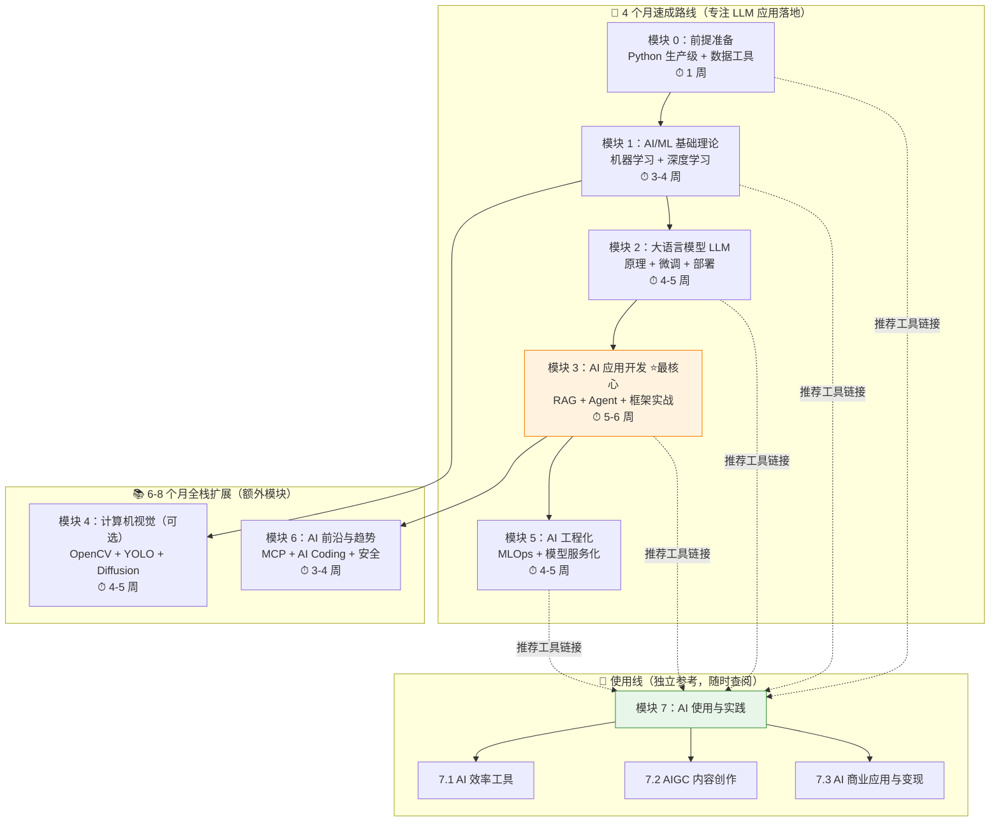

# 🤖 guide-ai — AI 从入门到实战知识库

> 面向后端开发者的 AI 全栈学习知识库 | 80% 实战 + 20% 理论 | 双线并行设计

[](https://github.com/)
[](https://python.org)
[](https://vitepress.dev)
[](LICENSE)

## 📖 项目简介

**guide-ai** 是一个面向后端开发者转 AI 的实战知识库，帮助有编程基础的开发者系统性地掌握 AI 全栈能力。

与 [guide-java](https://github.com/)、[guide-python](https://github.com/)、[guide-go](https://github.com/) 保持一致的项目组织方式，guide-ai 聚焦于 AI 领域，覆盖从 ML 基础到 LLM 应用、计算机视觉、AI 工程化、前沿趋势以及 AI 工具使用与变现的完整知识体系。

### 设计理念

- **实战驱动**：80% 实战 + 20% 理论，每个模块配备里程碑项目
- **后端视角**：面向有后端开发经验的开发者，利用已有编程能力快速切入 AI
- **双线并行**：编码线（模块 0-6）培养 AI 工程师能力，使用线（模块 7）培养 AI 工具使用与变现能力
- **代码即文档**：每个知识点都有可运行的 Python 代码示例，边学边练
- **工具融合**：编码模块通过链接引用模块 7 对应工具，形成"学技术 + 用工具"的闭环

### 统一工具栈

| 类别 | 工具 |
|------|------|
| 语言 | Python 3.11+ |
| ML 框架 | PyTorch、scikit-learn |
| LLM 生态 | Hugging Face Transformers、LangChain、LangGraph |
| 向量数据库 | Chroma（本地）、Pinecone（云） |
| LLM 推理 | vLLM、Ollama |
| API 框架 | FastAPI |
| 容器化 | Docker、Docker Compose |
| 版本控制 | Git、GitHub |

---

## 🗺️ 学习路径图

本知识库提供两条学习路线，4-8 个月覆盖全栈 AI 能力：



### 4 个月速成路线（专注 LLM 应用落地）

| 阶段 | 模块 | 时间 | 说明 |
|:----:|------|:----:|------|
| 1 | 模块 0：前提准备 | 1 周 | Python 生产级 + 数据工具 |
| 2 | 模块 1：AI/ML 基础理论 | 3-4 周 | 机器学习 + 深度学习基础 |
| 3 | 模块 2：大语言模型 LLM | 4-5 周 | LLM 原理 + 微调 + 部署 |
| 4 | 模块 3：AI 应用开发 ⭐ | 5-6 周 | RAG + Agent + 框架实战（最核心） |
| 5 | 模块 5：AI 工程化 | 4-5 周 | MLOps + 模型服务化 + 生产监控 |

### 6-8 个月全栈路线

在速成路线基础上，额外学习：
- **模块 4：计算机视觉**（可选，4-5 周）— OpenCV + YOLO + Diffusion + 多模态
- **模块 6：AI 前沿与趋势**（3-4 周）— MCP + AI Coding + 安全 + Vibe Coding
- **模块 7：AI 使用与实践**（独立参考）— AI 效率工具 + AIGC 内容创作 + 商业变现

---

## 📋 模块导航表

| 模块 | 名称 | 内容概要 | 时间估算 | 文档 | 代码 |
|:----:|------|----------|:--------:|:----:|:----:|
| 0 | 前提准备 | Python 异步/类型注解/NumPy/Pandas/Git | 1 周 | [docs/0-prerequisites/](docs/0-prerequisites/) | [code-examples/00-prerequisites/](code-examples/00-prerequisites/) |
| 1 | AI/ML 基础理论 | 监督/无监督/深度学习/Transformer/评估调优 | 3-4 周 | [docs/1-ml-basics/](docs/1-ml-basics/) | [code-examples/01-ml-basics/](code-examples/01-ml-basics/) |
| 2 | 大语言模型 LLM | Transformer 详解/微调/量化/部署/Tokenizer | 4-5 周 | [docs/2-llm/](docs/2-llm/) | [code-examples/02-llm/](code-examples/02-llm/) |
| 3 | AI 应用开发 ⭐ | Prompt/RAG/Agent/LangChain/LangGraph/评估 | 5-6 周 | [docs/3-ai-apps/](docs/3-ai-apps/) | [code-examples/03-ai-apps/](code-examples/03-ai-apps/) |
| 4 | 计算机视觉（可选） | OpenCV/YOLO/Diffusion/多模态/语义分割 | 4-5 周 | [docs/4-cv/](docs/4-cv/) | [code-examples/04-cv/](code-examples/04-cv/) |
| 5 | AI 工程化 | MLOps/vLLM/GPU 优化/数据工程/监控 | 4-5 周 | [docs/5-ai-engineering/](docs/5-ai-engineering/) | [code-examples/05-ai-engineering/](code-examples/05-ai-engineering/) |
| 6 | AI 前沿与趋势 | MCP/AI Coding/Agent 平台/安全/多模态 | 3-4 周 | [docs/6-ai-frontier/](docs/6-ai-frontier/) | [code-examples/06-ai-frontier/](code-examples/06-ai-frontier/) |
| 7 | AI 使用与实践 | AI 效率工具/AIGC 创作/商业变现 | 独立参考 | [docs/7-ai-tools/](docs/7-ai-tools/) | — |

---

## 🔍 快速查找表

### 面试常考 🔥

| 知识点 | 所属模块 | 难度 | 文档链接 |
|--------|:--------:|:----:|----------|
| Transformer 注意力机制 | 模块 1/2 | ⭐⭐⭐ | [docs/1-ml-basics/08-transformer.md](docs/1-ml-basics/08-transformer.md) |
| 偏差-方差权衡 | 模块 1 | ⭐⭐ | [docs/1-ml-basics/10-evaluation-tuning.md](docs/1-ml-basics/10-evaluation-tuning.md) |
| LoRA/QLoRA 微调原理 | 模块 2 | ⭐⭐⭐ | [docs/2-llm/07-lora-qlora.md](docs/2-llm/07-lora-qlora.md) |
| KV Cache 与 vLLM PagedAttention | 模块 2 | ⭐⭐⭐ | [docs/2-llm/12-vllm-deployment.md](docs/2-llm/12-vllm-deployment.md) |
| RAG 架构设计 | 模块 3 | ⭐⭐⭐ | [docs/3-ai-apps/05-document-loading.md](docs/3-ai-apps/05-document-loading.md) |
| 向量数据库选型 | 模块 3 | ⭐⭐ | [docs/3-ai-apps/08-vector-databases.md](docs/3-ai-apps/08-vector-databases.md) |
| Agent 架构（ReAct/Multi-Agent） | 模块 3 | ⭐⭐⭐ | [docs/3-ai-apps/14-react-pattern.md](docs/3-ai-apps/14-react-pattern.md) |
| MLOps 流水线设计 | 模块 5 | ⭐⭐ | [docs/5-ai-engineering/01-mlops-pipeline.md](docs/5-ai-engineering/01-mlops-pipeline.md) |
| GPU 显存优化 | 模块 5 | ⭐⭐⭐ | [docs/5-ai-engineering/11-memory-optimization.md](docs/5-ai-engineering/11-memory-optimization.md) |
| Prompt Injection 防御 | 模块 6 | ⭐⭐ | [docs/6-ai-frontier/15-prompt-injection.md](docs/6-ai-frontier/15-prompt-injection.md) |

### 工作常用 💼

| 知识点 | 所属模块 | 文档链接 |
|--------|:--------:|----------|
| Python 异步编程 | 模块 0 | [docs/0-prerequisites/01-async-programming.md](docs/0-prerequisites/01-async-programming.md) |
| Prompt Engineering 进阶 | 模块 3 | [docs/3-ai-apps/01-prompt-engineering.md](docs/3-ai-apps/01-prompt-engineering.md) |
| LangChain 框架实战 | 模块 3 | [docs/3-ai-apps/17-langchain.md](docs/3-ai-apps/17-langchain.md) |
| LangGraph 工作流 | 模块 3 | [docs/3-ai-apps/18-langgraph.md](docs/3-ai-apps/18-langgraph.md) |
| Ollama 本地部署 | 模块 2 | [docs/2-llm/13-ollama-local.md](docs/2-llm/13-ollama-local.md) |
| vLLM 推理服务 | 模块 5 | [docs/5-ai-engineering/05-vllm-serving.md](docs/5-ai-engineering/05-vllm-serving.md) |
| FastAPI + 推理后端 | 模块 5 | [docs/5-ai-engineering/07-api-gateway.md](docs/5-ai-engineering/07-api-gateway.md) |
| MCP Server 开发 | 模块 6 | [docs/6-ai-frontier/02-mcp-server-dev.md](docs/6-ai-frontier/02-mcp-server-dev.md) |

### AI 入门 🌱

| 知识点 | 所属模块 | 文档链接 |
|--------|:--------:|----------|
| NumPy 基础操作 | 模块 0 | [docs/0-prerequisites/05-numpy-basics.md](docs/0-prerequisites/05-numpy-basics.md) |
| Pandas 基础操作 | 模块 0 | [docs/0-prerequisites/06-pandas-basics.md](docs/0-prerequisites/06-pandas-basics.md) |
| 监督学习入门 | 模块 1 | [docs/1-ml-basics/01-supervised-learning.md](docs/1-ml-basics/01-supervised-learning.md) |
| 神经网络基础 | 模块 1 | [docs/1-ml-basics/05-neural-networks.md](docs/1-ml-basics/05-neural-networks.md) |
| LLM 主流模型对比 | 模块 2 | [docs/2-llm/06-model-comparison.md](docs/2-llm/06-model-comparison.md) |
| AI 对话助手使用 | 模块 7 | [docs/7-ai-tools/7.1-efficiency/ai-chat.md](docs/7-ai-tools/7.1-efficiency/ai-chat.md) |
| AI 搜索工具 | 模块 7 | [docs/7-ai-tools/7.1-efficiency/ai-search.md](docs/7-ai-tools/7.1-efficiency/ai-search.md) |
| 日常 Prompt 技巧 | 模块 7 | [docs/7-ai-tools/7.1-efficiency/prompt-tips.md](docs/7-ai-tools/7.1-efficiency/prompt-tips.md) |

---

---

## 🚀 快速开始

### 环境要求

- Python 3.11+
- Node.js 18+（VitePress 站点构建）
- pnpm（推荐）或 npm
- Docker & Docker Compose（运行中间件服务，可选）
- Git

### 1. 克隆仓库

```bash
git clone https://github.com/your-username/guide-ai.git
cd guide-ai
```

### 2. 安装 Python 依赖

```bash
# 创建虚拟环境
python -m venv .venv
source .venv/bin/activate  # Linux/macOS
# .venv\Scripts\activate   # Windows

# 安装依赖
pip install -r code-examples/requirements.txt
```

### 3. 启动 VitePress 开发服务器

```bash
cd docs
pnpm install
pnpm run dev
```

访问 `http://localhost:5173` 即可在线浏览知识库。

### 4. 运行代码示例

```bash
# 直接运行（内存模式，无需外部服务）
python code-examples/00-prerequisites/async_programming/01_asyncio_basics.py

# 连接真实服务（需先启动 Docker）
python code-examples/03-ai-apps/rag/04_vector_store.py server
```

---

## 🐳 Docker Compose 服务

按需启动所需服务，避免一次性占用过多资源：

| Compose 文件 | 启动命令 | 包含服务 | 对应代码模块 |
|-------------|----------|---------|-------------|
| `docker-compose.yml` | `docker compose -f docker/docker-compose.yml up -d` | Ollama、Chroma | 模块 2（LLM 部署）、模块 3（RAG） |
| `docker-compose.ml.yml` | `docker compose -f docker/docker-compose.ml.yml up -d` | MLflow、Jupyter | 模块 5（MLOps）、全模块 Notebook |
| `docker-compose.llm.yml` | `docker compose -f docker/docker-compose.llm.yml up -d` | vLLM、TGI | 模块 2（LLM 推理）、模块 5（模型服务化） |
| `docker-compose.monitor.yml` | `docker compose -f docker/docker-compose.monitor.yml up -d` | Prometheus、Grafana | 模块 5（生产监控） |

### 服务连接配置

所有代码示例使用统一的连接地址：

| 服务 | 地址 | 端口 | 说明 |
|------|------|:----:|------|
| Ollama | localhost | 11434 | 本地 LLM 推理 |
| Chroma | localhost | 8000 | 向量数据库 |
| MLflow | localhost | 5000 | 实验追踪 |
| Jupyter | localhost | 8888 | Notebook 服务 |
| vLLM | localhost | 8080 | LLM 推理 API（OpenAI 兼容） |
| TGI | localhost | 8081 | HuggingFace 推理服务 |
| Prometheus | localhost | 9090 | 指标采集 |
| Grafana | localhost | 3000 | 监控面板（admin/admin） |

---

## 📁 项目结构

```
guide-ai/
├── README.md                    # 项目说明（本文件）
├── CONTRIBUTING.md              # 贡献指南
├── .gitignore                   # Git 忽略规则
├── docs/                        # VitePress 知识文档
│   ├── .vitepress/              # VitePress 配置
│   ├── 0-prerequisites/         # 模块 0：前提准备
│   ├── 1-ml-basics/             # 模块 1：AI/ML 基础
│   ├── 2-llm/                   # 模块 2：大语言模型
│   ├── 3-ai-apps/               # 模块 3：AI 应用开发
│   ├── 4-cv/                    # 模块 4：计算机视觉
│   ├── 5-ai-engineering/        # 模块 5：AI 工程化
│   ├── 6-ai-frontier/           # 模块 6：AI 前沿
│   ├── 7-ai-tools/              # 模块 7：AI 使用与实践
│   ├── interview/               # 面试汇总
│   ├── learning-paths/          # 学习路径
│   └── templates/               # 文档模板
├── code-examples/               # Python 代码示例
│   ├── 00-prerequisites/        # 模块 0 代码
│   ├── 01-ml-basics/            # 模块 1 代码
│   ├── 02-llm/                  # 模块 2 代码
│   ├── 03-ai-apps/              # 模块 3 代码
│   ├── 04-cv/                   # 模块 4 代码
│   ├── 05-ai-engineering/       # 模块 5 代码
│   ├── 06-ai-frontier/          # 模块 6 代码
│   ├── pyproject.toml           # 统一依赖管理
│   └── requirements.txt         # pip 兼容依赖
├── .github/                     # GitHub Actions CI/CD
│   └── workflows/
├── docker/                      # Docker Compose 配置
│   ├── docker-compose.yml       # 基础服务
│   ├── docker-compose.ml.yml    # ML 服务
│   ├── docker-compose.llm.yml   # LLM 推理
│   └── docker-compose.monitor.yml # 监控
└── tests/                       # 属性测试与单元测试
```

---

## 🤝 参与贡献

欢迎提交 PR 或 Issue！请阅读 [CONTRIBUTING.md](CONTRIBUTING.md) 了解贡献指南。

## 📄 许可证

本项目采用 [MIT License](LICENSE) 开源。
