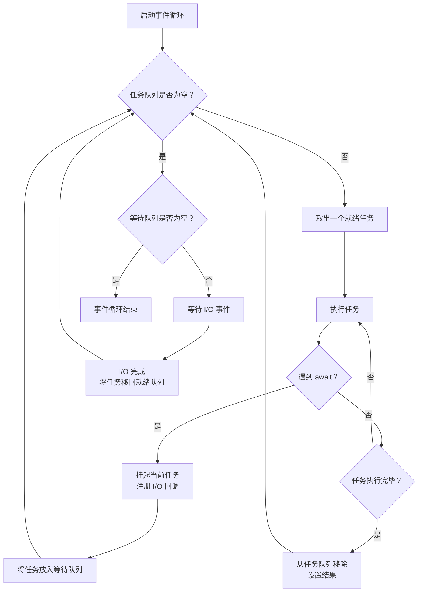

# Python 异步编程

## 概念说明

**异步编程**（Asynchronous Programming）是一种并发编程范式，允许程序在等待 I/O 操作（如网络请求、文件读写、数据库查询）完成时，不阻塞主线程，转而执行其他任务。Python 通过 `asyncio` 标准库和 `async/await` 语法原生支持异步编程。

### 为什么后端开发者需要掌握异步编程？

作为后端开发者，你一定熟悉这样的场景：一个 API 接口需要同时调用多个下游服务（数据库查询、第三方 API、缓存读取）。在同步模式下，这些调用只能串行执行，总耗时是所有调用耗时之和。而异步模式下，这些 I/O 操作可以并发执行，总耗时接近最慢的那个调用。

在 AI 应用开发中，异步编程更是不可或缺：
- **LLM API 调用**：调用 OpenAI、Claude 等 API 时，网络延迟通常在数百毫秒到数秒，异步可以同时发起多个请求
- **RAG 流水线**：文档加载、向量检索、LLM 生成可以流水线式并发执行
- **FastAPI 框架**：Python AI 应用的首选 Web 框架，原生基于异步
- **Agent 系统**：多 Agent 并发执行任务，需要异步协调

### 同步 vs 异步对比

| 维度 | 同步编程 | 异步编程 |
|------|----------|----------|
| 执行方式 | 串行，逐行阻塞执行 | 并发，I/O 等待时切换任务 |
| 适用场景 | CPU 密集型计算 | I/O 密集型操作 |
| 代码复杂度 | 简单直观 | 需要理解事件循环和协程 |
| 性能（I/O 场景） | 低，大量时间浪费在等待 | 高，充分利用等待时间 |
| Python 语法 | `def` + 普通函数调用 | `async def` + `await` |
| 典型框架 | Flask、Django（传统模式） | FastAPI、aiohttp、Sanic |

## 核心原理

### 1. asyncio 事件循环机制

asyncio 的核心是**事件循环**（Event Loop）。事件循环是一个无限循环，不断检查并执行就绪的任务（协程）。当一个协程遇到 I/O 操作时，它会将控制权交还给事件循环，事件循环转而执行其他就绪的协程。



事件循环的关键特性：
- **单线程**：asyncio 事件循环运行在单个线程中，通过协作式多任务实现并发
- **非抢占式**：协程必须主动让出控制权（通过 `await`），事件循环不会强制中断
- **I/O 多路复用**：底层使用 `select`/`epoll`/`kqueue` 等系统调用监听多个 I/O 事件

### 2. async/await 语法和协程

**协程**（Coroutine）是异步编程的基本执行单元。使用 `async def` 定义协程函数，使用 `await` 等待协程执行结果。

```python
import asyncio

# 定义协程函数
async def fetch_data(url: str) -> str:
    """模拟异步获取数据"""
    print(f"开始请求: {url}")
    # await 会挂起当前协程，让出控制权给事件循环
    await asyncio.sleep(1)  # 模拟网络延迟
    print(f"请求完成: {url}")
    return f"来自 {url} 的数据"

# 运行协程
async def main():
    result = await fetch_data("https://api.example.com")
    print(result)

# 启动事件循环
asyncio.run(main())
```

协程的三种状态：
- **Created（已创建）**：调用协程函数返回协程对象，但尚未执行
- **Running（运行中）**：协程正在事件循环中执行
- **Suspended（已挂起）**：协程遇到 `await`，等待 I/O 完成

### 3. aiohttp 异步 HTTP 客户端

`aiohttp` 是 Python 最流行的异步 HTTP 客户端/服务端库，在 AI 应用中常用于并发调用多个 API。

```python
import aiohttp
import asyncio

async def fetch_llm_response(session: aiohttp.ClientSession, prompt: str) -> dict:
    """异步调用 LLM API"""
    async with session.post(
        "http://localhost:11434/api/generate",
        json={"model": "qwen2", "prompt": prompt, "stream": False}
    ) as response:
        return await response.json()

async def batch_inference(prompts: list[str]) -> list[dict]:
    """批量并发推理"""
    async with aiohttp.ClientSession() as session:
        tasks = [fetch_llm_response(session, p) for p in prompts]
        return await asyncio.gather(*tasks)
```

aiohttp 的核心优势：
- **连接池复用**：`ClientSession` 内部维护连接池，避免重复建立 TCP 连接
- **流式响应**：支持流式读取大文件或 LLM 流式输出
- **超时控制**：内置 `ClientTimeout` 精细控制连接、读取超时

### 4. 异步上下文管理器（async with）

异步上下文管理器通过 `__aenter__` 和 `__aexit__` 魔术方法实现资源的异步获取和释放，使用 `async with` 语法调用。

```python
import aiohttp

class AsyncDatabaseConnection:
    """异步数据库连接上下文管理器"""

    def __init__(self, dsn: str):
        self.dsn = dsn
        self.connection = None

    async def __aenter__(self):
        """异步获取数据库连接"""
        print(f"正在连接数据库: {self.dsn}")
        # 模拟异步连接建立
        await asyncio.sleep(0.1)
        self.connection = f"Connection({self.dsn})"
        return self.connection

    async def __aexit__(self, exc_type, exc_val, exc_tb):
        """异步释放数据库连接"""
        print("正在关闭数据库连接")
        await asyncio.sleep(0.05)
        self.connection = None
        return False  # 不抑制异常

# 使用 async with 自动管理资源
async def query_database():
    async with AsyncDatabaseConnection("postgresql://localhost/mydb") as conn:
        print(f"使用连接: {conn}")
        # 执行查询...
```

常见的异步上下文管理器场景：
- `async with aiohttp.ClientSession() as session:` — HTTP 会话管理
- `async with aiofiles.open("file.txt") as f:` — 异步文件操作
- `async with asyncio.timeout(5):` — 超时控制（Python 3.11+）

### 5. asyncio.gather 并发执行

`asyncio.gather` 是实现并发执行多个协程的最常用方式，它会同时启动所有传入的协程，并等待全部完成。

```python
import asyncio
import time

async def call_service(name: str, delay: float) -> str:
    """模拟调用微服务"""
    await asyncio.sleep(delay)
    return f"{name} 响应完成"

async def main():
    start = time.perf_counter()

    # 并发执行三个服务调用
    results = await asyncio.gather(
        call_service("用户服务", 1.0),
        call_service("订单服务", 1.5),
        call_service("推荐服务", 0.8),
    )

    elapsed = time.perf_counter() - start
    print(f"所有结果: {results}")
    print(f"总耗时: {elapsed:.2f}s")  # 约 1.5s，而非 3.3s

asyncio.run(main())
```

`asyncio.gather` vs 其他并发原语：

| 方法 | 用途 | 错误处理 |
|------|------|----------|
| `asyncio.gather(*coros)` | 等待所有协程完成，返回结果列表 | `return_exceptions=True` 可收集异常 |
| `asyncio.wait(tasks)` | 更灵活的等待策略（FIRST_COMPLETED 等） | 返回 done/pending 两个集合 |
| `asyncio.TaskGroup()` | Python 3.11+ 结构化并发 | 任一任务失败则取消所有任务 |
| `asyncio.as_completed(coros)` | 按完成顺序迭代结果 | 逐个处理异常 |

## 代码示例

> 💻 完整可运行代码：[code-examples/00-prerequisites/async_programming/](https://github.com/skyhe58/guide-ai/tree/main/code-examples/00-prerequisites/async_programming/)
> 🐍 Python 版本：3.11+
> 📦 依赖：asyncio（标准库）、aiohttp

```python
# 异步编程快速入门 — 并发调用多个 API
# 完整代码见上方链接

import asyncio
import aiohttp

async def fetch_url(session: aiohttp.ClientSession, url: str) -> str:
    """异步获取 URL 内容"""
    async with session.get(url) as response:
        return await response.text()

async def main():
    urls = [
        "https://httpbin.org/delay/1",
        "https://httpbin.org/delay/1",
        "https://httpbin.org/delay/1",
    ]
    # 使用 async with 管理 HTTP 会话
    async with aiohttp.ClientSession() as session:
        # 并发请求 3 个 URL，总耗时约 1 秒而非 3 秒
        tasks = [fetch_url(session, url) for url in urls]
        results = await asyncio.gather(*tasks)
        print(f"获取了 {len(results)} 个响应")

if __name__ == "__main__":
    asyncio.run(main())
```

> 💡 **免费替代方案**：本示例使用公共 httpbin.org 服务，无需任何付费 API。如需测试 LLM 异步调用，可使用 Ollama 本地模型：
> ```bash
> docker compose -f docker/docker-compose.yml up -d ollama
> ```

## 实战要点

### 何时使用异步

**适合异步的场景（I/O 密集型）：**
- 网络请求：调用 LLM API、微服务间通信、爬虫
- 数据库操作：异步 ORM（如 SQLAlchemy async、Tortoise ORM）
- 文件 I/O：大文件读写（配合 `aiofiles`）
- 消息队列：异步消费 Kafka/RabbitMQ 消息

**不适合异步的场景（CPU 密集型）：**
- 数值计算：NumPy/PyTorch 矩阵运算（应使用多进程或 GPU）
- 图像处理：OpenCV 像素级操作
- 模型训练：深度学习训练循环
- 数据预处理：大规模数据清洗和转换

> ⚠️ **经验法则**：如果你的代码大部分时间在"等待"（网络、磁盘），用异步；如果大部分时间在"计算"（CPU），用多进程。

### 常见陷阱

**陷阱 1：忘记 await**

```python
# ❌ 错误：忘记 await，result 是协程对象而非实际结果
async def bad_example():
    result = fetch_data("https://api.example.com")  # 缺少 await
    print(result)  # 输出: <coroutine object fetch_data at 0x...>

# ✅ 正确：使用 await 等待协程完成
async def good_example():
    result = await fetch_data("https://api.example.com")
    print(result)  # 输出: 实际数据
```

**陷阱 2：在异步函数中调用阻塞操作**

```python
import time

# ❌ 错误：time.sleep 会阻塞整个事件循环
async def bad_sleep():
    time.sleep(5)  # 阻塞！所有其他协程都无法执行

# ✅ 正确：使用 asyncio.sleep 或 run_in_executor
async def good_sleep():
    await asyncio.sleep(5)  # 非阻塞，事件循环可以执行其他任务

# ✅ 如果必须调用阻塞函数，使用 run_in_executor
async def run_blocking():
    loop = asyncio.get_event_loop()
    result = await loop.run_in_executor(None, blocking_function, arg1)
```

**陷阱 3：未正确处理异步异常**

```python
# ❌ 错误：gather 默认会在第一个异常时中断
async def risky_gather():
    results = await asyncio.gather(
        task_that_may_fail(),
        task_that_may_fail(),
    )  # 如果任一任务抛出异常，整个 gather 失败

# ✅ 正确：使用 return_exceptions=True 收集所有结果（包括异常）
async def safe_gather():
    results = await asyncio.gather(
        task_that_may_fail(),
        task_that_may_fail(),
        return_exceptions=True,
    )
    for r in results:
        if isinstance(r, Exception):
            print(f"任务失败: {r}")
        else:
            print(f"任务成功: {r}")
```

### 与 FastAPI 的结合

FastAPI 原生支持异步，是 AI 应用的首选 Web 框架：

```python
from fastapi import FastAPI
import aiohttp

app = FastAPI()

@app.get("/predict")
async def predict(query: str):
    """异步调用 LLM 进行预测"""
    async with aiohttp.ClientSession() as session:
        async with session.post(
            "http://localhost:11434/api/generate",
            json={"model": "qwen2", "prompt": query, "stream": False}
        ) as resp:
            result = await resp.json()
    return {"prediction": result["response"]}
```

FastAPI 异步最佳实践：
- 路由函数使用 `async def` 定义，充分利用异步 I/O
- 数据库操作使用异步驱动（如 `asyncpg`、`aiomysql`）
- 外部 API 调用使用 `aiohttp` 或 `httpx`（异步模式）
- 避免在 `async def` 路由中调用同步阻塞函数

## 常见面试题

### Q1: 请解释 asyncio 事件循环的工作原理

**难度**：⭐⭐⭐ | **频率**：🔥🔥🔥

**答题思路**：
1. 先解释事件循环的核心概念：单线程、非阻塞、协作式多任务
2. 描述事件循环的执行流程：取任务 → 执行 → 遇到 await 挂起 → 执行其他任务 → I/O 完成后恢复
3. 说明底层实现：基于操作系统的 I/O 多路复用（epoll/kqueue）
4. 结合实际场景举例

**标准答案**：

asyncio 事件循环是 Python 异步编程的核心调度器，运行在单个线程中。它维护一个任务队列，不断从中取出就绪的协程执行。当协程遇到 `await` 表达式（通常是 I/O 操作）时，协程会被挂起，控制权交还给事件循环。事件循环随即执行其他就绪的协程。当 I/O 操作完成时，操作系统通过 I/O 多路复用机制（Linux 上是 epoll，macOS 上是 kqueue）通知事件循环，事件循环将对应的协程重新标记为就绪状态。

这种机制的关键优势在于：单线程避免了多线程的锁竞争和上下文切换开销，同时通过协作式调度实现了高效的 I/O 并发。在 Web 服务器场景下，一个事件循环可以同时处理数千个并发连接。

需要注意的是，事件循环是**协作式**的，协程必须主动通过 `await` 让出控制权。如果一个协程执行了长时间的 CPU 计算而不 `await`，会阻塞整个事件循环，导致其他协程无法执行。

**深入追问**：
- asyncio 事件循环与 Node.js 的事件循环有什么异同？
- Python 3.11 引入的 `TaskGroup` 相比 `gather` 有什么优势？
- 如何在异步程序中处理 CPU 密集型任务？（答：`run_in_executor` 配合线程池或进程池）

### Q2: async/await 与多线程有什么区别？各自适用什么场景？

**难度**：⭐⭐⭐ | **频率**：🔥🔥🔥

**答题思路**：
1. 从并发模型角度对比：协作式 vs 抢占式
2. 从资源开销角度对比：协程轻量 vs 线程较重
3. 从适用场景角度对比：I/O 密集 vs CPU 密集
4. 从代码复杂度角度对比：无锁 vs 需要锁

**标准答案**：

| 维度 | async/await（协程） | 多线程（threading） |
|------|---------------------|---------------------|
| 并发模型 | 协作式，协程主动让出控制权 | 抢占式，操作系统调度线程切换 |
| 执行线程 | 单线程 | 多线程（受 GIL 限制） |
| 上下文切换 | 极低开销（用户态切换） | 较高开销（内核态切换） |
| 并发数量 | 可轻松创建数万个协程 | 通常数百到数千个线程 |
| 共享状态 | 无需锁（单线程，不会被抢占） | 需要锁保护共享数据 |
| 适用场景 | I/O 密集型（网络请求、数据库） | I/O 密集型 + 部分 CPU 密集型 |
| GIL 影响 | 不受 GIL 影响（单线程） | 受 GIL 限制，无法真正并行 CPU 任务 |
| 调试难度 | 较低（执行顺序可预测） | 较高（竞态条件、死锁） |

在 AI 应用开发中，推荐优先使用 async/await：
- **FastAPI 路由**：天然异步，处理并发请求
- **LLM API 调用**：I/O 密集，适合异步并发
- **RAG 检索**：向量数据库查询是 I/O 操作

使用多线程/多进程的场景：
- **模型推理**：CPU/GPU 密集型，使用多进程或专用推理服务
- **数据预处理**：大规模数据转换，使用多进程

**深入追问**：
- Python 的 GIL 是什么？它如何影响多线程性能？
- `asyncio.to_thread()` 和 `loop.run_in_executor()` 有什么区别？
- 在什么情况下你会选择多进程而非异步或多线程？

### Q3: 如何正确处理异步代码中的异常？

**难度**：⭐⭐ | **频率**：🔥🔥

**答题思路**：
1. 说明异步异常的特殊性：异常可能在 await 点抛出
2. 介绍 gather 的异常处理策略
3. 介绍 TaskGroup 的结构化异常处理
4. 说明未被 await 的协程异常问题

**标准答案**：

异步代码中的异常处理有几个关键要点：

**1. 基本的 try/except**：与同步代码类似，在 `await` 处捕获异常。

```python
async def safe_request(url: str):
    try:
        async with aiohttp.ClientSession() as session:
            async with session.get(url, timeout=aiohttp.ClientTimeout(total=5)) as resp:
                return await resp.json()
    except aiohttp.ClientError as e:
        print(f"请求失败: {e}")
        return None
    except asyncio.TimeoutError:
        print("请求超时")
        return None
```

**2. asyncio.gather 的异常处理**：默认情况下，任一任务异常会导致整个 gather 失败。使用 `return_exceptions=True` 可以收集所有结果（包括异常对象），避免一个失败影响其他任务。

**3. TaskGroup 结构化并发**（Python 3.11+）：`async with asyncio.TaskGroup() as tg:` 提供更安全的异常处理——任一任务失败时，会自动取消所有其他任务，并将所有异常包装在 `ExceptionGroup` 中抛出。

**4. 未被 await 的协程**：如果创建了协程但忘记 await，异常会被静默吞掉。Python 会发出 `RuntimeWarning: coroutine was never awaited` 警告。

**深入追问**：
- `ExceptionGroup` 和 `except*` 语法是什么？如何使用？
- 如何实现异步重试机制？（答：使用 `tenacity` 库的异步重试装饰器）
- 在生产环境中，如何监控和记录异步任务的异常？

## 推荐工具

> 📌 以下工具可帮助你更高效地学习和实践本知识点，详见 [模块 7：AI 使用与实践](/7-ai-tools/)

| 工具 | 用途 | 详情 |
|------|------|------|
| Cursor | 辅助编写异步代码，自动补全 async/await 语法，快速生成异步模式模板 | [AI 编程辅助](/7-ai-tools/7.1-efficiency/ai-coding) |
| Kiro | Spec 驱动开发异步服务，通过 Steering 引导异步最佳实践 | [AI 编程辅助](/7-ai-tools/7.1-efficiency/ai-coding) |
| Perplexity | 快速搜索 asyncio 最新用法、性能对比和社区最佳实践 | [AI 搜索](/7-ai-tools/7.1-efficiency/ai-search) |

## 参考资料

- [Python 官方文档 — asyncio](https://docs.python.org/3/library/asyncio.html)
- [Real Python — Async IO in Python: A Complete Walkthrough](https://realpython.com/async-io-python/)
- [aiohttp 官方文档](https://docs.aiohttp.org/)
- [FastAPI 官方文档 — 异步](https://fastapi.tiangolo.com/async/)
- [PEP 492 — Coroutines with async and await syntax](https://peps.python.org/pep-0492/)
- [Python 3.11 — TaskGroup 和 ExceptionGroup](https://docs.python.org/3/library/asyncio-task.html#asyncio.TaskGroup)
