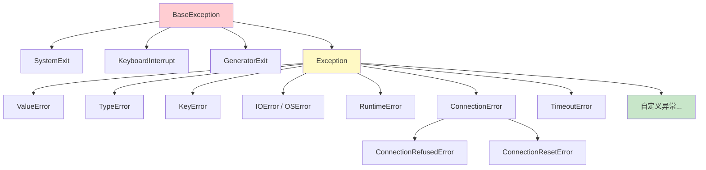

# Python 错误处理

## 概念说明

**错误处理**是编写健壮程序的基础能力。Python 通过异常（Exception）机制处理运行时错误，使用 `try/except` 捕获异常，使用 `raise` 抛出异常，使用上下文管理器（`with` 语句）管理资源的获取和释放。

### 为什么 AI 应用需要健壮的错误处理？

AI 应用比传统 Web 应用面临更多不确定性：

- **LLM API 调用失败**：网络超时、限流（429）、服务不可用（503）
- **模型加载异常**：显存不足（OOM）、模型文件损坏、版本不兼容
- **数据格式错误**：用户输入非法、文档解析失败、Embedding 维度不匹配
- **推理超时**：大模型推理耗时不可预测，可能超过预设时间
- **外部服务依赖**：向量数据库连接断开、Ollama 服务未启动

没有良好的错误处理，一个下游服务的故障就会导致整个 AI 流水线崩溃。

## 核心原理

### 1. Python 异常层次结构



关键规则：
- 只捕获 `Exception` 及其子类，不要捕获 `BaseException`（会拦截 Ctrl+C）
- 尽量精确捕获具体异常类型，避免裸 `except`
- 自定义异常应继承 `Exception`，不要继承 `BaseException`

### 2. 自定义异常类设计

在 AI 应用中，自定义异常可以让错误信息更有意义：

```python
class AIServiceError(Exception):
    """AI 服务基础异常类"""
    def __init__(self, message: str, service: str = "", retry_after: float = 0):
        super().__init__(message)
        self.service = service
        self.retry_after = retry_after

class ModelLoadError(AIServiceError):
    """模型加载失败（显存不足、文件损坏等）"""
    pass

class InferenceTimeoutError(AIServiceError):
    """推理超时"""
    pass

class VectorDBError(AIServiceError):
    """向量数据库操作失败"""
    pass

class RateLimitError(AIServiceError):
    """API 限流"""
    def __init__(self, message: str, retry_after: float = 60):
        super().__init__(message, retry_after=retry_after)
```

设计原则：
- 按服务/模块划分异常层次，便于分层捕获
- 携带上下文信息（服务名、重试时间等），方便日志和监控
- 保持异常层次扁平，不要超过 3 层继承

### 3. 异常链（raise ... from ...）

异常链用于在捕获一个异常后抛出另一个异常，同时保留原始异常的上下文：

```python
import httpx

async def call_llm_api(prompt: str) -> str:
    try:
        response = httpx.post("http://localhost:11434/api/generate",
                              json={"model": "qwen2", "prompt": prompt})
        response.raise_for_status()
        return response.json()["response"]
    except httpx.ConnectError as e:
        # raise ... from e 保留原始异常链
        raise VectorDBError(
            "无法连接 Ollama 服务，请检查是否已启动",
            service="ollama"
        ) from e
    except httpx.TimeoutException as e:
        raise InferenceTimeoutError(
            f"LLM 推理超时: {e}",
            service="ollama"
        ) from e
```

`raise X from Y` vs `raise X`：
- `raise X from Y`：显式链接，`X.__cause__ = Y`，traceback 显示 "The above exception was the direct cause of..."
- `raise X`：隐式链接，`X.__context__ = Y`，traceback 显示 "During handling of the above exception..."
- `raise X from None`：断开异常链，隐藏原始异常

### 4. 上下文管理器（with 语句）

上下文管理器通过 `__enter__` 和 `__exit__` 方法确保资源正确获取和释放：

```python
class ManagedModel:
    """模型生命周期管理器"""

    def __init__(self, model_path: str):
        self.model_path = model_path
        self.model = None

    def __enter__(self):
        print(f"加载模型: {self.model_path}")
        # 模拟模型加载
        self.model = {"name": self.model_path, "status": "loaded"}
        return self.model

    def __exit__(self, exc_type, exc_val, exc_tb):
        print("释放模型资源（显存回收）")
        self.model = None
        # 返回 False：不抑制异常
        return False

# 使用
with ManagedModel("qwen2-7b") as model:
    result = model  # 使用模型推理
# 离开 with 块后，模型资源自动释放
```

也可以用 `contextlib.contextmanager` 装饰器简化：

```python
from contextlib import contextmanager

@contextmanager
def gpu_memory_scope(device: str = "cuda:0"):
    """GPU 显存作用域管理"""
    print(f"分配 GPU 显存: {device}")
    try:
        yield device
    finally:
        print(f"释放 GPU 显存: {device}")
        # torch.cuda.empty_cache()
```

### 5. try/except/else/finally 完整语法

```python
try:
    # 可能抛出异常的代码
    result = call_llm_api(prompt)
except RateLimitError as e:
    # 捕获特定异常
    print(f"限流，{e.retry_after}s 后重试")
except AIServiceError as e:
    # 捕获父类异常（兜底）
    print(f"AI 服务异常: {e}")
except Exception as e:
    # 最后兜底（记录日志，不要静默吞掉）
    logger.exception(f"未预期的异常: {e}")
    raise
else:
    # 没有异常时执行（适合放"成功后的逻辑"）
    save_result(result)
finally:
    # 无论是否异常都执行（清理资源）
    cleanup()
```

执行顺序：
1. 执行 `try` 块
2. 如果有异常 → 匹配 `except`（从上到下，第一个匹配的生效）
3. 如果无异常 → 执行 `else`
4. 无论如何 → 执行 `finally`

### 6. 最佳实践

| 实践 | 说明 |
|------|------|
| 精确捕获 | `except ValueError` 而非 `except Exception` |
| 不要裸 except | `except:` 会捕获 KeyboardInterrupt，永远不要用 |
| 记录日志 | `logger.exception()` 自动记录 traceback |
| 快速失败 | 参数校验放在函数入口，尽早抛出异常 |
| 异常链 | 用 `raise X from e` 保留原始上下文 |
| 自定义异常 | 按业务域定义，携带上下文信息 |
| 优雅降级 | 捕获异常后提供降级方案，而非直接崩溃 |

## 代码示例

> 💻 完整可运行代码：[code-examples/00-prerequisites/error_handling/](https://github.com/skyhe58/guide-ai/tree/main/code-examples/00-prerequisites/error_handling/)
> 🐍 Python 版本：3.11+
> 📦 依赖：标准库

```python
# 自定义异常 + 异常链 + 优雅降级
class ModelLoadError(Exception):
    def __init__(self, model: str, reason: str):
        super().__init__(f"模型 {model} 加载失败: {reason}")
        self.model = model

def load_model(name: str):
    try:
        # 模拟模型加载
        if name == "too-large":
            raise MemoryError("GPU 显存不足")
        return {"model": name, "status": "ready"}
    except MemoryError as e:
        raise ModelLoadError(name, "显存不足，建议使用量化版本") from e

if __name__ == "__main__":
    try:
        model = load_model("too-large")
    except ModelLoadError as e:
        print(f"❌ {e}")
        print(f"💡 降级方案: 加载 {e.model} 的 4-bit 量化版本")
```

## 实战要点

### AI 应用中的常见异常场景

**API 限流处理：**
```python
async def call_with_backoff(prompt: str, max_retries: int = 3):
    for attempt in range(max_retries):
        try:
            return await call_llm_api(prompt)
        except RateLimitError as e:
            if attempt < max_retries - 1:
                await asyncio.sleep(e.retry_after)
            else:
                raise
```

**模型 OOM 降级：**
- 捕获 `torch.cuda.OutOfMemoryError`
- 降级到更小的模型或 CPU 推理
- 记录 GPU 显存使用情况到监控系统

**数据格式错误防御：**
- 使用 Pydantic 做输入验证（在入口处快速失败）
- 文档解析失败时跳过该文档，不影响整个 RAG 流水线

### 结构化错误日志

```python
import logging
import json

logger = logging.getLogger(__name__)

def log_ai_error(error: AIServiceError, context: dict):
    """结构化记录 AI 服务异常"""
    logger.error(json.dumps({
        "error_type": type(error).__name__,
        "message": str(error),
        "service": error.service,
        "retry_after": error.retry_after,
        "context": context,
    }, ensure_ascii=False))
```

## 常见面试题

### Q1: try/except/else/finally 的执行顺序是什么？

**难度**：⭐⭐ | **频率**：🔥🔥🔥

**答题思路**：
1. 先说明四个块的作用
2. 分有异常和无异常两种情况说明执行顺序
3. 强调 finally 一定会执行（即使有 return）

**标准答案**：

- `try`：执行可能抛出异常的代码
- `except`：捕获并处理异常（从上到下匹配，第一个匹配的生效）
- `else`：仅在 try 块没有异常时执行，适合放"成功后的逻辑"
- `finally`：无论是否发生异常都会执行，用于资源清理

执行顺序：
- 无异常：try → else → finally
- 有异常且被捕获：try（到异常处停止）→ except → finally
- 有异常未被捕获：try（到异常处停止）→ finally → 异常向上传播

特殊情况：即使 try 或 except 中有 `return`，finally 仍然会执行。如果 finally 中也有 `return`，会覆盖前面的返回值（这是一个常见陷阱，应避免在 finally 中 return）。

**深入追问**：
- 如果 finally 中抛出异常会怎样？（会覆盖原始异常）
- else 块和直接把代码放在 try 末尾有什么区别？（else 中的异常不会被 except 捕获）

### Q2: 什么时候应该自定义异常？如何设计异常层次？

**难度**：⭐⭐⭐ | **频率**：🔥🔥

**答题思路**：
1. 说明自定义异常的使用场景
2. 给出设计原则
3. 结合 AI 应用举例

**标准答案**：

**使用场景**：当内置异常无法准确表达业务错误语义时，应该自定义异常。例如 `ValueError` 无法区分"用户输入非法"和"模型参数非法"，自定义 `InvalidPromptError` 和 `InvalidModelConfigError` 可以让调用方精确处理。

**设计原则**：
1. 继承 `Exception`，不要继承 `BaseException`
2. 按业务域分层：基础异常 → 模块异常 → 具体异常
3. 携带上下文信息（错误码、服务名、重试建议等）
4. 保持层次扁平，不超过 3 层
5. 异常名以 `Error` 结尾（Python 惯例）

**AI 应用示例**：
```
AIServiceError（基础）
├── ModelError
│   ├── ModelLoadError
│   └── ModelInferenceError
├── DataError
│   ├── DocumentParseError
│   └── EmbeddingDimensionError
└── ExternalServiceError
    ├── LLMAPIError
    └── VectorDBError
```

**深入追问**：
- 异常中应该携带哪些信息？（错误消息、错误码、上下文数据、重试建议）
- 如何在微服务间传递异常信息？（序列化为 JSON 错误响应，包含 error_code 和 message）

## 推荐工具

> 📌 以下工具可帮助你更高效地学习和实践本知识点，详见 [模块 7：AI 使用与实践](/7-ai-tools/)

| 工具 | 用途 | 详情 |
|------|------|------|
| Cursor | 辅助编写异常处理代码，自动生成 try/except 模板和自定义异常类 | [AI 编程辅助](/7-ai-tools/7.1-efficiency/ai-coding) |
| Perplexity | 快速搜索 Python 异常处理最佳实践和常见陷阱 | [AI 搜索](/7-ai-tools/7.1-efficiency/ai-search) |

## 参考资料

- [Python 官方文档 — 错误和异常](https://docs.python.org/3/tutorial/errors.html)
- [Python 官方文档 — 内置异常](https://docs.python.org/3/library/exceptions.html)
- [Python 官方文档 — 上下文管理器](https://docs.python.org/3/reference/datamodel.html#context-managers)
- [Real Python — Python Exceptions: An Introduction](https://realpython.com/python-exceptions/)
- [PEP 3134 — Exception Chaining and Embedded Tracebacks](https://peps.python.org/pep-3134/)
