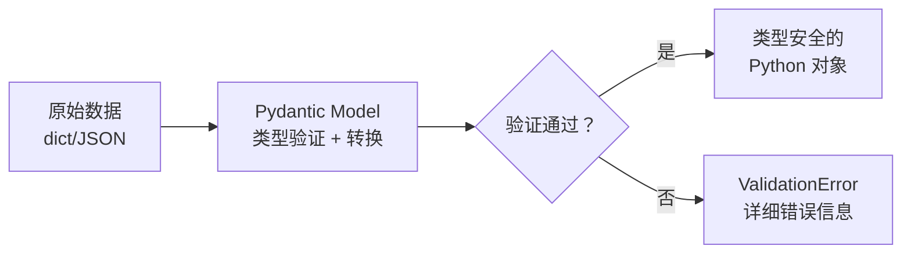

# Python 类型注解

## 概念说明

**类型注解**（Type Annotations）是 Python 3.5+ 引入的语法特性，允许开发者为变量、函数参数和返回值标注类型信息。类型注解不影响运行时行为（Python 仍然是动态类型语言），但能被 IDE、类型检查器（mypy/pyright）和数据验证库（Pydantic）利用。

### 为什么 AI 应用需要类型注解？

- **LLM 输出结构化**：LLM 返回的 JSON 需要用 Pydantic 模型验证和解析
- **API 接口定义**：FastAPI 依赖类型注解自动生成文档和请求验证
- **代码可维护性**：AI 项目涉及大量数据结构（Embedding 向量、文档块、检索结果），类型注解让代码自文档化
- **团队协作**：类型注解是最好的"活文档"，比注释更可靠
- **IDE 智能提示**：有类型注解的代码，IDE 能提供精确的自动补全和错误检测

## 核心原理

### 1. 基础类型注解

```python
# 变量注解
name: str = "guide-ai"
version: float = 1.0
is_ready: bool = True
embedding: list[float] = [0.1, 0.2, 0.3]

# 函数注解
def search_documents(query: str, top_k: int = 5) -> list[dict]:
    """检索文档，返回 top_k 个结果。"""
    ...
```

Python 3.9+ 可以直接使用内置类型作为泛型（不需要从 typing 导入）：

| Python 3.8 及之前 | Python 3.9+ | Python 3.10+ |
|-------------------|-------------|--------------|
| `typing.List[int]` | `list[int]` | `list[int]` |
| `typing.Dict[str, Any]` | `dict[str, Any]` | `dict[str, Any]` |
| `typing.Optional[str]` | `Optional[str]` | `str \| None` |
| `typing.Union[int, str]` | `Union[int, str]` | `int \| str` |

### 2. typing 模块核心类型

```python
from typing import Any, Optional, Union, Literal, TypeAlias

# Optional — 可选值（等价于 X | None）
def get_model(name: str) -> Optional[dict]:
    """返回模型信息，不存在时返回 None。"""
    ...

# Union — 联合类型
def process_input(data: Union[str, list[str]]) -> str:
    """接受字符串或字符串列表。"""
    ...

# Literal — 字面量类型（限定取值范围）
Difficulty = Literal["beginner", "intermediate", "advanced"]

def filter_by_difficulty(level: Difficulty) -> list[dict]:
    """按难度筛选，只接受三个固定值。"""
    ...

# TypeAlias — 类型别名（Python 3.10+）
Embedding: TypeAlias = list[float]
DocumentChunk: TypeAlias = dict[str, Any]
```

### 3. 泛型（Generic）

```python
from typing import TypeVar, Generic

T = TypeVar("T")

class Cache(Generic[T]):
    """泛型缓存类 — 可缓存任意类型的数据。

    在 AI 应用中常用于：
    - 缓存 Embedding 结果
    - 缓存 LLM 推理结果
    - 缓存向量检索结果
    """

    def __init__(self, max_size: int = 100):
        self._store: dict[str, T] = {}
        self.max_size = max_size

    def get(self, key: str) -> T | None:
        return self._store.get(key)

    def set(self, key: str, value: T) -> None:
        if len(self._store) >= self.max_size:
            # 简单的 FIFO 淘汰
            oldest = next(iter(self._store))
            del self._store[oldest]
        self._store[key] = value

# 使用时指定具体类型
embedding_cache: Cache[list[float]] = Cache(max_size=1000)
response_cache: Cache[str] = Cache(max_size=500)
```

### 4. Protocol — 结构化子类型（鸭子类型的类型化）

```python
from typing import Protocol, runtime_checkable

@runtime_checkable
class Embedder(Protocol):
    """Embedding 模型协议 — 任何实现了 embed 方法的类都满足此协议。"""

    def embed(self, texts: list[str]) -> list[list[float]]:
        ...

class OpenAIEmbedder:
    """OpenAI Embedding 实现。"""
    def embed(self, texts: list[str]) -> list[list[float]]:
        # 调用 OpenAI API
        return [[0.1, 0.2] for _ in texts]

class LocalEmbedder:
    """本地 Embedding 实现（BGE/M3E）。"""
    def embed(self, texts: list[str]) -> list[list[float]]:
        # 本地模型推理
        return [[0.3, 0.4] for _ in texts]

def build_index(embedder: Embedder, documents: list[str]) -> list[list[float]]:
    """接受任何满足 Embedder 协议的对象。"""
    return embedder.embed(documents)

# OpenAIEmbedder 和 LocalEmbedder 都满足 Embedder 协议
# 无需显式继承，只要有 embed 方法即可
```

Protocol 的优势：
- 不需要显式继承，符合 Python 的鸭子类型哲学
- `@runtime_checkable` 允许用 `isinstance()` 检查
- 比 ABC 更灵活，适合定义第三方库的接口约束

### 5. TypedDict — 类型化字典

```python
from typing import TypedDict, NotRequired

class LLMResponse(TypedDict):
    """LLM API 响应的类型定义。"""
    model: str
    response: str
    total_duration: int
    eval_count: int
    context: NotRequired[list[int]]  # 可选字段（Python 3.11+）

class RAGResult(TypedDict):
    """RAG 检索结果的类型定义。"""
    query: str
    documents: list[dict[str, str]]
    answer: str
    sources: list[str]
    confidence: float

# 使用 TypedDict 让字典的键和值类型都有约束
def format_response(result: RAGResult) -> str:
    # IDE 能自动补全 result 的键名
    return f"回答: {result['answer']} (置信度: {result['confidence']:.2f})"
```

### 6. Pydantic 数据验证



Pydantic 是 AI 应用中最重要的数据验证库：

```python
from pydantic import BaseModel, Field, field_validator

class ChatMessage(BaseModel):
    """聊天消息模型 — 自动验证和转换。"""
    role: Literal["system", "user", "assistant"]
    content: str = Field(min_length=1, max_length=10000)
    temperature: float = Field(default=0.7, ge=0, le=2.0)
    model: str = "qwen2"

    @field_validator("content")
    @classmethod
    def content_not_empty(cls, v: str) -> str:
        if not v.strip():
            raise ValueError("消息内容不能为空白")
        return v.strip()

# 自动验证
msg = ChatMessage(role="user", content="什么是 RAG？")
print(msg.model_dump())  # 序列化为字典

# 验证失败会抛出 ValidationError
try:
    bad_msg = ChatMessage(role="invalid", content="")
except Exception as e:
    print(f"验证失败: {e}")
```

Pydantic 在 AI 应用中的典型用途：
- **FastAPI 请求/响应模型**：自动验证 API 输入输出
- **LLM 输出解析**：将 LLM 的 JSON 输出解析为结构化对象
- **配置管理**：用 `BaseSettings` 管理环境变量和配置文件
- **数据管道**：ETL 过程中的数据清洗和验证

## 代码示例

> 💻 完整可运行代码：[code-examples/00-prerequisites/type_annotations/](https://github.com/skyhe58/guide-ai/tree/main/code-examples/00-prerequisites/type_annotations/)
> 🐍 Python 版本：3.11+
> 📦 依赖：pydantic>=2.5

```python
from pydantic import BaseModel, Field
from typing import Literal

class EmbeddingRequest(BaseModel):
    texts: list[str] = Field(min_length=1)
    model: Literal["bge-m3", "openai", "m3e"] = "bge-m3"
    normalize: bool = True

# 自动验证 + 序列化
req = EmbeddingRequest(texts=["什么是 RAG？", "如何微调 LLM？"])
print(req.model_dump_json(indent=2))
```

## 实战要点

**类型注解最佳实践：**
- 公共 API（函数签名、类属性）必须加类型注解
- 内部变量可以依赖类型推断，不必全部标注
- 使用 `from __future__ import annotations` 延迟求值（避免循环导入）
- 复杂类型用 `TypeAlias` 定义别名，提高可读性

**Pydantic 最佳实践：**
- API 请求/响应一律用 Pydantic 模型定义
- 使用 `Field()` 添加约束（min_length、ge、le 等）
- 用 `@field_validator` 实现自定义验证逻辑
- 用 `model_dump()` / `model_dump_json()` 序列化

**常见陷阱：**
- `list[int]` 和 `List[int]` 在 Python 3.9+ 等价，优先用小写
- `Optional[X]` 等价于 `X | None`，不是"可选参数"的意思
- Pydantic v2 和 v1 API 不兼容（v2 用 `model_dump`，v1 用 `dict`）

## 常见面试题

### Q1: Python 类型注解是强制的吗？运行时会检查类型吗？

**难度**：⭐⭐ | **频率**：🔥🔥🔥

**答题思路**：
1. 说明类型注解是可选的，不影响运行时
2. 解释类型检查工具（mypy/pyright）的作用
3. 说明 Pydantic 是运行时验证的例外

**标准答案**：

Python 类型注解是完全可选的，不会影响运行时行为。Python 解释器不会根据类型注解做任何检查或强制转换——即使标注了 `x: int`，赋值 `x = "hello"` 也不会报错。

类型注解的价值体现在：
1. **静态类型检查**：mypy、pyright 等工具在编码阶段检查类型一致性
2. **IDE 智能提示**：提供精确的自动补全和错误提示
3. **文档作用**：比注释更可靠的"活文档"
4. **运行时验证**：Pydantic 等库利用类型注解在运行时做数据验证（这是例外情况）

**深入追问**：
- `from __future__ import annotations` 的作用是什么？（延迟求值，将注解存为字符串）
- Protocol 和 ABC 的区别是什么？（Protocol 是结构化子类型，不需要显式继承）

### Q2: Pydantic v2 相比 v1 有哪些重要变化？

**难度**：⭐⭐⭐ | **频率**：🔥🔥

**答题思路**：
1. 核心架构变化（Rust 重写核心）
2. API 变化（方法名、配置方式）
3. 性能提升

**标准答案**：

Pydantic v2 的核心变化：
- **性能**：核心验证逻辑用 Rust 重写（pydantic-core），速度提升 5-50 倍
- **API 变化**：`.dict()` → `.model_dump()`，`.json()` → `.model_dump_json()`，`Config` 类 → `model_config` 字典
- **验证器**：`@validator` → `@field_validator`，`@root_validator` → `@model_validator`
- **严格模式**：新增 `strict=True`，不自动做类型转换
- **JSON Schema**：`.schema()` → `.model_json_schema()`

**深入追问**：
- 如何从 Pydantic v1 迁移到 v2？（使用 `bump-pydantic` 工具自动迁移）
- Pydantic 的 `model_validate` 和直接构造有什么区别？

## 推荐工具

> 📌 以下工具可帮助你更高效地学习和实践本知识点，详见 [模块 7：AI 使用与实践](/7-ai-tools/)

| 工具 | 用途 | 详情 |
|------|------|------|
| Cursor | 自动推断和补全类型注解，快速生成 Pydantic 模型 | [AI 编程辅助](/7-ai-tools/7.1-efficiency/ai-coding) |
| Perplexity | 搜索 typing 模块高级用法和 Pydantic v2 迁移指南 | [AI 搜索](/7-ai-tools/7.1-efficiency/ai-search) |

## 参考资料

- [Python 官方文档 — typing 模块](https://docs.python.org/3/library/typing.html)
- [Pydantic 官方文档](https://docs.pydantic.dev/latest/)
- [Real Python — Python Type Checking](https://realpython.com/python-type-checking/)
- [PEP 484 — Type Hints](https://peps.python.org/pep-0484/)
- [PEP 544 — Protocols: Structural subtyping](https://peps.python.org/pep-0544/)
- [mypy 官方文档](https://mypy.readthedocs.io/)
