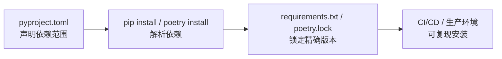

# Python 包管理

## 概念说明

**包管理**是 Python 项目开发的基础能力，涉及依赖安装、版本锁定、项目元数据配置和发布。Python 生态有多种包管理工具，核心是 `pip`（安装器）和 `pyproject.toml`（项目配置标准）。

### 为什么 AI 项目需要重视包管理？

AI 项目的依赖复杂度远超普通 Web 项目：
- **依赖数量多**：PyTorch、Transformers、LangChain、Chroma 等，动辄几十个依赖
- **版本敏感**：PyTorch 版本必须匹配 CUDA 版本，Pydantic v1/v2 API 不兼容
- **体积大**：PyTorch + CUDA 可能占用数 GB 磁盘空间
- **平台差异**：GPU 版本和 CPU 版本的安装方式不同
- **团队协作**：确保所有人使用相同的依赖版本，避免"在我机器上能跑"

## 核心原理

### 1. pip — Python 包安装器

```bash
# 基础安装
pip install numpy pandas torch

# 指定版本
pip install transformers==4.37.0
pip install "langchain>=0.1,<0.2"

# 从 requirements.txt 安装
pip install -r requirements.txt

# 导出当前环境依赖
pip freeze > requirements.txt

# 安装开发依赖
pip install -e ".[dev]"  # 从 pyproject.toml 安装可选依赖组
```

pip 版本约束语法：

| 语法 | 含义 | 示例 |
|------|------|------|
| `==` | 精确版本 | `torch==2.1.0` |
| `>=` | 最低版本 | `numpy>=1.26` |
| `>=,<` | 版本范围 | `"langchain>=0.1,<0.2"` |
| `~=` | 兼容版本 | `pydantic~=2.5`（等价于 `>=2.5,<3.0`） |
| `!=` | 排除版本 | `transformers!=4.36.0` |

### 2. pyproject.toml — 项目配置标准

`pyproject.toml` 是 Python 项目的统一配置文件（PEP 518/621），取代了 `setup.py`、`setup.cfg`、`requirements.txt` 等多个文件：

```toml
[build-system]
requires = ["setuptools>=68.0", "wheel"]
build-backend = "setuptools.backends._legacy:_Backend"

[project]
name = "guide-ai-examples"
version = "0.1.0"
description = "AI 知识库代码示例"
requires-python = ">=3.11"

dependencies = [
    # 按模块分组
    "numpy>=1.26",
    "pandas>=2.1",
    "torch>=2.1",
    "transformers>=4.37",
    "langchain>=0.1",
]

[project.optional-dependencies]
dev = ["pytest>=8.0", "ruff>=0.2"]
gpu = ["bitsandbytes>=0.42"]

[tool.ruff]
target-version = "py311"
line-length = 120

[tool.pytest.ini_options]
testpaths = ["tests"]
```

pyproject.toml 的优势：
- **统一配置**：项目元数据、依赖、工具配置都在一个文件中
- **标准化**：PEP 621 标准，所有工具都支持
- **可选依赖组**：`pip install ".[dev]"` 按需安装
- **工具配置**：ruff、pytest、mypy 等工具的配置也放在这里

### 3. poetry — 现代包管理器

```bash
# 初始化项目
poetry init

# 添加依赖
poetry add numpy pandas torch
poetry add --group dev pytest ruff

# 安装所有依赖
poetry install

# 更新依赖
poetry update

# 导出 requirements.txt（兼容 pip）
poetry export -f requirements.txt -o requirements.txt
```

poetry vs pip 对比：

| 维度 | pip + requirements.txt | poetry |
|------|----------------------|--------|
| 依赖解析 | 简单，可能冲突 | 完整的依赖解析器 |
| 锁文件 | 无（pip freeze 不精确） | poetry.lock（精确锁定） |
| 虚拟环境 | 需手动管理 | 自动创建和管理 |
| 依赖分组 | 多个 requirements 文件 | pyproject.toml 中分组 |
| 发布 | 需要 twine | 内置 `poetry publish` |
| 学习成本 | 低 | 中等 |

### 4. 依赖锁定



依赖锁定的最佳实践：
- `pyproject.toml`：声明依赖的版本范围（如 `numpy>=1.26`）
- `requirements.txt` 或 `poetry.lock`：锁定精确版本（如 `numpy==1.26.4`）
- 开发时用范围约束，部署时用精确版本
- 定期更新依赖并测试兼容性

### 5. AI 项目依赖管理策略

```toml
# 推荐的 AI 项目依赖分组策略
[project.optional-dependencies]
# 核心依赖（所有模块都需要）
core = ["numpy>=1.26", "pandas>=2.1", "pydantic>=2.5"]

# ML 基础
ml = ["scikit-learn>=1.4", "torch>=2.1", "matplotlib>=3.8"]

# LLM 相关
llm = ["transformers>=4.37", "langchain>=0.1", "ollama>=0.1"]

# GPU 加速（可选）
gpu = ["bitsandbytes>=0.42", "accelerate>=0.26"]

# 开发工具
dev = ["pytest>=8.0", "ruff>=0.2", "hypothesis>=6.92"]
```

安装策略：
```bash
# 只安装核心依赖
pip install ".[core]"

# 安装 ML + LLM 依赖
pip install ".[core,ml,llm]"

# 全部安装（含 GPU）
pip install ".[core,ml,llm,gpu]"

# 开发环境
pip install ".[core,ml,llm,dev]"
```

## 实战要点

**PyTorch 安装注意事项：**
- PyTorch 的 GPU 版本需要匹配 CUDA 版本
- 使用官方安装命令：`pip install torch --index-url https://download.pytorch.org/whl/cu121`
- CPU 版本体积更小：`pip install torch --index-url https://download.pytorch.org/whl/cpu`
- 在 requirements.txt 中用 `--extra-index-url` 指定 PyTorch 源

**依赖冲突解决：**
- `pip install --dry-run` 预检查依赖冲突
- `pip check` 检查已安装包的兼容性
- 使用 `pipdeptree` 查看依赖树
- 冲突时优先满足核心框架（PyTorch、Transformers）的版本要求

**生产环境建议：**
- 使用 Docker 固定完整环境（Python 版本 + 系统依赖 + Python 包）
- requirements.txt 锁定精确版本
- CI 中验证 `pip install` 成功

## 常见面试题

### Q1: pyproject.toml 和 requirements.txt 的区别是什么？

**难度**：⭐⭐ | **频率**：🔥🔥

**答题思路**：
1. 定位不同：项目配置 vs 依赖清单
2. 功能范围不同
3. 实际项目中如何配合使用

**标准答案**：

`pyproject.toml` 是 Python 项目的统一配置文件（PEP 518/621），包含项目元数据、依赖声明、构建配置和工具配置。它声明的是依赖的版本范围（如 `numpy>=1.26`）。

`requirements.txt` 是 pip 的依赖清单文件，通常包含精确锁定的版本（如 `numpy==1.26.4`），用于可复现的环境安装。

实际项目中两者配合使用：`pyproject.toml` 作为"源头"声明依赖范围，`requirements.txt` 作为"快照"锁定精确版本。开发时编辑 `pyproject.toml`，部署时用 `requirements.txt`。

**深入追问**：
- poetry.lock 和 requirements.txt 有什么区别？（poetry.lock 包含完整的依赖树和哈希校验）
- 如何处理不同平台（Linux/macOS/Windows）的依赖差异？

## 推荐工具

> 📌 以下工具可帮助你更高效地学习和实践本知识点，详见 [模块 7：AI 使用与实践](/7-ai-tools/)

| 工具 | 用途 | 详情 |
|------|------|------|
| Cursor | 自动生成 pyproject.toml 配置和依赖声明 | [AI 编程辅助](/7-ai-tools/7.1-efficiency/ai-coding) |
| Perplexity | 搜索包版本兼容性和依赖冲突解决方案 | [AI 搜索](/7-ai-tools/7.1-efficiency/ai-search) |

## 参考资料

- [Python Packaging User Guide](https://packaging.python.org/)
- [PEP 621 — Storing project metadata in pyproject.toml](https://peps.python.org/pep-0621/)
- [Poetry 官方文档](https://python-poetry.org/docs/)
- [pip 官方文档](https://pip.pypa.io/en/stable/)
- [Real Python — Python Packages and Modules](https://realpython.com/python-modules-packages/)
