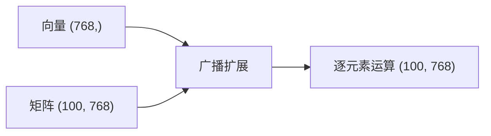

# NumPy 基础操作

## 概念说明

**NumPy**（Numerical Python）是 Python 科学计算的基础库，提供高性能的多维数组对象（`ndarray`）和丰富的数学运算函数。它是 PyTorch、scikit-learn、Pandas 等几乎所有 AI/ML 库的底层依赖。

### 为什么 AI 开发者必须掌握 NumPy？

- **Embedding 向量**：文本/图像的向量表示本质上就是 NumPy 数组
- **模型参数**：PyTorch 的 Tensor 和 NumPy 数组可以零拷贝互转
- **数据预处理**：特征工程、归一化、标准化都依赖 NumPy
- **相似度计算**：余弦相似度、欧氏距离等向量运算
- **性能**：NumPy 的向量化运算比 Python 循环快 10-100 倍

## 核心原理

### 1. 数组创建

```python
import numpy as np

# 从列表创建
embedding = np.array([0.1, 0.2, 0.3, 0.4, 0.5])
matrix = np.array([[1, 2, 3], [4, 5, 6]])

# 常用创建函数
zeros = np.zeros((3, 768))       # 3 个 768 维零向量
ones = np.ones((5, 5))           # 5x5 全 1 矩阵
identity = np.eye(3)             # 3x3 单位矩阵
random_emb = np.random.randn(10, 768)  # 10 个随机 768 维向量
sequence = np.arange(0, 1, 0.1)  # [0.0, 0.1, ..., 0.9]
linspace = np.linspace(0, 1, 5)  # [0.0, 0.25, 0.5, 0.75, 1.0]
```

### 2. 索引与切片

```python
# 一维索引
arr = np.array([10, 20, 30, 40, 50])
arr[0]      # 10
arr[-1]     # 50
arr[1:4]    # [20, 30, 40]

# 二维索引（常用于 Embedding 矩阵）
embeddings = np.random.randn(100, 768)  # 100 个文档的 Embedding
embeddings[0]        # 第 1 个文档的向量（768 维）
embeddings[:5]       # 前 5 个文档的向量（5x768）
embeddings[:, :3]    # 所有文档的前 3 个维度（100x3）

# 布尔索引（筛选）
scores = np.array([0.9, 0.3, 0.7, 0.1, 0.8])
high_scores = scores[scores > 0.5]  # [0.9, 0.7, 0.8]

# 花式索引（按索引列表取值）
indices = np.array([0, 3, 4])
selected = scores[indices]  # [0.9, 0.1, 0.8]
```

### 3. 广播机制



广播规则：当两个数组形状不同时，NumPy 自动扩展较小的数组以匹配较大的数组。

```python
# 向量归一化（广播）
embeddings = np.random.randn(100, 768)
mean = embeddings.mean(axis=0)    # (768,) — 每个维度的均值
std = embeddings.std(axis=0)      # (768,) — 每个维度的标准差
normalized = (embeddings - mean) / std  # (100, 768) — 广播运算

# 余弦相似度（AI 中最常用的相似度计算）
def cosine_similarity(a: np.ndarray, b: np.ndarray) -> float:
    return np.dot(a, b) / (np.linalg.norm(a) * np.linalg.norm(b))
```

### 4. 向量化运算

向量化是 NumPy 的核心优势——用数组运算替代 Python 循环：

```python
# ❌ Python 循环（慢）
def slow_normalize(vectors):
    result = []
    for v in vectors:
        norm = sum(x**2 for x in v) ** 0.5
        result.append([x / norm for x in v])
    return result

# ✅ NumPy 向量化（快 100 倍）
def fast_normalize(vectors: np.ndarray) -> np.ndarray:
    norms = np.linalg.norm(vectors, axis=1, keepdims=True)
    return vectors / norms
```

### 5. 常用数学函数

```python
# 线性代数
np.dot(a, b)           # 点积
np.matmul(A, B)        # 矩阵乘法（等价于 A @ B）
np.linalg.norm(v)      # 向量范数
np.linalg.inv(A)       # 矩阵求逆

# 统计函数
arr.mean()             # 均值
arr.std()              # 标准差
arr.max(), arr.min()   # 最大/最小值
np.argmax(arr)         # 最大值的索引（Top-K 检索常用）
np.argsort(arr)        # 排序后的索引

# Softmax（LLM 输出概率分布）
def softmax(x: np.ndarray) -> np.ndarray:
    exp_x = np.exp(x - np.max(x))  # 减去最大值防止溢出
    return exp_x / exp_x.sum()
```

## 代码示例

> 💻 完整可运行代码：[code-examples/00-prerequisites/numpy_basics/](https://github.com/skyhe58/guide-ai/tree/main/code-examples/00-prerequisites/numpy_basics/)
> 🐍 Python 版本：3.11+
> 📦 依赖：numpy>=1.26

```python
import numpy as np

# 模拟 Embedding 相似度检索
query = np.random.randn(768)
documents = np.random.randn(1000, 768)

# 批量计算余弦相似度（向量化）
norms = np.linalg.norm(documents, axis=1)
similarities = documents @ query / (norms * np.linalg.norm(query))

# Top-5 检索
top_k_indices = np.argsort(similarities)[-5:][::-1]
print(f"Top-5 文档索引: {top_k_indices}")
print(f"Top-5 相似度: {similarities[top_k_indices]}")
```

## 实战要点

**性能优化：**
- 优先使用向量化运算，避免 Python 循环
- 使用 `axis` 参数控制运算维度
- 大数组用 `float32` 而非 `float64`（节省一半内存，AI 场景精度足够）
- `np.einsum` 处理复杂的张量运算

**与 PyTorch 互转：**
```python
import torch
tensor = torch.from_numpy(np_array)  # NumPy → PyTorch（共享内存）
np_array = tensor.numpy()            # PyTorch → NumPy（共享内存）
```

**常见陷阱：**
- `np.array` 和 Python `list` 的行为不同（广播 vs 拼接）
- 切片返回的是视图（view），修改会影响原数组
- 注意 `axis=0`（沿行）和 `axis=1`（沿列）的区别

## 常见面试题

### Q1: NumPy 的向量化运算为什么比 Python 循环快？

**难度**：⭐⭐ | **频率**：🔥🔥🔥

**答题思路**：
1. 底层实现（C/Fortran）
2. 内存布局（连续内存）
3. 避免 Python 解释器开销

**标准答案**：

NumPy 向量化运算快的原因：
1. **底层 C 实现**：NumPy 的核心运算用 C 和 Fortran 编写，直接操作内存，避免了 Python 解释器的逐行解释开销
2. **连续内存布局**：ndarray 在内存中连续存储，CPU 缓存命中率高；Python list 存储的是对象指针，内存不连续
3. **SIMD 指令**：NumPy 利用 CPU 的 SIMD（单指令多数据）指令集，一条指令同时处理多个数据
4. **避免类型检查**：ndarray 元素类型固定，不需要每次运算都做类型检查；Python 循环中每次操作都要检查类型

通常向量化运算比等价的 Python 循环快 10-100 倍。

**深入追问**：
- ndarray 的 `dtype` 有哪些常用类型？AI 场景推荐用什么？（float32，平衡精度和内存）
- 什么是 NumPy 的视图（view）和副本（copy）？如何区分？

## 推荐工具

> 📌 以下工具可帮助你更高效地学习和实践本知识点，详见 [模块 7：AI 使用与实践](/7-ai-tools/)

| 工具 | 用途 | 详情 |
|------|------|------|
| Cursor | 辅助编写 NumPy 数组操作代码，自动补全 API | [AI 编程辅助](/7-ai-tools/7.1-efficiency/ai-coding) |
| Perplexity | 搜索 NumPy 高级用法和性能优化技巧 | [AI 搜索](/7-ai-tools/7.1-efficiency/ai-search) |

## 参考资料

- [NumPy 官方文档](https://numpy.org/doc/stable/)
- [NumPy 快速入门教程](https://numpy.org/doc/stable/user/quickstart.html)
- [Real Python — NumPy Tutorial](https://realpython.com/numpy-tutorial/)
- [CS231n — Python NumPy Tutorial](https://cs231n.github.io/python-numpy-tutorial/)
