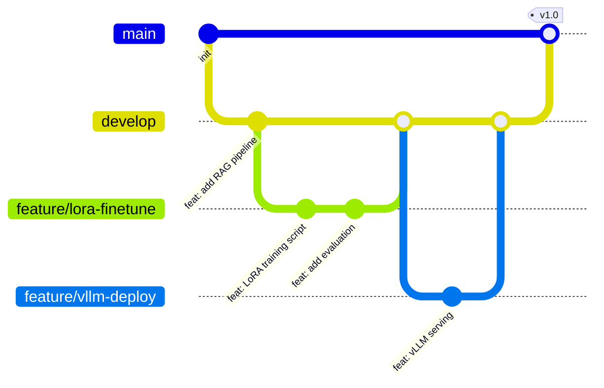

# Git/GitHub 工作流

## 概念说明

**Git** 是分布式版本控制系统，**GitHub** 是基于 Git 的代码托管平台。对于 AI 项目，Git/GitHub 不仅用于代码版本管理，还承担模型实验追踪、数据集版本化、CI/CD 自动部署等职责。

### AI 项目中的 Git 使用场景

- **代码版本管理**：模型训练脚本、推理服务代码、RAG 流水线
- **实验分支**：不同超参数/模型架构用不同分支实验
- **CI/CD**：GitHub Actions 自动运行测试、构建文档站点、部署服务
- **协作**：PR 工作流进行代码审查，Issue 追踪 bug 和需求
- **.gitignore**：排除模型权重文件（通常几 GB）、数据集、环境文件

## 核心原理

### 1. 分支管理策略



AI 项目推荐的分支策略：
- `main`：稳定版本，CI/CD 自动部署
- `develop`：开发分支，合并功能分支
- `feature/*`：功能分支（如 `feature/rag-optimization`）
- `experiment/*`：实验分支（如 `experiment/qwen2-lora-r16`）

### 2. PR 工作流

```bash
# 1. 创建功能分支
git checkout -b feature/add-rag-rerank

# 2. 开发并提交
git add docs/3-ai-apps/10-rerank.md
git commit -m "docs(ai-apps): 添加 Rerank 重排序知识条目"

# 3. 推送并创建 PR
git push origin feature/add-rag-rerank
# 在 GitHub 上创建 Pull Request，请求合并到 develop

# 4. 代码审查通过后合并
# 在 GitHub 上点击 Merge
```

### 3. GitHub Actions 基础

```yaml
# .github/workflows/deploy.yml 核心结构
name: Deploy
on:
  push:
    branches: [main]
jobs:
  build:
    runs-on: ubuntu-latest
    steps:
      - uses: actions/checkout@v4
      - name: Build
        run: pnpm run build
      - name: Deploy
        uses: actions/deploy-pages@v4
```

### 4. .gitignore 配置（AI 项目）

```gitignore
# 模型权重（通常几 GB，不应提交到 Git）
*.bin
*.safetensors
*.gguf
models/

# 数据集
datasets/
*.parquet

# Python
__pycache__/
*.pyc
.venv/

# 环境变量（含 API Key）
.env
.env.local

# IDE
.kiro/
.vscode/
```

> ⚠️ 大文件（模型权重、数据集）应使用 Git LFS 或 Hugging Face Hub 管理，不要直接提交到 Git 仓库。

## 实战要点

**Commit Message 规范：**
- `docs(module): 描述` — 文档变更
- `code(module): 描述` — 代码示例变更
- `feat(module): 描述` — 新功能
- `fix(module): 描述` — 修复

**AI 项目特殊注意：**
- 模型权重文件绝对不要提交到 Git（用 .gitignore 排除）
- API Key 放在 .env 文件中，.env 加入 .gitignore
- 大数据集用 DVC（Data Version Control）或 Hugging Face Datasets 管理

## 常见面试题

### Q1: Git 的 rebase 和 merge 有什么区别？

**难度**：⭐⭐ | **频率**：🔥🔥

**标准答案**：

- `merge`：创建一个合并提交，保留完整的分支历史，适合公共分支
- `rebase`：将当前分支的提交"移植"到目标分支顶端，历史更线性，适合个人功能分支

AI 项目建议：功能分支用 rebase 保持历史整洁，合并到 main/develop 用 merge 保留合并记录。

**深入追问**：
- 什么情况下不应该 rebase？（已推送到远程的公共分支）
- `git rebase -i` 的用途？（交互式 rebase，合并/修改/删除提交）

## 推荐工具

> 📌 以下工具可帮助你更高效地学习和实践本知识点，详见 [模块 7：AI 使用与实践](/7-ai-tools/)

| 工具 | 用途 | 详情 |
|------|------|------|
| Cursor | 内置 Git 集成，可视化 diff 和 commit | [AI 编程辅助](/7-ai-tools/7.1-efficiency/ai-coding) |
| Kiro | Spec 驱动开发，自动生成 commit message | [AI 编程辅助](/7-ai-tools/7.1-efficiency/ai-coding) |

## 参考资料

- [Pro Git 中文版](https://git-scm.com/book/zh/v2)
- [GitHub 官方文档](https://docs.github.com/)
- [GitHub Actions 文档](https://docs.github.com/en/actions)
