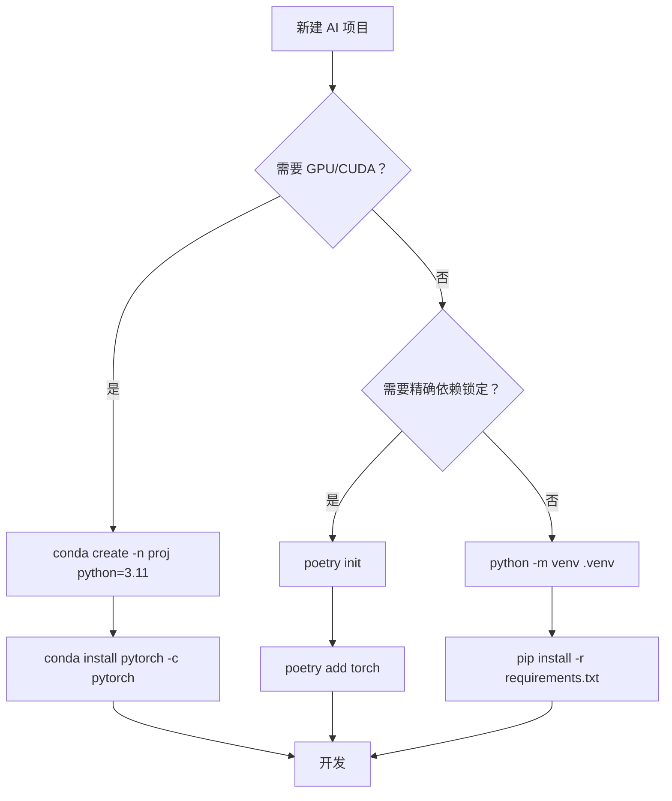

# 虚拟环境管理

## 概念说明

**虚拟环境**是 Python 的隔离机制，每个项目拥有独立的 Python 解释器和依赖包，避免不同项目之间的依赖冲突。

### 为什么 AI 项目必须使用虚拟环境？

AI 项目的依赖冲突比普通项目严重得多：
- PyTorch 2.1 需要特定版本的 CUDA
- LangChain 0.1 和 0.2 的 API 不兼容
- Pydantic v1 和 v2 不能共存
- 不同项目可能需要不同版本的 Transformers

没有虚拟环境，安装一个项目的依赖可能破坏另一个项目。

## 核心原理

### 1. venv — Python 内置虚拟环境

```bash
# 创建虚拟环境
python -m venv .venv

# 激活
source .venv/bin/activate      # Linux/macOS
# .venv\Scripts\activate       # Windows

# 安装依赖
pip install -r requirements.txt

# 退出
deactivate
```

venv 的特点：
- Python 3.3+ 内置，无需额外安装
- 轻量，只隔离 Python 包
- 不能管理 Python 版本本身

### 2. conda — 科学计算环境管理

```bash
# 创建环境（指定 Python 版本）
conda create -n guide-ai python=3.11

# 激活
conda activate guide-ai

# 安装包（conda 渠道）
conda install pytorch torchvision -c pytorch

# 安装包（pip 兼容）
pip install langchain chromadb

# 导出环境
conda env export > environment.yml

# 从文件创建环境
conda env create -f environment.yml
```

conda 的特点：
- 可以管理 Python 版本和非 Python 依赖（CUDA、cuDNN）
- 有自己的包仓库（conda-forge），预编译的科学计算包
- 环境体积较大

### 3. poetry — 现代依赖管理

```bash
# 创建项目
poetry init

# 自动创建虚拟环境并安装依赖
poetry install

# 进入虚拟环境
poetry shell

# 添加依赖
poetry add torch transformers
poetry add --group dev pytest ruff
```

### 4. 工具对比

| 维度 | venv | conda | poetry |
|------|------|-------|--------|
| Python 版本管理 | ❌ | ✅ | ❌（需配合 pyenv） |
| 非 Python 依赖 | ❌ | ✅（CUDA 等） | ❌ |
| 依赖锁定 | ❌ | ✅（environment.yml） | ✅（poetry.lock） |
| 依赖解析 | 简单 | 完整 | 完整 |
| 学习成本 | 低 | 中 | 中 |
| 推荐场景 | 简单项目 | GPU/CUDA 项目 | 需要精确依赖管理 |

### 5. 环境隔离最佳实践



推荐策略：
- **本知识库项目**：venv + pip（简单直接）
- **GPU 训练项目**：conda（管理 CUDA 依赖）
- **团队协作项目**：poetry（精确锁定依赖版本）

## 实战要点

**常见陷阱：**
- 忘记激活虚拟环境就 `pip install`，污染全局环境
- conda 和 pip 混用可能导致依赖冲突（优先用 conda 安装，pip 作为补充）
- `.venv` 目录不要提交到 Git（加入 .gitignore）

**Docker vs 虚拟环境：**
- 开发阶段用虚拟环境（轻量、快速）
- 部署阶段用 Docker（完全隔离、可复现）

## 常见面试题

### Q1: venv 和 conda 的区别？什么时候用哪个？

**难度**：⭐ | **频率**：🔥

**标准答案**：

venv 是 Python 内置的轻量虚拟环境工具，只隔离 Python 包，不能管理 Python 版本和非 Python 依赖。conda 是 Anaconda 提供的环境管理器，可以管理 Python 版本、非 Python 依赖（如 CUDA、cuDNN），有自己的包仓库。

AI 项目推荐：需要 GPU 训练时用 conda（方便管理 CUDA），纯 CPU 推理或 Web 服务用 venv 即可。

**深入追问**：
- 如何在 Docker 中管理 Python 环境？（直接用系统 Python + pip，不需要虚拟环境）

## 推荐工具

> 📌 以下工具可帮助你更高效地学习和实践本知识点，详见 [模块 7：AI 使用与实践](/7-ai-tools/)

| 工具 | 用途 | 详情 |
|------|------|------|
| Perplexity | 搜索环境管理最佳实践和依赖冲突解决方案 | [AI 搜索](/7-ai-tools/7.1-efficiency/ai-search) |

## 参考资料

- [Python 官方文档 — venv](https://docs.python.org/3/library/venv.html)
- [conda 官方文档](https://docs.conda.io/)
- [Poetry 官方文档](https://python-poetry.org/docs/)
- [Real Python — Python Virtual Environments](https://realpython.com/python-virtual-environments-a-primer/)
