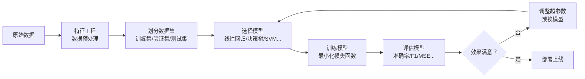

# 监督学习

## 概念说明

**监督学习**（Supervised Learning）是机器学习最核心的范式：给模型提供带标签的训练数据（输入-输出对），让模型学习输入到输出的映射关系，从而对新数据做出预测。

类比后端开发：监督学习就像写一个函数 `f(x) = y`，但你不是手写逻辑，而是给模型大量的 `(x, y)` 样本，让它自己"学"出这个函数。

### 两大任务类型

| 类型 | 输出 | 示例 | 评估指标 |
|------|------|------|----------|
| **分类**（Classification） | 离散类别 | 垃圾邮件检测、情感分析、图像分类 | 准确率、F1、AUC-ROC |
| **回归**（Regression） | 连续数值 | 房价预测、Token 用量预估、延迟预测 | MSE、MAE、R² |

### 在 AI 应用中的位置

- **传统 ML**：分类/回归是基础，理解后才能理解深度学习
- **LLM 微调**：本质上是监督学习（指令-回答对）
- **RAG 评估**：检索结果的相关性评分是分类/回归问题
- **模型选型**：理解偏差-方差权衡才能选对模型

## 核心原理

### 1. 监督学习流程



### 2. 损失函数

损失函数衡量模型预测值与真实值的差距，训练的目标就是最小化损失：

**回归损失：**
- **MSE**（均方误差）：$L = \frac{1}{n}\sum(y_i - \hat{y}_i)^2$，对大误差敏感
- **MAE**（平均绝对误差）：$L = \frac{1}{n}\sum|y_i - \hat{y}_i|$，对异常值鲁棒

**分类损失：**
- **交叉熵**（Cross-Entropy）：$L = -\sum y_i \log(\hat{y}_i)$，分类任务标准损失
- **Hinge Loss**：SVM 使用的损失函数

### 3. 梯度下降

梯度下降是优化损失函数的核心算法：

```python
# 梯度下降伪代码
for epoch in range(max_epochs):
    predictions = model(X_train)           # 前向传播
    loss = loss_function(predictions, y_train)  # 计算损失
    gradients = compute_gradients(loss)    # 反向传播
    model.parameters -= learning_rate * gradients  # 更新参数
```

梯度下降变体：

| 变体 | 每次更新使用的数据量 | 特点 |
|------|---------------------|------|
| BGD（批量梯度下降） | 全部训练数据 | 稳定但慢 |
| SGD（随机梯度下降） | 单个样本 | 快但不稳定 |
| Mini-batch GD | 一个 batch（如 32/64） | 平衡速度和稳定性，最常用 |

### 4. 过拟合与欠拟合


| 问题 | 原因 | 解决方案 |
|------|------|----------|
| 欠拟合 | 模型太简单、特征不够 | 增加模型复杂度、增加特征 |
| 过拟合 | 模型太复杂、数据太少 | 正则化（L1/L2）、Dropout、数据增强、早停 |

## 代码示例

> 💻 完整可运行代码：[code-examples/01-ml-basics/supervised_learning/](https://github.com/your-repo/tree/main/code-examples/01-ml-basics/supervised_learning/)
> 🐍 Python 版本：3.11+
> 📦 依赖：scikit-learn、torch、numpy、matplotlib

```python
from sklearn.linear_model import LinearRegression
from sklearn.model_selection import train_test_split
from sklearn.metrics import mean_squared_error
import numpy as np

# 生成模拟数据
X = np.random.randn(100, 3)
y = X @ np.array([2.0, -1.0, 0.5]) + np.random.randn(100) * 0.1

# 划分数据集
X_train, X_test, y_train, y_test = train_test_split(X, y, test_size=0.2)

# 训练
model = LinearRegression()
model.fit(X_train, y_train)

# 评估
y_pred = model.predict(X_test)
mse = mean_squared_error(y_test, y_pred)
print(f"MSE: {mse:.4f}, 系数: {model.coef_.round(3)}")
```

## 实战要点

**数据划分：**
- 训练集 70-80%、验证集 10-15%、测试集 10-15%
- 时序数据不能随机划分，必须按时间顺序
- 类别不平衡时用分层采样（`stratify` 参数）

**特征工程：**
- 数值特征：标准化（StandardScaler）或归一化（MinMaxScaler）
- 类别特征：One-Hot 编码或 Label 编码
- 缺失值：填充均值/中位数，或用模型预测

**模型选择经验：**
- 数据量小（< 1000）：线性模型、决策树
- 数据量中等：随机森林、XGBoost
- 数据量大 + 复杂模式：深度学习

## 常见面试题

### Q1: 分类和回归的区别是什么？

**难度**：⭐ | **频率**：🔥🔥🔥

**答题思路**：输出类型 → 损失函数 → 评估指标

**标准答案**：分类的输出是离散类别（如正/负、猫/狗），使用交叉熵损失，评估用准确率/F1/AUC。回归的输出是连续数值（如价格、温度），使用 MSE/MAE 损失，评估用 MSE/R²。两者的训练流程相同（数据 → 模型 → 损失 → 优化），只是输出层和损失函数不同。

**深入追问**：
- 逻辑回归是分类还是回归？（分类，名字有误导性）
- 如何将回归问题转化为分类问题？（离散化/分桶）

### Q2: 什么是偏差-方差权衡？

**难度**：⭐⭐⭐ | **频率**：🔥🔥🔥

**答题思路**：定义偏差和方差 → 与欠拟合/过拟合的关系 → 如何平衡

**标准答案**：偏差（Bias）衡量模型预测值与真实值的系统性偏离，高偏差 = 欠拟合。方差（Variance）衡量模型对训练数据变化的敏感度，高方差 = 过拟合。总误差 = 偏差² + 方差 + 不可约误差。简单模型高偏差低方差，复杂模型低偏差高方差。目标是找到两者的平衡点，常用方法：交叉验证选择模型复杂度、正则化控制方差。

**深入追问**：
- 集成学习（Bagging/Boosting）如何影响偏差和方差？
- 深度学习为什么能同时降低偏差和方差？

### Q3: 梯度下降的学习率如何选择？

**难度**：⭐⭐ | **频率**：🔥🔥

**标准答案**：学习率太大会导致震荡甚至发散，太小会收敛极慢。实践中：(1) 从 0.001 开始尝试；(2) 使用学习率调度器（如 CosineAnnealing、ReduceLROnPlateau）；(3) 使用自适应优化器（Adam 自动调整每个参数的学习率）；(4) 学习率预热（Warmup）避免训练初期不稳定。

**深入追问**：
- Adam 优化器的原理？（一阶矩 + 二阶矩估计）
- 什么是学习率预热（Warmup）？为什么 Transformer 需要？

## 推荐工具

> 📌 以下工具可帮助你更高效地学习和实践本知识点，详见 [模块 7：AI 使用与实践](/7-ai-tools/)

| 工具 | 用途 | 详情 |
|------|------|------|
| Perplexity | 快速搜索 ML 算法原理和最新论文 | [AI 搜索](/7-ai-tools/7.1-efficiency/ai-search) |
| Cursor | 辅助编写 scikit-learn/PyTorch 训练代码 | [AI 编程辅助](/7-ai-tools/7.1-efficiency/ai-coding) |

## 参考资料

- [scikit-learn 官方文档 — 监督学习](https://scikit-learn.org/stable/supervised_learning.html)
- [fast.ai — Practical Deep Learning](https://course.fast.ai/)
- [Andrew Ng — Machine Learning Specialization](https://www.coursera.org/specializations/machine-learning-introduction)
- [StatQuest — Machine Learning 系列](https://www.youtube.com/c/joshstarmer)
