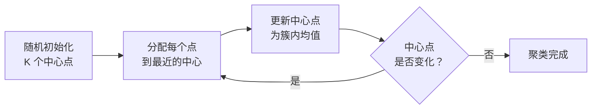

# 无监督学习

## 概念说明

**无监督学习**（Unsupervised Learning）是在没有标签的数据中发现隐藏结构和模式。与监督学习不同，无监督学习不需要人工标注的 `(x, y)` 对，只需要输入数据 `x`。

类比：监督学习像"有老师教"（给答案），无监督学习像"自己探索"（发现规律）。

### 两大任务类型

| 类型 | 目标 | 典型算法 | AI 应用场景 |
|------|------|----------|------------|
| **聚类** | 将相似数据分组 | K-Means、DBSCAN、层次聚类 | 文档聚类、用户分群、异常检测 |
| **降维** | 减少特征维度 | PCA、t-SNE、UMAP | Embedding 可视化、特征压缩、去噪 |

### 在 AI 应用中的位置

- **Embedding 可视化**：用 t-SNE/UMAP 将 768 维向量降到 2D 可视化
- **文档聚类**：RAG 中对检索结果聚类，提高多样性
- **异常检测**：检测 LLM 输出中的异常模式
- **数据探索**：训练前了解数据分布和结构

## 核心原理

### 1. K-Means 聚类



K-Means 核心步骤：
1. 随机选择 K 个初始中心点
2. 将每个数据点分配到最近的中心点（欧氏距离）
3. 重新计算每个簇的中心点（簇内所有点的均值）
4. 重复 2-3 直到中心点不再变化（收敛）

```python
from sklearn.cluster import KMeans

# 对 Embedding 向量聚类
kmeans = KMeans(n_clusters=5, random_state=42)
labels = kmeans.fit_predict(embeddings)  # 每个文档的簇标签
centers = kmeans.cluster_centers_         # 5 个簇中心
```

K 值选择方法：
- **肘部法则**（Elbow Method）：画 K vs 惯性（inertia）曲线，找拐点
- **轮廓系数**（Silhouette Score）：衡量簇内紧密度和簇间分离度，越接近 1 越好

### 2. PCA 降维

**PCA**（主成分分析）通过线性变换将高维数据投影到低维空间，保留最大方差的方向。

```python
from sklearn.decomposition import PCA

# 将 768 维 Embedding 降到 2 维用于可视化
pca = PCA(n_components=2)
embeddings_2d = pca.fit_transform(embeddings_768d)

# 查看各主成分解释的方差比例
print(pca.explained_variance_ratio_)
# 例如 [0.15, 0.08] 表示前两个主成分解释了 23% 的方差
```

PCA 的应用场景：
- **可视化**：高维 Embedding 降到 2D/3D 画散点图
- **去噪**：保留主要成分，去除噪声维度
- **加速**：降维后减少计算量（如 KNN 检索）
- **特征工程**：作为预处理步骤减少特征数量

### 3. 聚类 vs 降维 对比

| 维度 | 聚类 | 降维 |
|------|------|------|
| 目标 | 分组（离散标签） | 压缩（连续低维表示） |
| 输出 | 每个点的簇标签 | 每个点的低维坐标 |
| 典型算法 | K-Means、DBSCAN | PCA、t-SNE、UMAP |
| 常见组合 | 先降维再聚类 | 先聚类再降维可视化 |

## 代码示例

> 💻 完整可运行代码：[code-examples/01-ml-basics/unsupervised_learning/](https://github.com/skyhe58/guide-ai/tree/main/code-examples/01-ml-basics/unsupervised_learning/)
> 🐍 Python 版本：3.11+
> 📦 依赖：scikit-learn、numpy、matplotlib

```python
from sklearn.cluster import KMeans
from sklearn.decomposition import PCA
import numpy as np

# 模拟 100 个文档的 Embedding
embeddings = np.random.randn(100, 768).astype(np.float32)

# 聚类
kmeans = KMeans(n_clusters=5, random_state=42)
labels = kmeans.fit_predict(embeddings)

# 降维可视化
pca = PCA(n_components=2)
coords = pca.fit_transform(embeddings)
print(f"簇分布: {np.bincount(labels)}")
```

## 实战要点

**K-Means 注意事项：**
- 需要预先指定 K 值（用肘部法则或轮廓系数确定）
- 对初始中心点敏感（用 `init='k-means++'` 改善）
- 只能发现球形簇，不适合非凸形状（用 DBSCAN 替代）
- 特征需要标准化

**PCA 注意事项：**
- 只能捕捉线性关系（非线性用 t-SNE/UMAP）
- `n_components` 选择：看累计方差解释比例（通常保留 95%）
- t-SNE 适合可视化但不适合作为特征（不保持全局结构）

## 常见面试题

### Q1: K-Means 的 K 值如何确定？

**难度**：⭐⭐ | **频率**：🔥🔥

**标准答案**：两种常用方法：(1) 肘部法则：画 K vs inertia 曲线，找曲线弯折点（"肘部"）；(2) 轮廓系数：对不同 K 值计算轮廓系数，选最大值对应的 K。实际中两者结合使用，再结合业务理解确定。

**深入追问**：
- K-Means 和 DBSCAN 的区别？（DBSCAN 不需要指定 K，能发现任意形状的簇）
- K-Means++ 初始化的原理？

### Q2: PCA 和 t-SNE 的区别？

**难度**：⭐⭐ | **频率**：🔥🔥

**标准答案**：PCA 是线性降维，保持全局结构，速度快，可逆（能重建），适合特征压缩。t-SNE 是非线性降维，保持局部结构，速度慢，不可逆，适合可视化。Embedding 可视化用 t-SNE/UMAP，特征工程用 PCA。

**深入追问**：
- UMAP 相比 t-SNE 的优势？（更快、保持更多全局结构、支持新数据 transform）

## 推荐工具

> 📌 以下工具可帮助你更高效地学习和实践本知识点，详见 [模块 7：AI 使用与实践](/7-ai-tools/)

| 工具 | 用途 | 详情 |
|------|------|------|
| Perplexity | 搜索聚类算法对比和降维可视化技巧 | [AI 搜索](/7-ai-tools/7.1-efficiency/ai-search) |
| Cursor | 辅助编写 scikit-learn 聚类和降维代码 | [AI 编程辅助](/7-ai-tools/7.1-efficiency/ai-coding) |

## 参考资料

- [scikit-learn — 聚类](https://scikit-learn.org/stable/modules/clustering.html)
- [scikit-learn — 降维](https://scikit-learn.org/stable/modules/decomposition.html)
- [StatQuest — K-Means Clustering](https://www.youtube.com/watch?v=4b5d3muPQmA)
- [StatQuest — PCA](https://www.youtube.com/watch?v=FgakZw6K1QQ)
