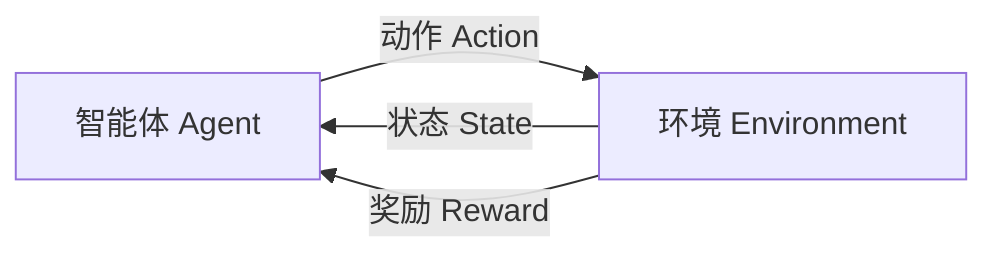
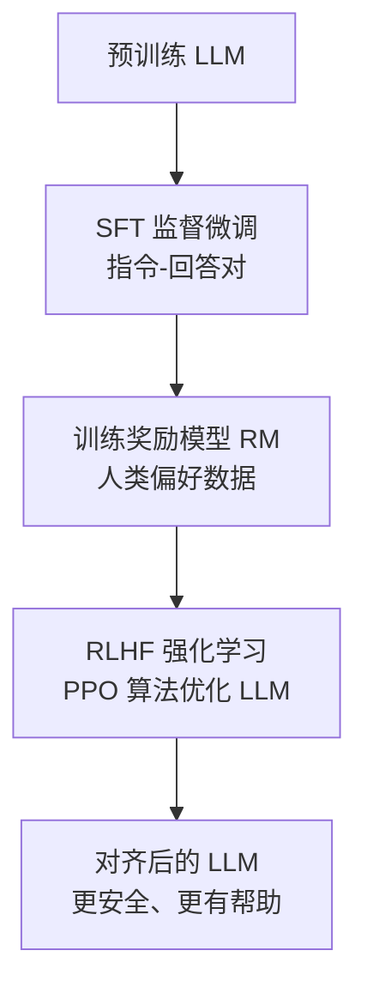

# 强化学习入门

> 📌 **了解级别**：本节内容作为知识储备，理解核心概念即可。强化学习在 LLM 训练（RLHF）中有重要应用，但日常 AI 应用开发中较少直接使用。

## 概念说明

**强化学习**（Reinforcement Learning, RL）是机器学习的第三大范式：智能体（Agent）在环境中通过试错学习，根据奖励信号调整策略，最大化长期累积奖励。

三大范式对比：

| 范式 | 数据 | 学习方式 | 类比 |
|------|------|----------|------|
| 监督学习 | 带标签 (x, y) | 从正确答案学习 | 有老师教 |
| 无监督学习 | 无标签 x | 发现数据结构 | 自己探索 |
| 强化学习 | 状态-动作-奖励 | 从试错中学习 | 打游戏（得分反馈） |

### 为什么 AI 开发者需要了解强化学习？

- **RLHF**（人类反馈强化学习）：GPT-4、Claude 等 LLM 训练的关键步骤
- **DPO**（直接偏好优化）：RLHF 的简化替代方案
- **AI Agent**：Agent 的决策过程本质上是强化学习问题
- **面试**：LLM 训练流程中 RLHF 是高频考点

## 核心原理

### 1. 核心概念



| 概念 | 说明 | LLM 场景类比 |
|------|------|-------------|
| **Agent（智能体）** | 做决策的主体 | LLM 模型 |
| **Environment（环境）** | Agent 交互的外部世界 | 用户对话场景 |
| **State（状态）** | 环境的当前描述 | 对话历史 |
| **Action（动作）** | Agent 的选择 | 生成的下一个 Token |
| **Reward（奖励）** | 动作的反馈信号 | 人类偏好评分 |
| **Policy（策略）** | 状态到动作的映射 | LLM 的生成策略 |

### 2. 马尔可夫决策过程（MDP）

强化学习的数学框架是 MDP，由五元组 `(S, A, P, R, γ)` 定义：

- **S**：状态空间
- **A**：动作空间
- **P**：状态转移概率 P(s'|s, a)
- **R**：奖励函数 R(s, a)
- **γ**：折扣因子（0-1），控制对未来奖励的重视程度

**马尔可夫性质**：下一个状态只取决于当前状态和动作，与历史无关。

### 3. Q-Learning 入门

Q-Learning 是最经典的强化学习算法，学习一个 Q 函数 Q(s, a)，表示在状态 s 下执行动作 a 的长期价值。

```python
# Q-Learning 伪代码
Q = {}  # Q 表：(状态, 动作) → 价值

for episode in range(n_episodes):
    state = env.reset()
    while not done:
        # ε-贪心策略：大部分时间选最优动作，偶尔随机探索
        if random() < epsilon:
            action = random_action()
        else:
            action = argmax(Q[state])

        next_state, reward, done = env.step(action)

        # Q 值更新（贝尔曼方程）
        Q[state][action] += alpha * (
            reward + gamma * max(Q[next_state]) - Q[state][action]
        )
        state = next_state
```

关键超参数：
- **α（学习率）**：Q 值更新步长
- **γ（折扣因子）**：未来奖励的权重（0.9-0.99）
- **ε（探索率）**：随机探索的概率（逐渐衰减）

### 4. 与 LLM 训练的关系（RLHF）



RLHF 中的强化学习映射：
- **Agent** = LLM
- **State** = 输入 Prompt + 已生成的 Token
- **Action** = 生成下一个 Token
- **Reward** = 奖励模型（RM）的评分
- **Policy** = LLM 的生成概率分布

## 代码示例

```python
import numpy as np

# 简化的 Q-Learning 示例：网格世界
# Agent 在 4x4 网格中从起点走到终点

grid_size = 4
n_actions = 4  # 上下左右
Q = np.zeros((grid_size * grid_size, n_actions))

# 奖励：到达终点 +10，每步 -1
# 训练后 Agent 学会走最短路径
print("Q-Learning 网格世界示例（概念演示）")
print("实际 RLHF 使用 PPO 算法，原理类似但更复杂")
```

## 实战要点

**对于 AI 应用开发者：**
- 不需要从零实现 RL 算法，理解概念即可
- 重点理解 RLHF 在 LLM 训练中的作用
- DPO（直接偏好优化）是 RLHF 的简化替代，越来越流行
- AI Agent 的决策可以用 RL 框架理解，但实际多用 LLM + 工具调用实现

## 常见面试题

### Q1: RLHF 在 LLM 训练中的作用是什么？

**难度**：⭐⭐⭐ | **频率**：🔥🔥🔥

**标准答案**：RLHF 是 LLM 训练的第三阶段（预训练 → SFT → RLHF）。它通过人类偏好数据训练奖励模型（RM），然后用 PPO 算法优化 LLM，使其生成更符合人类期望的回答（更有帮助、更安全、更诚实）。RLHF 解决了 SFT 无法解决的"对齐"问题。

**深入追问**：
- DPO 和 RLHF 的区别？（DPO 不需要单独的奖励模型，直接从偏好数据优化）
- PPO 算法的核心思想？（限制策略更新幅度，避免训练不稳定）

## 推荐工具

> 📌 以下工具可帮助你更高效地学习和实践本知识点，详见 [模块 7：AI 使用与实践](/7-ai-tools/)

| 工具 | 用途 | 详情 |
|------|------|------|
| Perplexity | 搜索 RLHF/DPO 最新论文和教程 | [AI 搜索](/7-ai-tools/7.1-efficiency/ai-search) |

## 参考资料

- [OpenAI — RLHF 论文](https://arxiv.org/abs/2203.02155)
- [Hugging Face — RLHF 教程](https://huggingface.co/blog/rlhf)
- [DPO 论文](https://arxiv.org/abs/2305.18290)
- [Spinning Up in Deep RL — OpenAI](https://spinningup.openai.com/)
- [David Silver — RL 课程](https://www.davidsilver.uk/teaching/)
