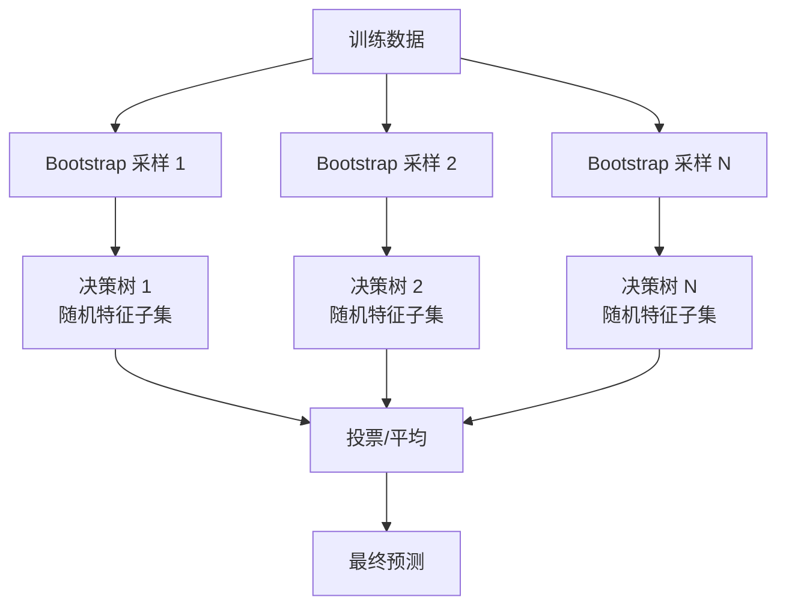
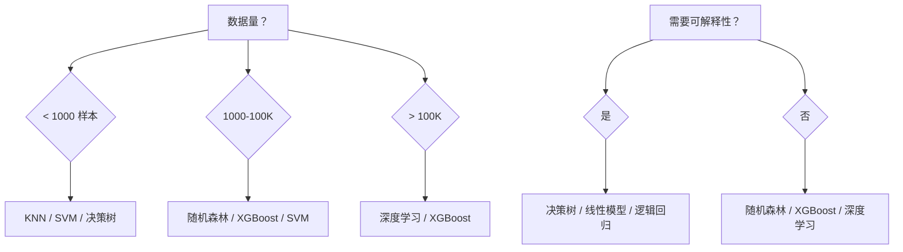

# 常见机器学习算法

## 概念说明

本节汇总 ML 面试中最常考的经典算法，每个算法包含原理说明、适用场景、代码实现和面试要点。这些算法是理解深度学习和 LLM 的基础。

## 算法总览

| 算法 | 类型 | 核心思想 | 适用场景 | 面试频率 |
|------|------|----------|----------|:--------:|
| 线性回归 | 回归 | 最小化 MSE | 连续值预测 | 🔥🔥🔥 |
| 逻辑回归 | 分类 | Sigmoid + 交叉熵 | 二分类/多分类 | 🔥🔥🔥 |
| 决策树 | 分类/回归 | 信息增益/基尼系数 | 可解释性要求高 | 🔥🔥🔥 |
| 随机森林 | 集成 | Bagging + 特征随机 | 通用分类/回归 | 🔥🔥🔥 |
| SVM | 分类 | 最大间隔 + 核函数 | 中小数据集高维 | 🔥🔥 |
| KNN | 分类/回归 | 距离度量 + 投票 | 小数据集快速原型 | 🔥🔥 |
| 朴素贝叶斯 | 分类 | 贝叶斯定理 + 特征独立 | 文本分类 | 🔥 |

## 核心原理

### 1. 线性回归（Linear Regression）

**原理**：找到一条直线（超平面）$y = w^Tx + b$，使预测值与真实值的均方误差最小。

**求解方法**：
- 正规方程（解析解）：$w = (X^TX)^{-1}X^Ty$
- 梯度下降（迭代解）：适合大数据集

**面试要点**：
- 假设：线性关系、误差正态分布、特征无多重共线性
- 正则化：L1（Lasso，特征选择）、L2（Ridge，防过拟合）

### 2. 逻辑回归（Logistic Regression）

**原理**：在线性回归基础上加 Sigmoid 函数，将输出映射到 (0, 1) 概率区间。

$$\sigma(z) = \frac{1}{1 + e^{-z}}, \quad z = w^Tx + b$$

**面试要点**：
- 名字有"回归"但实际是分类算法
- 损失函数是交叉熵（不是 MSE）
- 多分类用 Softmax（Multinomial Logistic Regression）
- 输出是概率，可以设置不同阈值调整精确率/召回率

### 3. 决策树（Decision Tree）

**原理**：通过递归划分特征空间，每个节点选择最优特征和阈值进行分裂。

**分裂准则**：
- **信息增益**（ID3）：选择使信息熵下降最多的特征
- **基尼系数**（CART）：选择使基尼不纯度最小的特征（scikit-learn 默认）

**面试要点**：
- 优势：可解释性强、不需要特征缩放
- 劣势：容易过拟合（需要剪枝或限制深度）
- 剪枝：预剪枝（限制深度/叶子数）、后剪枝（先生长再修剪）

### 4. 随机森林（Random Forest）

**原理**：Bagging + 特征随机 = 多棵决策树投票。

**面试要点**：
- Bagging 降低方差（减少过拟合）
- 特征随机增加树的多样性
- `n_estimators`（树的数量）越多越好，但有边际递减
- OOB（Out-of-Bag）评估：不需要单独的验证集

### 5. SVM（支持向量机）

**原理**：找到一个超平面，使两类数据之间的间隔（margin）最大化。

**面试要点**：
- 线性 SVM：适合线性可分数据
- 核函数（Kernel Trick）：RBF/多项式核，将数据映射到高维空间处理非线性
- 支持向量：距离超平面最近的样本点，决定了超平面的位置
- 必须做特征标准化

### 6. KNN（K 近邻）

**原理**：对新样本，找到训练集中最近的 K 个邻居，投票决定类别。

**面试要点**：
- 懒学习（Lazy Learning）：不需要训练，预测时计算距离
- K 值选择：太小容易过拟合，太大容易欠拟合
- 距离度量：欧氏距离、曼哈顿距离、余弦相似度
- 缺点：预测慢（需要计算与所有训练样本的距离）、维度灾难

### 7. 朴素贝叶斯（Naive Bayes）

> 📌 了解级别

**原理**：基于贝叶斯定理，假设特征之间相互独立。

$$P(y|x) = \frac{P(x|y) \cdot P(y)}{P(x)}$$

**面试要点**：
- "朴素"指特征独立假设（实际中很少成立，但效果仍然不错）
- 适合文本分类（垃圾邮件、情感分析）
- 训练快、可增量学习
- 对特征相关性敏感

## 算法选择指南

## 代码示例

> 💻 完整可运行代码：[code-examples/01-ml-basics/supervised_learning/](https://github.com/skyhe58/guide-ai/tree/main/code-examples/01-ml-basics/supervised_learning/)

每个算法的完整实现见对应代码文件：
- `01_linear_regression.py` — 线性回归
- `02_logistic_regression.py` — 逻辑回归
- `03_decision_tree.py` — 决策树
- `04_random_forest.py` — 随机森林
- `05_svm_knn.py` — SVM 与 KNN

## 常见面试题

### Q1: 随机森林和决策树的区别？

**难度**：⭐⭐ | **频率**：🔥🔥🔥

**标准答案**：随机森林是多棵决策树的集成（Bagging）。区别：(1) 随机森林用 Bootstrap 采样训练每棵树；(2) 每次分裂只考虑随机特征子集；(3) 最终结果由所有树投票/平均。优势：降低方差、减少过拟合、不需要剪枝。

**追问**：Bagging 和 Boosting 的区别？（Bagging 并行降方差，Boosting 串行降偏差）

### Q2: SVM 的核函数是什么？为什么需要？

**难度**：⭐⭐⭐ | **频率**：🔥🔥

**标准答案**：核函数将数据从低维空间映射到高维空间，使线性不可分的数据变得线性可分。核技巧（Kernel Trick）的关键是不需要显式计算高维映射，只需要计算内积。常用核：RBF（高斯核，最通用）、线性核、多项式核。

**追问**：RBF 核的 gamma 参数如何影响模型？（gamma 大 → 决策边界复杂 → 容易过拟合）

## 推荐工具

> 📌 以下工具可帮助你更高效地学习和实践本知识点，详见 [模块 7：AI 使用与实践](/7-ai-tools/)

| 工具 | 用途 | 详情 |
|------|------|------|
| Perplexity | 搜索算法原理对比和适用场景 | [AI 搜索](/7-ai-tools/7.1-efficiency/ai-search) |
| Cursor | 辅助编写 scikit-learn 代码 | [AI 编程辅助](/7-ai-tools/7.1-efficiency/ai-coding) |

## 参考资料

- [scikit-learn 算法选择指南](https://scikit-learn.org/stable/tutorial/machine_learning_map/)
- [StatQuest — ML 算法系列](https://www.youtube.com/c/joshstarmer)
- [Hands-On Machine Learning（O'Reilly）](https://www.oreilly.com/library/view/hands-on-machine-learning/9781098125967/)
