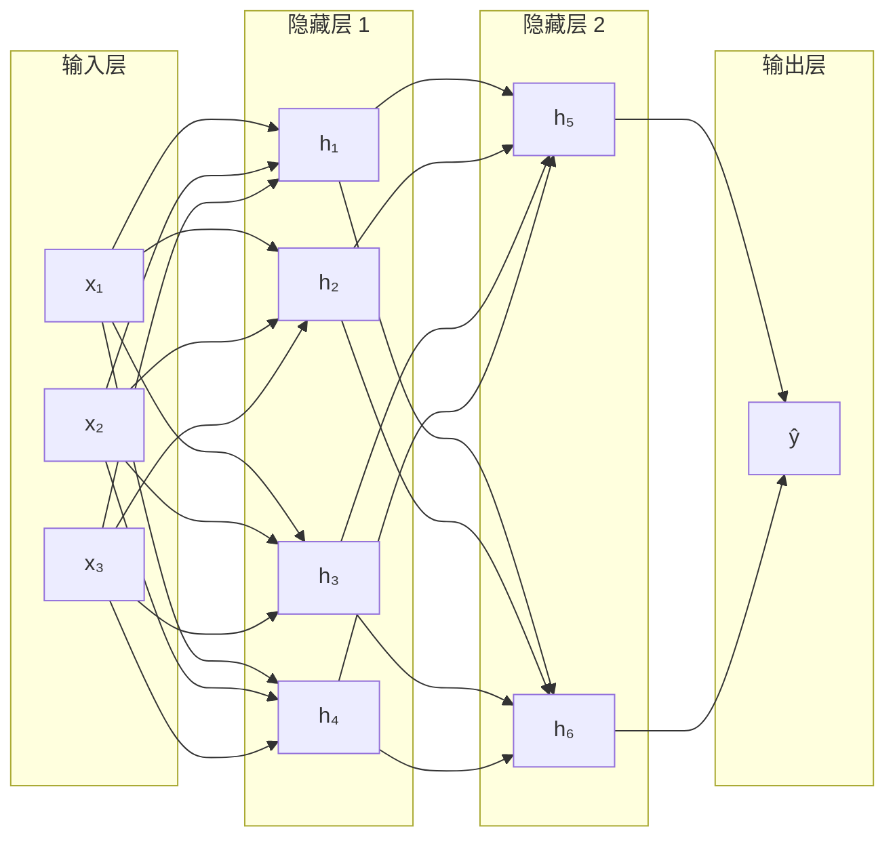

# 神经网络

## 概念说明

**神经网络**（Neural Network）是深度学习的基础，由多层"神经元"组成，每层对输入做线性变换 + 非线性激活，逐层提取越来越抽象的特征。

类比后端开发：神经网络就像一个多层的数据处理管道（Pipeline），每层是一个 `transform` 函数，数据从输入层流经隐藏层到输出层。

### 从感知机到深度学习

| 模型 | 层数 | 能力 | 年代 |
|------|:----:|------|:----:|
| 感知机（Perceptron） | 1 层 | 线性分类 | 1958 |
| 多层感知机（MLP） | 2-3 层 | 非线性分类 | 1986 |
| 深度神经网络（DNN） | 多层 | 复杂模式识别 | 2012+ |
| Transformer | 多层注意力 | 序列建模（LLM 基础） | 2017+ |

## 核心原理

### 1. 前向传播

数据从输入层逐层传递到输出层：



每层的计算：
```
z = W @ x + b        # 线性变换
a = activation(z)     # 非线性激活
```

### 2. 反向传播

反向传播是训练神经网络的核心算法，通过链式法则从输出层向输入层逐层计算梯度。


反向传播步骤：
1. **前向传播**：计算每层的输出和最终损失
2. **计算输出层梯度**：∂L/∂ŷ
3. **逐层反向传播**：用链式法则计算每层参数的梯度
4. **更新参数**：W -= lr × ∂L/∂W

```python
# PyTorch 自动反向传播
loss = criterion(output, target)  # 计算损失
loss.backward()                    # 自动计算所有参数的梯度
optimizer.step()                   # 更新参数
optimizer.zero_grad()              # 清零梯度
```

### 3. 激活函数

激活函数引入非线性，没有激活函数，多层网络等价于单层线性变换。

| 激活函数 | 公式 | 范围 | 特点 | 使用场景 |
|----------|------|------|------|----------|
| **ReLU** | max(0, x) | [0, +∞) | 简单高效，可能"死亡" | 隐藏层首选 |
| **Sigmoid** | 1/(1+e⁻ˣ) | (0, 1) | 输出概率，梯度消失 | 二分类输出层 |
| **Tanh** | (eˣ-e⁻ˣ)/(eˣ+e⁻ˣ) | (-1, 1) | 零中心，梯度消失 | RNN 隐藏层 |
| **GELU** | x·Φ(x) | (-∞, +∞) | 平滑版 ReLU | Transformer（BERT/GPT） |
| **SiLU/Swish** | x·σ(x) | (-∞, +∞) | 平滑，自门控 | 现代 LLM（LLaMA） |

```python
import torch.nn as nn

# PyTorch 中使用激活函数
model = nn.Sequential(
    nn.Linear(768, 256),
    nn.ReLU(),           # 隐藏层用 ReLU
    nn.Linear(256, 64),
    nn.ReLU(),
    nn.Linear(64, 2),    # 输出层不加激活（交叉熵损失内含 Softmax）
)
```

### 4. 梯度消失与梯度爆炸

| 问题 | 原因 | 解决方案 |
|------|------|----------|
| 梯度消失 | Sigmoid/Tanh 梯度 < 1，多层连乘趋近 0 | 用 ReLU、残差连接、BatchNorm |
| 梯度爆炸 | 权重过大，梯度连乘趋近 ∞ | 梯度裁剪、权重初始化、BatchNorm |

### 5. PyTorch 模型定义

```python
import torch
import torch.nn as nn

class SimpleClassifier(nn.Module):
    """简单的多层感知机分类器。"""
    
    def __init__(self, input_dim: int, hidden_dim: int, num_classes: int):
        super().__init__()
        self.network = nn.Sequential(
            nn.Linear(input_dim, hidden_dim),
            nn.ReLU(),
            nn.Dropout(0.3),          # 防过拟合
            nn.Linear(hidden_dim, hidden_dim // 2),
            nn.ReLU(),
            nn.Dropout(0.3),
            nn.Linear(hidden_dim // 2, num_classes),
        )
    
    def forward(self, x: torch.Tensor) -> torch.Tensor:
        return self.network(x)

# 训练循环
model = SimpleClassifier(input_dim=768, hidden_dim=256, num_classes=10)
criterion = nn.CrossEntropyLoss()
optimizer = torch.optim.Adam(model.parameters(), lr=1e-3)

for epoch in range(10):
    output = model(X_train)
    loss = criterion(output, y_train)
    loss.backward()
    optimizer.step()
    optimizer.zero_grad()
```

## 代码示例

> 💻 完整可运行代码：[code-examples/01-ml-basics/deep_learning/01_neural_network.py](https://github.com/skyhe58/guide-ai/tree/main/code-examples/01-ml-basics/deep_learning/01_neural_network.py)
> 🐍 Python 版本：3.11+
> 📦 依赖：torch>=2.1

## 实战要点

**模型设计：**
- 隐藏层激活函数首选 ReLU（或 GELU/SiLU）
- 输出层：分类用 Softmax（CrossEntropyLoss 内含），回归不加激活
- Dropout 放在激活函数之后，防止过拟合
- BatchNorm 放在线性层和激活函数之间

**训练技巧：**
- 学习率从 1e-3 开始（Adam 优化器）
- 使用学习率调度器（CosineAnnealing、ReduceLROnPlateau）
- 早停（Early Stopping）：验证集损失不再下降时停止训练
- 权重初始化：PyTorch 默认的 Kaiming 初始化通常够用

**常见陷阱：**
- 忘记 `optimizer.zero_grad()`，梯度会累积
- 忘记 `model.eval()` 和 `torch.no_grad()`，推理时 Dropout 仍然生效
- 数据没有标准化，训练不收敛

## 常见面试题

### Q1: 反向传播的原理是什么？

**难度**：⭐⭐⭐ | **频率**：🔥🔥🔥

**答题思路**：链式法则 → 逐层计算梯度 → 参数更新

**标准答案**：反向传播利用微积分的链式法则，从输出层向输入层逐层计算损失函数对每个参数的梯度。具体步骤：(1) 前向传播计算每层输出和最终损失；(2) 从输出层开始，计算损失对输出的梯度；(3) 逐层向前传播梯度，每层用链式法则 ∂L/∂W = ∂L/∂a × ∂a/∂z × ∂z/∂W；(4) 用计算得到的梯度更新参数。PyTorch 的 `autograd` 自动完成这个过程。

**深入追问**：
- 计算图（Computational Graph）是什么？PyTorch 如何实现自动微分？
- 为什么需要 `zero_grad()`？不清零会怎样？

### Q2: ReLU 相比 Sigmoid 的优势是什么？

**难度**：⭐⭐ | **频率**：🔥🔥🔥

**标准答案**：(1) 计算简单：max(0, x) 比指数运算快；(2) 缓解梯度消失：正区间梯度恒为 1，不会随层数衰减；(3) 稀疏激活：负值输出 0，产生稀疏表示。缺点：负区间梯度为 0（"死亡 ReLU"），可用 Leaky ReLU 或 GELU 解决。

**追问**：GELU 为什么在 Transformer 中更常用？（平滑、可微、概率解释）

### Q3: 梯度消失和梯度爆炸如何解决？

**难度**：⭐⭐⭐ | **频率**：🔥🔥🔥

**标准答案**：梯度消失：(1) 用 ReLU/GELU 替代 Sigmoid；(2) 残差连接（ResNet）；(3) BatchNorm/LayerNorm。梯度爆炸：(1) 梯度裁剪 `torch.nn.utils.clip_grad_norm_`；(2) 合适的权重初始化（Kaiming/Xavier）；(3) 降低学习率。Transformer 中 LayerNorm + 残差连接是标配。

**追问**：残差连接为什么能缓解梯度消失？（梯度可以直接通过 skip connection 传播）

## 推荐工具

> 📌 以下工具可帮助你更高效地学习和实践本知识点，详见 [模块 7：AI 使用与实践](/7-ai-tools/)

| 工具 | 用途 | 详情 |
|------|------|------|
| Perplexity | 搜索神经网络原理图解和 PyTorch 教程 | [AI 搜索](/7-ai-tools/7.1-efficiency/ai-search) |
| Cursor | 辅助编写 PyTorch 模型代码 | [AI 编程辅助](/7-ai-tools/7.1-efficiency/ai-coding) |

## 参考资料

- [PyTorch 官方教程](https://pytorch.org/tutorials/)
- [3Blue1Brown — 神经网络系列](https://www.youtube.com/playlist?list=PLZHQObOWTQDNU6R1_67000Dx_ZCJB-3pi)
- [fast.ai — Practical Deep Learning](https://course.fast.ai/)
- [Deep Learning Book（Goodfellow）](https://www.deeplearningbook.org/)
