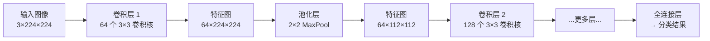

# CNN 卷积神经网络

## 概念说明

**CNN**（Convolutional Neural Network，卷积神经网络）是专门处理网格状数据（如图像）的深度学习架构。它通过卷积层自动提取局部特征，通过池化层降低空间维度，最终通过全连接层输出分类结果。

### 为什么需要 CNN？

普通 MLP 处理图像的问题：
- 一张 224×224 的 RGB 图像有 150,528 个像素，全连接层参数量爆炸
- MLP 无法利用图像的空间结构（相邻像素的关联性）
- MLP 对平移不具有不变性（同一物体在不同位置会被当作不同输入）

CNN 的解决方案：
- **局部连接**：卷积核只关注局部区域，大幅减少参数
- **权重共享**：同一个卷积核在整张图像上滑动，参数复用
- **平移不变性**：无论物体在图像哪个位置，都能被同一个卷积核检测到

## 核心原理

### 1. 卷积层（Convolution）



卷积操作的关键参数：

| 参数 | 说明 | 常用值 |
|------|------|--------|
| kernel_size | 卷积核大小 | 3×3（最常用）、5×5、1×1 |
| stride | 步长 | 1（默认）、2（降采样） |
| padding | 填充 | 1（保持尺寸不变，配合 3×3 卷积核） |
| out_channels | 输出通道数（卷积核数量） | 64、128、256、512 |

```python
import torch.nn as nn

# 卷积层：3 通道输入 → 64 通道输出，3×3 卷积核
conv = nn.Conv2d(in_channels=3, out_channels=64, kernel_size=3, padding=1)
# 输入 (batch, 3, 224, 224) → 输出 (batch, 64, 224, 224)
```

### 2. 池化层（Pooling）

池化层降低特征图的空间维度，减少计算量，增加感受野：

- **MaxPool**：取区域内最大值（最常用）
- **AvgPool**：取区域内平均值
- **AdaptiveAvgPool**：输出固定大小（不管输入多大）

```python
pool = nn.MaxPool2d(kernel_size=2, stride=2)
# 输入 (batch, 64, 224, 224) → 输出 (batch, 64, 112, 112)
```

### 3. 经典架构演进

| 架构 | 年份 | 层数 | 核心创新 | Top-5 错误率 |
|------|:----:|:----:|----------|:------------:|
| **LeNet-5** | 1998 | 5 | 卷积 + 池化的基本结构 | — |
| **AlexNet** | 2012 | 8 | ReLU、Dropout、GPU 训练 | 16.4% |
| **VGG** | 2014 | 16/19 | 统一 3×3 卷积核 | 7.3% |
| **ResNet** | 2015 | 50/101/152 | **残差连接（Skip Connection）** | 3.6% |

### 4. ResNet 残差连接

ResNet 的核心创新——残差连接（Skip Connection）解决了深层网络的梯度消失问题：

```python
class ResidualBlock(nn.Module):
    def __init__(self, channels):
        super().__init__()
        self.conv1 = nn.Conv2d(channels, channels, 3, padding=1)
        self.bn1 = nn.BatchNorm2d(channels)
        self.conv2 = nn.Conv2d(channels, channels, 3, padding=1)
        self.bn2 = nn.BatchNorm2d(channels)

    def forward(self, x):
        residual = x                          # 保存输入
        out = nn.ReLU()(self.bn1(self.conv1(x)))
        out = self.bn2(self.conv2(out))
        out += residual                       # 残差连接：输出 = F(x) + x
        return nn.ReLU()(out)
```

残差连接的意义：
- 梯度可以直接通过 skip connection 传播，缓解梯度消失
- 网络可以学习"恒等映射"，更深的层至少不会比浅层差
- 使训练 100+ 层的网络成为可能

### 5. 图像分类原理

```
输入图像 → [卷积+ReLU+池化] × N → 全局平均池化 → 全连接层 → Softmax → 类别概率
```

低层特征（边缘、纹理）→ 中层特征（形状、部件）→ 高层特征（物体、场景）

## 代码示例

> 💻 完整可运行代码：[code-examples/01-ml-basics/deep_learning/02_cnn_mnist.py](https://github.com/skyhe58/guide-ai/tree/main/code-examples/01-ml-basics/deep_learning/02_cnn_mnist.py)
> 🐍 Python 版本：3.11+
> 📦 依赖：torch>=2.1, torchvision>=0.16

```python
import torch.nn as nn

class SimpleCNN(nn.Module):
    def __init__(self, num_classes=10):
        super().__init__()
        self.features = nn.Sequential(
            nn.Conv2d(1, 32, 3, padding=1), nn.ReLU(), nn.MaxPool2d(2),
            nn.Conv2d(32, 64, 3, padding=1), nn.ReLU(), nn.MaxPool2d(2),
        )
        self.classifier = nn.Sequential(
            nn.Flatten(),
            nn.Linear(64 * 7 * 7, 128), nn.ReLU(), nn.Dropout(0.5),
            nn.Linear(128, num_classes),
        )

    def forward(self, x):
        return self.classifier(self.features(x))
```

## 实战要点

**模型选择：**
- 快速原型：用预训练 ResNet（`torchvision.models.resnet18(pretrained=True)`）
- 迁移学习：冻结卷积层，只训练最后的全连接层
- 小数据集：数据增强（翻转、旋转、裁剪）+ 预训练模型

**常见陷阱：**
- 输入图像需要归一化（ImageNet 均值/标准差）
- 注意 `(batch, channels, height, width)` 的维度顺序（PyTorch 是 NCHW）
- BatchNorm 在训练和推理时行为不同（`model.train()` vs `model.eval()`）

## 常见面试题

### Q1: CNN 中卷积层的作用是什么？为什么用 3×3 卷积核？

**难度**：⭐⭐ | **频率**：🔥🔥🔥

**标准答案**：卷积层通过卷积核在输入上滑动，提取局部特征（边缘、纹理、形状）。3×3 是最常用的卷积核大小（VGG 论证），因为：(1) 两个 3×3 卷积的感受野等于一个 5×5，但参数更少（18 vs 25）；(2) 更多层 = 更多非线性 = 更强的表达能力；(3) 计算效率高。

**追问**：1×1 卷积的作用？（通道数变换、跨通道信息融合、降维）

### Q2: ResNet 的残差连接为什么有效？

**难度**：⭐⭐⭐ | **频率**：🔥🔥🔥

**标准答案**：残差连接让网络学习 F(x) = H(x) - x（残差），而非直接学习 H(x)。优势：(1) 梯度可以通过 skip connection 直接传播，缓解梯度消失；(2) 如果某层不需要变换，网络可以学习 F(x)=0（恒等映射），不会因为层数增加而退化；(3) 使训练 152 层甚至 1000+ 层的网络成为可能。

**追问**：ResNet 和 DenseNet 的区别？（ResNet 是加法，DenseNet 是拼接）

## 推荐工具

> 📌 以下工具可帮助你更高效地学习和实践本知识点，详见 [模块 7：AI 使用与实践](/7-ai-tools/)

| 工具 | 用途 | 详情 |
|------|------|------|
| Perplexity | 搜索 CNN 架构演进和经典论文 | [AI 搜索](/7-ai-tools/7.1-efficiency/ai-search) |
| Cursor | 辅助编写 PyTorch CNN 模型代码 | [AI 编程辅助](/7-ai-tools/7.1-efficiency/ai-coding) |

## 参考资料

- [CS231n — Convolutional Neural Networks](https://cs231n.github.io/convolutional-networks/)
- [ResNet 论文](https://arxiv.org/abs/1512.03385)
- [PyTorch — torchvision.models](https://pytorch.org/vision/stable/models.html)
- [3Blue1Brown — CNN 可视化](https://www.youtube.com/watch?v=KuXjwB4LzSA)
