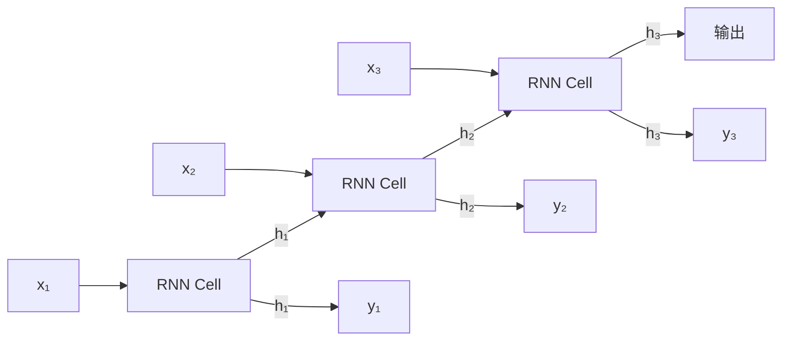

# RNN/LSTM/GRU

## 概念说明

**RNN**（Recurrent Neural Network，循环神经网络）是处理序列数据的经典架构。它通过隐藏状态（hidden state）在时间步之间传递信息，使模型能"记住"之前的输入。

**LSTM**（Long Short-Term Memory）和 **GRU**（Gated Recurrent Unit）是 RNN 的改进版本，通过门控机制解决了原始 RNN 的梯度消失问题。

### 历史地位

RNN/LSTM 曾是 NLP 的主流架构（2013-2017），但已被 Transformer 取代。了解 RNN 的价值在于：
- 理解序列建模的基本思想
- 理解 Transformer 为什么取代了 RNN
- 部分场景仍在使用（时序预测、小模型嵌入式部署）

## 核心原理

### 1. RNN 基本结构



每个时间步的计算：
```
h_t = tanh(W_hh @ h_{t-1} + W_xh @ x_t + b)
y_t = W_hy @ h_t
```

RNN 的问题：**梯度消失**。长序列中，早期时间步的梯度经过多次连乘后趋近于 0，模型无法学习长距离依赖。

### 2. LSTM — 门控机制

LSTM 通过三个"门"控制信息的流动：

| 门 | 作用 | 公式 |
|------|------|------|
| **遗忘门**（Forget Gate） | 决定丢弃哪些旧信息 | f = σ(W_f · [h_{t-1}, x_t]) |
| **输入门**（Input Gate） | 决定存储哪些新信息 | i = σ(W_i · [h_{t-1}, x_t]) |
| **输出门**（Output Gate） | 决定输出哪些信息 | o = σ(W_o · [h_{t-1}, x_t]) |

LSTM 的关键：**细胞状态**（Cell State）像一条传送带，信息可以几乎不变地流过整个序列，解决了梯度消失问题。

### 3. GRU — 简化版 LSTM

GRU 将 LSTM 的三个门简化为两个门（重置门 + 更新门），参数更少，训练更快，效果接近 LSTM。

### 4. RNN vs Transformer

| 维度 | RNN/LSTM | Transformer |
|------|----------|-------------|
| 并行性 | ❌ 必须串行处理 | ✅ 完全并行 |
| 长距离依赖 | 较弱（即使 LSTM） | ✅ 注意力直接连接任意位置 |
| 训练速度 | 慢（无法并行） | 快（GPU 并行） |
| 内存 | O(1) 隐藏状态 | O(n²) 注意力矩阵 |
| 当前地位 | 已被取代 | NLP/LLM 主流 |

> 💡 **结论**：Transformer 在几乎所有 NLP 任务上都优于 RNN/LSTM，这就是为什么现代 LLM 全部基于 Transformer。

## 代码示例

> 💻 完整可运行代码：[code-examples/01-ml-basics/deep_learning/03_rnn_lstm.py](https://github.com/your-repo/tree/main/code-examples/01-ml-basics/deep_learning/03_rnn_lstm.py)
> 🐍 Python 版本：3.11+
> 📦 依赖：torch>=2.1

```python
import torch.nn as nn

# PyTorch LSTM
lstm = nn.LSTM(input_size=128, hidden_size=256, num_layers=2, batch_first=True)
# 输入 (batch, seq_len, 128) → 输出 (batch, seq_len, 256)

# GRU（更轻量）
gru = nn.GRU(input_size=128, hidden_size=256, num_layers=2, batch_first=True)
```

## 实战要点

- RNN/LSTM 已不是 NLP 首选，但理解其原理有助于理解 Transformer 的优势
- 时序预测（股价、传感器数据）中 LSTM 仍有使用
- 如果面试问到 RNN，重点说清楚"为什么被 Transformer 取代"

## 常见面试题

### Q1: LSTM 如何解决 RNN 的梯度消失问题？

**难度**：⭐⭐⭐ | **频率**：🔥🔥

**标准答案**：LSTM 引入细胞状态（Cell State）和三个门控机制。细胞状态像传送带，信息可以几乎不变地流过整个序列。遗忘门控制丢弃旧信息，输入门控制添加新信息，输出门控制输出。关键是细胞状态的梯度路径是加法（而非乘法），梯度不会随时间步衰减。

**追问**：GRU 和 LSTM 的区别？（GRU 两个门、无细胞状态、参数更少、效果接近）

### Q2: Transformer 为什么取代了 RNN？

**难度**：⭐⭐⭐ | **频率**：🔥🔥🔥

**标准答案**：三个核心原因：(1) **并行性**：RNN 必须串行处理序列，Transformer 的自注意力可以完全并行，训练速度快数倍；(2) **长距离依赖**：RNN 的信息需要逐步传递，距离越远衰减越严重；Transformer 的注意力可以直接连接任意两个位置；(3) **可扩展性**：Transformer 更容易扩展到大模型（Scaling Laws），RNN 的串行特性限制了规模。

**追问**：RNN 还有什么场景在用？（流式处理、嵌入式设备、极长序列的内存受限场景）

## 推荐工具

> 📌 以下工具可帮助你更高效地学习和实践本知识点，详见 [模块 7：AI 使用与实践](/7-ai-tools/)

| 工具 | 用途 | 详情 |
|------|------|------|
| Perplexity | 搜索 RNN/LSTM 原理和 Transformer 对比 | [AI 搜索](/7-ai-tools/7.1-efficiency/ai-search) |
| Cursor | 辅助编写 PyTorch RNN/LSTM 代码 | [AI 编程辅助](/7-ai-tools/7.1-efficiency/ai-coding) |

## 参考资料

- [Understanding LSTM Networks — colah's blog](https://colah.github.io/posts/2015-08-Understanding-LSTMs/)
- [PyTorch — nn.LSTM 文档](https://pytorch.org/docs/stable/generated/torch.nn.LSTM.html)
- [The Unreasonable Effectiveness of RNNs — Karpathy](https://karpathy.github.io/2015/05/21/rnn-effectiveness/)
