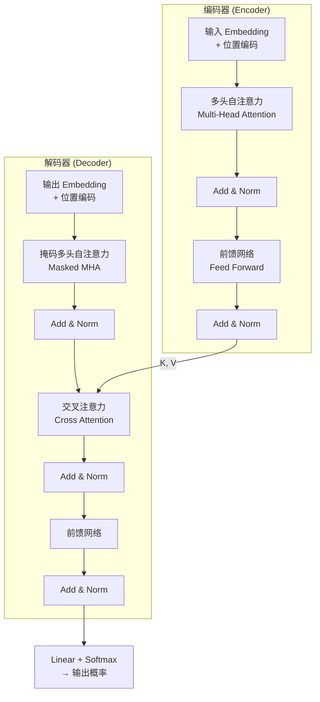

# Transformer 架构

## 概念说明

**Transformer** 是 2017 年 Google 在论文《Attention Is All You Need》中提出的架构，完全基于注意力机制，抛弃了 RNN 的循环结构。它是现代所有大语言模型（GPT、Claude、LLaMA、Qwen）的基础。

### 为什么 Transformer 如此重要？

- **GPT 系列**：Decoder-Only Transformer
- **BERT**：Encoder-Only Transformer
- **T5**：Encoder-Decoder Transformer
- 理解 Transformer = 理解现代 AI 的基石

## 核心原理

### 1. 整体架构



核心组件：
- **自注意力**（Self-Attention）：计算序列中每个位置与其他所有位置的关联
- **多头注意力**（Multi-Head）：多组注意力并行，捕捉不同类型的关联
- **位置编码**（Positional Encoding）：注入位置信息（注意力本身不感知顺序）
- **残差连接 + LayerNorm**：稳定训练，缓解梯度消失
- **前馈网络**（FFN）：两层线性变换 + 激活函数，增加非线性

### 2. 自注意力机制（Self-Attention）

自注意力的核心：对于序列中的每个 Token，计算它与所有其他 Token 的关联度。

```
Attention(Q, K, V) = softmax(Q @ K^T / √d_k) @ V
```

| 矩阵 | 含义 | 类比 |
|------|------|------|
| **Q**（Query） | "我在找什么" | 搜索查询 |
| **K**（Key） | "我有什么" | 文档标题 |
| **V**（Value） | "我的内容" | 文档内容 |

计算步骤：
1. 输入 X 分别乘以 W_Q、W_K、W_V 得到 Q、K、V
2. Q @ K^T 计算注意力分数（每对 Token 的关联度）
3. 除以 √d_k 缩放（防止点积过大导致 Softmax 梯度消失）
4. Softmax 归一化为概率分布
5. 乘以 V 得到加权输出

### 3. 多头注意力（Multi-Head Attention）

将 Q、K、V 分成多个"头"，每个头独立计算注意力，最后拼接：

```python
# 伪代码
heads = []
for i in range(num_heads):
    Q_i = X @ W_Q_i  # 每个头有独立的投影矩阵
    K_i = X @ W_K_i
    V_i = X @ W_V_i
    head_i = attention(Q_i, K_i, V_i)
    heads.append(head_i)

output = concat(heads) @ W_O  # 拼接后再投影
```

多头的意义：不同的头可以关注不同类型的关系（语法、语义、位置等）。

### 4. 位置编码（Positional Encoding）

注意力机制是置换不变的（不感知顺序），需要额外注入位置信息：

```python
# 正弦位置编码（原始 Transformer）
PE(pos, 2i)   = sin(pos / 10000^(2i/d_model))
PE(pos, 2i+1) = cos(pos / 10000^(2i/d_model))
```

现代 LLM 使用的位置编码：
- **RoPE**（旋转位置编码）：LLaMA、Qwen 使用
- **ALiBi**：通过注意力偏置注入位置信息

### 5. Transformer 为何取代 RNN

| 维度 | RNN | Transformer |
|------|-----|-------------|
| 并行性 | ❌ 串行 | ✅ 完全并行 |
| 长距离依赖 | 信息逐步传递，衰减 | 注意力直接连接任意位置 |
| 训练速度 | 慢 | 快（GPU 并行） |
| 可扩展性 | 难以扩展 | Scaling Laws，越大越强 |

## 代码示例

> 💻 完整可运行代码：[code-examples/01-ml-basics/deep_learning/04_transformer_basics.py](https://github.com/your-repo/tree/main/code-examples/01-ml-basics/deep_learning/04_transformer_basics.py)
> 🐍 Python 版本：3.11+
> 📦 依赖：torch>=2.1

```python
import torch
import torch.nn as nn
import math

def scaled_dot_product_attention(Q, K, V, mask=None):
    """缩放点积注意力。"""
    d_k = Q.size(-1)
    scores = Q @ K.transpose(-2, -1) / math.sqrt(d_k)
    if mask is not None:
        scores = scores.masked_fill(mask == 0, float('-inf'))
    weights = torch.softmax(scores, dim=-1)
    return weights @ V, weights
```

## 实战要点

**理解优先级：**
1. 自注意力的 Q/K/V 计算流程（面试必考）
2. 多头注意力的作用
3. 位置编码的必要性
4. 残差连接 + LayerNorm 的作用

**不需要深入的：**
- 正弦位置编码的具体公式（了解即可，现代 LLM 用 RoPE）
- Encoder-Decoder 交叉注意力（GPT 系列不用 Encoder）

## 常见面试题

### Q1: 请解释 Transformer 的自注意力机制

**难度**：⭐⭐⭐ | **频率**：🔥🔥🔥

**标准答案**：自注意力通过 Q、K、V 三个矩阵计算序列中每个位置与其他所有位置的关联度。Q（查询）和 K（键）的点积得到注意力分数，除以 √d_k 缩放后经 Softmax 归一化为权重，再与 V（值）加权求和得到输出。多头注意力将 Q/K/V 分成多个头并行计算，捕捉不同类型的关联。

**追问**：
- 为什么要除以 √d_k？（防止点积过大导致 Softmax 梯度消失）
- KV Cache 是什么？（推理时缓存已计算的 K/V，避免重复计算）

### Q2: Transformer 的位置编码为什么必要？

**难度**：⭐⭐⭐ | **频率**：🔥🔥🔥

**标准答案**：自注意力是置换不变的——打乱输入顺序，输出不变。但语言是有序的（"猫吃鱼"和"鱼吃猫"含义不同），所以需要位置编码注入位置信息。原始 Transformer 用正弦函数，现代 LLM 用 RoPE（旋转位置编码），它将位置信息编码为旋转角度，支持外推到更长序列。

**追问**：RoPE 和 ALiBi 的区别？（RoPE 修改 Q/K，ALiBi 修改注意力分数）

### Q3: LayerNorm 和 BatchNorm 的区别？

**难度**：⭐⭐ | **频率**：🔥🔥

**标准答案**：BatchNorm 在 batch 维度归一化（同一特征跨样本），依赖 batch 大小，推理时需要维护运行均值。LayerNorm 在特征维度归一化（同一样本跨特征），不依赖 batch 大小。Transformer 用 LayerNorm 因为：(1) 序列长度可变，BatchNorm 不适用；(2) 不依赖 batch 大小，推理更简单。

**追问**：Pre-Norm 和 Post-Norm 的区别？（Pre-Norm 训练更稳定，现代 LLM 多用 Pre-Norm）

## 推荐工具

> 📌 以下工具可帮助你更高效地学习和实践本知识点，详见 [模块 7：AI 使用与实践](/7-ai-tools/)

| 工具 | 用途 | 详情 |
|------|------|------|
| Perplexity | 搜索 Transformer 论文解读和架构图解 | [AI 搜索](/7-ai-tools/7.1-efficiency/ai-search) |
| Cursor | 辅助编写 Transformer 实现代码 | [AI 编程辅助](/7-ai-tools/7.1-efficiency/ai-coding) |

## 参考资料

- [Attention Is All You Need（原始论文）](https://arxiv.org/abs/1706.03762)
- [The Illustrated Transformer — Jay Alammar](https://jalammar.github.io/illustrated-transformer/)
- [Harvard NLP — The Annotated Transformer](https://nlp.seas.harvard.edu/annotated-transformer/)
- [3Blue1Brown — Attention 可视化](https://www.youtube.com/watch?v=eMlx5fFNoYc)
- [Lilian Weng — Attention 综述](https://lilianweng.github.io/posts/2018-06-24-attention/)
