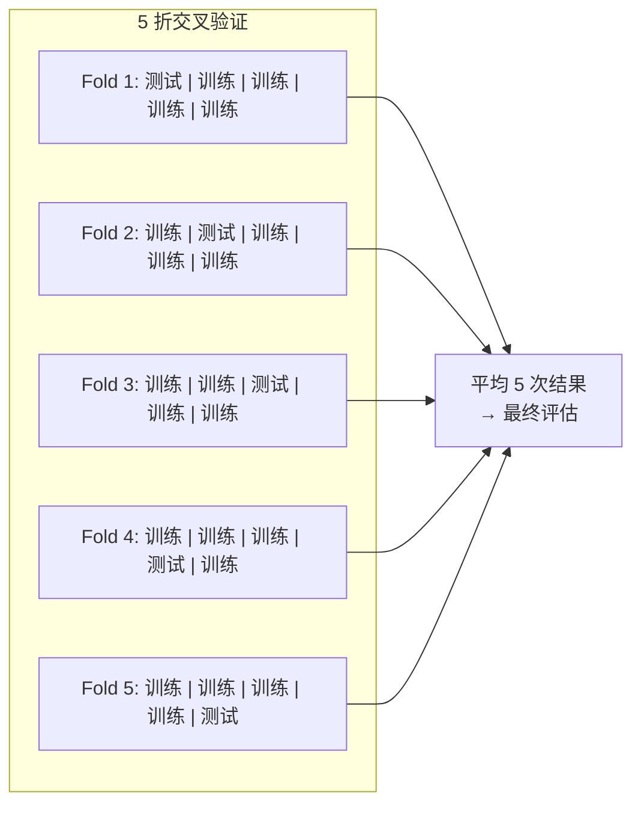

# 评估与调优

## 概念说明

模型训练完成后，需要客观评估其性能并通过调优提升效果。评估回答"模型好不好"，调优回答"怎么让模型更好"。

## 核心原理

### 1. 过拟合与欠拟合

| 问题 | 表现 | 原因 | 解决方案 |
|------|------|------|----------|
| **欠拟合** | 训练集和测试集都差 | 模型太简单 | 增加模型复杂度、增加特征 |
| **过拟合** | 训练集好但测试集差 | 模型太复杂/数据太少 | 正则化、Dropout、数据增强、早停 |

正则化方法：
- **L1 正则化**（Lasso）：权重绝对值之和，产生稀疏权重（特征选择）
- **L2 正则化**（Ridge）：权重平方和，限制权重大小（防过拟合）
- **Dropout**：训练时随机丢弃神经元，推理时关闭
- **数据增强**：对训练数据做变换（翻转、旋转、裁剪）增加多样性

### 2. 交叉验证



| 方法 | 说明 | 适用场景 |
|------|------|----------|
| K-Fold | 数据分 K 份，轮流做测试集 | 通用（K=5 或 10） |
| 分层 K-Fold | 保持每折的类别比例 | 类别不平衡 |
| 留一法 | K=样本数，每次留一个做测试 | 数据极少 |

### 3. 超参调优

| 方法 | 原理 | 效率 | 适用场景 |
|------|------|:----:|----------|
| Grid Search | 穷举所有组合 | 低 | 参数少（2-3 个） |
| Random Search | 随机采样组合 | 中 | 参数多，比 Grid 更高效 |
| **Optuna** | 贝叶斯优化 | 高 | **推荐**，智能搜索 |
| 学习曲线 | 画训练/验证曲线 | — | 诊断过拟合/欠拟合 |

```python
import optuna

def objective(trial):
    lr = trial.suggest_float("lr", 1e-5, 1e-2, log=True)
    n_layers = trial.suggest_int("n_layers", 1, 5)
    dropout = trial.suggest_float("dropout", 0.1, 0.5)
    # 训练模型并返回验证集指标
    return val_accuracy

study = optuna.create_study(direction="maximize")
study.optimize(objective, n_trials=100)
print(f"最佳参数: {study.best_params}")
```

### 4. 评估指标

**分类指标：**

| 指标 | 公式 | 含义 | 适用场景 |
|------|------|------|----------|
| 准确率 | (TP+TN)/(TP+TN+FP+FN) | 预测正确的比例 | 类别平衡 |
| 精确率 | TP/(TP+FP) | 预测为正的中有多少真正 | 关注误报（垃圾邮件） |
| 召回率 | TP/(TP+FN) | 真正为正的中有多少被找到 | 关注漏报（疾病检测） |
| F1 | 2×P×R/(P+R) | 精确率和召回率的调和均值 | 类别不平衡 |
| AUC-ROC | ROC 曲线下面积 | 模型区分正负样本的能力 | 二分类综合评估 |

**混淆矩阵：**
```
              预测正    预测负
实际正    TP (真正例)  FN (假负例)
实际负    FP (假正例)  TN (真负例)
```

**回归指标：**
- MSE：均方误差，对大误差敏感
- MAE：平均绝对误差，对异常值鲁棒
- R²：决定系数，1 表示完美拟合

## 代码示例

> 💻 完整可运行代码：[code-examples/01-ml-basics/evaluation/](https://github.com/your-repo/tree/main/code-examples/01-ml-basics/evaluation/)
> 🐍 Python 版本：3.11+
> 📦 依赖：scikit-learn、optuna

## 实战要点

**指标选择：**
- 类别平衡 → 准确率
- 类别不平衡 → F1 或 AUC-ROC
- 关注误报 → 精确率（如垃圾邮件过滤）
- 关注漏报 → 召回率（如疾病检测）

**调优优先级：**
1. 先确保数据质量（比调参重要 10 倍）
2. 选对模型架构
3. 学习率（最重要的超参数）
4. 其他超参数（batch size、正则化等）

## 常见面试题

### Q1: 精确率和召回率的区别？什么时候用哪个？

**难度**：⭐⭐ | **频率**：🔥🔥🔥

**标准答案**：精确率关注"预测为正的有多少是对的"（减少误报），召回率关注"真正为正的有多少被找到"（减少漏报）。垃圾邮件过滤重精确率（不能误杀正常邮件），疾病检测重召回率（不能漏诊）。两者通常此消彼长，F1 是两者的调和均值。

**追问**：如何调整精确率和召回率的平衡？（调整分类阈值）

### Q2: 交叉验证的作用？为什么不直接用训练集/测试集划分？

**难度**：⭐⭐ | **频率**：🔥🔥

**标准答案**：单次划分的评估结果受划分方式影响大（运气成分）。交叉验证通过多次划分取平均，得到更稳定可靠的评估。K-Fold 让每个样本都做过一次测试集，充分利用数据。数据量小时尤其重要。

**追问**：时序数据能用 K-Fold 吗？（不能，必须按时间顺序划分）

## 推荐工具

> 📌 以下工具可帮助你更高效地学习和实践本知识点，详见 [模块 7：AI 使用与实践](/7-ai-tools/)

| 工具 | 用途 | 详情 |
|------|------|------|
| Perplexity | 搜索评估指标选择和调优策略 | [AI 搜索](/7-ai-tools/7.1-efficiency/ai-search) |
| Cursor | 辅助编写评估和调优代码 | [AI 编程辅助](/7-ai-tools/7.1-efficiency/ai-coding) |

## 参考资料

- [scikit-learn — 模型评估](https://scikit-learn.org/stable/modules/model_evaluation.html)
- [Optuna 官方文档](https://optuna.readthedocs.io/)
- [Google ML Crash Course — 评估](https://developers.google.com/machine-learning/crash-course/classification)
