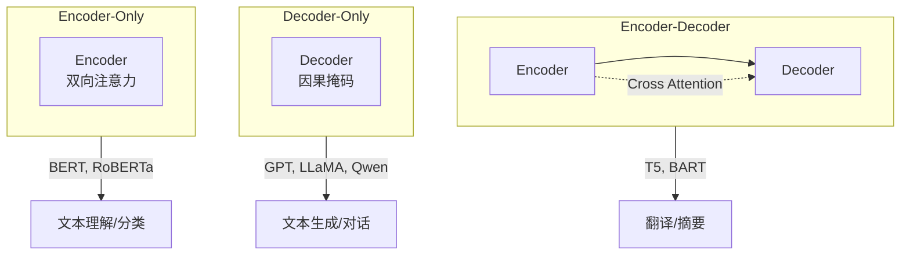

# Transformer 架构详解

## 概念说明

模块 1 介绍了 Transformer 的基本原理，本节深入分析三种 Transformer 变体架构，这是理解现代 LLM 的关键。

## 核心原理

### 三种 Transformer 变体



| 架构 | 注意力方向 | 代表模型 | 适用任务 |
|------|-----------|----------|----------|
| **Encoder-Decoder** | 编码器双向 + 解码器因果 | T5、BART、mT5 | 翻译、摘要、seq2seq |
| **Decoder-Only** | 因果注意力（只看左边） | **GPT-4、Claude、LLaMA、Qwen** | 文本生成、对话、推理 |
| **Encoder-Only** | 双向注意力 | BERT、RoBERTa | 文本分类、NER、问答 |

### 为什么 Decoder-Only 成为主流？

现代 LLM（GPT-4、Claude、LLaMA、Qwen、DeepSeek）全部采用 Decoder-Only 架构：

1. **统一范式**：所有任务都可以转化为"给定前文，预测下一个 Token"
2. **Scaling Laws**：Decoder-Only 在大规模训练中表现最好
3. **简单高效**：只有一个模块，训练和推理都更简单
4. **涌现能力**：规模足够大时，Decoder-Only 模型展现出 few-shot、推理等涌现能力

### Decoder-Only 架构详解

```
输入 Token IDs → Embedding + 位置编码 → [Decoder Block × N] → LM Head → 下一个 Token 概率

Decoder Block:
  → Masked Multi-Head Attention（因果掩码，只看左边）
  → Add & LayerNorm
  → FFN（SwiGLU 激活，现代 LLM 标配）
  → Add & LayerNorm
```

现代 LLM 的关键改进（相比原始 Transformer）：
- **Pre-Norm**（LayerNorm 在注意力之前）替代 Post-Norm
- **RoPE** 替代正弦位置编码
- **SwiGLU/GeGLU** 替代 ReLU/GELU
- **GQA**（Grouped Query Attention）替代标准 MHA，减少 KV Cache
- **RMSNorm** 替代 LayerNorm（更快）

## 常见面试题

### Q1: Encoder-Only、Decoder-Only、Encoder-Decoder 的区别？

**难度**：⭐⭐⭐ | **频率**：🔥🔥🔥

**标准答案**：Encoder-Only（BERT）使用双向注意力，适合理解任务（分类、NER）。Decoder-Only（GPT/LLaMA）使用因果注意力（只看左边），适合生成任务。Encoder-Decoder（T5）编码器双向理解输入，解码器因果生成输出，适合 seq2seq 任务。现代 LLM 全部采用 Decoder-Only，因为统一范式 + Scaling Laws 表现最好。

**追问**：为什么 BERT 不适合做文本生成？（双向注意力在生成时会"偷看"未来 Token）

## 推荐工具

> 📌 以下工具可帮助你更高效地学习和实践本知识点，详见 [模块 7：AI 使用与实践](/7-ai-tools/)

| 工具 | 用途 | 详情 |
|------|------|------|
| Perplexity | 搜索 Transformer 变体对比 | [AI 搜索](/7-ai-tools/7.1-efficiency/ai-search) |
| Cursor | 辅助编写模型代码 | [AI 编程辅助](/7-ai-tools/7.1-efficiency/ai-coding) |

## 参考资料

- [Attention Is All You Need](https://arxiv.org/abs/1706.03762)
- [LLaMA 论文](https://arxiv.org/abs/2302.13971)
- [The Illustrated GPT-2 — Jay Alammar](https://jalammar.github.io/illustrated-gpt2/)
