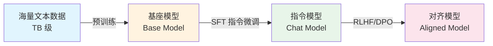
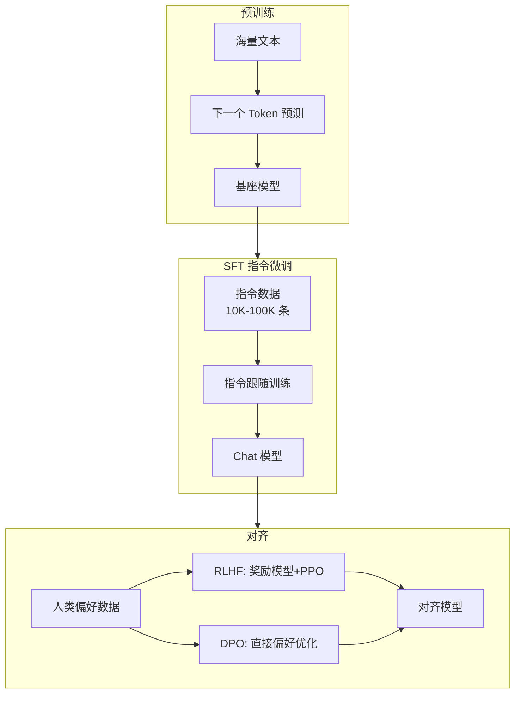

# 训练流程

## 概念说明

现代 LLM 的训练分为多个阶段：预训练 → SFT 指令微调 → 对齐（RLHF/DPO）。理解这个流程是掌握 LLM 技术栈的关键。

## 核心原理

### 训练流程全景图

### 1. 预训练（Pre-training）

**目标**：学习语言的通用知识（语法、事实、推理能力）

- **数据**：互联网文本、书籍、代码（TB 级）
- **任务**：下一个 Token 预测（Causal LM）
- **规模**：数千 GPU，训练数周到数月
- **成本**：GPT-4 预训练估计 $100M+

### 2. SFT 指令微调（Supervised Fine-Tuning）

**目标**：让模型学会遵循指令、进行对话

- **数据**：高质量指令-回答对（10K-100K 条）
- **格式**：Alpaca 格式或 ShareGPT 格式
- **方法**：全参数微调或 LoRA/QLoRA
- **效果**：基座模型 → 能对话的 Chat 模型

### 3. RLHF（Reinforcement Learning from Human Feedback）

**目标**：让模型输出符合人类偏好（有用、无害、诚实）

流程：
1. **收集偏好数据**：人类对模型回复排序
2. **训练奖励模型**（Reward Model）：学习人类偏好
3. **PPO 优化**：用奖励模型指导策略优化

缺点：流程复杂，训练不稳定，需要 4 个模型同时在显存中。

### 4. DPO（Direct Preference Optimization）

**目标**：简化 RLHF，直接从偏好数据优化

- **核心思想**：将奖励模型隐式包含在策略优化中
- **优势**：不需要单独的奖励模型，训练更稳定
- **效果**：与 RLHF 效果相当，实现更简单
- **趋势**：越来越多模型使用 DPO 替代 RLHF

### 5. 阶段对比

| 阶段 | 数据量 | 计算成本 | 目标 |
|------|--------|----------|------|
| 预训练 | TB 级 | $100K-$100M | 通用知识 |
| SFT | 10K-100K 条 | $100-$10K | 指令跟随 |
| RLHF/DPO | 10K-100K 对 | $1K-$100K | 人类对齐 |

## 代码示例

> 💻 微调代码：[code-examples/02-llm/finetuning/](https://github.com/skyhe58/guide-ai/tree/main/code-examples/02-llm/finetuning/)

## 实战要点

1. **个人开发者只需关注 SFT**：预训练和 RLHF 需要大量资源
2. **LoRA/QLoRA 是 SFT 的最佳选择**：低成本、高效果
3. **DPO 正在替代 RLHF**：更简单、更稳定

## 常见面试题

### Q1: LLM 训练的三个阶段是什么？

**难度**：⭐⭐⭐ | **频率**：🔥🔥🔥

**标准答案**：(1) 预训练：在海量文本上学习语言知识，任务是下一个 Token 预测。(2) SFT 指令微调：在指令数据上训练，让模型学会遵循指令。(3) 对齐（RLHF/DPO）：用人类偏好数据优化，使输出有用、无害、诚实。

### Q2: DPO 和 RLHF 的区别？

**难度**：⭐⭐⭐ | **频率**：🔥🔥

**标准答案**：RLHF 需要先训练奖励模型，再用 PPO 优化策略，流程复杂且不稳定。DPO 将奖励模型隐式包含在损失函数中，直接从偏好数据优化，不需要单独的奖励模型，训练更简单稳定。效果相当，DPO 是趋势。

## 推荐工具

| 工具 | 用途 | 详情 |
|------|------|------|
| Perplexity | 搜索训练流程最新进展 | [AI 搜索](/7-ai-tools/7.1-efficiency/ai-search) |

## 参考资料

- [InstructGPT 论文（RLHF）](https://arxiv.org/abs/2203.02155)
- [DPO 论文](https://arxiv.org/abs/2305.18290)
- [Hugging Face TRL 库](https://github.com/huggingface/trl)
- [Chip Huyen — RLHF 详解](https://huyenchip.com/2023/05/02/rlhf.html)
