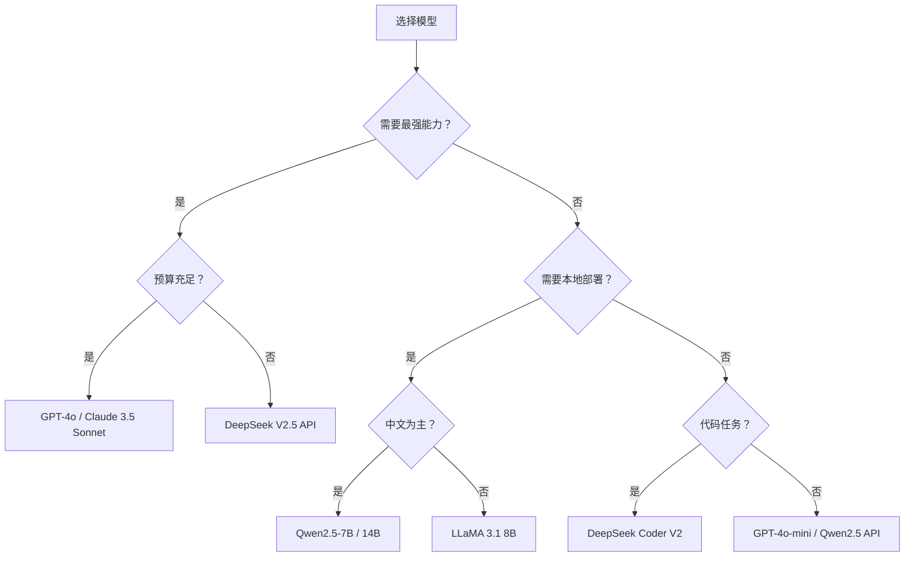

# 主流模型对比

## 概念说明

了解主流 LLM 的特点、能力和适用场景，是选择合适模型的基础。本节对比 GPT、Claude、LLaMA、Qwen、DeepSeek 等主流模型系列。

## 核心原理

### 模型能力对比（2024 年末）

| 模型 | 厂商 | 参数量 | 开源 | 中文 | 代码 | 推理 | API 价格 |
|------|------|--------|------|------|------|------|----------|
| GPT-4o | OpenAI | 未公开 | ❌ | ⭐⭐⭐ | ⭐⭐⭐⭐ | ⭐⭐⭐⭐ | $2.5-10/1M |
| Claude 3.5 Sonnet | Anthropic | 未公开 | ❌ | ⭐⭐⭐ | ⭐⭐⭐⭐⭐ | ⭐⭐⭐⭐ | $3-15/1M |
| LLaMA 3.1 | Meta | 8B/70B/405B | ✅ | ⭐⭐ | ⭐⭐⭐ | ⭐⭐⭐ | 免费 |
| Qwen2.5 | 阿里 | 0.5B-72B | ✅ | ⭐⭐⭐⭐⭐ | ⭐⭐⭐⭐ | ⭐⭐⭐⭐ | ¥0.3-12/1M |
| DeepSeek V2.5 | DeepSeek | 236B(MoE) | ✅ | ⭐⭐⭐⭐⭐ | ⭐⭐⭐⭐⭐ | ⭐⭐⭐⭐ | ¥1-2/1M |

### 部署难度对比

| 模型 | 本地部署 | 最低显存 | Ollama 支持 | vLLM 支持 |
|------|----------|----------|-------------|-----------|
| GPT-4o | ❌ 仅 API | — | ❌ | ❌ |
| Claude 3.5 | ❌ 仅 API | — | ❌ | ❌ |
| LLaMA 3.1 8B | ✅ | 6 GB | ✅ | ✅ |
| Qwen2.5 7B | ✅ | 5 GB | ✅ | ✅ |
| DeepSeek V2 Lite | ✅ | 8 GB | ✅ | ✅ |

### 模型选型指南

### 各系列详解

#### GPT 系列（OpenAI）
- **优势**：综合能力最强，生态最完善
- **劣势**：闭源，价格较高，数据隐私风险
- **推荐**：GPT-4o（复杂任务）、GPT-4o-mini（日常任务）

#### Claude 系列（Anthropic）
- **优势**：代码能力极强，长文本处理好（200K 上下文）
- **劣势**：闭源，中文能力略弱于 GPT-4o
- **推荐**：Claude 3.5 Sonnet（代码和长文本）

#### LLaMA 系列（Meta）
- **优势**：开源标杆，社区生态丰富
- **劣势**：中文能力一般，需要微调
- **推荐**：LLaMA 3.1 8B（英文场景本地部署）

#### Qwen 系列（阿里）
- **优势**：中文能力最强，开源，模型尺寸丰富
- **劣势**：英文能力略弱于 LLaMA 3.1
- **推荐**：Qwen2.5-7B（中文本地部署首选）

#### DeepSeek 系列
- **优势**：性价比极高，代码能力强，MoE 架构推理成本低
- **劣势**：社区生态不如 LLaMA
- **推荐**：DeepSeek V2.5 API（性价比之王）

## 代码示例

> 💻 多模型评测脚本：[code-examples/02-llm/milestone_projects/model_comparison/benchmark.py](https://github.com/your-repo/tree/main/code-examples/02-llm/milestone_projects/model_comparison/benchmark.py)

## 实战要点

1. **中文场景首选 Qwen2.5**：中文能力最强的开源模型
2. **性价比首选 DeepSeek API**：价格是 GPT-4o 的 1/10
3. **本地部署首选 7B-8B 模型**：消费级 GPU 可运行
4. **代码任务首选 Claude 3.5 Sonnet 或 DeepSeek Coder**

## 常见面试题

### Q1: 如何选择合适的 LLM？

**难度**：⭐⭐⭐ | **频率**：🔥🔥🔥

**标准答案**：根据任务需求、部署环境、成本预算选择。(1) 需要最强能力：GPT-4o/Claude 3.5。(2) 中文本地部署：Qwen2.5-7B。(3) 性价比 API：DeepSeek V2.5。(4) 代码生成：Claude 3.5 Sonnet。(5) 数据隐私要求：本地部署开源模型。

### Q2: 开源模型和闭源模型的优劣？

**难度**：⭐⭐ | **频率**：🔥🔥

**标准答案**：开源优势：可本地部署（数据隐私）、可微调定制、免费。闭源优势：能力更强（GPT-4o/Claude）、无需运维。趋势：开源模型快速追赶，7B 开源模型已接近 GPT-3.5 水平。

## 推荐工具

| 工具 | 用途 | 详情 |
|------|------|------|
| Perplexity | 搜索模型最新评测 | [AI 搜索](/7-ai-tools/7.1-efficiency/ai-search) |

## 参考资料

- [LMSYS Chatbot Arena](https://chat.lmsys.org/)
- [Open LLM Leaderboard](https://huggingface.co/spaces/open-llm-leaderboard/open_llm_leaderboard)
- [Qwen2.5 技术报告](https://qwenlm.github.io/blog/qwen2.5/)
- [DeepSeek V2 论文](https://arxiv.org/abs/2405.04434)
