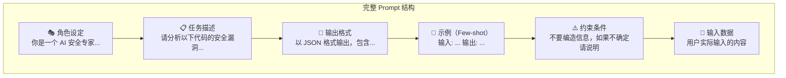
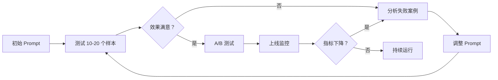

# Prompt Engineering 进阶

## 概念说明

**Prompt Engineering**（提示词工程）是设计和优化 LLM 输入提示词的技术，目标是让模型产出更准确、更结构化、更可控的输出。它是 AI 应用开发中投入产出比最高的技能——不需要训练模型，只需要调整输入就能显著提升效果。

### 为什么 Prompt Engineering 如此重要？

- **零成本优化**：不需要微调、不需要 GPU，只需要调整文本
- **效果显著**：好的 Prompt 和差的 Prompt 效果可能差 10 倍
- **快速迭代**：修改 Prompt 立即看到效果，比训练模型快 1000 倍
- **生产必备**：所有 LLM 应用（RAG、Agent、客服）都依赖 Prompt 设计

### Prompt 的组成要素



## 核心原理

### 1. 角色设定（Role Prompting）

给 LLM 设定一个专业角色，可以显著提升特定领域的输出质量：

```python
# ❌ 无角色设定
prompt = "解释什么是 RAG"

# ✅ 有角色设定
prompt = """你是一位有 5 年经验的 AI 架构师，擅长 RAG 系统设计。
请用通俗易懂的语言解释什么是 RAG，并给出一个实际应用场景。"""

# ✅ 更精确的角色设定
prompt = """你是一位面向后端开发者的 AI 技术讲师。
你的学生有 Java/Python 后端经验但没有 AI 背景。
请用后端开发者能理解的类比来解释 RAG 架构。
类比要求：用数据库查询 + API 调用的概念来解释。"""
```

角色设定的最佳实践：
- 明确专业领域和经验年限
- 指定目标受众（"面向后端开发者"）
- 设定沟通风格（"通俗易懂"、"技术深度"）
- 添加约束（"不要编造"、"不确定时说明"）

### 2. 输出格式控制

控制 LLM 输出结构化数据是生产环境的核心需求：

```python
# JSON 格式输出
prompt = """分析以下 LLM 模型，以 JSON 格式输出：
{
  "model_name": "模型名称",
  "strengths": ["优势1", "优势2"],
  "weaknesses": ["劣势1", "劣势2"],
  "best_use_case": "最佳使用场景",
  "cost_rating": "低/中/高"
}

模型：Qwen2-7B"""

# Markdown 表格输出
prompt = """对比以下向量数据库，以 Markdown 表格输出：
| 数据库 | 部署方式 | 性能 | 适用场景 | 成本 |
数据库列表：Chroma、Pinecone、FAISS、Milvus"""

# 分步骤输出
prompt = """请按以下步骤分析这段代码的性能问题：
步骤 1：识别性能瓶颈
步骤 2：分析根因
步骤 3：给出优化方案
步骤 4：预估优化效果

代码：{code}"""
```

### 3. 分隔符使用

分隔符帮助 LLM 区分指令和数据，防止 Prompt Injection：

```python
# 使用三重引号分隔用户输入
prompt = f"""请总结以下文档的核心观点：

\"\"\"
{user_document}
\"\"\"

要求：
1. 提取 3-5 个核心观点
2. 每个观点一句话概括
3. 按重要性排序"""

# 使用 XML 标签分隔（Claude 推荐）
prompt = f"""请分析以下代码：

<code>
{user_code}
</code>

<requirements>
1. 找出潜在的 bug
2. 给出修复建议
</requirements>"""
```

### 4. Few-shot 示例设计

通过提供输入-输出示例，让 LLM "学会"你期望的格式和风格：

```python
prompt = """你是一个 AI 知识库的标签生成器。根据文档内容生成标签。

示例 1：
文档：LoRA 通过低秩分解减少微调参数，只需训练 0.1% 的参数即可达到接近全参数微调的效果。
标签：["LoRA", "微调", "参数高效", "低秩分解"]

示例 2：
文档：RAG 系统先从知识库检索相关文档，再将检索结果作为上下文输入 LLM 生成回答。
标签：["RAG", "检索增强", "知识库", "LLM 应用"]

现在请为以下文档生成标签：
文档：{new_document}
标签："""
```

Few-shot 示例设计原则：
- 示例数量：2-5 个（太多浪费 Token，太少效果不好）
- 示例多样性：覆盖不同类型的输入
- 示例质量：示例本身必须是高质量的
- 格式一致：所有示例保持相同的输入输出格式

### 5. Prompt 迭代优化流程



## 代码示例

> 💻 完整可运行代码：[code-examples/03-ai-apps/prompt_engineering/01_advanced_prompts.py](https://github.com/your-repo/tree/main/code-examples/03-ai-apps/prompt_engineering/01_advanced_prompts.py)
> 🐍 Python 版本：3.11+
> 📦 依赖：ollama（可选，服务模式）

```python
# Prompt 模板管理（生产环境推荐）
from string import Template

ANALYSIS_PROMPT = Template("""你是一位 $role。

请分析以下内容：
\"\"\"
$content
\"\"\"

输出要求：
$format_instructions

约束：
- 基于给定内容分析，不要编造信息
- 如果信息不足，明确说明""")

# 使用
prompt = ANALYSIS_PROMPT.substitute(
    role="AI 安全专家",
    content=user_input,
    format_instructions="以 JSON 格式输出，包含 risk_level、issues、recommendations",
)
```

## 实战要点

**生产环境 Prompt 设计原则：**
- **明确 > 简洁**：宁可 Prompt 长一点，也要把要求说清楚
- **结构化输出**：生产环境必须要求 JSON/结构化输出，方便程序解析
- **防御性设计**：用分隔符隔离用户输入，防止 Prompt Injection
- **版本管理**：Prompt 和代码一样需要版本控制，记录每次修改和效果变化
- **温度控制**：需要确定性输出用 temperature=0，需要创意用 0.7-1.0

**常见陷阱：**
- 指令太模糊（"写得好一点"→ 应该具体说明"好"的标准）
- 没有提供输出格式示例（LLM 不知道你要什么格式）
- 一个 Prompt 塞太多任务（应该拆分成多步）
- 没有处理 LLM 拒绝回答的情况（需要 fallback 策略）

**Prompt 长度与成本：**
- GPT-4o：输入 $2.5/1M tokens，输出 $10/1M tokens
- 长 Prompt 意味着更高成本，需要在效果和成本间平衡
- 使用缓存（相同 Prompt 前缀可以复用 KV Cache）

## 常见面试题

### Q1: Prompt Engineering 有哪些核心技巧？

**难度**：⭐⭐ | **频率**：🔥🔥🔥

**答题思路**：按类别列举 → 每个技巧给例子 → 说明适用场景

**标准答案**：核心技巧包括：(1) 角色设定——给 LLM 设定专业角色提升领域输出质量；(2) 输出格式控制——要求 JSON/表格等结构化输出；(3) Few-shot 示例——提供 2-5 个输入输出示例让模型"学会"格式；(4) Chain-of-Thought——让模型分步推理提升复杂任务准确率；(5) 分隔符——隔离指令和数据防止注入；(6) 约束条件——明确告诉模型不要做什么。

**深入追问**：
- 如何评估 Prompt 的效果？（A/B 测试、人工评估、自动化指标）
- Prompt 版本管理怎么做？（Git 管理 + LangSmith 追踪）
- 如何防止 Prompt Injection？（分隔符、输入过滤、输出检测）

### Q2: Few-shot 和 Zero-shot 的区别？什么时候用哪个？

**难度**：⭐⭐ | **频率**：🔥🔥🔥

**答题思路**：定义区别 → 各自优劣 → 选择策略

**标准答案**：Zero-shot 不提供示例，直接给指令；Few-shot 提供 2-5 个示例。Zero-shot 适合简单任务（翻译、摘要）和大模型（GPT-4 级别）。Few-shot 适合需要特定格式/风格的任务、小模型、或模型不熟悉的领域。选择策略：先试 Zero-shot，效果不好再加 Few-shot 示例。

**深入追问**：
- 动态 Few-shot 是什么？（根据输入动态选择最相关的示例）
- Few-shot 示例的顺序会影响结果吗？（会，最后一个示例影响最大）

### Q3: 如何让 LLM 稳定输出 JSON 格式？

**难度**：⭐⭐⭐ | **频率**：🔥🔥🔥

**答题思路**：多种方法 → 各自优劣 → 生产环境推荐

**标准答案**：(1) Prompt 中明确要求 JSON 格式并给出 schema 示例；(2) 使用 OpenAI 的 `response_format={"type": "json_object"}`（强制 JSON）；(3) 使用 Pydantic + LangChain 的 `PydanticOutputParser` 自动生成格式指令和解析；(4) 后处理：用正则提取 JSON 块，try/except 解析，失败时重试。生产环境推荐方案 2+4 组合。

**深入追问**：
- 如果 LLM 输出的 JSON 格式不对怎么办？（重试 + 修复 + fallback）
- Function Calling 和 JSON 模式的区别？（Function Calling 更结构化，有参数 schema 验证）

## 推荐工具

> 📌 以下工具可帮助你更高效地学习和实践本知识点，详见 [模块 7：AI 使用与实践](/7-ai-tools/)

| 工具 | 用途 | 详情 |
|------|------|------|
| Cursor | 辅助编写和调试 Prompt，快速迭代 | [AI 编程辅助](/7-ai-tools/7.1-efficiency/ai-coding) |
| ChatGPT | 交互式测试不同 Prompt 策略 | [AI 对话助手](/7-ai-tools/7.1-efficiency/ai-chat) |
| Perplexity | 搜索 Prompt Engineering 最新技巧 | [AI 搜索](/7-ai-tools/7.1-efficiency/ai-search) |

## 参考资料

- [OpenAI — Prompt Engineering Guide](https://platform.openai.com/docs/guides/prompt-engineering)
- [Anthropic — Prompt Engineering](https://docs.anthropic.com/en/docs/build-with-claude/prompt-engineering)
- [DAIR.AI — Prompt Engineering Guide](https://www.promptingguide.ai/)
- [LangChain — Output Parsers](https://python.langchain.com/docs/modules/model_io/output_parsers/)
