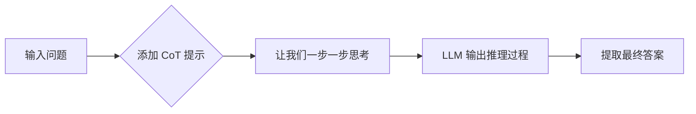
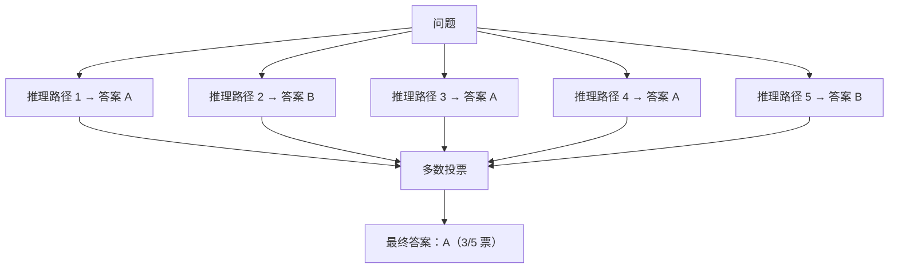
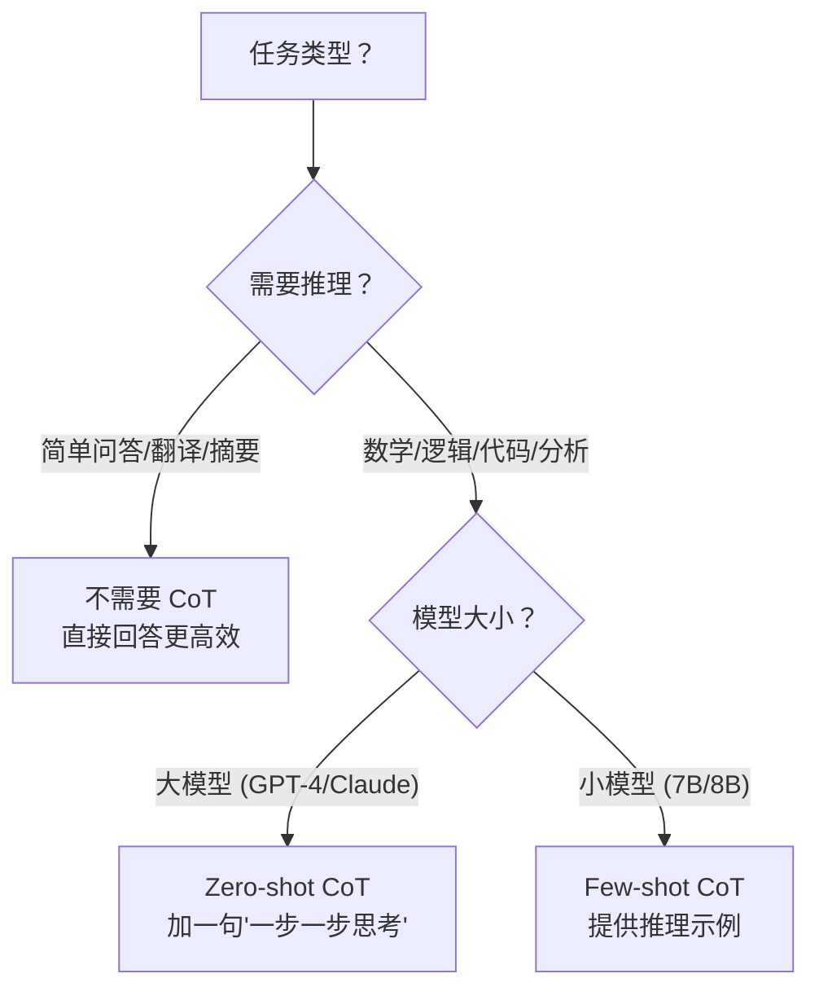

# Chain-of-Thought 思维链

## 概念说明

**Chain-of-Thought（CoT）** 是一种让 LLM "分步推理"的 Prompt 技巧。通过引导模型先输出推理过程再给出最终答案，可以显著提升复杂任务（数学、逻辑、代码）的准确率。

核心思想：**不要让模型直接给答案，让它先"想一想"。**

### CoT 的效果

| 任务类型 | 无 CoT 准确率 | 有 CoT 准确率 | 提升 |
|----------|:------------:|:------------:|:----:|
| 数学推理（GSM8K） | ~20% | ~60% | 3x |
| 逻辑推理 | ~40% | ~75% | 1.9x |
| 代码生成 | ~50% | ~70% | 1.4x |
| 简单问答 | ~90% | ~90% | 无提升 |

> 💡 CoT 对复杂推理任务效果显著，对简单任务几乎无提升（甚至可能降低效率）。

## 核心原理

### 1. Few-shot CoT

在示例中展示推理过程：

```python
prompt = """请解决以下数学问题。先展示推理过程，再给出最终答案。

问题：一个书店有 120 本书，卖出了 40%，又进货 30 本，现在有多少本？
推理过程：
1. 卖出的数量：120 × 40% = 48 本
2. 卖出后剩余：120 - 48 = 72 本
3. 进货后总数：72 + 30 = 102 本
最终答案：102 本

问题：{user_question}
推理过程："""
```

### 2. Zero-shot CoT

不需要示例，只需要一句魔法咒语：**"Let's think step by step"**（让我们一步一步思考）

```python
# ❌ 直接问
prompt = "一个水池有两个水管，A 管 3 小时注满，B 管 5 小时注满，同时开多久注满？"

# ✅ Zero-shot CoT
prompt = """一个水池有两个水管，A 管 3 小时注满，B 管 5 小时注满，同时开多久注满？

让我们一步一步思考："""
```



### 3. Self-Consistency（自一致性）

对同一个问题用 CoT 生成多个推理路径，取多数投票的答案：



实现方式：设置 `temperature=0.7`，多次调用取众数。

### 4. CoT 变体对比

| 变体 | 方法 | 优势 | 劣势 |
|------|------|------|------|
| Few-shot CoT | 示例中展示推理 | 效果最好 | 需要设计示例 |
| Zero-shot CoT | "一步一步思考" | 零成本 | 效果略差 |
| Self-Consistency | 多路径投票 | 更准确 | 成本高（多次调用） |
| Tree-of-Thought | 树状搜索推理 | 复杂推理最强 | 成本极高 |

### 5. 什么时候用 CoT？



## 代码示例

> 💻 完整可运行代码：[code-examples/03-ai-apps/prompt_engineering/02_chain_of_thought.py](https://github.com/your-repo/tree/main/code-examples/03-ai-apps/prompt_engineering/02_chain_of_thought.py)
> 🐍 Python 版本：3.11+
> 📦 依赖：ollama（可选，服务模式）

```python
# Zero-shot CoT — 只需加一句话
def zero_shot_cot(question: str) -> str:
    return f"{question}\n\n让我们一步一步思考："

# Self-Consistency — 多次调用取众数
def self_consistency(question: str, n_samples: int = 5) -> str:
    answers = []
    for _ in range(n_samples):
        response = llm.generate(zero_shot_cot(question), temperature=0.7)
        answer = extract_final_answer(response)
        answers.append(answer)
    return most_common(answers)
```

## 实战要点

**何时使用 CoT：**
- ✅ 数学计算、逻辑推理、代码调试、多步分析
- ❌ 简单问答、翻译、摘要、格式转换

**CoT 最佳实践：**
- 大模型（GPT-4/Claude）用 Zero-shot CoT 就够了
- 小模型（7B/8B）需要 Few-shot CoT 提供推理示例
- 关键任务用 Self-Consistency 提高准确率（成本 = N 倍）
- CoT 会增加输出 Token 数，注意成本控制

**常见陷阱：**
- 简单任务加 CoT 反而降低效率（多余的推理浪费 Token）
- CoT 不能解决模型知识缺失的问题（不知道的还是不知道）
- Self-Consistency 的 N 值通常 3-5 就够，太多成本不划算

## 常见面试题

### Q1: Chain-of-Thought 的原理和效果？

**难度**：⭐⭐ | **频率**：🔥🔥🔥

**答题思路**：定义 → 为什么有效 → 变体 → 适用场景

**标准答案**：CoT 通过引导 LLM 先输出推理过程再给出答案，将复杂问题分解为多个简单步骤。有效原因：(1) 分步推理降低了每一步的难度；(2) 中间步骤提供了"工作记忆"；(3) 推理过程可以被检查和纠错。主要变体：Zero-shot CoT（加"一步一步思考"）、Few-shot CoT（提供推理示例）、Self-Consistency（多路径投票）。适合数学、逻辑、代码等需要推理的任务，简单任务不需要。

**深入追问**：
- Zero-shot CoT 和 Few-shot CoT 什么时候用哪个？（大模型用 Zero-shot，小模型用 Few-shot）
- Self-Consistency 的成本如何控制？（N=3-5，只对关键任务使用）
- CoT 和 ReAct 的区别？（CoT 只推理，ReAct 推理+行动+观察）

### Q2: 如何提升 LLM 在数学推理任务上的表现？

**难度**：⭐⭐⭐ | **频率**：🔥🔥

**标准答案**：(1) Chain-of-Thought 分步推理；(2) Self-Consistency 多路径投票；(3) 使用擅长数学的模型（DeepSeek-R1、GPT-4）；(4) 提供计算工具（Function Calling 调用计算器）；(5) 验证步骤（让模型检查自己的计算过程）。

**深入追问**：
- Tree-of-Thought 是什么？（树状搜索多个推理分支，选最优路径）

## 推荐工具

> 📌 以下工具可帮助你更高效地学习和实践本知识点，详见 [模块 7：AI 使用与实践](/7-ai-tools/)

| 工具 | 用途 | 详情 |
|------|------|------|
| ChatGPT | 交互式测试 CoT 效果 | [AI 对话助手](/7-ai-tools/7.1-efficiency/ai-chat) |
| Perplexity | 搜索 CoT 最新变体 | [AI 搜索](/7-ai-tools/7.1-efficiency/ai-search) |

## 参考资料

- [Chain-of-Thought 论文（Google, 2022）](https://arxiv.org/abs/2201.11903)
- [Zero-shot CoT 论文](https://arxiv.org/abs/2205.11916)
- [Self-Consistency 论文](https://arxiv.org/abs/2203.11171)
- [Tree-of-Thought 论文](https://arxiv.org/abs/2305.10601)
