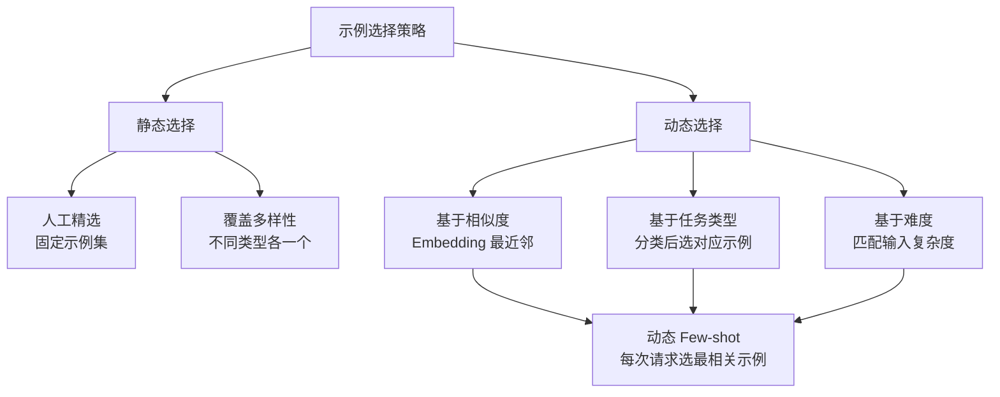
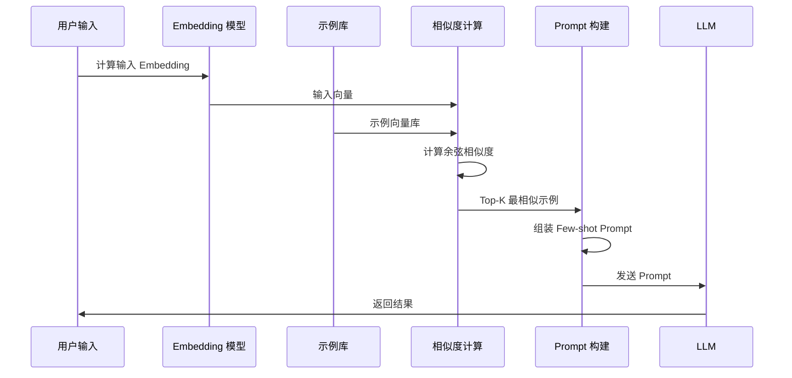

# Few-shot Learning 少样本学习

## 概念说明

**Few-shot Learning**（少样本学习）是通过在 Prompt 中提供少量输入-输出示例，让 LLM "学会"你期望的任务格式、风格和逻辑的技术。它是 **In-Context Learning**（上下文学习）的核心形式——不需要训练模型，只需要在输入中给几个例子。

### 为什么 Few-shot 如此重要？

- **零训练成本**：不需要微调，不需要 GPU，只需要在 Prompt 中加几个示例
- **格式控制**：示例是最直观的"格式说明书"，比文字描述更有效
- **风格迁移**：通过示例让模型"学会"特定的输出风格和语气
- **小模型增强**：小模型（7B/8B）在 Few-shot 下效果远好于 Zero-shot

### Few-shot 的分类

| 类型 | 示例数量 | 适用场景 | 效果 |
|------|:--------:|----------|:----:|
| Zero-shot | 0 个 | 简单任务、大模型 | ⭐⭐⭐ |
| One-shot | 1 个 | 格式简单的任务 | ⭐⭐⭐⭐ |
| Few-shot | 2-5 个 | 复杂格式、特定风格 | ⭐⭐⭐⭐⭐ |
| Many-shot | 10+ 个 | 长上下文模型、高精度需求 | ⭐⭐⭐⭐⭐ |

> 💡 示例数量不是越多越好。2-5 个高质量示例通常就够了，太多会浪费 Token 且可能引入噪声。

## 核心原理

### 1. 示例选择策略

选择什么样的示例直接决定 Few-shot 的效果：



**静态 Few-shot**：预先选好固定示例，所有输入共用。
- 优点：简单、稳定、无额外计算
- 缺点：示例可能与当前输入不相关

**动态 Few-shot**：根据当前输入动态选择最相关的示例。
- 优点：示例与输入高度相关，效果更好
- 缺点：需要 Embedding 计算，增加延迟

### 2. 动态 Few-shot 工作流程



### 3. 示例数量的影响

示例数量对效果的影响呈**边际递减**：

| 示例数量 | 效果提升 | Token 成本 | 建议 |
|:--------:|:--------:|:----------:|------|
| 0 → 1 | 🔺🔺🔺 大幅提升 | 低 | 至少给 1 个示例 |
| 1 → 3 | 🔺🔺 明显提升 | 中 | 推荐的平衡点 |
| 3 → 5 | 🔺 小幅提升 | 中高 | 复杂任务可以用 |
| 5 → 10 | ➡️ 几乎不变 | 高 | 通常不值得 |
| 10+ | ⚠️ 可能下降 | 很高 | 噪声增加，不推荐 |

> 💡 **经验法则**：3 个高质量示例 > 10 个低质量示例。质量比数量重要。

### 4. 示例排序的影响

研究表明，示例的排列顺序会显著影响 LLM 的输出：

- **最后一个示例影响最大**（Recency Bias）：LLM 倾向于模仿最后一个示例的格式和风格
- **第一个示例设定基调**（Primacy Effect）：第一个示例建立了任务的基本模式
- **中间示例影响最小**：中间的示例容易被"忽略"

**最佳排序策略**：
1. 第一个示例：最典型、最标准的案例（设定基调）
2. 中间示例：覆盖不同类型和边界情况
3. 最后一个示例：与当前输入最相似的案例（利用 Recency Bias）

### 5. 示例设计原则

```python
# ✅ 好的 Few-shot 示例设计
prompt = """根据产品描述生成营销文案。

示例 1（电子产品）：
产品：无线降噪耳机，续航 30 小时，主动降噪
文案：告别喧嚣，沉浸音乐世界。30 小时超长续航，让好音乐不间断。

示例 2（食品）：
产品：有机燕麦片，无添加，高纤维
文案：每一口都是大自然的馈赠。有机种植，零添加，开启健康早餐新方式。

示例 3（服装）：
产品：轻薄羽绒服，90% 白鹅绒，可收纳
文案：轻如无物，暖若拥抱。90% 白鹅绒填充，一件解决整个冬天。

现在请为以下产品生成文案：
产品：{product_description}
文案："""

# ❌ 差的 Few-shot 示例设计
prompt = """生成文案。

示例：手机 → 好手机，买它！
示例：电脑 → 好电脑，买它！

产品：{product_description}
文案："""
# 问题：示例太简单、格式单一、没有多样性
```

## 代码示例

> 💻 完整可运行代码：[code-examples/03-ai-apps/prompt_engineering/03_few_shot.py](https://github.com/your-repo/tree/main/code-examples/03-ai-apps/prompt_engineering/03_few_shot.py)
> 🐍 Python 版本：3.11+
> 📦 依赖：ollama（可选，服务模式）

```python
# 动态 Few-shot — 基于相似度选择最相关示例
def select_examples(query: str, examples: list, top_k: int = 3) -> list:
    """根据输入选择最相关的示例。"""
    query_embedding = compute_embedding(query)
    scored = []
    for ex in examples:
        sim = cosine_similarity(query_embedding, ex["embedding"])
        scored.append((sim, ex))
    scored.sort(reverse=True)
    return [ex for _, ex in scored[:top_k]]
```

## 实战要点

**示例选择最佳实践：**
- ✅ 示例要多样化：覆盖不同类型、不同难度的输入
- ✅ 示例要高质量：示例本身必须是正确的、格式规范的
- ✅ 示例格式一致：所有示例保持相同的输入输出格式
- ✅ 动态选择：生产环境推荐基于相似度动态选择示例
- ✅ 最后一个示例放最相关的：利用 Recency Bias
- ❌ 不要用太多示例：3-5 个通常就够了

**动态 Few-shot 实现要点：**
- Embedding 模型选择：text-embedding-3-small（OpenAI）或 bge-m3（开源）
- 示例库管理：用向量数据库（Chroma/FAISS）存储示例 Embedding
- 缓存策略：对高频输入缓存示例选择结果，减少 Embedding 计算
- 示例数量：动态选择 2-3 个最相关示例，比固定 5 个效果更好

**成本控制：**
- 每个示例约占 50-200 Token，3 个示例约 150-600 Token
- 动态 Few-shot 需要额外的 Embedding API 调用（成本很低）
- 权衡：Few-shot 增加的 Token 成本 vs 减少的重试成本

## 常见面试题

### Q1: Few-shot Learning 的原理？如何选择示例？

**难度**：⭐⭐ | **频率**：🔥🔥🔥

**答题思路**：定义 → 为什么有效 → 示例选择策略 → 动态 vs 静态

**标准答案**：Few-shot Learning 通过在 Prompt 中提供少量输入-输出示例，让 LLM 在上下文中"学会"任务的格式和逻辑，属于 In-Context Learning。有效原因：(1) 示例比文字描述更直观；(2) LLM 的注意力机制能从示例中提取模式；(3) 示例提供了隐式的格式约束。示例选择策略：静态选择（固定示例集，简单稳定）和动态选择（基于 Embedding 相似度选最相关示例，效果更好）。生产环境推荐动态 Few-shot，用向量数据库管理示例库。

**深入追问**：
- 示例的顺序会影响结果吗？（会，最后一个示例影响最大，利用 Recency Bias）
- 示例数量怎么选？（2-5 个，边际递减，质量比数量重要）
- 动态 Few-shot 的延迟怎么控制？（Embedding 缓存、预计算、轻量模型）

### Q2: Few-shot 和 Fine-tuning 的区别？什么时候用哪个？

**难度**：⭐⭐⭐ | **频率**：🔥🔥🔥

**答题思路**：对比维度 → 各自优劣 → 选择策略

**标准答案**：

| 维度 | Few-shot | Fine-tuning |
|------|----------|-------------|
| 成本 | 零训练成本 | 需要 GPU 和训练数据 |
| 速度 | 即时生效 | 训练需要数小时 |
| 效果 | 简单任务够用 | 复杂/专业任务更好 |
| 灵活性 | 随时修改示例 | 需要重新训练 |
| 数据需求 | 2-5 个示例 | 数百到数千条数据 |

选择策略：先试 Few-shot，效果不够再考虑 Fine-tuning。如果任务需要专业领域知识、特定输出风格、或 Few-shot 无法达到的准确率，才用 Fine-tuning。

**深入追问**：
- RAG 和 Few-shot 可以结合吗？（可以，RAG 检索相关文档，Few-shot 提供格式示例）
- Many-shot（10+ 示例）什么时候有用？（长上下文模型如 Gemini 1.5，复杂分类任务）
- 如何评估 Few-shot 的效果？（A/B 测试、人工评估、自动化指标如 BLEU/ROUGE）

### Q3: 如何实现动态 Few-shot？

**难度**：⭐⭐⭐ | **频率**：🔥🔥

**标准答案**：(1) 构建示例库：收集高质量的输入-输出示例对；(2) 计算 Embedding：用 Embedding 模型将所有示例转为向量，存入向量数据库；(3) 动态选择：对每个新输入计算 Embedding，用余弦相似度找 Top-K 最相似的示例；(4) 组装 Prompt：将选中的示例按顺序插入 Prompt 模板；(5) 优化：缓存高频查询的示例选择结果，定期更新示例库。

**深入追问**：
- 用什么 Embedding 模型？（OpenAI text-embedding-3-small 或开源 bge-m3）
- 示例库多大合适？（50-500 条，覆盖主要场景即可）

## 推荐工具

> 📌 以下工具可帮助你更高效地学习和实践本知识点，详见 [模块 7：AI 使用与实践](/7-ai-tools/)

| 工具 | 用途 | 详情 |
|------|------|------|
| ChatGPT | 交互式测试 Few-shot 效果 | [AI 对话助手](/7-ai-tools/7.1-efficiency/ai-chat) |
| Cursor | 编写动态 Few-shot 选择逻辑 | [AI 编程辅助](/7-ai-tools/7.1-efficiency/ai-coding) |
| Perplexity | 搜索 Few-shot 最新研究 | [AI 搜索](/7-ai-tools/7.1-efficiency/ai-search) |

## 参考资料

- [Language Models are Few-Shot Learners（GPT-3 论文）](https://arxiv.org/abs/2005.14165)
- [Rethinking the Role of Demonstrations](https://arxiv.org/abs/2202.12837)
- [Fantastically Ordered Prompts（示例排序研究）](https://arxiv.org/abs/2104.08786)
- [DAIR.AI — Few-shot Prompting](https://www.promptingguide.ai/techniques/fewshot)
- [LangChain — Example Selectors](https://python.langchain.com/docs/modules/model_io/prompts/example_selectors/)
