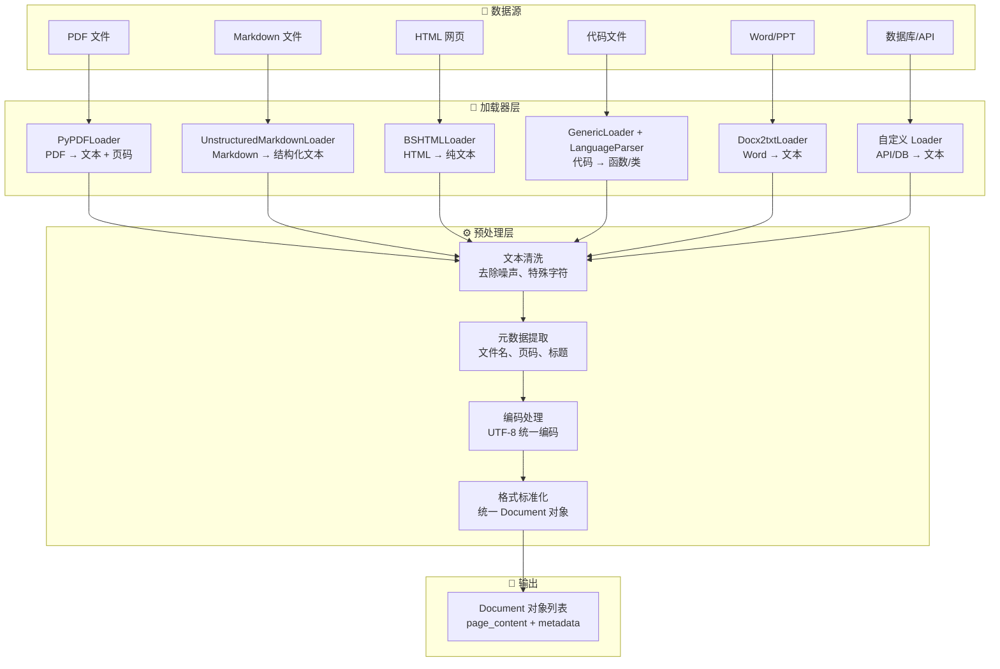
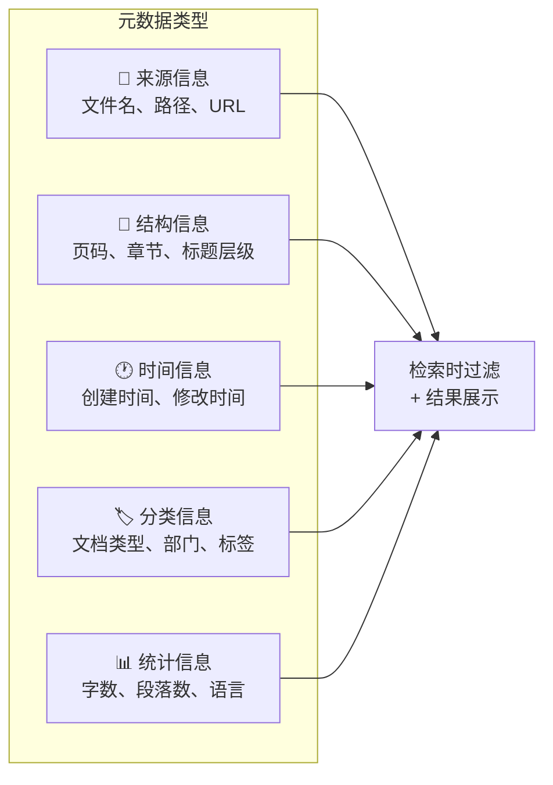

# 文档加载

## 概念说明

**文档加载**（Document Loading）是 RAG（检索增强生成）系统的第一步，负责将各种格式的非结构化数据（PDF、Markdown、HTML、代码文件、Word 文档等）转换为统一的文本格式，供后续切分和向量化使用。

### 为什么文档加载如此重要？

- **数据质量决定 RAG 效果**：垃圾进垃圾出（Garbage In, Garbage Out），加载阶段的质量直接影响最终生成质量
- **格式多样性挑战**：企业知识库通常包含 PDF、Word、HTML、Markdown、代码等多种格式
- **结构信息保留**：好的加载器能保留标题层级、表格结构、代码块等语义信息
- **元数据提取**：文件名、页码、章节标题等元数据对检索排序至关重要
- **生产环境必备**：任何 RAG 系统都需要稳定、高效的文档加载管道

### AI 应用场景

| 场景 | 文档类型 | 关键挑战 |
|------|----------|----------|
| 企业知识库 | PDF/Word/PPT | 表格、图片、扫描件 OCR |
| 技术文档 | Markdown/RST | 代码块保留、链接处理 |
| 网页爬取 | HTML/JSON | 去噪、正文提取 |
| 代码仓库 | .py/.js/.java | 函数/类结构保留 |
| 法律合同 | PDF（扫描件） | OCR 精度、格式还原 |

## 核心原理

### RAG 文档加载流程



### 1. PDF 文档加载

PDF 是企业中最常见的文档格式，也是最难处理的格式之一：

| 解析库 | 优势 | 劣势 | 适用场景 |
|--------|------|------|----------|
| PyPDF2/PyPDFLoader | 轻量、速度快 | 表格支持差 | 纯文本 PDF |
| pdfplumber | 表格提取好 | 速度较慢 | 含表格的 PDF |
| Unstructured | 功能全面 | 依赖多、体积大 | 复杂布局 PDF |
| PyMuPDF (fitz) | 速度快、功能全 | API 复杂 | 高性能场景 |
| OCR (Tesseract) | 支持扫描件 | 精度依赖图片质量 | 扫描件 PDF |

```python
# PyPDF 加载 — 最常用
from langchain_community.document_loaders import PyPDFLoader

loader = PyPDFLoader("knowledge_base/report.pdf")
documents = loader.load()  # 每页一个 Document

for doc in documents:
    print(f"页码: {doc.metadata['page']}")
    print(f"内容: {doc.page_content[:100]}...")
```

### 2. Markdown 文档加载

Markdown 是技术文档的主流格式，加载时需要保留结构信息：

```python
from langchain_community.document_loaders import UnstructuredMarkdownLoader

loader = UnstructuredMarkdownLoader("docs/api-guide.md", mode="elements")
documents = loader.load()

# mode="elements" 会按标题、段落、代码块等元素拆分
for doc in documents:
    print(f"类型: {doc.metadata.get('category', 'unknown')}")
    print(f"内容: {doc.page_content[:80]}...")
```

### 3. HTML 网页加载

HTML 加载的核心挑战是去除导航栏、广告等噪声，提取正文：

```python
from langchain_community.document_loaders import BSHTMLLoader

loader = BSHTMLLoader("page.html", open_encoding="utf-8")
documents = loader.load()

# 更高级：使用 WebBaseLoader 直接从 URL 加载
from langchain_community.document_loaders import WebBaseLoader

loader = WebBaseLoader("https://docs.example.com/api")
documents = loader.load()
```

### 4. 代码文件加载

代码文件需要保留函数/类的结构信息，便于后续按函数粒度检索：

```python
from langchain_community.document_loaders.generic import GenericLoader
from langchain_community.document_loaders.parsers import LanguageParser
from langchain_text_splitters import Language

loader = GenericLoader.from_filesystem(
    path="./src",
    glob="**/*.py",
    parser=LanguageParser(language=Language.PYTHON, parser_threshold=500),
)
documents = loader.load()

# 每个函数/类会被解析为独立的 Document
for doc in documents:
    print(f"文件: {doc.metadata['source']}")
    print(f"内容: {doc.page_content[:100]}...")
```

### 5. 自定义加载器

生产环境中经常需要从数据库、API 等自定义数据源加载：

```python
from langchain_core.document_loaders import BaseLoader
from langchain_core.documents import Document

class DatabaseLoader(BaseLoader):
    """从数据库加载文档的自定义加载器。"""

    def __init__(self, connection_string: str, query: str):
        self.connection_string = connection_string
        self.query = query

    def lazy_load(self):
        """惰性加载，逐条 yield Document。"""
        # 实际实现中连接数据库执行查询
        for row in self._execute_query():
            yield Document(
                page_content=row["content"],
                metadata={"source": "database", "id": row["id"]},
            )
```

### 文档加载的元数据策略



## 代码示例

> 💻 完整可运行代码：[code-examples/03-ai-apps/rag/01_document_loading.py](https://github.com/skyhe58/guide-ai/tree/main/code-examples/03-ai-apps/rag/01_document_loading.py)
> 🐍 Python 版本：3.11+
> 📦 依赖：标准库（默认模式）

## 实战要点

**文档加载最佳实践：**

1. **选择合适的加载器**：PDF 用 PyPDFLoader（简单）或 pdfplumber（表格），Markdown 用 UnstructuredMarkdownLoader，HTML 用 BSHTMLLoader + BeautifulSoup 去噪
2. **保留元数据**：文件名、页码、章节标题等元数据对检索排序至关重要，加载时务必提取并存储
3. **统一编码处理**：所有文本统一转为 UTF-8，处理好中文编码问题（GBK、GB2312 等）
4. **惰性加载大文件**：使用 `lazy_load()` 而非 `load()`，避免一次性加载大量文档导致内存溢出
5. **文本清洗流水线**：加载后统一清洗——去除多余空白、特殊字符、页眉页脚、水印文字等噪声
6. **错误处理与日志**：生产环境必须处理文件损坏、编码错误、格式异常等情况，记录详细日志
7. **增量加载策略**：通过文件哈希或修改时间判断文件是否变更，只加载新增/修改的文件
8. **OCR 兜底方案**：对扫描件 PDF，需要 OCR 兜底（Tesseract/PaddleOCR），但要注意 OCR 精度问题

**常见陷阱：**
- PDF 表格被解析为乱序文本（用 pdfplumber 或 Camelot 专门处理表格）
- HTML 加载了导航栏、广告等噪声（需要配置 CSS 选择器过滤）
- 代码文件丢失缩进和结构（使用 LanguageParser 保留结构）
- 大文件一次性加载导致 OOM（使用惰性加载 + 流式处理）

## 常见面试题

### Q1: RAG 系统中文档加载阶段需要注意什么？

**难度**：⭐⭐ | **频率**：🔥🔥🔥

**答题思路**：从数据质量 → 格式处理 → 元数据 → 性能优化四个维度展开

**标准答案**：文档加载是 RAG 的第一步，直接影响最终效果。需要注意：(1) 选择合适的解析器——PDF 用 PyPDF/pdfplumber，HTML 需要去噪提取正文，代码文件要保留结构；(2) 保留元数据——文件名、页码、章节标题等信息对检索排序和结果展示至关重要；(3) 文本清洗——去除页眉页脚、水印、特殊字符等噪声；(4) 编码统一——处理好中文编码（GBK→UTF-8）；(5) 性能优化——大文件用惰性加载，增量更新只处理变更文件。

**深入追问**：
- PDF 表格如何处理？（pdfplumber 提取表格结构，转为 Markdown 表格格式存储）
- 扫描件 PDF 怎么办？（OCR 识别，Tesseract/PaddleOCR，注意精度和后处理）
- 如何处理多语言文档？（语言检测 + 对应编码处理 + 多语言 Embedding 模型）

### Q2: 如何设计一个支持多种格式的文档加载管道？

**难度**：⭐⭐⭐ | **频率**：🔥🔥

**答题思路**：架构设计 → 扩展性 → 错误处理 → 性能

**标准答案**：设计一个工厂模式的加载管道：(1) 根据文件扩展名自动选择对应的 Loader（.pdf→PyPDFLoader，.md→MarkdownLoader 等）；(2) 统一输出 Document 对象（page_content + metadata）；(3) 加载后经过清洗管道（去噪、编码统一、元数据补充）；(4) 支持插件式扩展——新增格式只需注册新的 Loader；(5) 错误处理——单个文件失败不影响整体，记录日志后跳过；(6) 性能优化——多线程/多进程并行加载，大文件惰性加载。

**深入追问**：
- 如何实现增量加载？（文件哈希 + 修改时间戳，维护已加载文件索引）
- 加载管道如何监控？（加载成功率、失败原因统计、处理速度指标）
- 如何处理超大文件（>100MB）？（流式读取、分块加载、内存映射）

### Q3: LangChain 的 Document 对象包含哪些信息？为什么这样设计？

**难度**：⭐⭐ | **频率**：🔥🔥

**答题思路**：结构说明 → 设计意图 → 实际用途

**标准答案**：LangChain 的 Document 对象包含两个核心字段：`page_content`（文本内容）和 `metadata`（元数据字典）。这样设计的原因：(1) 统一接口——不管原始格式是什么，都转为相同的 Document 对象，方便下游处理；(2) 元数据驱动——metadata 存储来源、页码、标题等信息，支持检索时过滤和结果展示；(3) 可序列化——简单的数据结构便于存储和传输。

**深入追问**：
- metadata 中通常存哪些字段？（source、page、title、created_at、file_type 等）
- 如何利用 metadata 提升检索效果？（过滤特定来源、按时间排序、按类型加权）

## 推荐工具

> 📌 以下工具可帮助你更高效地学习和实践本知识点，详见 [模块 7：AI 使用与实践](/7-ai-tools/)

| 工具 | 用途 | 详情 |
|------|------|------|
| Cursor | 辅助编写文档加载代码，快速调试 | [AI 编程辅助](/7-ai-tools/7.1-efficiency/ai-coding) |
| ChatGPT | 交互式测试不同文档格式的解析策略 | [AI 对话助手](/7-ai-tools/7.1-efficiency/ai-chat) |
| Perplexity | 搜索最新的文档解析库和最佳实践 | [AI 搜索](/7-ai-tools/7.1-efficiency/ai-search) |

## 参考资料

- [LangChain — Document Loaders](https://python.langchain.com/docs/modules/data_connection/document_loaders/)
- [Unstructured — 文档解析库](https://unstructured.io/)
- [pdfplumber — PDF 表格提取](https://github.com/jsvine/pdfplumber)
- [PyMuPDF — 高性能 PDF 处理](https://pymupdf.readthedocs.io/)
- [LlamaIndex — Data Connectors](https://docs.llamaindex.ai/en/stable/module_guides/loading/)
