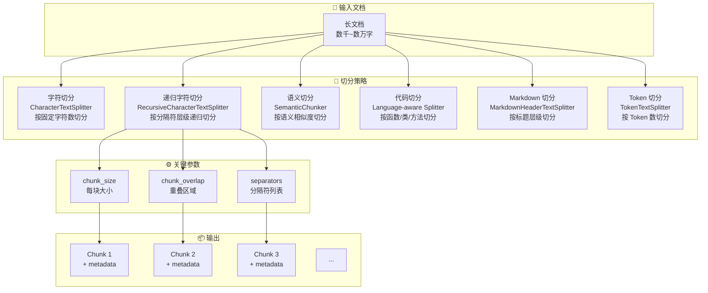
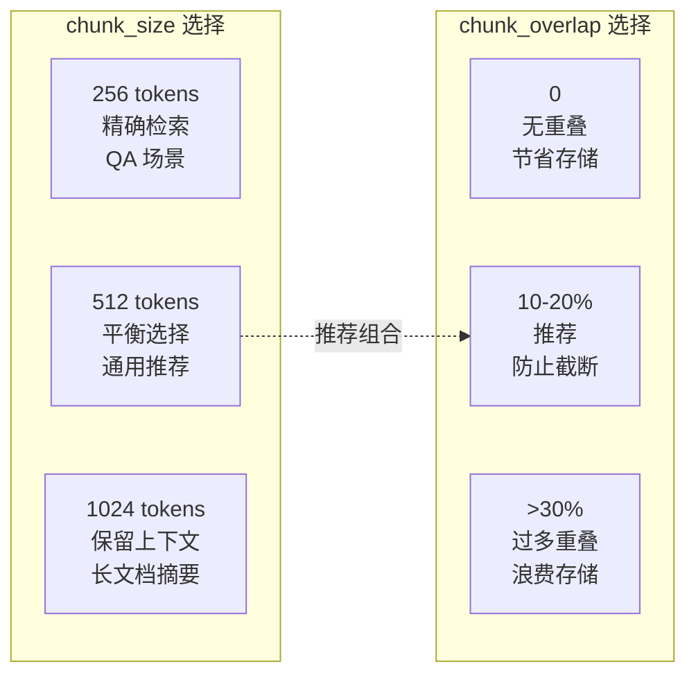

# 文档切分

## 概念说明

**文档切分**（Text Splitting / Chunking）是 RAG 系统中将长文档拆分为适合 Embedding 和检索的小块（Chunk）的过程。切分质量直接决定了检索的精度和生成的质量——切分太大会引入噪声，切分太小会丢失上下文。

### 为什么文档切分如此重要？

- **Embedding 模型有长度限制**：大多数 Embedding 模型的最佳输入长度在 256-512 tokens
- **检索精度依赖切分质量**：一个 Chunk 应该包含完整的语义单元，而不是被截断的半句话
- **上下文窗口有限**：LLM 的上下文窗口有限，需要精选最相关的 Chunk
- **成本控制**：更精准的 Chunk 意味着更少的 Token 消耗
- **效果差异巨大**：好的切分策略和差的切分策略，RAG 效果可能差 3-5 倍

### 切分的核心矛盾

```
Chunk 太大 → 包含无关信息 → 检索精度下降 → 生成质量差
Chunk 太小 → 丢失上下文 → 语义不完整 → 生成质量差
```

最佳切分 = 在"语义完整性"和"检索精度"之间找到平衡点。

## 核心原理

### 文档切分策略全景图



### 1. RecursiveCharacterTextSplitter（推荐默认）

这是 LangChain 中最常用的切分器，按分隔符层级递归切分：

```python
from langchain_text_splitters import RecursiveCharacterTextSplitter

splitter = RecursiveCharacterTextSplitter(
    chunk_size=500,        # 每块最大 500 字符
    chunk_overlap=50,      # 相邻块重叠 50 字符
    separators=["\n\n", "\n", "。", "！", "？", "；", " ", ""],
    # 优先按段落切分 → 按行切分 → 按句子切分 → 按字符切分
)

chunks = splitter.split_text(long_document)
```

**分隔符层级递归逻辑**：
1. 先尝试按 `\n\n`（段落）切分
2. 如果段落太长，按 `\n`（行）切分
3. 如果行太长，按句号等标点切分
4. 最后按字符切分（兜底）

### 2. 语义切分（Semantic Chunking）

基于 Embedding 相似度判断语义边界，相邻句子语义差异大的地方切分：

```python
from langchain_experimental.text_splitter import SemanticChunker
from langchain_openai import OpenAIEmbeddings

semantic_splitter = SemanticChunker(
    embeddings=OpenAIEmbeddings(),
    breakpoint_threshold_type="percentile",  # 百分位阈值
    breakpoint_threshold_amount=95,          # 95% 分位
)

chunks = semantic_splitter.split_text(document)
```

### 3. 切分策略对比

| 策略 | 原理 | 优势 | 劣势 | 适用场景 |
|------|------|------|------|----------|
| CharacterTextSplitter | 固定字符数切分 | 简单快速 | 可能截断语义 | 快速原型 |
| RecursiveCharacterTextSplitter | 按分隔符层级递归 | 语义保留好 | 需要调参 | **通用推荐** |
| SemanticChunker | Embedding 相似度 | 语义边界精准 | 速度慢、成本高 | 高质量需求 |
| MarkdownHeaderTextSplitter | 按标题层级 | 保留文档结构 | 仅限 Markdown | 技术文档 |
| TokenTextSplitter | 按 Token 数 | 精确控制 Token | 不考虑语义 | Token 敏感场景 |
| CodeTextSplitter | 按代码结构 | 保留函数完整性 | 仅限代码 | 代码仓库 |

### 4. chunk_size 和 chunk_overlap 的选择



**经验法则**：
- `chunk_size`：通用场景 512 tokens，QA 场景 256 tokens，摘要场景 1024 tokens
- `chunk_overlap`：通常为 chunk_size 的 10-20%（50-100 字符）
- 中文文档：1 个中文字符 ≈ 1-2 个 token，chunk_size 需要相应调整

## 代码示例

> 💻 完整可运行代码：[code-examples/03-ai-apps/rag/02_text_splitting.py](https://github.com/skyhe58/guide-ai/tree/main/code-examples/03-ai-apps/rag/02_text_splitting.py)
> 🐍 Python 版本：3.11+
> 📦 依赖：标准库（默认模式）

## 实战要点

**切分策略选择指南：**

1. **默认使用 RecursiveCharacterTextSplitter**：它是最通用的切分器，通过分隔符层级递归保证语义完整性，适合 90% 的场景
2. **中文文档调整分隔符**：默认分隔符是英文标点，中文文档需要添加 `"。"、"！"、"？"、"；"` 等中文标点
3. **chunk_size 根据场景调整**：QA 场景用 256-512，摘要场景用 512-1024，代码场景按函数切分
4. **chunk_overlap 不要太大**：10-20% 足够防止语义截断，过大会导致存储浪费和检索重复
5. **代码文件用专用切分器**：CodeTextSplitter 能按函数/类/方法切分，保留代码结构完整性
6. **Markdown 文档按标题切分**：MarkdownHeaderTextSplitter 保留标题层级信息，便于结构化检索
7. **语义切分用于高质量场景**：SemanticChunker 效果最好但速度慢、成本高，适合对质量要求极高的场景
8. **切分后检查质量**：随机抽样检查 Chunk 是否语义完整，是否有截断、重复、噪声等问题

**常见陷阱：**
- chunk_size 设置为字符数但 Embedding 模型限制是 Token 数（需要换算）
- 中文文档用英文分隔符导致切分效果差
- 表格被切分到多个 Chunk 中导致信息丢失
- 代码块被截断导致语法不完整

## 常见面试题

### Q1: RAG 系统中如何选择文档切分策略？

**难度**：⭐⭐⭐ | **频率**：🔥🔥🔥

**答题思路**：先说通用推荐 → 再按场景分析 → 最后说调参经验

**标准答案**：通用推荐 RecursiveCharacterTextSplitter，它通过分隔符层级递归（段落→行→句子→字符）保证语义完整性。具体选择：(1) 纯文本/通用场景用 RecursiveCharacterTextSplitter，chunk_size=512，overlap=50；(2) Markdown 技术文档用 MarkdownHeaderTextSplitter 按标题切分；(3) 代码仓库用 CodeTextSplitter 按函数/类切分；(4) 高质量需求用 SemanticChunker 按语义边界切分。关键参数：chunk_size 根据 Embedding 模型最佳输入长度设置，overlap 为 chunk_size 的 10-20%。

**深入追问**：
- chunk_size 设多大合适？（取决于 Embedding 模型，OpenAI 推荐 512 tokens，BGE 推荐 256-512）
- 如何评估切分质量？（人工抽样 + 下游检索效果 + Chunk 语义完整性评分）
- 语义切分的原理是什么？（计算相邻句子的 Embedding 相似度，相似度骤降处切分）

### Q2: chunk_overlap 的作用是什么？设多大合适？

**难度**：⭐⭐ | **频率**：🔥🔥🔥

**答题思路**：作用 → 设置原则 → 权衡

**标准答案**：chunk_overlap 是相邻 Chunk 之间的重叠区域，作用是防止重要信息被切分到两个 Chunk 的边界而丢失。比如一个完整的句子被切分到两个 Chunk 中，重叠区域可以保证至少一个 Chunk 包含完整句子。设置原则：通常为 chunk_size 的 10-20%（如 chunk_size=500 时 overlap=50-100）。太小可能丢失边界信息，太大会导致存储浪费、检索结果重复、Embedding 计算成本增加。

**深入追问**：
- overlap 为 0 会有什么问题？（边界信息丢失，跨 Chunk 的语义被截断）
- overlap 过大会有什么问题？（存储浪费、检索重复、成本增加）
- 有没有不需要 overlap 的切分方式？（语义切分天然按语义边界切，不需要 overlap）

## 推荐工具

> 📌 以下工具可帮助你更高效地学习和实践本知识点，详见 [模块 7：AI 使用与实践](/7-ai-tools/)

| 工具 | 用途 | 详情 |
|------|------|------|
| Cursor | 辅助编写切分代码，快速调试 | [AI 编程辅助](/7-ai-tools/7.1-efficiency/ai-coding) |
| ChatGPT | 交互式测试不同切分策略 | [AI 对话助手](/7-ai-tools/7.1-efficiency/ai-chat) |
| Perplexity | 搜索最新的切分研究 | [AI 搜索](/7-ai-tools/7.1-efficiency/ai-search) |

## 参考资料

- [LangChain — Text Splitters](https://python.langchain.com/docs/modules/data_connection/document_transformers/)
- [Pinecone — Chunking Strategies](https://www.pinecone.io/learn/chunking-strategies/)
- [Unstructured — Chunking](https://unstructured.io/blog/chunking-for-rag)
- [LlamaIndex — Node Parser](https://docs.llamaindex.ai/en/stable/module_guides/loading/node_parsers/)
- [Greg Kamradt — 5 Levels of Text Splitting](https://github.com/FullStackRetrieval-com/RetrievalTutorials)
