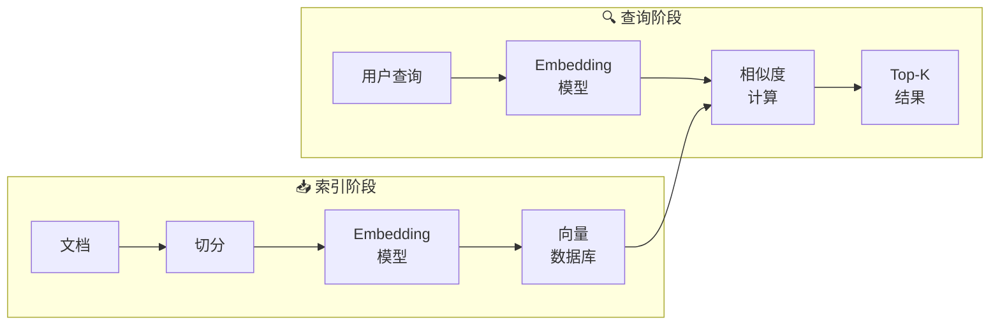
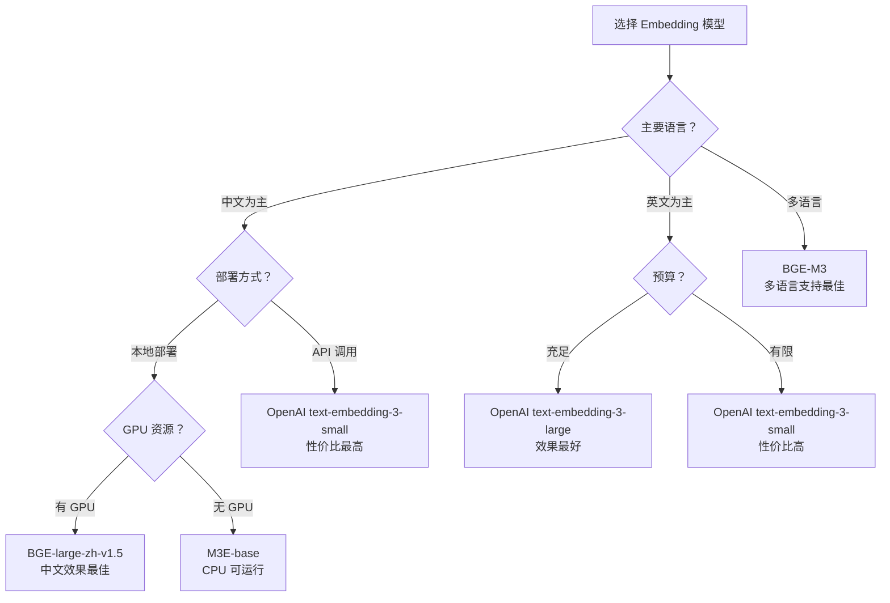

# Embedding 模型

## 概念说明

**Embedding 模型**（嵌入模型）将文本转换为高维向量（通常 768-3072 维），使得语义相似的文本在向量空间中距离更近。它是 RAG 系统的核心组件——文档和查询都需要通过 Embedding 模型转为向量，才能进行相似度检索。

### 为什么 Embedding 模型如此重要？

- **语义理解的基础**：Embedding 将文本的"含义"编码为数字向量，是语义搜索的基础
- **检索质量的关键**：Embedding 模型的质量直接决定了检索的准确率和召回率
- **成本与性能的权衡**：不同模型在维度、速度、精度、成本上差异巨大
- **中文场景特殊性**：通用英文模型在中文场景效果可能很差，需要选择中文优化模型
- **生产环境核心组件**：每次文档入库和用户查询都需要调用 Embedding 模型

### Embedding 的直觉理解

```
"如何部署 LLM？"  →  [0.12, -0.34, 0.56, ..., 0.78]  (1536维)
"LLM 部署方法"    →  [0.11, -0.33, 0.55, ..., 0.77]  (1536维)
"今天天气真好"    →  [0.89, 0.23, -0.67, ..., -0.12]  (1536维)

相似度("如何部署 LLM？", "LLM 部署方法") = 0.95  ← 语义相似
相似度("如何部署 LLM？", "今天天气真好")   = 0.12  ← 语义不相关
```

## 核心原理

### Embedding 在 RAG 中的位置



### 主流 Embedding 模型对比

| 模型 | 维度 | 最大 Token | 中文支持 | 部署方式 | 成本 | MTEB 排名 |
|------|------|-----------|----------|----------|------|-----------|
| OpenAI text-embedding-3-large | 3072 | 8191 | 良好 | API | $0.13/1M tokens | 前 10 |
| OpenAI text-embedding-3-small | 1536 | 8191 | 良好 | API | $0.02/1M tokens | 前 30 |
| BGE-large-zh-v1.5 | 1024 | 512 | **优秀** | 本地 | 免费 | 中文 Top 3 |
| BGE-M3 | 1024 | 8192 | **优秀** | 本地 | 免费 | 多语言 Top 5 |
| M3E-large | 1024 | 512 | **优秀** | 本地 | 免费 | 中文 Top 5 |
| GTE-large-zh | 1024 | 8192 | **优秀** | 本地 | 免费 | 中文 Top 5 |
| Cohere embed-v3 | 1024 | 512 | 良好 | API | $0.1/1M tokens | 前 5 |
| Jina embeddings-v2 | 768 | 8192 | 良好 | API/本地 | 免费/付费 | 前 15 |

### 模型选型决策树



### 相似度计算方法

| 方法 | 公式 | 范围 | 适用场景 |
|------|------|------|----------|
| 余弦相似度 | cos(A,B) = A·B / (‖A‖·‖B‖) | [-1, 1] | **最常用**，归一化后的向量 |
| 欧氏距离 | ‖A-B‖₂ | [0, ∞) | 绝对距离敏感场景 |
| 点积 | A·B | (-∞, +∞) | 向量已归一化时等价余弦 |
| 曼哈顿距离 | Σ|Aᵢ-Bᵢ| | [0, ∞) | 高维稀疏向量 |

```python
import numpy as np

def cosine_similarity(a: np.ndarray, b: np.ndarray) -> float:
    """余弦相似度计算。"""
    return np.dot(a, b) / (np.linalg.norm(a) * np.linalg.norm(b))

# 归一化后的向量，点积 = 余弦相似度
a_norm = a / np.linalg.norm(a)
b_norm = b / np.linalg.norm(b)
similarity = np.dot(a_norm, b_norm)  # 等价于 cosine_similarity
```

### Embedding 模型的训练原理

Embedding 模型通常基于对比学习（Contrastive Learning）训练：

1. **正样本对**：语义相似的文本对（如问题-答案、标题-正文）
2. **负样本对**：语义不相关的文本对（随机配对或困难负样本）
3. **训练目标**：拉近正样本对的向量距离，推远负样本对的向量距离
4. **损失函数**：InfoNCE Loss / Triplet Loss / Contrastive Loss

## 代码示例

> 💻 完整可运行代码：[code-examples/03-ai-apps/rag/03_embedding.py](https://github.com/your-repo/tree/main/code-examples/03-ai-apps/rag/03_embedding.py)
> 🐍 Python 版本：3.11+
> 📦 依赖：numpy（默认模式）、sentence-transformers（本地模型模式）

## 实战要点

**Embedding 模型选型与使用：**

1. **中文场景优先选 BGE/M3E**：OpenAI Embedding 在中文场景效果不如专门的中文模型（BGE-large-zh、M3E-large），且本地部署无 API 成本
2. **维度不是越高越好**：3072 维比 1024 维效果提升有限，但存储和计算成本翻倍。通用场景 1024 维足够
3. **查询和文档用同一个模型**：索引阶段和查询阶段必须使用同一个 Embedding 模型，否则向量空间不一致
4. **批量 Embedding 提升效率**：不要逐条调用 API，批量处理（batch_size=32-128）可以显著提升吞吐量
5. **Embedding 缓存策略**：对已经 Embedding 过的文档建立缓存（文本哈希→向量），避免重复计算
6. **归一化向量**：存入向量数据库前归一化向量（L2 norm），这样点积 = 余弦相似度，检索更快
7. **定期评估模型效果**：用 MTEB 基准测试或自建评估集定期评估 Embedding 模型在你的数据上的效果
8. **考虑 Matryoshka Embedding**：OpenAI text-embedding-3 支持降维（3072→1024→256），可以在精度和成本间灵活权衡

**常见陷阱：**
- 索引和查询用了不同的 Embedding 模型（向量空间不一致，检索失效）
- 文本超过模型最大 Token 限制被截断（需要先切分再 Embedding）
- 没有归一化向量导致相似度计算不准确
- 忽略了 Embedding 模型的语言偏好（英文模型处理中文效果差）

## 常见面试题

### Q1: 如何选择 Embedding 模型？需要考虑哪些因素？

**难度**：⭐⭐⭐ | **频率**：🔥🔥🔥

**答题思路**：从多个维度分析 → 给出决策框架 → 举例说明

**标准答案**：选择 Embedding 模型需要考虑：(1) 语言支持——中文场景优先 BGE/M3E/GTE，英文场景 OpenAI/Cohere；(2) 部署方式——API 调用（OpenAI）简单但有成本和延迟，本地部署（BGE）免费但需要 GPU；(3) 维度与性能——1024 维是性价比最高的选择，3072 维提升有限但成本翻倍；(4) 最大 Token 长度——BGE-M3 支持 8192 tokens 适合长文档，BGE-large-zh 只支持 512；(5) MTEB 排行榜——参考但不迷信，需要在自己的数据上评估。中文 RAG 推荐 BGE-large-zh-v1.5 或 BGE-M3。

**深入追问**：
- Embedding 模型的训练原理是什么？（对比学习，正负样本对，InfoNCE Loss）
- 如何评估 Embedding 模型在你的数据上的效果？（构建评估集，计算 Recall@K、MRR、NDCG）
- Matryoshka Embedding 是什么？（支持降维的 Embedding，可以灵活权衡精度和成本）

### Q2: 余弦相似度和欧氏距离有什么区别？什么时候用哪个？

**难度**：⭐⭐ | **频率**：🔥🔥🔥

**答题思路**：数学定义 → 直觉理解 → 适用场景

**标准答案**：余弦相似度衡量两个向量的方向相似性（角度），范围 [-1,1]，不受向量长度影响；欧氏距离衡量两个向量的绝对距离，范围 [0,∞)，受向量长度影响。在 RAG 场景中，余弦相似度更常用，因为我们关心的是语义方向而非绝对大小。当向量已经 L2 归一化后，余弦相似度 = 1 - 欧氏距离²/2，两者等价。实践中推荐：先归一化向量，然后用点积（等价于余弦相似度）计算，速度最快。

**深入追问**：
- 为什么要对向量做 L2 归一化？（消除长度影响，点积=余弦相似度，加速计算）
- 内积搜索和余弦搜索在向量数据库中有什么区别？（归一化后等价，未归一化时内积受长度影响）

### Q3: 如何处理 Embedding 模型的 Token 长度限制？

**难度**：⭐⭐ | **频率**：🔥🔥

**答题思路**：问题描述 → 解决方案 → 最佳实践

**标准答案**：大多数 Embedding 模型有 Token 长度限制（如 512 tokens），超出部分会被截断。解决方案：(1) 在 Embedding 之前先用 TextSplitter 切分文档，确保每个 Chunk 不超过模型限制；(2) 选择支持长文本的模型（BGE-M3 支持 8192 tokens）；(3) 对长文档使用分段 Embedding + 平均池化（Mean Pooling）合并；(4) 使用 Late Chunking 技术——先对长文本整体 Embedding，再按位置切分向量。

**深入追问**：
- Mean Pooling 和 CLS Token 有什么区别？（Mean Pooling 取所有 Token 向量的平均，CLS 取第一个 Token 的向量）
- Late Chunking 的原理是什么？（利用长上下文模型先编码完整文档，再按 Chunk 位置提取对应向量段）

## 推荐工具

> 📌 以下工具可帮助你更高效地学习和实践本知识点，详见 [模块 7：AI 使用与实践](/7-ai-tools/)

| 工具 | 用途 | 详情 |
|------|------|------|
| Cursor | 辅助编写 Embedding 代码 | [AI 编程辅助](/7-ai-tools/7.1-efficiency/ai-coding) |
| ChatGPT | 了解不同 Embedding 模型特点 | [AI 对话助手](/7-ai-tools/7.1-efficiency/ai-chat) |
| Perplexity | 搜索 MTEB 排行榜和最新模型 | [AI 搜索](/7-ai-tools/7.1-efficiency/ai-search) |

## 参考资料

- [OpenAI — Embeddings Guide](https://platform.openai.com/docs/guides/embeddings)
- [MTEB — Massive Text Embedding Benchmark](https://huggingface.co/spaces/mteb/leaderboard)
- [BGE — BAAI General Embedding](https://huggingface.co/BAAI/bge-large-zh-v1.5)
- [M3E — Moka Massive Mixed Embedding](https://huggingface.co/moka-ai/m3e-large)
- [Sentence-Transformers](https://www.sbert.net/)
- [Cohere — Embed v3](https://cohere.com/embed)
