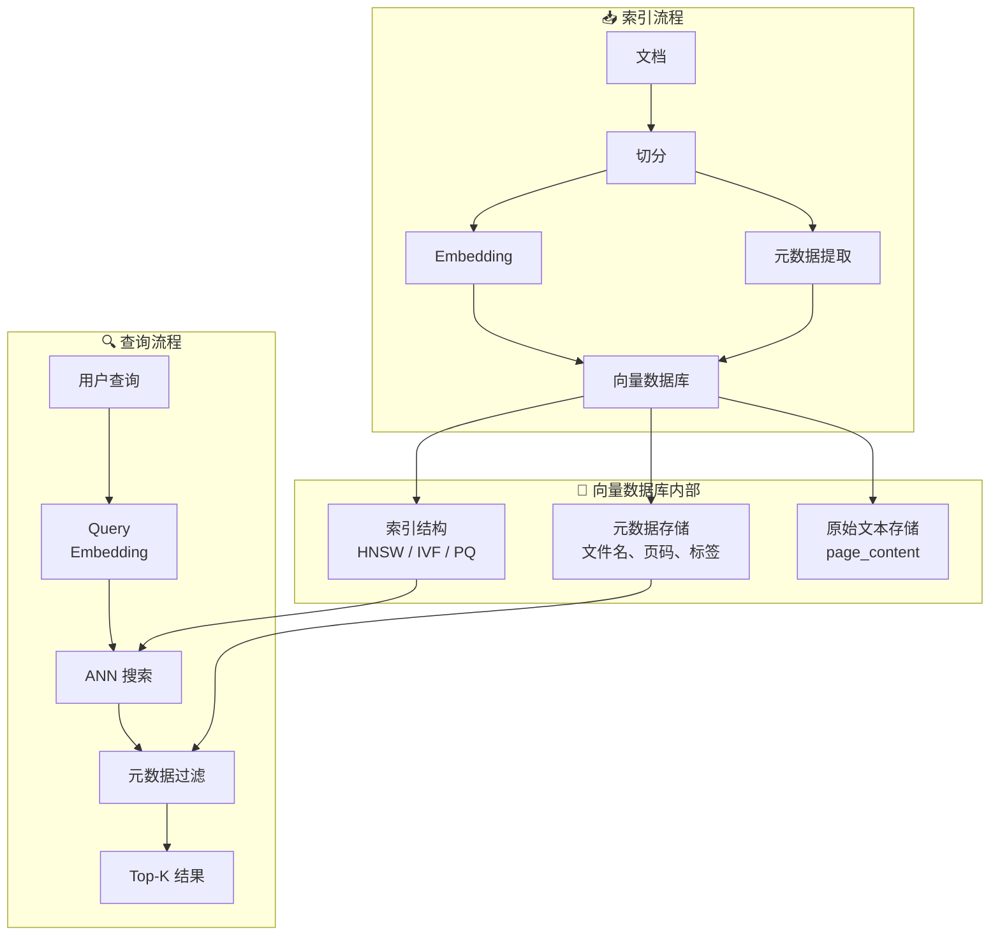
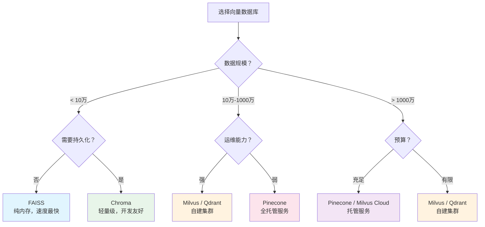

# 向量数据库

## 概念说明

**向量数据库**（Vector Database）是专门用于存储、索引和检索高维向量的数据库系统。在 RAG 系统中，文档经过 Embedding 后转为向量存入向量数据库，用户查询时将查询文本也转为向量，通过近似最近邻（ANN）搜索找到最相关的文档。

### 为什么需要向量数据库？

- **高维向量检索**：传统数据库无法高效处理 768-3072 维向量的相似度搜索
- **ANN 加速**：通过索引结构（HNSW、IVF 等）将暴力搜索 O(n) 降低到 O(log n)
- **元数据过滤**：支持在向量搜索的同时按元数据过滤（如按文档类型、时间范围）
- **持久化存储**：向量和元数据持久化存储，支持增删改查
- **水平扩展**：支持分布式部署，处理亿级向量数据

### 向量数据库 vs 传统数据库

| 特性 | 传统数据库（MySQL） | 向量数据库（Milvus） |
|------|---------------------|---------------------|
| 数据类型 | 结构化数据（行列） | 高维向量 + 元数据 |
| 查询方式 | SQL 精确匹配 | 相似度搜索（ANN） |
| 索引类型 | B-Tree、Hash | HNSW、IVF、PQ |
| 典型查询 | WHERE name = 'xxx' | 找到最相似的 Top-K 向量 |
| 适用场景 | 事务处理、精确查询 | 语义搜索、推荐系统 |

## 核心原理

### 向量数据库在 RAG 中的架构



### 主流向量数据库对比

| 数据库 | 类型 | 部署方式 | 最大数据量 | 元数据过滤 | 适用场景 | 开源 |
|--------|------|----------|-----------|-----------|----------|------|
| **Chroma** | 嵌入式 | 本地/Docker | 百万级 | ✅ | 原型开发、小规模 | ✅ |
| **FAISS** | 库 | 本地（内存） | 亿级 | ❌ | 高性能搜索、研究 | ✅ |
| **Milvus** | 分布式 | Docker/K8s | 百亿级 | ✅ | 企业级生产环境 | ✅ |
| **Pinecone** | 云服务 | SaaS | 百亿级 | ✅ | 快速上线、免运维 | ❌ |
| **Weaviate** | 分布式 | Docker/K8s | 亿级 | ✅ | 多模态搜索 | ✅ |
| **Qdrant** | 分布式 | Docker/K8s | 亿级 | ✅ | 高性能过滤搜索 | ✅ |
| **pgvector** | 扩展 | PostgreSQL | 千万级 | ✅ | 已有 PG 基础设施 | ✅ |

### 选型决策树



### ANN 索引算法对比

| 算法 | 原理 | 构建速度 | 查询速度 | 内存占用 | 精度 |
|------|------|----------|----------|----------|------|
| **HNSW** | 分层可导航小世界图 | 慢 | **最快** | 高 | **最高** |
| **IVF** | 倒排文件索引 | 快 | 中等 | 中等 | 中等 |
| **PQ** | 乘积量化 | 中等 | 快 | **最低** | 较低 |
| **IVF-PQ** | IVF + PQ 组合 | 中等 | 快 | 低 | 中等 |
| **Flat** | 暴力搜索 | 无需构建 | 最慢 | 低 | **100%** |

**HNSW 是目前最常用的索引算法**，在精度和速度之间取得了最佳平衡。

### Chroma 使用示例

```python
import chromadb

# 创建客户端
client = chromadb.Client()  # 内存模式
# client = chromadb.PersistentClient(path="./chroma_db")  # 持久化模式

# 创建集合
collection = client.create_collection(
    name="knowledge_base",
    metadata={"hnsw:space": "cosine"},  # 使用余弦相似度
)

# 添加文档
collection.add(
    documents=["RAG 是检索增强生成", "LLM 是大语言模型"],
    metadatas=[{"source": "doc1"}, {"source": "doc2"}],
    ids=["id1", "id2"],
)

# 查询
results = collection.query(
    query_texts=["什么是 RAG？"],
    n_results=2,
    where={"source": "doc1"},  # 元数据过滤
)
```

## 代码示例

> 💻 完整可运行代码：[code-examples/03-ai-apps/rag/04_vector_store.py](https://github.com/your-repo/tree/main/code-examples/03-ai-apps/rag/04_vector_store.py)
> 🐍 Python 版本：3.11+
> 📦 依赖：chromadb（默认模式）
> 🐳 Docker：`docker run -p 8000:8000 chromadb/chroma`（服务模式）

## 实战要点

**向量数据库选型与使用：**

1. **开发阶段用 Chroma**：Chroma 开箱即用，支持内存模式和持久化模式，API 简洁，适合快速原型开发
2. **生产环境考虑 Milvus/Qdrant**：支持分布式部署、高可用、水平扩展，适合百万级以上数据
3. **已有 PostgreSQL 用 pgvector**：如果团队已有 PG 基础设施，pgvector 扩展可以避免引入新组件
4. **HNSW 是默认索引选择**：在精度和速度之间取得最佳平衡，适合大多数场景
5. **元数据过滤很重要**：不要只靠向量相似度，结合元数据过滤（文档类型、时间范围、权限）可以显著提升检索精度
6. **定期重建索引**：数据量变化大时需要重建索引，HNSW 的 ef_construction 和 M 参数影响索引质量
7. **向量维度与存储成本**：1024 维 float32 向量 = 4KB/条，1 亿条 = 400GB，需要规划存储容量
8. **备份与恢复策略**：生产环境必须有向量数据库的备份策略，Chroma 支持文件级备份，Milvus 支持快照

**常见陷阱：**
- 小数据量用了重量级方案（10 万条数据不需要 Milvus 集群，Chroma 足够）
- 忽略了元数据过滤（纯向量搜索在多租户场景下会返回其他租户的数据）
- FAISS 没有持久化（进程重启数据丢失，需要自己实现序列化）
- 索引参数没有调优（HNSW 的 M 和 ef 参数对性能影响很大）

## 常见面试题

### Q1: 如何选择向量数据库？Chroma、FAISS、Milvus 各适合什么场景？

**难度**：⭐⭐⭐ | **频率**：🔥🔥🔥

**答题思路**：按数据规模和场景分类 → 各自优劣 → 给出推荐

**标准答案**：(1) Chroma——轻量级嵌入式数据库，开箱即用，适合原型开发和小规模应用（<100 万条），支持持久化和元数据过滤；(2) FAISS——Meta 开源的向量搜索库，纯内存操作速度最快，适合对性能要求极高的场景，但不支持元数据过滤和持久化，需要自己封装；(3) Milvus——分布式向量数据库，支持百亿级数据、高可用、水平扩展，适合企业级生产环境，但运维复杂度高。选型建议：开发阶段用 Chroma，生产环境根据数据规模选 Milvus（大规模）或 Qdrant（中等规模）。

**深入追问**：
- HNSW 索引的原理是什么？（分层图结构，上层稀疏快速定位，下层稠密精确搜索）
- 向量数据库如何实现元数据过滤？（先过滤后搜索 / 先搜索后过滤 / 混合策略）
- 如何估算向量数据库的存储需求？（向量数 × 维度 × 4字节 + 索引开销 + 元数据）

### Q2: HNSW 索引的原理是什么？为什么它比暴力搜索快？

**难度**：⭐⭐⭐ | **频率**：🔥🔥

**答题思路**：直觉理解 → 技术原理 → 参数调优

**标准答案**：HNSW（Hierarchical Navigable Small World）是一种分层图索引结构。直觉理解：想象一个多层地图，最上层是全国地图（节点少，跳跃大），最下层是街道地图（节点多，精确）。搜索时从最上层开始，快速定位到大致区域，然后逐层下降精确搜索。技术原理：每层是一个可导航小世界图，节点之间有边连接，搜索时贪心地沿着边移动到离目标最近的节点。关键参数：M（每个节点的最大连接数，影响精度和内存）、ef_construction（构建时搜索宽度，影响索引质量）、ef_search（查询时搜索宽度，影响查询精度和速度）。

**深入追问**：
- HNSW 的时间复杂度是多少？（O(log n)，n 为向量数量）
- M 参数设多大合适？（通常 16-64，越大精度越高但内存越大）
- IVF 和 HNSW 的区别？（IVF 基于聚类分区，HNSW 基于图结构，HNSW 通常更快更准）

## 推荐工具

> 📌 以下工具可帮助你更高效地学习和实践本知识点，详见 [模块 7：AI 使用与实践](/7-ai-tools/)

| 工具 | 用途 | 详情 |
|------|------|------|
| Cursor | 辅助编写向量数据库操作代码 | [AI 编程辅助](/7-ai-tools/7.1-efficiency/ai-coding) |
| ChatGPT | 了解不同向量数据库的特点 | [AI 对话助手](/7-ai-tools/7.1-efficiency/ai-chat) |
| Perplexity | 搜索向量数据库基准测试 | [AI 搜索](/7-ai-tools/7.1-efficiency/ai-search) |

## 参考资料

- [Chroma — 官方文档](https://docs.trychroma.com/)
- [FAISS — Facebook AI Similarity Search](https://faiss.ai/)
- [Milvus — 官方文档](https://milvus.io/docs)
- [Pinecone — 官方文档](https://docs.pinecone.io/)
- [Qdrant — 官方文档](https://qdrant.tech/documentation/)
- [pgvector — PostgreSQL 向量扩展](https://github.com/pgvector/pgvector)
- [ANN Benchmarks](https://ann-benchmarks.com/)
