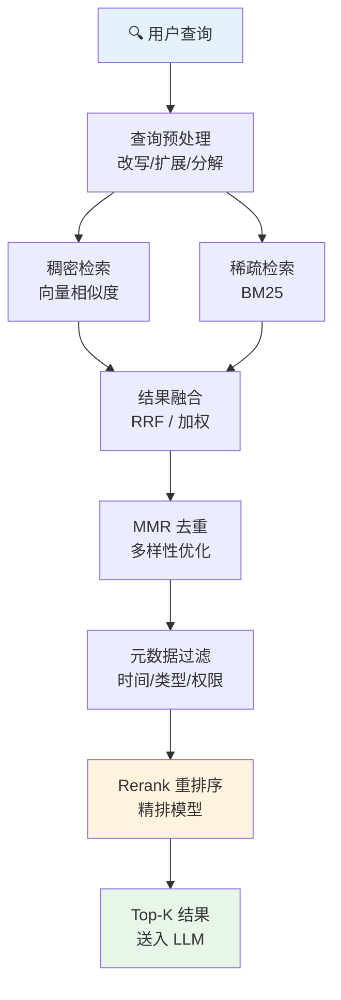
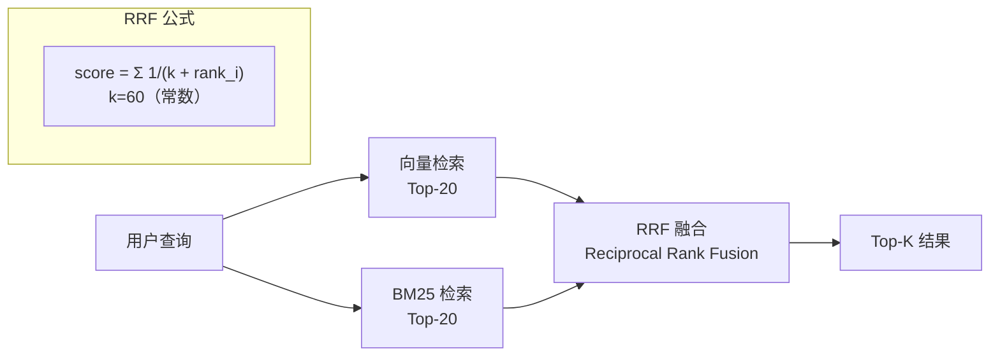

# 检索策略

## 概念说明

**检索策略**（Retrieval Strategy）决定了 RAG 系统如何从向量数据库中找到与用户查询最相关的文档。不同的检索策略在精度、多样性、速度之间有不同的权衡——选择合适的检索策略是 RAG 系统优化的核心环节。

### 为什么检索策略如此重要？

- **检索是 RAG 的瓶颈**：如果检索不到相关文档，后续的 LLM 生成再好也没用
- **精度 vs 多样性**：纯相似度检索可能返回高度重复的结果，缺乏多样性
- **关键词 vs 语义**：用户查询可能包含精确关键词（BM25 擅长）或语义描述（向量检索擅长）
- **效果差异显著**：好的检索策略可以将 RAG 的准确率提升 20-40%
- **场景依赖性强**：不同场景（QA、搜索、推荐）需要不同的检索策略

### 检索策略分类

| 类别 | 策略 | 核心思想 |
|------|------|----------|
| 稠密检索 | 向量相似度 | 语义匹配，理解"含义" |
| 稀疏检索 | BM25/TF-IDF | 关键词匹配，精确匹配 |
| 混合检索 | 向量 + BM25 | 结合语义和关键词优势 |
| 多样性检索 | MMR | 在相关性和多样性间平衡 |
| 多步检索 | 迭代检索 | 多轮检索逐步精化 |

## 核心原理

### 检索策略全景流程



### 1. 向量相似度检索（Dense Retrieval）

最基础的检索方式，通过 Embedding 向量的相似度找到最相关的文档：

```python
# 基本向量检索
results = vector_store.similarity_search(
    query="如何部署 LLM？",
    k=5,  # 返回 Top-5
)

# 带分数的向量检索
results_with_scores = vector_store.similarity_search_with_score(
    query="如何部署 LLM？",
    k=5,
)
for doc, score in results_with_scores:
    print(f"相似度: {score:.4f} | {doc.page_content[:50]}...")
```

**优势**：理解语义，"LLM 部署"和"大模型上线"能匹配
**劣势**：对精确关键词不敏感，"vLLM v0.4.1"可能匹配不到

### 2. BM25 稀疏检索（Sparse Retrieval）

基于关键词频率的经典检索算法，擅长精确匹配：

```python
from rank_bm25 import BM25Okapi
import jieba

# 中文分词 + BM25
corpus = [doc.page_content for doc in documents]
tokenized_corpus = [list(jieba.cut(doc)) for doc in corpus]
bm25 = BM25Okapi(tokenized_corpus)

# 查询
query_tokens = list(jieba.cut("vLLM 部署配置"))
scores = bm25.get_scores(query_tokens)
top_k_indices = scores.argsort()[-5:][::-1]
```

**BM25 公式核心思想**：
- TF（词频）：关键词在文档中出现越多，相关性越高
- IDF（逆文档频率）：在越少文档中出现的词，区分度越高
- 文档长度归一化：避免长文档因为词多而得分高

### 3. 混合检索（Hybrid Search）

结合向量检索和 BM25 的优势，是目前生产环境的最佳实践：



**RRF（Reciprocal Rank Fusion）融合算法**：

```python
def reciprocal_rank_fusion(
    results_list: list[list[str]],
    k: int = 60,
) -> dict[str, float]:
    """RRF 融合多路检索结果。

    Args:
        results_list: 多路检索结果，每路是文档 ID 列表（按相关性排序）
        k: 常数，通常为 60
    """
    fused_scores: dict[str, float] = {}
    for results in results_list:
        for rank, doc_id in enumerate(results):
            fused_scores[doc_id] = fused_scores.get(doc_id, 0) + 1 / (k + rank + 1)
    return dict(sorted(fused_scores.items(), key=lambda x: x[1], reverse=True))
```

### 4. MMR（Maximal Marginal Relevance）

在相关性和多样性之间取得平衡，避免返回高度重复的结果：

```python
# MMR 检索
results = vector_store.max_marginal_relevance_search(
    query="RAG 系统设计",
    k=5,           # 最终返回 5 个
    fetch_k=20,    # 先检索 20 个候选
    lambda_mult=0.5,  # 0=最大多样性，1=最大相关性
)
```

**MMR 公式**：
```
MMR = argmax[λ · Sim(q, d) - (1-λ) · max(Sim(d, d_selected))]
```
- λ=1：纯相关性（等价于普通相似度检索）
- λ=0：纯多样性（选择与已选结果最不相似的）
- λ=0.5：平衡相关性和多样性（推荐默认值）

### 5. 检索策略对比

| 策略 | 语义理解 | 精确匹配 | 多样性 | 速度 | 适用场景 |
|------|----------|----------|--------|------|----------|
| 向量相似度 | ✅ 强 | ❌ 弱 | ❌ 低 | 快 | 语义搜索 |
| BM25 | ❌ 弱 | ✅ 强 | ❌ 低 | 最快 | 关键词搜索 |
| 混合检索 | ✅ 强 | ✅ 强 | ❌ 低 | 中等 | **生产推荐** |
| MMR | ✅ 强 | ❌ 弱 | ✅ 高 | 中等 | 需要多样性 |
| 混合 + MMR | ✅ 强 | ✅ 强 | ✅ 高 | 较慢 | 最佳效果 |

## 代码示例

> 💻 完整可运行代码：[code-examples/03-ai-apps/rag/05_retrieval.py](https://github.com/skyhe58/guide-ai/tree/main/code-examples/03-ai-apps/rag/05_retrieval.py)
> 🐍 Python 版本：3.11+
> 📦 依赖：numpy（默认模式）

## 实战要点

**检索策略选择与优化：**

1. **生产环境用混合检索**：向量检索 + BM25 + RRF 融合是目前最佳实践，兼顾语义理解和精确匹配
2. **MMR 用于需要多样性的场景**：如推荐系统、多角度分析，lambda_mult=0.5 是好的起点
3. **BM25 中文需要分词**：使用 jieba 分词，考虑添加领域词典提升分词质量
4. **检索数量要大于最终需要**：先检索 20-50 个候选，再通过 Rerank 精排到 Top-5
5. **元数据过滤前置**：在向量搜索之前或同时进行元数据过滤，减少搜索空间
6. **查询预处理很重要**：用户查询可能很短或很模糊，需要查询改写/扩展（见 RAG 优化章节）
7. **评估检索效果**：用 Recall@K、MRR、NDCG 等指标评估检索质量，而不是只看最终生成效果
8. **A/B 测试不同策略**：不同数据集和场景下最优策略不同，需要实验验证

**常见陷阱：**
- 只用向量检索忽略了关键词匹配（用户搜索"vLLM 0.4.1"时向量检索可能找不到）
- MMR 的 fetch_k 设置太小（需要足够大的候选池才能保证多样性）
- 混合检索的权重没有调优（向量和 BM25 的权重需要根据数据特点调整）
- 忽略了检索评估（只看最终生成效果，无法定位是检索还是生成的问题）

## 常见面试题

### Q1: 向量检索和 BM25 各有什么优劣？为什么要混合检索？

**难度**：⭐⭐⭐ | **频率**：🔥🔥🔥

**答题思路**：各自原理 → 优劣对比 → 混合检索的价值

**标准答案**：向量检索基于 Embedding 语义匹配，优势是理解同义词和语义关系（"部署"和"上线"能匹配），劣势是对精确关键词不敏感（版本号、专有名词）。BM25 基于关键词频率匹配，优势是精确匹配能力强、速度快、不需要 GPU，劣势是不理解语义（"部署"和"上线"匹配不到）。混合检索结合两者优势：用向量检索捕获语义相关性，用 BM25 捕获精确关键词匹配，通过 RRF 等融合算法合并结果。实验表明混合检索比单一策略提升 10-30% 的检索准确率。

**深入追问**：
- RRF 融合算法的原理是什么？（按排名倒数求和，不依赖分数归一化）
- 混合检索中向量和 BM25 的权重怎么调？（网格搜索 + 评估集，通常向量权重 0.6-0.7）
- 还有哪些融合算法？（加权求和、学习排序 Learn-to-Rank）

### Q2: 什么是 MMR？什么场景下需要用 MMR？

**难度**：⭐⭐ | **频率**：🔥🔥

**答题思路**：定义 → 公式直觉 → 适用场景

**标准答案**：MMR（Maximal Marginal Relevance）是一种在相关性和多样性之间取得平衡的检索策略。核心思想：每次选择下一个文档时，不仅考虑它与查询的相关性，还考虑它与已选文档的差异性。公式：MMR = λ·Sim(q,d) - (1-λ)·max(Sim(d,d_selected))。λ 控制相关性和多样性的权衡。适用场景：(1) 知识库中有大量相似文档时，避免返回重复内容；(2) 需要多角度回答问题时（如"RAG 的优缺点"需要不同角度的文档）；(3) 推荐系统中需要多样化推荐。

**深入追问**：
- lambda_mult 设多少合适？（通常 0.5，QA 场景偏高 0.7，推荐场景偏低 0.3）
- MMR 的计算复杂度是多少？（O(k·n)，k 为返回数量，n 为候选数量）
- 除了 MMR 还有哪些多样性策略？（DPP、聚类去重、子模函数优化）

## 推荐工具

> 📌 以下工具可帮助你更高效地学习和实践本知识点，详见 [模块 7：AI 使用与实践](/7-ai-tools/)

| 工具 | 用途 | 详情 |
|------|------|------|
| Cursor | 辅助编写检索策略代码 | [AI 编程辅助](/7-ai-tools/7.1-efficiency/ai-coding) |
| ChatGPT | 了解不同检索策略的原理 | [AI 对话助手](/7-ai-tools/7.1-efficiency/ai-chat) |
| Perplexity | 搜索最新检索策略研究 | [AI 搜索](/7-ai-tools/7.1-efficiency/ai-search) |

## 参考资料

- [LangChain — Retrievers](https://python.langchain.com/docs/modules/data_connection/retrievers/)
- [Pinecone — Hybrid Search](https://www.pinecone.io/learn/hybrid-search-intro/)
- [Weaviate — Hybrid Search](https://weaviate.io/developers/weaviate/search/hybrid)
- [BM25 — The Okapi BM25 Algorithm](https://en.wikipedia.org/wiki/Okapi_BM25)
- [MMR — Maximal Marginal Relevance](https://www.cs.cmu.edu/~jgc/publication/The_Use_MMR_Diversity_Based_LTMIR_1998.pdf)
