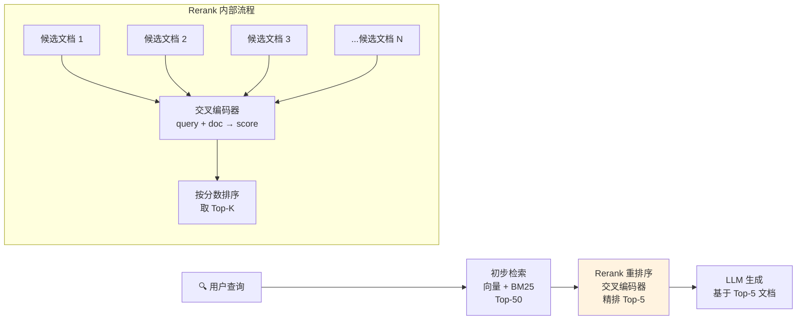
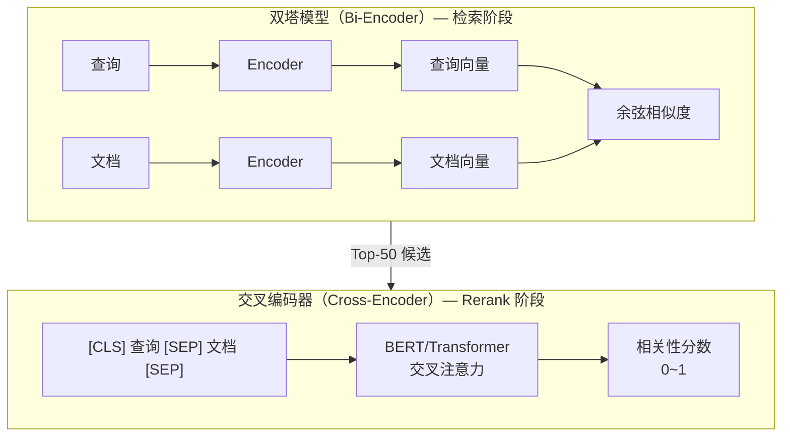

# Rerank 重排序

## 概念说明

**Rerank（重排序）** 是 RAG 系统中在初步检索之后、送入 LLM 之前的精排阶段。初步检索（向量检索/BM25）速度快但精度有限，Rerank 模型通过更精细的交叉注意力机制对候选文档重新打分排序，显著提升最终送入 LLM 的文档质量。

### 为什么需要 Rerank？

- **初步检索精度有限**：向量检索是"双塔模型"（查询和文档独立编码），无法捕获查询-文档之间的细粒度交互
- **Rerank 是"交叉编码器"**：将查询和文档拼接后一起编码，能捕获更精细的语义关系
- **成本可控**：只对 Top-20~50 个候选文档重排序，计算量远小于对全库重排
- **效果提升显著**：Rerank 通常能将 RAG 准确率提升 5-15%
- **即插即用**：不需要修改索引和检索逻辑，只在检索后加一步重排序

### 检索 vs Rerank 的类比

```
检索（Retrieval）= 海选：从 100 万份简历中快速筛出 50 份（速度优先）
Rerank（重排序）= 精选：对 50 份简历逐一精读，选出最好的 5 份（精度优先）
```

## 核心原理

### Rerank 在 RAG 中的位置



### 双塔模型 vs 交叉编码器



| 特性 | 双塔模型（Bi-Encoder） | 交叉编码器（Cross-Encoder） |
|------|------------------------|---------------------------|
| 编码方式 | 查询和文档独立编码 | 查询和文档拼接后联合编码 |
| 交互方式 | 向量点积/余弦相似度 | 全注意力交叉交互 |
| 速度 | 快（可预计算文档向量） | 慢（每次查询需重新计算） |
| 精度 | 中等 | **高** |
| 适用阶段 | 检索（召回） | 重排序（精排） |
| 典型模型 | BGE、OpenAI Embedding | BGE-Reranker、Cohere Rerank |

### 主流 Rerank 模型对比

| 模型 | 类型 | 中文支持 | 部署方式 | 成本 | 效果 |
|------|------|----------|----------|------|------|
| Cohere Rerank v3 | API | 良好 | API | $1/1000 次 | 优秀 |
| BGE-Reranker-v2-m3 | 开源 | **优秀** | 本地 | 免费 | 优秀 |
| BGE-Reranker-large | 开源 | **优秀** | 本地 | 免费 | 良好 |
| Jina Reranker v2 | API/开源 | 良好 | API/本地 | 免费/付费 | 良好 |
| ms-marco-MiniLM | 开源 | 一般 | 本地 | 免费 | 中等 |
| LLM as Reranker | 通用 | 优秀 | API/本地 | 较高 | 优秀 |

### Rerank 使用示例

```python
# 使用 Cohere Rerank
from cohere import Client

co = Client(api_key="your-api-key")
results = co.rerank(
    model="rerank-multilingual-v3.0",
    query="如何优化 RAG 系统？",
    documents=["文档1内容...", "文档2内容...", "文档3内容..."],
    top_n=5,
)

for result in results.results:
    print(f"排名: {result.index}, 分数: {result.relevance_score:.4f}")
```

```python
# 使用 BGE-Reranker（本地部署）
from sentence_transformers import CrossEncoder

model = CrossEncoder("BAAI/bge-reranker-v2-m3")
pairs = [
    ["如何优化 RAG？", "RAG 优化包括查询改写、Rerank、上下文压缩..."],
    ["如何优化 RAG？", "今天天气很好，适合出去散步..."],
]
scores = model.predict(pairs)
# scores: [0.92, 0.03]  — 第一个文档高度相关
```

### LLM as Reranker

用 LLM 本身作为 Reranker，通过 Prompt 让 LLM 判断文档相关性：

```python
rerank_prompt = """给定查询和文档，判断文档与查询的相关性。
输出一个 0-10 的分数，10 表示完全相关。

查询：{query}
文档：{document}

相关性分数（0-10）："""
```

## 代码示例

> 💻 完整可运行代码：[code-examples/03-ai-apps/rag/06_rerank.py](https://github.com/your-repo/tree/main/code-examples/03-ai-apps/rag/06_rerank.py)
> 🐍 Python 版本：3.11+
> 📦 依赖：numpy（默认模式）、sentence-transformers（本地模型模式）

## 实战要点

**Rerank 选型与使用：**

1. **中文场景用 BGE-Reranker-v2-m3**：中文效果最好的开源 Reranker，支持多语言，本地部署免费
2. **Rerank 候选数量控制在 20-50**：太少可能漏掉相关文档，太多会增加延迟和成本
3. **Rerank 后取 Top-3~5 送入 LLM**：经过精排后的文档质量高，3-5 个通常足够
4. **Rerank 不替代好的初步检索**：Rerank 只能在候选集中重排序，如果初步检索没有召回相关文档，Rerank 也无能为力
5. **考虑延迟预算**：Rerank 增加 50-200ms 延迟，对实时性要求高的场景需要权衡
6. **LLM as Reranker 效果好但成本高**：GPT-4 做 Rerank 效果最好，但成本是专用 Reranker 的 10-100 倍
7. **批量处理提升吞吐**：将多个查询-文档对批量送入 Reranker，利用 GPU 并行计算
8. **Rerank 分数可用于阈值过滤**：设置最低相关性分数阈值，过滤掉不相关的文档

**常见陷阱：**
- 初步检索质量太差，Rerank 无法挽救（垃圾进垃圾出）
- Rerank 候选数量太少（Top-5 直接 Rerank 效果有限，应该先检索 Top-50 再 Rerank）
- 忽略了 Rerank 的延迟开销（交叉编码器比双塔模型慢 10-100 倍）
- 没有评估 Rerank 的实际提升（需要对比有无 Rerank 的检索指标）

## 常见面试题

### Q1: 为什么需要 Rerank？它和向量检索有什么区别？

**难度**：⭐⭐⭐ | **频率**：🔥🔥🔥

**答题思路**：从模型架构差异 → 各自优劣 → 为什么需要两阶段

**标准答案**：向量检索使用双塔模型（Bi-Encoder），查询和文档独立编码为向量，通过向量相似度匹配，速度快但精度有限。Rerank 使用交叉编码器（Cross-Encoder），将查询和文档拼接后联合编码，通过全注意力机制捕获细粒度语义交互，精度高但速度慢。两阶段检索的原因：(1) 交叉编码器无法预计算文档向量，对全库逐一计算不现实；(2) 先用快速的向量检索召回 Top-50 候选，再用精确的 Rerank 精排到 Top-5，兼顾速度和精度。这就是"召回-精排"两阶段架构。

**深入追问**：
- 交叉编码器为什么比双塔模型精度高？（全注意力交互 vs 独立编码后点积）
- Rerank 的延迟通常是多少？（50-200ms，取决于候选数量和模型大小）
- 有没有不需要 Rerank 的场景？（数据量小、实时性要求极高、检索精度已经足够）

### Q2: 如何选择 Rerank 模型？Cohere 和 BGE-Reranker 怎么选？

**难度**：⭐⭐ | **频率**：🔥🔥

**答题思路**：对比维度 → 各自优劣 → 选型建议

**标准答案**：Cohere Rerank 是 API 服务，优势是开箱即用、效果好、支持多语言，劣势是有 API 成本和网络延迟。BGE-Reranker 是开源模型，优势是免费、可本地部署、中文效果优秀、数据不出域，劣势是需要 GPU 资源和运维。选型建议：(1) 快速原型/小规模用 Cohere API；(2) 中文场景/数据敏感/大规模用 BGE-Reranker-v2-m3 本地部署；(3) 对效果要求极高且预算充足可以用 LLM as Reranker（GPT-4）。

**深入追问**：
- LLM as Reranker 的原理是什么？（用 Prompt 让 LLM 判断查询-文档相关性打分）
- 如何评估 Rerank 的效果？（对比有无 Rerank 的 NDCG@K、MRR 指标）
- Rerank 和 Fine-tune Embedding 哪个提升更大？（通常 Rerank 更快见效，Fine-tune 上限更高）

## 推荐工具

> 📌 以下工具可帮助你更高效地学习和实践本知识点，详见 [模块 7：AI 使用与实践](/7-ai-tools/)

| 工具 | 用途 | 详情 |
|------|------|------|
| Cursor | 辅助编写 Rerank 代码 | [AI 编程辅助](/7-ai-tools/7.1-efficiency/ai-coding) |
| ChatGPT | 了解不同 Rerank 模型特点 | [AI 对话助手](/7-ai-tools/7.1-efficiency/ai-chat) |
| Perplexity | 搜索最新 Rerank 基准测试 | [AI 搜索](/7-ai-tools/7.1-efficiency/ai-search) |

## 参考资料

- [Cohere — Rerank API](https://docs.cohere.com/docs/reranking)
- [BGE-Reranker — BAAI](https://huggingface.co/BAAI/bge-reranker-v2-m3)
- [Sentence-Transformers — Cross-Encoder](https://www.sbert.net/docs/cross_encoder/usage/usage.html)
- [LangChain — Rerankers](https://python.langchain.com/docs/integrations/document_transformers/)
- [Jina — Reranker](https://jina.ai/reranker/)
