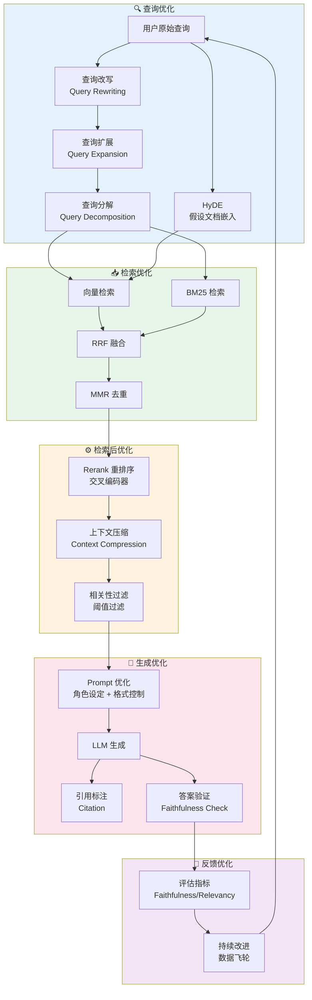
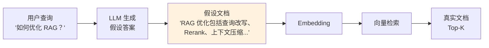
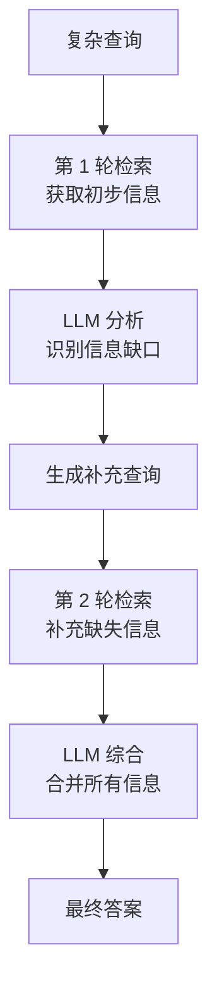

# RAG 优化

## 概念说明

**RAG 优化**是对 RAG（检索增强生成）系统各环节进行系统性改进的过程，包括查询改写、假设文档嵌入（HyDE）、多步检索、上下文压缩等技术。一个基础 RAG 系统的准确率通常在 50-60%，经过系统优化可以提升到 80-90%。

### 为什么 RAG 需要优化？

- **基础 RAG 效果有限**：简单的"检索 + 生成"在复杂场景下准确率不够
- **用户查询质量参差不齐**：用户查询可能很短、很模糊、或包含歧义
- **检索结果噪声多**：检索到的文档可能包含大量无关信息
- **上下文窗口有限**：不能把所有检索结果都塞给 LLM
- **生产环境要求高**：企业级 RAG 系统需要 80%+ 的准确率

### RAG 优化的核心思路

```
基础 RAG：查询 → 检索 → 生成（准确率 ~60%）
优化 RAG：查询改写 → 混合检索 → Rerank → 上下文压缩 → 生成（准确率 ~85%）
```

## 核心原理

### RAG 完整优化链路



### 1. 查询改写（Query Rewriting）

用 LLM 将用户的模糊查询改写为更精确的检索查询：

```python
rewrite_prompt = """你是一个搜索查询优化专家。
将用户的口语化查询改写为更适合知识库检索的查询。

原始查询：{query}

改写要求：
1. 补充隐含的上下文信息
2. 使用更精确的技术术语
3. 去除口语化表达
4. 如果查询包含多个子问题，拆分为多个查询

改写后的查询（JSON 列表）："""

# 示例
# 输入："RAG 怎么搞？"
# 输出：["RAG 系统架构设计", "RAG 检索增强生成实现步骤"]
```

### 2. HyDE（Hypothetical Document Embeddings）

让 LLM 先生成一个"假设答案"，用假设答案的 Embedding 去检索，而不是用原始查询：



**HyDE 的直觉**：假设答案和真实答案在向量空间中更接近，比短查询和长文档的匹配效果更好。

```python
hyde_prompt = """请回答以下问题。即使你不确定，也请给出一个合理的答案。

问题：{query}

答案："""

# 1. LLM 生成假设答案
hypothetical_answer = llm.generate(hyde_prompt.format(query=user_query))

# 2. 用假设答案的 Embedding 检索
results = vector_store.similarity_search(hypothetical_answer, k=5)
```

### 3. 查询分解（Query Decomposition）

将复杂查询拆分为多个简单子查询，分别检索后合并结果：

```python
decompose_prompt = """将以下复杂问题分解为 2-4 个简单的子问题：

问题：{query}

子问题列表（JSON）："""

# 示例
# 输入："对比 Chroma 和 Milvus 在 RAG 场景下的性能和成本"
# 输出：[
#   "Chroma 向量数据库的性能特点",
#   "Milvus 向量数据库的性能特点",
#   "Chroma 的部署成本",
#   "Milvus 的部署成本"
# ]
```

### 4. 上下文压缩（Context Compression）

检索到的文档可能很长，其中只有部分内容与查询相关。上下文压缩提取最相关的部分：

```python
compress_prompt = """给定查询和文档，提取文档中与查询最相关的内容。
只保留直接回答查询的信息，去除无关内容。

查询：{query}
文档：{document}

相关内容："""
```

### 5. 多步检索（Iterative Retrieval）

对于复杂问题，一次检索可能不够，需要多轮检索逐步深入：



### 6. RAG 优化效果对比

| 优化技术 | 准确率提升 | 延迟增加 | 成本增加 | 实现复杂度 |
|----------|-----------|----------|----------|-----------|
| 查询改写 | +5-10% | +200ms | 低 | 低 |
| HyDE | +5-15% | +500ms | 中 | 低 |
| 混合检索 | +10-20% | +50ms | 低 | 中 |
| Rerank | +5-15% | +100ms | 中 | 低 |
| 上下文压缩 | +3-8% | +300ms | 中 | 中 |
| 查询分解 | +10-20% | +1s | 高 | 高 |
| 多步检索 | +15-25% | +2s | 高 | 高 |

## 代码示例

> 💻 完整可运行代码：[code-examples/03-ai-apps/rag/07_rag_optimization.py](https://github.com/your-repo/tree/main/code-examples/03-ai-apps/rag/07_rag_optimization.py)
> 🐍 Python 版本：3.11+
> 📦 依赖：numpy（默认模式）

## 实战要点

**RAG 优化策略选择：**

1. **优先做混合检索 + Rerank**：这是投入产出比最高的优化组合，通常能提升 15-30% 的准确率
2. **查询改写是低成本高回报**：一个简单的 LLM 查询改写就能显著提升检索质量，实现成本低
3. **HyDE 适合短查询场景**：当用户查询很短（2-5 个词）时，HyDE 效果最明显
4. **上下文压缩节省 Token**：检索到的文档可能很长，压缩后只保留相关部分，减少 LLM 输入 Token
5. **查询分解用于复杂问题**：对比类、多方面分析类问题，拆分为子查询分别检索效果更好
6. **多步检索用于深度问题**：需要推理链的问题（如"为什么 X 导致了 Y？"），多步检索逐步深入
7. **不要一次性加所有优化**：从最简单的优化开始，逐步添加，每步评估效果
8. **建立评估基准**：在优化之前先建立基准指标（Faithfulness、Answer Relevancy），每次优化后对比
9. **监控延迟和成本**：每个优化步骤都会增加延迟和成本，需要在效果和性能之间权衡

**常见陷阱：**
- 过度优化导致延迟太高（用户等不了 5 秒的响应）
- HyDE 生成的假设答案质量差（需要好的 Prompt 和合适的 LLM）
- 查询分解产生了不相关的子查询（需要验证子查询的质量）
- 没有评估基准就开始优化（无法量化优化效果）

## 常见面试题

### Q1: 如何系统性地优化 RAG 系统？

**难度**：⭐⭐⭐⭐ | **频率**：🔥🔥🔥

**答题思路**：按 RAG 链路各环节展开 → 每个环节的优化方法 → 优先级排序

**标准答案**：RAG 优化可以从四个环节入手：(1) 查询优化——查询改写（LLM 将口语化查询改为精确查询）、HyDE（用假设答案的 Embedding 检索）、查询分解（复杂问题拆分为子查询）；(2) 检索优化——混合检索（向量+BM25+RRF 融合）、元数据过滤、增大召回数量；(3) 检索后优化——Rerank 重排序（交叉编码器精排）、上下文压缩（提取相关片段）、相关性阈值过滤；(4) 生成优化——Prompt 优化（角色设定+格式控制）、引用标注、答案验证。优先级：混合检索 > Rerank > 查询改写 > 上下文压缩 > HyDE > 多步检索。

**深入追问**：
- HyDE 的原理是什么？什么场景下效果好？（假设文档嵌入，短查询场景效果最好）
- 如何评估 RAG 优化的效果？（Faithfulness、Answer Relevancy、Context Precision、Context Recall）
- 优化后延迟增加了怎么办？（异步并行、缓存、模型量化、减少检索数量）

### Q2: 什么是 HyDE？它的优缺点是什么？

**难度**：⭐⭐⭐ | **频率**：🔥🔥

**答题思路**：原理 → 为什么有效 → 优缺点 → 适用场景

**标准答案**：HyDE（Hypothetical Document Embeddings）是一种查询优化技术。原理：先让 LLM 根据查询生成一个"假设答案"，然后用假设答案的 Embedding（而非原始查询的 Embedding）去向量数据库检索。为什么有效：假设答案是一段完整的文本，与知识库中的真实文档在向量空间中更接近，比短查询的 Embedding 匹配效果更好。优点：(1) 对短查询效果提升显著；(2) 实现简单，只需加一步 LLM 调用。缺点：(1) 增加一次 LLM 调用的延迟和成本；(2) 假设答案可能不准确，导致检索偏差；(3) 对已经很精确的查询可能没有提升。

**深入追问**：
- HyDE 生成的假设答案不准确怎么办？（多次生成取平均、结合原始查询检索）
- HyDE 和查询改写有什么区别？（HyDE 生成完整答案用于 Embedding，查询改写优化查询文本）
- 什么场景下不适合用 HyDE？（查询已经很精确、实时性要求高、LLM 对领域不熟悉）

### Q3: RAG 系统的评估指标有哪些？

**难度**：⭐⭐⭐ | **频率**：🔥🔥🔥

**答题思路**：分检索和生成两个阶段 → 每个阶段的指标 → 如何使用

**标准答案**：RAG 评估分为检索评估和生成评估：检索评估——(1) Recall@K（Top-K 中包含正确文档的比例）；(2) MRR（正确文档的平均倒数排名）；(3) NDCG（考虑排名位置的相关性评分）。生成评估——(1) Faithfulness（答案是否忠实于检索到的文档，不编造）；(2) Answer Relevancy（答案是否回答了用户的问题）；(3) Context Precision（检索到的文档中有多少是相关的）；(4) Context Recall（相关文档是否都被检索到了）。工具：RAGAS、DeepEval 可以自动化评估这些指标。

**深入追问**：
- Faithfulness 和 Answer Relevancy 的区别？（Faithfulness 检查是否编造，Relevancy 检查是否回答了问题）
- 如何构建 RAG 评估数据集？（人工标注 + LLM 辅助生成 + 持续收集用户反馈）

## 推荐工具

> 📌 以下工具可帮助你更高效地学习和实践本知识点，详见 [模块 7：AI 使用与实践](/7-ai-tools/)

| 工具 | 用途 | 详情 |
|------|------|------|
| Cursor | 辅助编写 RAG 优化代码 | [AI 编程辅助](/7-ai-tools/7.1-efficiency/ai-coding) |
| ChatGPT | 测试查询改写和 HyDE 策略 | [AI 对话助手](/7-ai-tools/7.1-efficiency/ai-chat) |
| Perplexity | 搜索最新 RAG 优化论文 | [AI 搜索](/7-ai-tools/7.1-efficiency/ai-search) |

## 参考资料

- [LangChain — RAG](https://python.langchain.com/docs/tutorials/rag/)
- [HyDE — Hypothetical Document Embeddings](https://arxiv.org/abs/2212.10496)
- [RAGAS — RAG Assessment](https://docs.ragas.io/)
- [LlamaIndex — Advanced RAG](https://docs.llamaindex.ai/en/stable/optimizing/production_rag/)
- [Pinecone — RAG Best Practices](https://www.pinecone.io/learn/retrieval-augmented-generation/)
- [Jerry Liu — Building Production RAG](https://www.anyscale.com/blog/a-comprehensive-guide-for-building-rag-based-llm-applications-part-1)
