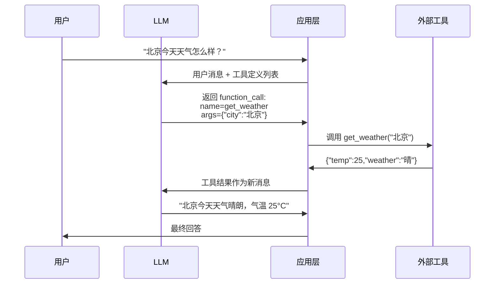
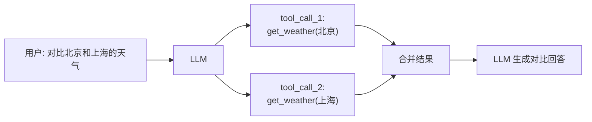

# Function Calling

## 概念说明

**Function Calling**（函数调用）是 LLM 与外部世界交互的核心机制。它允许模型根据用户意图，自动选择合适的函数并生成结构化的调用参数，从而实现搜索、计算、数据库查询、API 调用等能力。Function Calling 是构建 AI Agent 的基石——没有它，LLM 只能"说"，不能"做"。

### 为什么 Function Calling 如此重要？

- **打破 LLM 局限**：LLM 无法访问实时数据、执行计算、操作外部系统，Function Calling 补齐了这些能力
- **结构化输出**：相比让 LLM 自由生成 JSON，Function Calling 通过 schema 约束保证输出格式正确
- **Agent 基石**：所有 Agent 框架（LangChain、LangGraph、AutoGen）底层都依赖 Function Calling
- **生产级可靠性**：参数经过 schema 验证，比纯文本解析更稳定

### Function Calling 的核心流程



### Function Calling vs 传统方式

| 对比维度 | 传统 Prompt 解析 | Function Calling |
|----------|-----------------|-----------------|
| 输出格式 | 不稳定，需要正则提取 | schema 约束，格式保证 |
| 参数验证 | 手动验证 | 自动 schema 验证 |
| 多工具选择 | 需要复杂 Prompt 设计 | 模型自动选择 |
| 并行调用 | 难以实现 | 原生支持（parallel tool calls） |
| 错误处理 | 解析失败需重试 | 结构化错误信息 |

## 核心原理

### 1. 工具定义（Tool Definition）

Function Calling 的第一步是定义工具的 JSON Schema，告诉 LLM 有哪些工具可用、每个工具的参数是什么：

```python
# OpenAI 格式的工具定义
tools = [
    {
        "type": "function",
        "function": {
            "name": "get_weather",
            "description": "获取指定城市的当前天气信息",
            "parameters": {
                "type": "object",
                "properties": {
                    "city": {
                        "type": "string",
                        "description": "城市名称，如'北京'、'上海'"
                    },
                    "unit": {
                        "type": "string",
                        "enum": ["celsius", "fahrenheit"],
                        "description": "温度单位，默认摄氏度"
                    }
                },
                "required": ["city"]
            }
        }
    }
]
```

工具定义的关键要素：
- **name**：函数名，LLM 通过名称选择工具
- **description**：功能描述，影响 LLM 的工具选择决策（非常重要！）
- **parameters**：JSON Schema 格式的参数定义，支持类型、枚举、必填等约束

### 2. 参数解析与验证

LLM 返回的 function_call 包含函数名和参数 JSON，应用层需要解析并验证：

```python
import json

def parse_function_call(response) -> dict:
    """解析 LLM 返回的 function_call。"""
    tool_call = response.choices[0].message.tool_calls[0]
    return {
        "id": tool_call.id,
        "name": tool_call.function.name,
        "arguments": json.loads(tool_call.function.arguments)
    }
```

### 3. 多工具调用（Parallel Tool Calls）

OpenAI GPT-4o 支持一次返回多个工具调用，适合需要同时获取多个信息的场景：



### 4. 工具选择策略

通过 `tool_choice` 参数控制 LLM 的工具选择行为：

| tool_choice 值 | 行为 | 适用场景 |
|----------------|------|----------|
| `"auto"` | LLM 自行决定是否调用工具 | 通用对话 |
| `"none"` | 禁止调用工具 | 纯文本回答 |
| `"required"` | 必须调用至少一个工具 | 强制工具使用 |
| `{"type":"function","function":{"name":"xxx"}}` | 强制调用指定工具 | 确定性场景 |

### 5. 错误处理与重试

生产环境中 Function Calling 可能出现的问题及处理策略：

- **参数格式错误**：LLM 生成的 JSON 不合法 → 重试或手动修复
- **工具不存在**：LLM 调用了未定义的工具 → 返回错误信息让 LLM 重新选择
- **参数缺失**：必填参数未提供 → 提示 LLM 补充信息
- **工具执行失败**：外部 API 超时/错误 → 返回错误信息让 LLM 给出替代方案

## 代码示例

> 💻 完整可运行代码：[code-examples/03-ai-apps/agent/01_function_calling.py](https://github.com/your-repo/tree/main/code-examples/03-ai-apps/agent/01_function_calling.py)
> 🐍 Python 版本：3.11+
> 📦 依赖：标准库（默认模式）

```python
# Function Calling 核心流程示例
from dataclasses import dataclass

@dataclass
class ToolCall:
    id: str
    name: str
    arguments: dict

def execute_tool(tool_call: ToolCall, registry: dict) -> str:
    """根据 LLM 返回的 tool_call 执行对应工具。"""
    func = registry.get(tool_call.name)
    if not func:
        return f"错误：工具 '{tool_call.name}' 不存在"
    return func(**tool_call.arguments)
```

## 实战要点

**工具定义最佳实践：**
- **description 决定一切**：LLM 根据 description 选择工具，描述要准确、具体，避免模糊
- **参数命名语义化**：用 `city` 而不是 `param1`，用 `start_date` 而不是 `d1`
- **合理使用 enum**：当参数有固定选项时，用 enum 约束比 description 描述更可靠
- **控制工具数量**：单次请求不超过 20 个工具定义，太多会降低选择准确率
- **必填 vs 可选**：只把真正必须的参数放在 required 中，其他用默认值
- **版本管理**：工具定义变更需要回归测试，避免破坏已有功能

**生产环境注意事项：**
- **超时控制**：外部工具调用必须设置超时，避免阻塞整个流程
- **结果截断**：工具返回结果过长时需要截断，避免超出 context window
- **成本控制**：每次 Function Calling 都消耗 token，工具定义本身也占 token
- **日志追踪**：记录每次工具调用的输入输出，方便调试和审计
- **幂等性**：工具实现要考虑重试场景，确保多次调用结果一致
- **安全校验**：对 LLM 生成的参数做二次校验，防止注入攻击

## 常见面试题

### Q1: Function Calling 的工作原理是什么？和让 LLM 直接输出 JSON 有什么区别？

**难度**：⭐⭐ | **频率**：🔥🔥🔥

**答题思路**：先讲流程 → 再对比区别 → 最后说优势

**标准答案**：Function Calling 的流程是：(1) 开发者定义工具的 JSON Schema（名称、描述、参数）；(2) 将工具定义和用户消息一起发给 LLM；(3) LLM 根据用户意图选择合适的工具，生成结构化的函数名和参数；(4) 应用层执行工具并将结果返回 LLM；(5) LLM 基于工具结果生成最终回答。与直接输出 JSON 的区别：Function Calling 有 schema 约束保证格式正确，支持自动工具选择和并行调用，参数经过类型验证，而直接输出 JSON 格式不稳定、需要正则提取、容易出错。

**深入追问**：
- 如果 LLM 选错了工具怎么办？（返回错误信息让 LLM 重新选择，或用 tool_choice 强制指定）
- Function Calling 的 token 消耗怎么计算？（工具定义 + 用户消息 + 模型输出都算 token）
- 如何优化多工具场景下的选择准确率？（精确的 description、减少工具数量、分组管理）

### Q2: 如何设计一个支持多工具并行调用的 Function Calling 系统？

**难度**：⭐⭐⭐ | **频率**：🔥🔥

**答题思路**：架构设计 → 并行执行 → 结果合并 → 错误处理

**标准答案**：设计要点：(1) 工具注册中心——统一管理所有工具的定义和实现，支持动态注册；(2) 并行执行引擎——使用 asyncio.gather 并行执行多个工具调用，设置独立超时；(3) 结果合并——按 tool_call_id 将结果与调用对应，组装成 tool message 列表返回 LLM；(4) 错误隔离——单个工具失败不影响其他工具，失败的工具返回错误信息；(5) 重试机制——对可重试的错误（超时、限流）自动重试，不可重试的直接返回错误。

**深入追问**：
- 并行调用时如何处理工具间的依赖关系？（拓扑排序，有依赖的串行执行）
- 如何限制并行调用的并发数？（信号量 Semaphore 控制）
- 工具调用结果太长怎么办？（截断、摘要、分页）

### Q3: Function Calling 在生产环境中有哪些常见问题？如何解决？

**难度**：⭐⭐⭐ | **频率**：🔥🔥

**答题思路**：列举问题 → 分析原因 → 给出方案

**标准答案**：常见问题包括：(1) 工具选择错误——description 不够精确导致 LLM 选错工具，解决方案是优化描述、减少工具数量、添加示例；(2) 参数幻觉——LLM 编造不存在的参数值，解决方案是严格的 schema 验证 + 二次校验；(3) 无限循环——LLM 反复调用同一工具，解决方案是设置最大调用次数限制；(4) 成本失控——复杂对话中工具定义占用大量 token，解决方案是动态工具加载、只传相关工具；(5) 延迟过高——多次工具调用导致响应慢，解决方案是并行调用、缓存、流式输出。

**深入追问**：
- 如何做 Function Calling 的 A/B 测试？（对比不同工具定义的选择准确率）
- 如何监控 Function Calling 的质量？（LangSmith 追踪、成功率指标、延迟监控）

## 推荐工具

> 📌 以下工具可帮助你更高效地学习和实践本知识点，详见 [模块 7：AI 使用与实践](/7-ai-tools/)

| 工具 | 用途 | 详情 |
|------|------|------|
| Cursor | 辅助编写工具定义和调试 Function Calling 代码 | [AI 编程辅助](/7-ai-tools/7.1-efficiency/ai-coding) |
| ChatGPT | 交互式测试 Function Calling 行为 | [AI 对话助手](/7-ai-tools/7.1-efficiency/ai-chat) |
| Perplexity | 搜索 Function Calling API 变更和最佳实践 | [AI 搜索](/7-ai-tools/7.1-efficiency/ai-search) |

## 参考资料

- [OpenAI — Function Calling Guide](https://platform.openai.com/docs/guides/function-calling)
- [OpenAI — Parallel Function Calling](https://platform.openai.com/docs/guides/function-calling/parallel-function-calls)
- [Anthropic — Tool Use](https://docs.anthropic.com/en/docs/build-with-claude/tool-use)
- [LangChain — Tool Calling](https://python.langchain.com/docs/concepts/tool_calling/)
- [Gorilla LLM — Function Calling Leaderboard](https://gorilla.cs.berkeley.edu/leaderboard.html)
