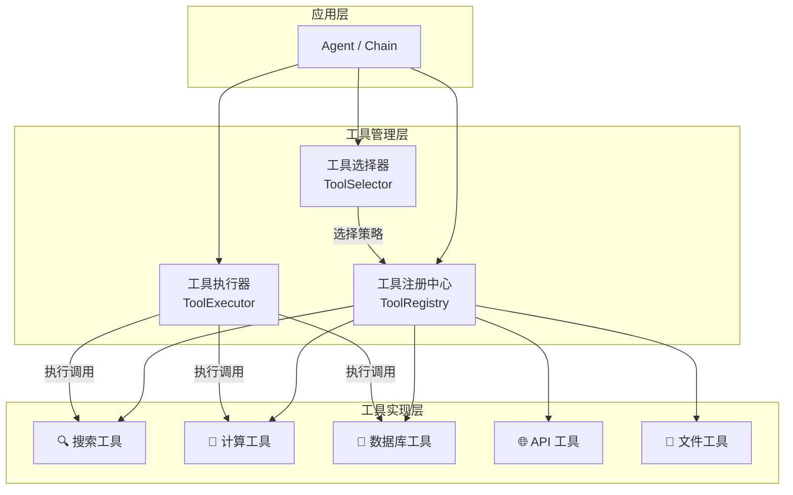
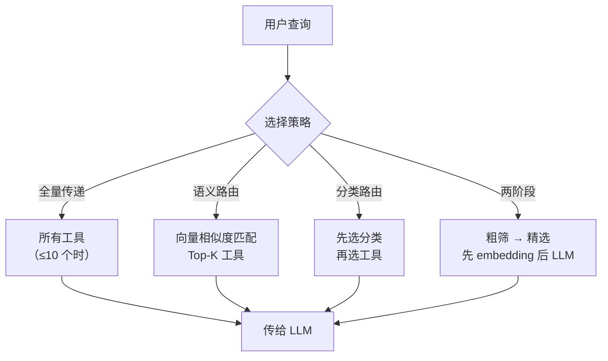

# Tool Use — 自定义工具开发

## 概念说明

**Tool Use**（工具使用）是在 Function Calling 基础上的工程化实践，关注如何设计、注册、管理和选择工具。如果说 Function Calling 是"LLM 能调用函数"，那么 Tool Use 就是"如何构建一个可靠的工具生态系统"。它是 Agent 系统从 Demo 走向生产的关键环节。

### 为什么需要系统化的 Tool Use？

- **工具数量增长**：生产环境可能有 50+ 工具，需要统一管理和动态加载
- **质量保证**：每个工具需要输入验证、错误处理、超时控制、日志记录
- **选择准确性**：工具太多时 LLM 选择准确率下降，需要智能路由策略
- **可维护性**：工具需要版本管理、测试、文档，和代码一样需要工程化

### Tool Use 的分层架构



### 主流框架的 Tool Use 对比

| 框架 | 工具定义方式 | 工具选择 | 特色 |
|------|-------------|---------|------|
| OpenAI | JSON Schema | 模型内置 | 原生支持、并行调用 |
| LangChain | @tool 装饰器 / BaseTool | 模型选择 | 生态丰富、工具库多 |
| LlamaIndex | FunctionTool | QueryEngine 路由 | 与索引深度集成 |
| Anthropic | JSON Schema | 模型内置 | 支持 computer_use |
| AutoGen | 函数注册 | Agent 协商 | 多 Agent 工具共享 |

## 核心原理

### 1. 工具设计原则

好的工具设计遵循以下原则：

- **单一职责**：每个工具只做一件事，`search_web` 和 `search_database` 应该是两个工具
- **明确边界**：输入输出类型明确，用 Pydantic 做 schema 验证
- **幂等安全**：相同输入产生相同输出，支持安全重试
- **优雅降级**：工具失败时返回有意义的错误信息，而不是抛异常
- **可观测性**：记录调用日志、执行时间、成功率等指标

### 2. 工具注册中心

工具注册中心是管理所有工具的核心组件：

```python
class ToolRegistry:
    """工具注册中心 — 统一管理工具的注册、查询、分组。"""

    def register(self, tool: BaseTool) -> None:
        """注册工具到中心。"""

    def get(self, name: str) -> BaseTool | None:
        """按名称获取工具。"""

    def list_by_category(self, category: str) -> list[BaseTool]:
        """按分类获取工具列表。"""

    def to_openai_tools(self) -> list[dict]:
        """导出为 OpenAI Function Calling 格式。"""
```

### 3. 工具选择策略

当工具数量较多时，需要智能选择策略避免 LLM 选择困难：



**策略选择建议：**
- **≤10 个工具**：全量传递，LLM 直接选择
- **10-50 个工具**：语义路由，用 embedding 匹配最相关的 5-10 个
- **50+ 个工具**：分类路由 + 两阶段筛选

### 4. 工具执行与错误处理

生产级工具执行需要考虑超时、重试、熔断：

```python
async def execute_with_retry(
    tool: BaseTool,
    args: dict,
    max_retries: int = 3,
    timeout: float = 30.0
) -> ToolResult:
    """带重试和超时的工具执行。"""
    for attempt in range(max_retries):
        try:
            result = await asyncio.wait_for(
                tool.execute(**args), timeout=timeout
            )
            return ToolResult(success=True, data=result)
        except asyncio.TimeoutError:
            if attempt == max_retries - 1:
                return ToolResult(success=False, error="工具执行超时")
        except Exception as e:
            if attempt == max_retries - 1:
                return ToolResult(success=False, error=str(e))
```

### 5. 工具安全性

工具是 Agent 与外部世界的接口，安全性至关重要：

- **输入校验**：对 LLM 生成的参数做白名单校验，防止 SQL 注入、命令注入
- **权限控制**：不同用户/场景可用的工具不同，实现 RBAC
- **操作审计**：记录所有工具调用，支持事后审计
- **沙箱执行**：代码执行类工具必须在沙箱中运行
- **速率限制**：防止 LLM 无限循环调用工具

## 代码示例

> 💻 完整可运行代码：[code-examples/03-ai-apps/agent/02_tool_use.py](https://github.com/your-repo/tree/main/code-examples/03-ai-apps/agent/02_tool_use.py)
> 🐍 Python 版本：3.11+
> 📦 依赖：标准库（默认模式）

```python
# 工具注册与执行核心流程
from abc import ABC, abstractmethod

class BaseTool(ABC):
    name: str
    description: str

    @abstractmethod
    def execute(self, **kwargs) -> str:
        """执行工具逻辑。"""

    def to_openai_schema(self) -> dict:
        """导出为 OpenAI Function Calling 格式。"""
```

## 实战要点

**工具设计最佳实践：**
- **description 是灵魂**：LLM 根据 description 选择工具，描述要精确、包含使用场景和限制
- **参数越少越好**：每个工具参数控制在 3-5 个以内，复杂参数用嵌套对象
- **返回值要简洁**：工具返回结果不要超过 2000 token，过长需要截断或摘要
- **分类管理**：按功能分类（搜索类、计算类、数据类），方便路由和权限控制
- **测试覆盖**：每个工具都要有单元测试，覆盖正常、异常、边界情况
- **文档完善**：工具的 description 就是文档，要包含功能、参数说明、返回格式、使用示例

**工具选择优化：**
- **减少工具数量**：合并功能相近的工具，用参数区分而不是创建新工具
- **语义去重**：避免多个工具 description 相似导致 LLM 混淆
- **动态加载**：根据对话上下文动态加载相关工具，而不是一次传所有工具
- **A/B 测试**：对比不同工具定义的选择准确率，持续优化
- **监控告警**：监控工具选择错误率，超过阈值时告警
- **缓存策略**：对相同参数的工具调用结果做缓存，减少重复调用

## 常见面试题

### Q1: 如何设计一个可扩展的工具注册系统？

**难度**：⭐⭐⭐ | **频率**：🔥🔥🔥

**答题思路**：架构设计 → 核心组件 → 扩展机制

**标准答案**：可扩展的工具注册系统包含：(1) BaseTool 抽象基类——定义统一接口（name、description、parameters schema、execute 方法）；(2) ToolRegistry 注册中心——支持动态注册/注销、按名称/分类查询、导出为不同格式（OpenAI/Anthropic/LangChain）；(3) 装饰器注册——用 @register_tool 装饰器简化注册流程；(4) 插件机制——支持从配置文件或目录自动发现和加载工具；(5) 版本管理——同一工具支持多版本共存，灰度切换。

**深入追问**：
- 如何处理工具间的依赖关系？（依赖注入、工具组合）
- 如何实现工具的热更新？（动态加载 + 注册中心刷新）
- 工具注册中心如何做高可用？（分布式注册、本地缓存）

### Q2: 当工具数量超过 50 个时，如何保证 LLM 的工具选择准确率？

**难度**：⭐⭐⭐ | **频率**：🔥🔥

**答题思路**：问题分析 → 解决方案 → 实践经验

**标准答案**：工具过多时 LLM 选择准确率会显著下降，解决方案：(1) 语义路由——将用户查询和工具 description 做 embedding 相似度匹配，只传 Top-5 相关工具给 LLM；(2) 分类路由——先让 LLM 选择工具类别（搜索/计算/数据），再在类别内选择具体工具；(3) 两阶段筛选——第一阶段用轻量模型（GPT-3.5）粗筛，第二阶段用强模型（GPT-4）精选；(4) 工具合并——将功能相近的工具合并，用参数区分；(5) 上下文感知——根据对话历史和用户画像动态加载相关工具子集。

**深入追问**：
- 语义路由的 embedding 模型怎么选？（text-embedding-3-small 性价比高）
- 如何评估工具选择的准确率？（构建测试集、计算 precision/recall）
- 工具选择错误时如何自动纠正？（错误反馈 + 重新选择）

### Q3: 如何保证工具调用的安全性？

**难度**：⭐⭐⭐ | **频率**：🔥🔥

**答题思路**：安全威胁 → 防御措施 → 最佳实践

**标准答案**：工具安全的核心威胁和防御：(1) 参数注入——LLM 生成的参数可能包含恶意内容（SQL 注入、命令注入），需要对参数做白名单校验和转义；(2) 越权访问——通过 RBAC 控制不同用户可用的工具集，敏感工具需要二次确认；(3) 无限循环——LLM 可能反复调用同一工具，设置最大调用次数和总超时；(4) 数据泄露——工具返回结果可能包含敏感信息，需要脱敏处理；(5) 资源耗尽——限制工具的并发数和调用频率，防止 DDoS。

**深入追问**：
- 代码执行工具如何做沙箱隔离？（Docker 容器、gVisor、WebAssembly）
- 如何实现工具调用的审计日志？（结构化日志 + 链路追踪）

## 推荐工具

> 📌 以下工具可帮助你更高效地学习和实践本知识点，详见 [模块 7：AI 使用与实践](/7-ai-tools/)

| 工具 | 用途 | 详情 |
|------|------|------|
| Cursor | 辅助编写自定义工具和注册逻辑 | [AI 编程辅助](/7-ai-tools/7.1-efficiency/ai-coding) |
| ChatGPT | 测试工具定义和选择行为 | [AI 对话助手](/7-ai-tools/7.1-efficiency/ai-chat) |
| Perplexity | 搜索 Tool Use 最新模式和框架 | [AI 搜索](/7-ai-tools/7.1-efficiency/ai-search) |

## 参考资料

- [OpenAI — Function Calling Guide](https://platform.openai.com/docs/guides/function-calling)
- [LangChain — Custom Tools](https://python.langchain.com/docs/how_to/custom_tools/)
- [Anthropic — Tool Use](https://docs.anthropic.com/en/docs/build-with-claude/tool-use)
- [LlamaIndex — Tools](https://docs.llamaindex.ai/en/stable/module_guides/deploying/agents/tools/)
- [Gorilla — OpenFunctions](https://gorilla.cs.berkeley.edu/blogs/7_open_functions_v2.html)
