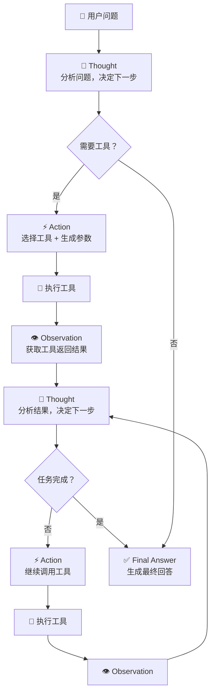
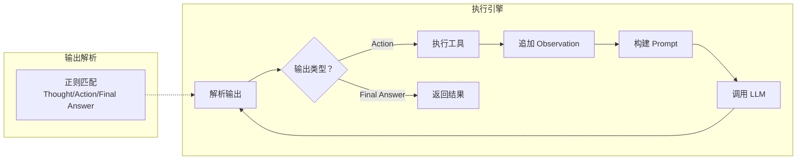

# ReAct 模式

## 概念说明

**ReAct**（Reasoning + Acting）是一种将推理（Thought）和行动（Action）交替进行的 Agent 模式。它由 Yao et al. 在 2022 年提出，核心思想是让 LLM 在每一步先"想"再"做"，通过观察（Observation）工具返回的结果来决定下一步行动。ReAct 是目前最主流的 Agent 设计模式，LangChain Agent 的默认实现就是 ReAct。

### 为什么 ReAct 如此重要？

- **可解释性**：每一步都有 Thought 说明推理过程，方便调试和审计
- **自适应**：根据工具返回结果动态调整策略，而不是预设固定流程
- **通用性**：适用于问答、搜索、数据分析、代码生成等各种任务
- **容错性**：工具调用失败时可以通过推理选择替代方案

### ReAct vs 其他 Agent 模式

| 模式 | 特点 | 优势 | 劣势 |
|------|------|------|------|
| ReAct | 推理-行动交替 | 可解释、灵活 | 步骤多、延迟高 |
| Plan-and-Execute | 先规划后执行 | 全局最优 | 不够灵活 |
| Reflexion | 自我反思改进 | 持续优化 | 成本高 |
| LATS | 树搜索 + 反思 | 探索充分 | 计算量大 |

## 核心原理

### 1. ReAct 循环流程

ReAct 的核心是 Thought → Action → Observation 的循环：



### 2. ReAct Prompt 模板

ReAct 的 Prompt 设计是关键，需要明确定义 Thought/Action/Observation 的格式：

```text
Answer the following questions as best you can. You have access to the following tools:

{tool_descriptions}

Use the following format:

Question: the input question you must answer
Thought: you should always think about what to do
Action: the action to take, should be one of [{tool_names}]
Action Input: the input to the action
Observation: the result of the action
... (this Thought/Action/Action Input/Observation can repeat N times)
Thought: I now know the final answer
Final Answer: the final answer to the original input question

Begin!

Question: {input}
Thought:
```

### 3. ReAct 执行引擎

ReAct 执行引擎的核心逻辑：



### 4. 停止条件设计

ReAct 循环需要明确的停止条件，避免无限循环：

- **Final Answer**：LLM 输出 "Final Answer" 标记，表示任务完成
- **最大步数**：设置 max_iterations（通常 5-10 步），超过则强制停止
- **超时限制**：设置总执行时间上限（如 60 秒）
- **重复检测**：连续两次相同的 Action + Input，说明陷入循环
- **错误累积**：连续 N 次工具调用失败，强制返回已有信息

### 5. ReAct 的变体

**ReAct + Self-Consistency**：多次运行 ReAct，投票选择最佳答案

**ReAct + Reflexion**：在 ReAct 基础上增加反思步骤，从失败中学习

**Structured ReAct**：用 JSON 格式替代文本格式，提高解析可靠性：

```json
{
  "thought": "用户想知道北京天气，我需要调用天气工具",
  "action": "get_weather",
  "action_input": {"city": "北京"}
}
```

## 代码示例

> 💻 完整可运行代码：[code-examples/03-ai-apps/agent/03_react_pattern.py](https://github.com/skyhe58/guide-ai/tree/main/code-examples/03-ai-apps/agent/03_react_pattern.py)
> 🐍 Python 版本：3.11+
> 📦 依赖：标准库（默认模式）

```python
# ReAct 核心循环
class ReActAgent:
    def run(self, question: str, max_steps: int = 10) -> str:
        prompt = self._build_initial_prompt(question)
        for step in range(max_steps):
            response = self.llm.generate(prompt)
            parsed = self._parse_output(response)
            if parsed.type == "final_answer":
                return parsed.content
            observation = self._execute_action(parsed.action, parsed.action_input)
            prompt += f"\nObservation: {observation}\nThought:"
        return "达到最大步数限制，无法完成任务"
```

## 实战要点

**ReAct Prompt 设计：**
- **Thought 引导**：在 Prompt 中强调"先思考再行动"，避免 LLM 跳过推理直接调用工具
- **工具描述精确**：工具的 description 要包含使用场景和限制，帮助 LLM 做出正确选择
- **格式严格**：Thought/Action/Observation 的格式要严格定义，方便正则解析
- **示例驱动**：在 Prompt 中提供 1-2 个完整的 ReAct 示例，帮助 LLM 理解格式
- **错误处理指导**：告诉 LLM 工具失败时应该怎么做（换工具、换参数、直接回答）
- **Final Answer 明确**：明确定义什么时候应该输出 Final Answer

**生产环境优化：**
- **步数控制**：max_iterations 设为 5-8，太多会导致成本和延迟失控
- **流式输出**：每一步的 Thought 实时展示给用户，提升体验
- **中间结果缓存**：相同的 Action + Input 不重复执行
- **并行优化**：当多个 Action 互不依赖时，并行执行
- **降级策略**：ReAct 失败时降级为直接回答（不调用工具）
- **监控指标**：追踪平均步数、工具调用成功率、总延迟、token 消耗

**常见陷阱：**
- LLM 跳过 Thought 直接输出 Action（Prompt 中强调必须先思考）
- 输出格式不规范导致解析失败（用 JSON 格式替代文本格式）
- 工具返回结果太长导致 context 溢出（截断或摘要）
- 陷入无限循环（重复检测 + 最大步数限制）

## 常见面试题

### Q1: 解释 ReAct 模式的工作原理，它和 Chain-of-Thought 有什么区别？

**难度**：⭐⭐⭐ | **频率**：🔥🔥🔥

**答题思路**：定义 ReAct → 核心循环 → 与 CoT 对比

**标准答案**：ReAct 是 Reasoning + Acting 的结合，核心循环是 Thought（推理）→ Action（调用工具）→ Observation（观察结果）→ Thought（继续推理），直到得出最终答案。与 Chain-of-Thought 的区别：CoT 只有推理没有行动，LLM 纯靠内部知识推理；ReAct 在推理的基础上增加了工具调用能力，可以获取外部信息。举例：问"今天北京天气如何"，CoT 只能根据训练数据猜测，ReAct 可以调用天气 API 获取实时数据。ReAct 的优势是可解释性强（每步都有 Thought）、可以访问外部信息、支持动态调整策略。

**深入追问**：
- ReAct 的 Thought 步骤可以省略吗？（不建议，Thought 提升推理质量和可解释性）
- ReAct 如何处理工具调用失败？（在 Thought 中分析失败原因，选择替代方案）
- ReAct 和 Plan-and-Execute 模式的区别？（ReAct 边想边做，P&E 先规划后执行）

### Q2: 如何优化 ReAct Agent 的性能和成本？

**难度**：⭐⭐⭐ | **频率**：🔥🔥

**答题思路**：性能瓶颈 → 优化策略 → 成本控制

**标准答案**：ReAct 的主要瓶颈是多轮 LLM 调用导致的延迟和成本。优化策略：(1) 减少步数——优化 Prompt 让 LLM 更快得出结论，设置合理的 max_iterations；(2) 并行执行——当多个 Action 互不依赖时并行调用工具；(3) 缓存——对相同的工具调用结果做缓存；(4) 模型选择——简单推理用 GPT-3.5，复杂推理用 GPT-4，混合使用；(5) 流式输出——每步实时展示，减少用户感知延迟；(6) 提前终止——检测到 LLM 已有足够信息时提前输出 Final Answer。成本控制：监控每次对话的 token 消耗，设置预算上限。

**深入追问**：
- 如何检测 ReAct 陷入了无限循环？（重复 Action 检测、步数限制、超时）
- ReAct 的 Observation 太长怎么办？（截断、摘要、只保留关键信息）
- 如何评估 ReAct Agent 的质量？（任务完成率、平均步数、准确率、用户满意度）

### Q3: 设计一个支持多工具的 ReAct Agent，需要考虑哪些关键问题？

**难度**：⭐⭐⭐⭐ | **频率**：🔥🔥

**答题思路**：架构设计 → 关键组件 → 异常处理

**标准答案**：关键设计考虑：(1) 工具注册——统一的工具注册中心，支持动态添加/移除工具；(2) Prompt 管理——工具描述要精确，工具数量多时用语义路由筛选相关工具；(3) 输出解析——用结构化格式（JSON）替代文本格式，提高解析可靠性；(4) 执行引擎——支持同步/异步工具执行、超时控制、重试机制；(5) 状态管理——维护对话历史和中间结果，支持断点续传；(6) 安全控制——工具调用权限校验、参数校验、调用频率限制；(7) 可观测性——记录每步的 Thought/Action/Observation，支持 LangSmith 追踪。

**深入追问**：
- 如何实现 ReAct 的断点续传？（序列化中间状态，支持恢复）
- 多用户并发时如何隔离 Agent 状态？（每个会话独立的状态管理）

## 推荐工具

> 📌 以下工具可帮助你更高效地学习和实践本知识点，详见 [模块 7：AI 使用与实践](/7-ai-tools/)

| 工具 | 用途 | 详情 |
|------|------|------|
| Cursor | 辅助编写 ReAct Agent 代码 | [AI 编程辅助](/7-ai-tools/7.1-efficiency/ai-coding) |
| ChatGPT | 交互式测试 ReAct 推理过程 | [AI 对话助手](/7-ai-tools/7.1-efficiency/ai-chat) |
| Perplexity | 搜索 ReAct 论文和最新实践 | [AI 搜索](/7-ai-tools/7.1-efficiency/ai-search) |

## 参考资料

- [ReAct: Synergizing Reasoning and Acting in Language Models (Yao et al., 2022)](https://arxiv.org/abs/2210.03629)
- [LangChain — ReAct Agent](https://python.langchain.com/docs/how_to/agent_executor/)
- [LangGraph — ReAct Agent](https://langchain-ai.github.io/langgraph/how-tos/create-react-agent/)
- [Reflexion: Language Agents with Verbal Reinforcement Learning](https://arxiv.org/abs/2303.11366)
- [LATS: Language Agent Tree Search](https://arxiv.org/abs/2310.04406)
