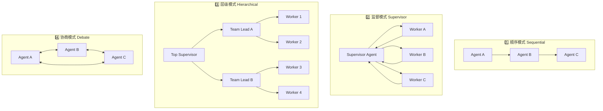
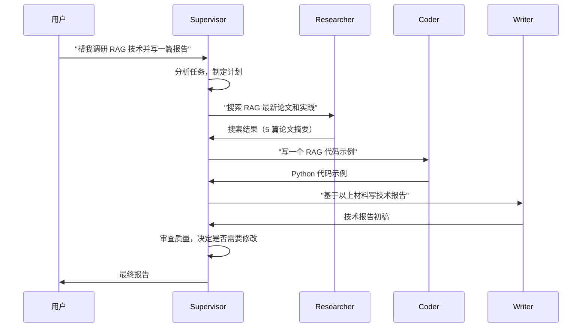
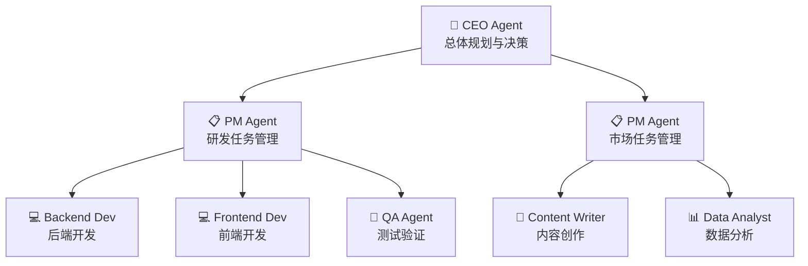

# Multi-Agent 协作

## 概念说明

**Multi-Agent**（多 Agent 协作）是指多个具有不同能力的 AI Agent 协同工作来完成复杂任务。单个 Agent 的能力有限——它可能擅长搜索但不擅长编码，擅长分析但不擅长写作。Multi-Agent 系统通过分工协作，让每个 Agent 专注于自己擅长的领域，就像一个高效的团队。

### 为什么需要 Multi-Agent？

- **能力互补**：不同 Agent 擅长不同任务（搜索、编码、分析、写作）
- **复杂任务分解**：将大任务拆分为子任务，分配给专业 Agent 并行处理
- **质量提升**：通过 Agent 间的审查和反馈，提升输出质量
- **可扩展性**：新增能力只需添加新 Agent，不影响现有系统
- **容错性**：单个 Agent 失败不影响整体，可以由其他 Agent 接管

### Multi-Agent 架构模式总览



## 核心原理

### 1. Supervisor 模式（最常用）

Supervisor 模式是最实用的 Multi-Agent 架构，由一个 Supervisor Agent 负责任务分配和结果汇总：



**Supervisor 的核心职责：**
- 理解用户意图，分解任务
- 选择合适的 Worker Agent
- 传递上下文和中间结果
- 审查 Worker 输出质量
- 决定任务是否完成

### 2. Hierarchical 模式

适合大型复杂任务，多层级的 Agent 组织结构：



### 3. Agent 间通信机制

Agent 之间的通信方式决定了协作效率：

| 通信方式 | 描述 | 优势 | 劣势 |
|----------|------|------|------|
| 直接传递 | Supervisor 直接传递消息 | 简单、可控 | Supervisor 成为瓶颈 |
| 共享状态 | 所有 Agent 读写共享状态 | 灵活、解耦 | 状态冲突风险 |
| 消息队列 | 通过消息队列异步通信 | 可扩展、容错 | 复杂度高 |
| 黑板模式 | 共享黑板，Agent 自主读写 | 松耦合 | 协调困难 |

### 4. 任务分配策略

Supervisor 如何决定将任务分配给哪个 Agent：

- **基于能力匹配**：根据 Agent 的 description 和用户任务做语义匹配
- **基于负载均衡**：将任务分配给当前空闲的 Agent
- **基于历史表现**：优先分配给历史成功率高的 Agent
- **LLM 决策**：让 Supervisor LLM 根据上下文自主决定

### 5. 结果汇总与质量控制

Multi-Agent 的输出质量控制：

- **Supervisor 审查**：Supervisor 检查每个 Worker 的输出质量
- **交叉验证**：让多个 Agent 独立完成同一任务，对比结果
- **迭代改进**：输出不满意时，Supervisor 给出反馈让 Worker 修改
- **投票机制**：多个 Agent 的结果通过投票选择最佳

## 代码示例

> 💻 完整可运行代码：[code-examples/03-ai-apps/agent/04_multi_agent.py](https://github.com/your-repo/tree/main/code-examples/03-ai-apps/agent/04_multi_agent.py)
> 🐍 Python 版本：3.11+
> 📦 依赖：标准库（默认模式）

```python
# Supervisor 模式核心结构
class SupervisorAgent:
    def __init__(self, workers: list[WorkerAgent]):
        self.workers = {w.name: w for w in workers}

    def route(self, task: str) -> str:
        """根据任务内容选择合适的 Worker。"""
        # LLM 决策或规则匹配
        ...

    def run(self, user_request: str) -> str:
        """执行完整的 Multi-Agent 工作流。"""
        plan = self.plan(user_request)
        results = {}
        for step in plan:
            worker = self.workers[step.agent]
            results[step.name] = worker.execute(step.task, context=results)
        return self.summarize(results)
```

## 实战要点

**架构选择：**
- **简单任务**（2-3 个 Agent）：Supervisor 模式，一个 Supervisor + 多个 Worker
- **复杂任务**（5+ Agent）：Hierarchical 模式，多层级管理
- **创意任务**：Debate 模式，多个 Agent 讨论得出最佳方案
- **流水线任务**：Sequential 模式，Agent 按顺序处理

**Supervisor 设计：**
- **Prompt 设计**：Supervisor 的 Prompt 要包含所有 Worker 的能力描述和使用场景
- **任务分解**：将复杂任务分解为原子任务，每个任务由一个 Worker 完成
- **上下文传递**：将前序 Agent 的输出作为后续 Agent 的输入上下文
- **循环控制**：设置最大迭代次数，避免 Agent 间无限来回
- **降级策略**：Worker 失败时 Supervisor 可以自己处理或选择其他 Worker
- **成本预算**：设置每个任务的 token 预算，避免成本失控

**常见陷阱：**
- Agent 数量过多导致协调开销大于收益（建议 3-5 个 Agent）
- Supervisor 成为性能瓶颈（考虑异步并行）
- Agent 间上下文丢失（使用共享状态管理）
- 没有明确的停止条件（设置最大轮次和超时）

## 常见面试题

### Q1: 对比 Multi-Agent 的几种架构模式，各自适用什么场景？

**难度**：⭐⭐⭐ | **频率**：🔥🔥🔥

**答题思路**：列举模式 → 对比优劣 → 场景匹配

**标准答案**：四种主要模式：(1) Sequential（顺序）——Agent 按固定顺序处理，适合流水线任务（文档生成：调研→写作→审校）；(2) Supervisor（监督）——一个 Supervisor 分配任务给 Worker，适合大多数场景，是最实用的模式；(3) Hierarchical（层级）——多层 Supervisor 管理，适合大型复杂项目（软件开发：PM→开发→测试）；(4) Debate（协商）——Agent 间讨论辩论，适合需要多角度分析的创意任务。选择建议：先用 Supervisor 模式，不够用再升级到 Hierarchical。

**深入追问**：
- Supervisor 模式中，Supervisor 本身用什么模型？（通常用最强模型如 GPT-4，Worker 可以用较弱模型）
- 如何处理 Agent 间的冲突？（Supervisor 仲裁、投票机制、优先级规则）
- Multi-Agent 的成本如何控制？（token 预算、模型分级、缓存复用）

### Q2: 如何设计一个 Supervisor Agent 来协调多个 Worker Agent？

**难度**：⭐⭐⭐⭐ | **频率**：🔥🔥

**答题思路**：职责定义 → 核心流程 → 关键设计

**标准答案**：Supervisor 的设计要点：(1) 任务理解——解析用户请求，识别需要哪些能力；(2) 任务分解——将复杂任务拆分为原子子任务，确定执行顺序和依赖关系；(3) Agent 路由——根据子任务类型选择合适的 Worker（基于能力描述的语义匹配）；(4) 上下文管理——将前序 Agent 的输出传递给后续 Agent，维护全局状态；(5) 质量审查——检查每个 Worker 的输出，不满意则要求修改或换 Agent；(6) 结果汇总——将所有 Worker 的输出整合为最终回答。实现上推荐用 LangGraph 的 StateGraph，Supervisor 作为路由节点。

**深入追问**：
- Supervisor 如何判断任务是否完成？（检查所有子任务完成 + 质量达标）
- 如何实现 Worker 的动态注册和发现？（工具注册中心 + 能力描述）
- 如何处理 Worker 超时或失败？（超时重试、降级处理、错误上报）

### Q3: Multi-Agent 系统中如何管理共享状态？

**难度**：⭐⭐⭐ | **频率**：🔥🔥

**答题思路**：状态类型 → 管理方案 → 一致性保证

**标准答案**：共享状态管理方案：(1) 集中式状态——用 TypedDict 或 Pydantic 定义全局状态，所有 Agent 通过 Supervisor 读写，简单但 Supervisor 成为瓶颈；(2) 分布式状态——每个 Agent 维护自己的状态，通过消息传递同步，灵活但一致性难保证；(3) LangGraph StateGraph——推荐方案，用图的状态作为共享存储，每个节点（Agent）可以读写状态的特定字段，框架保证状态一致性；(4) 外部存储——用 Redis/数据库存储状态，支持持久化和多实例共享。关键是定义清晰的状态 schema，明确每个 Agent 可以读写哪些字段。

**深入追问**：
- 如何处理状态冲突？（乐观锁、版本号、最后写入胜出）
- 状态如何持久化以支持断点续传？（序列化到数据库、LangGraph checkpointer）

## 推荐工具

> 📌 以下工具可帮助你更高效地学习和实践本知识点，详见 [模块 7：AI 使用与实践](/7-ai-tools/)

| 工具 | 用途 | 详情 |
|------|------|------|
| Cursor | 辅助编写 Multi-Agent 系统代码 | [AI 编程辅助](/7-ai-tools/7.1-efficiency/ai-coding) |
| ChatGPT | 设计 Agent 协作流程和 Prompt | [AI 对话助手](/7-ai-tools/7.1-efficiency/ai-chat) |
| Perplexity | 搜索 Multi-Agent 最新架构和论文 | [AI 搜索](/7-ai-tools/7.1-efficiency/ai-search) |

## 参考资料

- [LangGraph — Multi-Agent Systems](https://langchain-ai.github.io/langgraph/concepts/multi_agent/)
- [AutoGen — Multi-Agent Conversation](https://microsoft.github.io/autogen/)
- [CrewAI — Multi-Agent Framework](https://www.crewai.com/)
- [MetaGPT — Multi-Agent Meta Programming](https://github.com/geekan/MetaGPT)
- [Generative Agents: Interactive Simulacra of Human Behavior](https://arxiv.org/abs/2304.03442)
