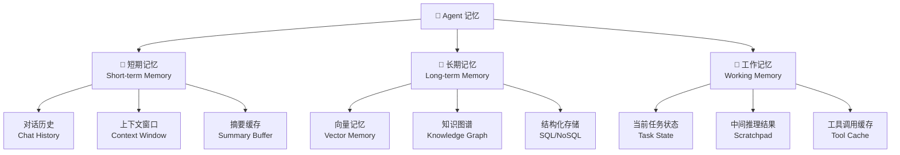
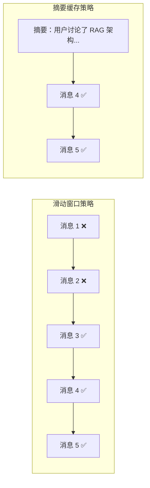
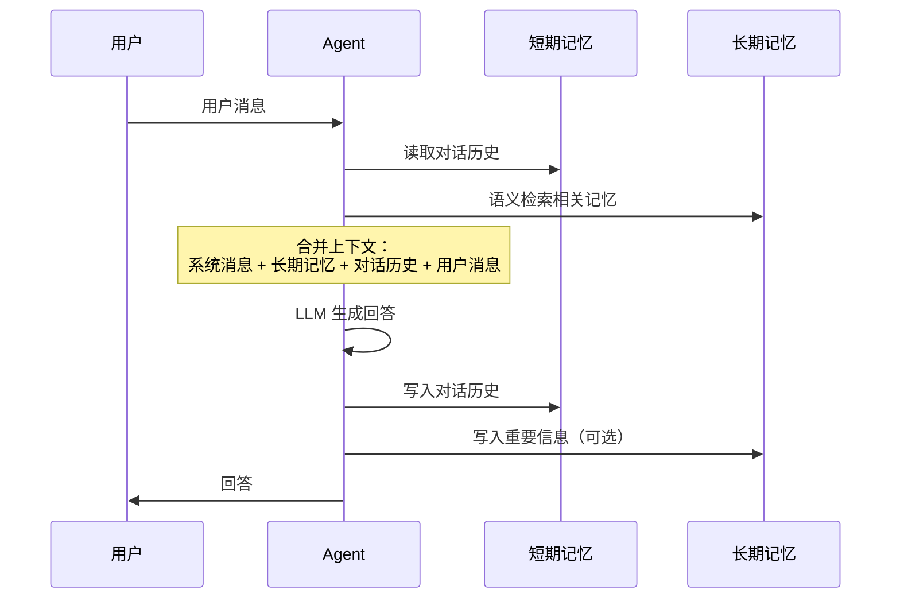

# Agent 记忆

## 概念说明

**Agent Memory**（Agent 记忆）是让 AI Agent 具备"记住"能力的机制。没有记忆的 Agent 每次对话都是从零开始——它不记得你是谁、之前聊了什么、你的偏好是什么。记忆系统让 Agent 能够维护对话上下文、积累知识、个性化服务，是从"工具"进化为"助手"的关键。

### 为什么 Agent 需要记忆？

- **对话连贯性**：记住之前的对话内容，避免重复提问
- **个性化服务**：记住用户偏好、历史行为，提供定制化回答
- **知识积累**：将工具调用结果、学到的知识持久化，避免重复查询
- **任务续传**：长任务中断后可以从上次的进度继续
- **多轮推理**：复杂问题需要多轮对话，记忆保证推理的连续性

### Agent 记忆的分类体系



### 记忆类型对比

| 记忆类型 | 存储位置 | 生命周期 | 容量 | 检索方式 | 典型用途 |
|----------|---------|---------|------|---------|---------|
| 短期记忆 | Context Window | 单次对话 | 有限（128K tokens） | 顺序读取 | 对话上下文 |
| 长期记忆 | 向量数据库/SQL | 跨对话持久 | 无限 | 语义检索 | 用户偏好、历史知识 |
| 工作记忆 | 内存/缓存 | 单次任务 | 中等 | 键值查找 | 任务状态、中间结果 |

## 核心原理

### 1. 短期记忆 — 对话历史管理

短期记忆的核心挑战是 context window 有限，需要策略管理对话历史：

**策略 1：滑动窗口（Window Buffer）**
```
保留最近 K 轮对话，丢弃更早的消息。
优点：简单、可预测
缺点：丢失早期重要信息
```

**策略 2：摘要缓存（Summary Buffer）**
```
当对话超过阈值时，用 LLM 将早期对话压缩为摘要。
优点：保留关键信息，节省 token
缺点：摘要可能丢失细节
```

**策略 3：Token 预算（Token Budget）**
```
设置 token 上限，优先保留最近消息和系统消息。
优点：精确控制成本
缺点：需要 token 计数
```



### 2. 长期记忆 — 向量记忆

向量记忆是最常用的长期记忆方案，将信息编码为向量存储在向量数据库中：

**存储流程：**
1. 将对话/知识文本编码为 embedding 向量
2. 存储到向量数据库（Chroma、FAISS、Pinecone）
3. 附带元数据（时间戳、用户 ID、主题标签）

**检索流程：**
1. 将当前查询编码为 embedding 向量
2. 在向量数据库中做相似度搜索（Top-K）
3. 将检索到的记忆作为上下文注入 Prompt

### 3. 记忆的读写时机



### 4. 记忆的遗忘与更新

不是所有信息都值得记住，需要遗忘机制：

- **时间衰减**：越久远的记忆权重越低，模拟人类遗忘曲线
- **重要性评分**：用 LLM 评估信息的重要性，只保留高分记忆
- **去重合并**：相似的记忆合并为一条，避免冗余
- **容量限制**：设置记忆上限，满时淘汰最不重要的记忆
- **主动遗忘**：用户要求删除特定记忆（隐私合规）

### 5. 知识图谱记忆

除了向量记忆，知识图谱也是一种强大的长期记忆方案：

```
实体：用户张三
关系：偏好 → Python
关系：正在学习 → RAG
关系：使用 → MacBook Pro
关系：工作于 → 某科技公司
```

知识图谱的优势：
- 结构化存储，支持精确查询
- 关系推理（"张三的同事也在学 RAG 吗？"）
- 可解释性强，记忆内容透明

## 代码示例

> 💻 完整可运行代码：[code-examples/03-ai-apps/agent/05_agent_memory.py](https://github.com/skyhe58/guide-ai/tree/main/code-examples/03-ai-apps/agent/05_agent_memory.py)
> 🐍 Python 版本：3.11+
> 📦 依赖：标准库（默认模式）

```python
# 记忆管理核心接口
from abc import ABC, abstractmethod

class BaseMemory(ABC):
    @abstractmethod
    def add(self, content: str, metadata: dict = None) -> None:
        """添加记忆。"""

    @abstractmethod
    def search(self, query: str, top_k: int = 5) -> list[dict]:
        """搜索相关记忆。"""

    @abstractmethod
    def clear(self) -> None:
        """清空记忆。"""
```

## 实战要点

**对话历史管理：**
- **System Message 永远保留**：系统消息定义 Agent 行为，不能被截断
- **最近消息优先**：最近的对话最相关，优先保留
- **摘要压缩**：超过阈值时用 LLM 压缩早期对话为摘要
- **Token 计数**：用 tiktoken 精确计算 token 数，避免超出限制
- **多轮对话标记**：标记每轮对话的边界，方便回溯
- **敏感信息过滤**：对话历史中的密码、密钥等敏感信息要脱敏

**向量记忆优化：**
- **Embedding 模型选择**：text-embedding-3-small 性价比高，BGE-M3 支持中文
- **元数据丰富**：存储时间戳、用户 ID、主题、重要性评分等元数据
- **混合检索**：向量相似度 + 关键词匹配 + 时间衰减的混合排序
- **记忆去重**：相似度超过阈值的记忆合并，避免冗余
- **定期清理**：设置 TTL（生存时间），自动清理过期记忆
- **隐私合规**：支持用户查看和删除自己的记忆数据

**常见陷阱：**
- 对话历史无限增长导致 token 超限（必须设置截断策略）
- 向量记忆检索到不相关内容（优化 embedding 模型和检索策略）
- 记忆写入太频繁导致性能问题（批量写入、异步写入）
- 没有考虑多用户隔离（每个用户独立的记忆空间）

## 常见面试题

### Q1: Agent 的短期记忆和长期记忆有什么区别？如何实现？

**难度**：⭐⭐⭐ | **频率**：🔥🔥🔥

**答题思路**：定义区别 → 实现方案 → 协同工作

**标准答案**：短期记忆存储在 LLM 的 context window 中，生命周期是单次对话，容量受 token 限制（如 128K），通过顺序读取访问，实现方式是维护消息列表（chat history）。长期记忆存储在外部系统（向量数据库、SQL），生命周期跨对话持久化，容量理论上无限，通过语义检索访问，实现方式是将重要信息编码为 embedding 存入向量数据库。两者协同工作：每次对话开始时，从长期记忆中检索与当前话题相关的信息，注入到短期记忆（context）中，对话结束后将重要信息写入长期记忆。

**深入追问**：
- 如何判断哪些信息值得写入长期记忆？（LLM 评分、规则过滤、用户标记）
- 短期记忆满了怎么办？（滑动窗口、摘要压缩、Token 预算）
- 长期记忆的检索准确率如何提升？（混合检索、Rerank、元数据过滤）

### Q2: 如何设计一个支持多用户的 Agent 记忆系统？

**难度**：⭐⭐⭐⭐ | **频率**：🔥🔥

**答题思路**：需求分析 → 架构设计 → 关键技术

**标准答案**：多用户记忆系统设计：(1) 用户隔离——每个用户独立的记忆空间，用 user_id 做命名空间隔离，向量数据库用 collection 或 metadata filter 区分；(2) 会话管理——每个用户可以有多个会话（session），每个会话有独立的短期记忆；(3) 记忆层级——用户级记忆（偏好、画像）+ 会话级记忆（对话历史）+ 全局记忆（公共知识）；(4) 存储方案——短期记忆用 Redis（快速读写），长期记忆用向量数据库 + PostgreSQL（持久化）；(5) 隐私合规——支持用户查看、导出、删除自己的记忆，符合 GDPR 要求。

**深入追问**：
- 如何实现记忆的跨设备同步？（服务端存储 + 会话 ID 关联）
- 记忆系统如何做水平扩展？（分片存储、读写分离）
- 如何防止记忆污染（用户故意注入错误信息）？（可信度评分、来源追踪）

### Q3: 对话历史太长超出 context window 怎么办？

**难度**：⭐⭐⭐ | **频率**：🔥🔥🔥

**答题思路**：问题分析 → 解决方案 → 方案对比

**标准答案**：三种主要方案：(1) 滑动窗口——只保留最近 K 轮对话，简单但丢失早期信息；(2) 摘要压缩——用 LLM 将早期对话压缩为摘要，保留关键信息但有摘要成本；(3) 语义检索——将所有对话存入向量数据库，每次只检索与当前话题最相关的历史消息。生产环境推荐组合方案：系统消息（永远保留）+ 长期记忆检索结果 + 近期对话摘要 + 最近 3-5 轮完整对话。这样既保证了上下文连贯性，又控制了 token 消耗。

**深入追问**：
- 摘要压缩会丢失哪些信息？如何缓解？（关键实体提取 + 摘要 + 原文索引）
- 如何精确计算对话历史的 token 数？（tiktoken 库，按模型选择编码器）

## 推荐工具

> 📌 以下工具可帮助你更高效地学习和实践本知识点，详见 [模块 7：AI 使用与实践](/7-ai-tools/)

| 工具 | 用途 | 详情 |
|------|------|------|
| Cursor | 辅助编写记忆管理和向量存储代码 | [AI 编程辅助](/7-ai-tools/7.1-efficiency/ai-coding) |
| ChatGPT | 测试不同记忆策略的效果 | [AI 对话助手](/7-ai-tools/7.1-efficiency/ai-chat) |
| Perplexity | 搜索 Agent Memory 最新研究 | [AI 搜索](/7-ai-tools/7.1-efficiency/ai-search) |

## 参考资料

- [LangChain — Memory](https://python.langchain.com/docs/concepts/memory/)
- [LangGraph — Persistence](https://langchain-ai.github.io/langgraph/concepts/persistence/)
- [Mem0 — Memory Layer for AI](https://github.com/mem0ai/mem0)
- [Generative Agents: Interactive Simulacra of Human Behavior](https://arxiv.org/abs/2304.03442)
- [MemGPT: Towards LLMs as Operating Systems](https://arxiv.org/abs/2310.08560)
