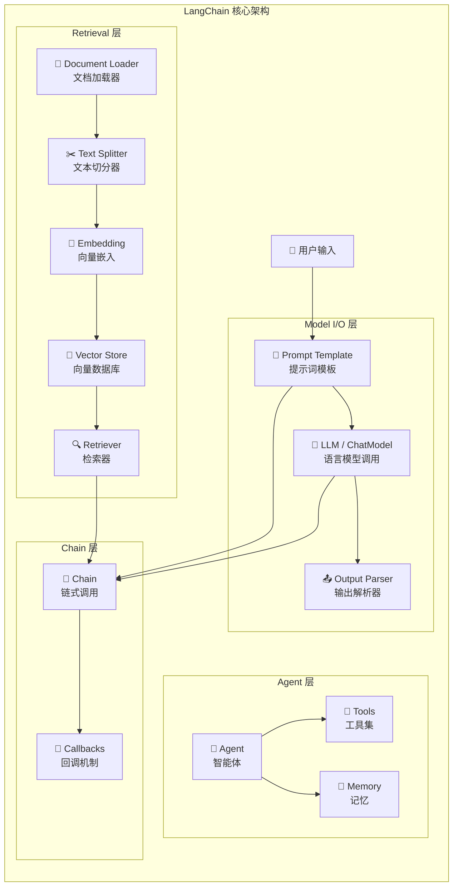
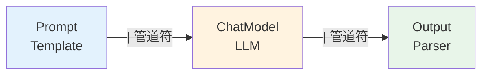
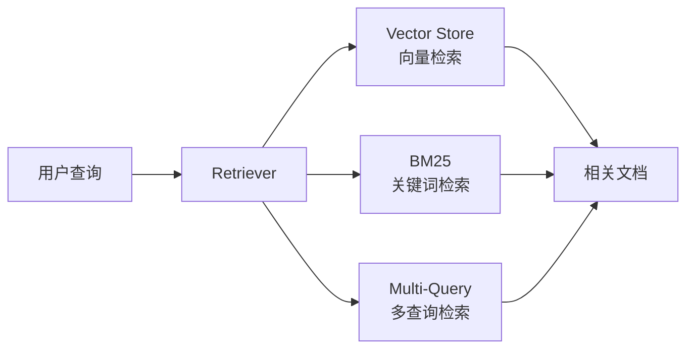

# LangChain

## 概念说明

**LangChain** 是目前最流行的 LLM 应用开发框架，提供了一套标准化的组件和接口，帮助开发者快速构建基于大语言模型的应用。它的核心理念是"链式调用"——将 Prompt 构建、LLM 调用、输出解析、记忆管理等步骤串联成可复用的链（Chain），大幅降低 LLM 应用的开发复杂度。

### 为什么需要 LangChain？

- **标准化接口**：统一不同 LLM 提供商（OpenAI、Anthropic、Ollama）的调用方式
- **组件复用**：Prompt Template、Output Parser、Memory 等组件可自由组合
- **生态丰富**：内置 700+ 集成（向量数据库、文档加载器、工具等）
- **快速原型**：几十行代码即可搭建 RAG、Agent 等复杂应用
- **社区活跃**：GitHub 90K+ Star，文档完善，问题响应快

### LangChain 核心架构



## 核心原理

### 1. Prompt Template — 提示词模板

Prompt Template 将提示词参数化，支持变量插入和格式控制：

```python
# 基础模板
template = "请用{language}解释{concept}的核心原理"
# 渲染后: "请用中文解释RAG的核心原理"

# ChatPromptTemplate 支持多角色消息
messages = [
    ("system", "你是一个{role}专家"),
    ("human", "{question}"),
]
```

**模板类型对比：**

| 模板类型 | 适用场景 | 特点 |
|---------|---------|------|
| PromptTemplate | 简单文本补全 | 单字符串模板 |
| ChatPromptTemplate | 对话模型 | 支持 system/human/ai 角色 |
| FewShotPromptTemplate | Few-shot 学习 | 动态插入示例 |
| PipelinePromptTemplate | 复杂 Prompt | 多模板组合 |

### 2. Output Parser — 输出解析器

将 LLM 的自由文本输出解析为结构化数据：

```
LLM 输出: "名称: RAG\n类型: 架构模式\n难度: 中级"
    ↓ Output Parser
Python 对象: {"name": "RAG", "type": "架构模式", "difficulty": "中级"}
```

常用 Parser：`StrOutputParser`（纯文本）、`JsonOutputParser`（JSON）、`PydanticOutputParser`（Pydantic 模型）、`CommaSeparatedListOutputParser`（列表）。

### 3. Chain — 链式调用（LCEL）

LangChain Expression Language（LCEL）是 LangChain v0.2+ 推荐的链式调用方式：



LCEL 的核心优势：
- **流式输出**：天然支持 streaming
- **异步调用**：自动支持 async/await
- **批量处理**：内置 batch 方法
- **可观测性**：与 LangSmith 无缝集成

### 4. Memory — 记忆管理

LangChain 提供多种记忆策略：

| 记忆类型 | 原理 | 适用场景 |
|---------|------|---------|
| ConversationBufferMemory | 保存完整对话历史 | 短对话 |
| ConversationBufferWindowMemory | 滑动窗口，保留最近 K 轮 | 中等长度对话 |
| ConversationSummaryMemory | LLM 压缩历史为摘要 | 长对话 |
| ConversationTokenBufferMemory | 按 token 数截断 | 精确控制成本 |
| VectorStoreRetrieverMemory | 向量检索相关记忆 | 跨会话长期记忆 |

### 5. Retriever — 检索器

Retriever 是 RAG 的核心组件，负责从知识库中检索相关文档：



### 6. Agent — 智能体

LangChain Agent 让 LLM 自主决定使用哪些工具：

```
用户: "北京今天天气怎么样？"
Agent 思考: 需要查询天气 → 选择 weather_tool → 调用 API → 格式化结果
```

### 7. Callbacks — 回调机制

回调系统提供链路执行的全生命周期钩子：

| 回调事件 | 触发时机 | 用途 |
|---------|---------|------|
| on_llm_start | LLM 调用开始 | 记录输入 |
| on_llm_end | LLM 调用结束 | 记录输出和耗时 |
| on_chain_start | Chain 开始执行 | 追踪链路 |
| on_chain_error | Chain 执行出错 | 错误告警 |
| on_tool_start | 工具调用开始 | 审计日志 |

## 代码示例

> 💻 完整可运行代码：[code-examples/03-ai-apps/frameworks/01_langchain_basics.py](https://github.com/your-repo/tree/main/code-examples/03-ai-apps/frameworks/01_langchain_basics.py)
> 🐍 Python 版本：3.11+
> 📦 依赖：标准库（默认模式）

```python
# LCEL 链式调用核心模式
prompt = ChatPromptTemplate.from_messages([
    ("system", "你是一个{role}专家"),
    ("human", "{question}"),
])
chain = prompt | llm | StrOutputParser()
result = chain.invoke({"role": "AI", "question": "什么是RAG？"})
```

## 实战要点

**版本选择：**
- LangChain v0.2+ 推荐使用 LCEL（LangChain Expression Language）
- 旧版 `LLMChain`、`SequentialChain` 已废弃，迁移到 LCEL
- `langchain-core` 是核心包，`langchain-community` 是社区集成

**性能优化：**
- 使用 `chain.astream()` 实现流式输出，提升用户体验
- 批量处理用 `chain.batch(inputs)`，自动并发
- 缓存 LLM 调用结果，避免重复请求（`SQLiteCache`、`RedisCache`）

**常见陷阱：**
- LangChain 版本迭代快，API 经常变更，锁定版本号
- 不要过度封装——简单场景直接调 API 比用 LangChain 更清晰
- Memory 组件在 v0.2+ 中变化较大，推荐用 LangGraph 管理状态

## 常见面试题

### Q1: LangChain 的 LCEL 是什么？相比旧版 Chain 有什么优势？

**难度**：⭐⭐⭐ | **频率**：🔥🔥🔥

**答题思路**：定义 LCEL → 核心语法 → 优势对比

**标准答案**：LCEL（LangChain Expression Language）是 LangChain v0.2+ 推荐的链式调用方式，使用 `|` 管道符将组件串联。核心优势：(1) 天然支持流式输出（streaming），无需额外配置；(2) 自动支持异步调用（async/await）；(3) 内置批量处理（batch）和并发控制；(4) 与 LangSmith 无缝集成，自动追踪每个步骤；(5) 类型安全，支持 Pydantic 输入输出校验。相比旧版 `LLMChain`，LCEL 更灵活、更高效、更易调试。

**深入追问**：
- LCEL 的 `|` 管道符底层是如何实现的？（`__or__` 运算符重载，返回 `RunnableSequence`）
- 如何在 LCEL 中实现条件分支？（`RunnableBranch` 或 `RunnableLambda`）

### Q2: LangChain 的 Memory 有哪些类型？生产环境推荐哪种？

**难度**：⭐⭐⭐ | **频率**：🔥🔥

**答题思路**：列举类型 → 对比优缺点 → 生产推荐

**标准答案**：LangChain 提供五种主要 Memory：BufferMemory（完整历史）、WindowMemory（滑动窗口）、SummaryMemory（摘要压缩）、TokenBufferMemory（Token 预算）、VectorStoreMemory（向量检索）。生产环境推荐组合方案：短期用 WindowMemory 保留最近 5-10 轮，长期用 VectorStoreMemory 持久化重要信息。但 LangChain v0.2+ 推荐迁移到 LangGraph 的状态管理，更灵活且支持持久化。

**深入追问**：
- SummaryMemory 的摘要质量如何保证？（选择强模型做摘要、设置摘要模板）
- 多用户场景下 Memory 如何隔离？（按 session_id 或 user_id 分区）

### Q3: LangChain 的 Callback 机制有什么用？如何自定义？

**难度**：⭐⭐⭐⭐ | **频率**：🔥🔥

**答题思路**：用途说明 → 内置回调 → 自定义方法

**标准答案**：Callback 机制提供链路执行的全生命周期钩子，用于日志记录、性能监控、成本追踪和错误告警。内置回调包括 `StdOutCallbackHandler`（控制台输出）和 `LangSmithCallbackHandler`（追踪平台）。自定义回调需继承 `BaseCallbackHandler`，实现 `on_llm_start`、`on_llm_end`、`on_chain_error` 等方法。生产环境常用于：记录每次 LLM 调用的 token 消耗和延迟、异常时发送告警、审计日志合规。

**深入追问**：
- 回调是同步还是异步执行？（默认同步，可用 `AsyncCallbackHandler` 异步执行）
- 如何用 Callback 实现 token 成本统计？（在 `on_llm_end` 中累加 `token_usage`）

## 推荐工具

> 📌 以下工具可帮助你更高效地学习和实践本知识点，详见 [模块 7：AI 使用与实践](/7-ai-tools/)

| 工具 | 用途 | 详情 |
|------|------|------|
| Cursor | 辅助编写 LangChain 应用代码 | [AI 编程辅助](/7-ai-tools/7.1-efficiency/ai-coding) |
| ChatGPT | 快速理解 LangChain 概念和调试 | [AI 对话助手](/7-ai-tools/7.1-efficiency/ai-chat) |
| Perplexity | 搜索 LangChain 最新版本变更 | [AI 搜索](/7-ai-tools/7.1-efficiency/ai-search) |

## 参考资料

- [LangChain 官方文档](https://python.langchain.com/docs/)
- [LangChain Expression Language (LCEL)](https://python.langchain.com/docs/concepts/lcel/)
- [LangChain GitHub](https://github.com/langchain-ai/langchain)
- [LangChain Cookbook](https://python.langchain.com/docs/how_to/)
- [Build a RAG App — LangChain Tutorial](https://python.langchain.com/docs/tutorials/rag/)
