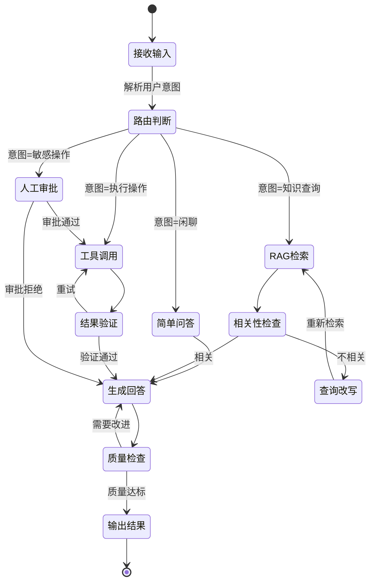
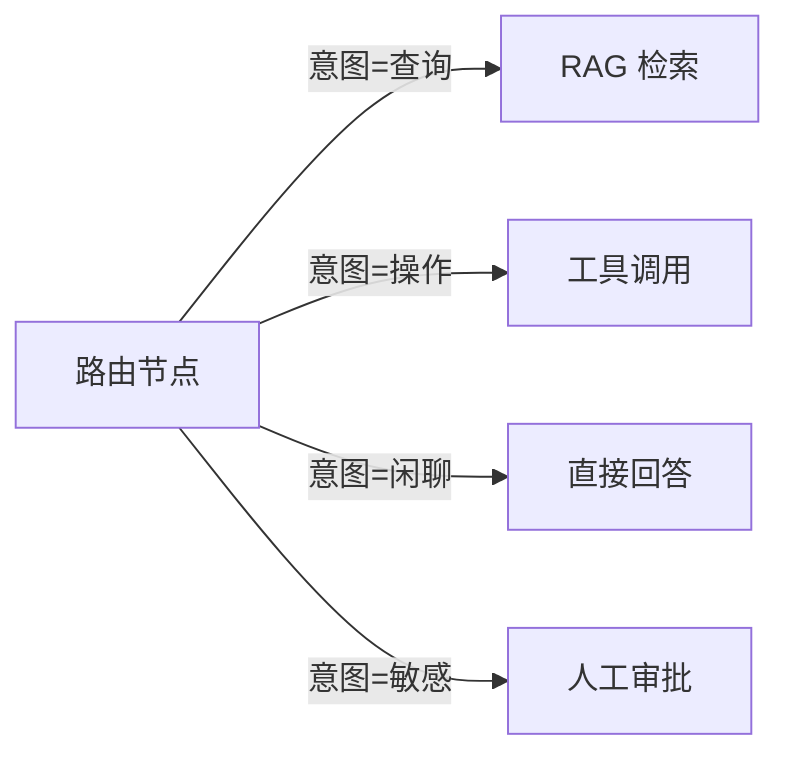
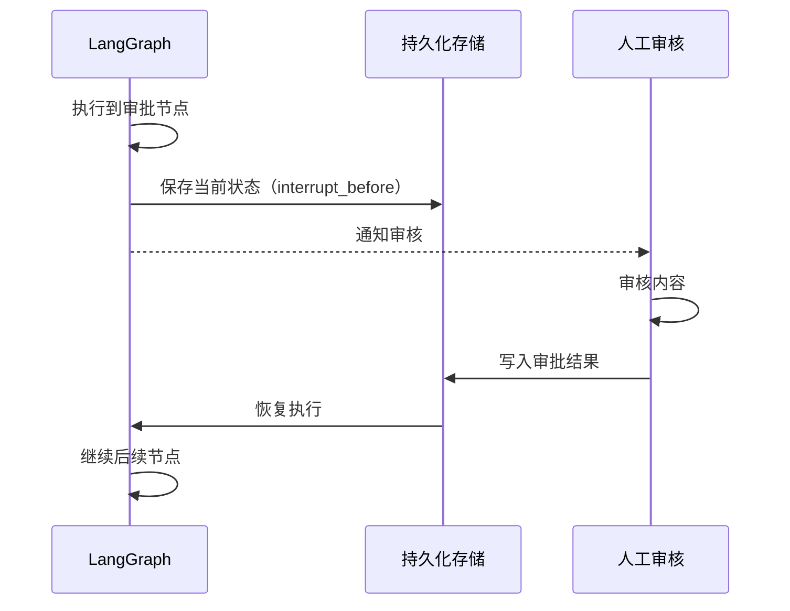

# LangGraph

## 概念说明

**LangGraph** 是 LangChain 团队推出的图状态机框架，专门用于构建复杂的、有状态的多步骤 LLM 应用。与 LangChain 的线性 Chain 不同，LangGraph 将工作流建模为**有向图**——节点（Node）执行具体操作，边（Edge）定义流转逻辑，状态（State）在节点间传递和更新。

### 为什么需要 LangGraph？

LangChain 的 Chain 适合线性流程，但现实中的 AI 应用往往需要：

- **条件分支**：根据 LLM 输出决定下一步操作
- **循环迭代**：Agent 反复推理直到满足条件
- **人机协作**：关键步骤需要人工审批
- **状态持久化**：长任务中断后可恢复
- **并行执行**：多个节点同时处理

LangGraph 用图结构天然支持这些场景。

### LangGraph 核心状态机



## 核心原理

### 1. State — 状态定义

State 是 LangGraph 的核心，定义了在节点间传递的数据结构：

```python
from typing import TypedDict, Annotated
from langgraph.graph.message import add_messages

class AgentState(TypedDict):
    messages: Annotated[list, add_messages]  # 对话消息（自动追加）
    current_step: str                         # 当前步骤
    context: list[str]                        # 检索到的上下文
    tool_results: dict                        # 工具调用结果
    retry_count: int                          # 重试次数
```

`Annotated` + `add_messages` 是 LangGraph 的 reducer 机制——多个节点写入同一字段时，自动合并而非覆盖。

### 2. Node — 节点

节点是图中的执行单元，接收 State 并返回更新后的 State：

```python
def retrieve_node(state: AgentState) -> dict:
    """检索节点：从向量数据库检索相关文档。"""
    query = state["messages"][-1].content
    docs = vector_store.similarity_search(query, k=3)
    return {"context": [doc.page_content for doc in docs]}
```

### 3. Edge — 边（条件路由）

边定义节点间的流转逻辑，条件边根据 State 动态选择下一个节点：



### 4. Human-in-the-Loop — 人机协作

LangGraph 原生支持人工介入，关键步骤可暂停等待人工审批：

**工作流程：**
1. 图执行到"人工审批"节点时暂停
2. 将当前状态持久化到数据库
3. 通知人工审核（邮件/Slack/Web UI）
4. 人工审批后，从暂停点恢复执行



### 5. Persistence — 持久化

LangGraph 支持将图的执行状态持久化，实现：

| 持久化场景 | 实现方式 | 用途 |
|-----------|---------|------|
| 会话记忆 | `MemorySaver` | 开发调试 |
| 生产持久化 | `SqliteSaver` / `PostgresSaver` | 长任务恢复 |
| 检查点 | `Checkpointer` | 任意步骤回溯 |
| 跨会话 | `thread_id` 隔离 | 多用户并发 |

### 6. Subgraph — 子图

复杂工作流可拆分为多个子图，每个子图独立管理自己的状态：

```
主图
├── 意图识别子图
├── RAG 检索子图
│   ├── 查询改写节点
│   ├── 向量检索节点
│   └── Rerank 节点
├── Agent 执行子图
│   ├── 工具选择节点
│   ├── 工具调用节点
│   └── 结果验证节点
└── 输出生成子图
```

子图的优势：模块化开发、独立测试、状态隔离、团队协作。

## 代码示例

> 💻 完整可运行代码：[code-examples/03-ai-apps/frameworks/02_langgraph_workflow.py](https://github.com/your-repo/tree/main/code-examples/03-ai-apps/frameworks/02_langgraph_workflow.py)
> 🐍 Python 版本：3.11+
> 📦 依赖：标准库（默认模式）

```python
# LangGraph 核心构建模式
from langgraph.graph import StateGraph, END

graph = StateGraph(AgentState)
graph.add_node("retrieve", retrieve_node)
graph.add_node("generate", generate_node)
graph.add_conditional_edges("route", route_function, {
    "query": "retrieve",
    "chat": "generate",
})
graph.set_entry_point("route")
app = graph.compile()
```

## 实战要点

**图设计原则：**
- **单一职责**：每个节点只做一件事，保持简单
- **状态最小化**：State 只包含必要字段，避免膨胀
- **错误处理**：每个节点都要处理异常，避免图中断
- **超时控制**：设置节点执行超时，防止无限等待
- **循环保护**：条件路由必须设置最大重试次数

**与 LangChain 的关系：**
- LangGraph 是 LangChain 生态的一部分，可以直接使用 LangChain 的组件
- 简单线性流程用 LCEL，复杂有状态流程用 LangGraph
- LangGraph 的节点内部可以调用 LCEL Chain

**生产部署：**
- 使用 `LangGraph Platform` 或 `LangServe` 部署为 API
- 持久化用 PostgreSQL，支持高并发
- 配合 LangSmith 做全链路追踪

## 常见面试题

### Q1: LangGraph 和 LangChain 的 LCEL 有什么区别？什么时候用哪个？

**难度**：⭐⭐⭐ | **频率**：🔥🔥🔥

**答题思路**：核心区别 → 适用场景 → 选型建议

**标准答案**：LCEL 是线性管道，适合 `Prompt → LLM → Parser` 这类顺序执行的场景，简单高效。LangGraph 是图状态机，支持条件分支、循环迭代、人机协作和状态持久化，适合复杂的多步骤工作流。选型建议：简单的 RAG 问答用 LCEL；需要条件路由、重试逻辑、人工审批的 Agent 应用用 LangGraph；Multi-Agent 协作必须用 LangGraph。两者可以混用——LangGraph 节点内部调用 LCEL Chain。

**深入追问**：
- LangGraph 的状态持久化是如何实现的？（Checkpointer 接口 + 序列化 State）
- LangGraph 如何处理并发节点？（`fan-out` 模式，多节点并行执行后 `fan-in` 合并）

### Q2: 如何用 LangGraph 实现 Human-in-the-Loop？

**难度**：⭐⭐⭐⭐ | **频率**：🔥🔥

**答题思路**：场景说明 → 实现方式 → 恢复机制

**标准答案**：LangGraph 通过 `interrupt_before` 或 `interrupt_after` 参数实现人机协作。在编译图时指定需要人工审批的节点，图执行到该节点时自动暂停，将当前 State 持久化到 Checkpointer。人工审核后，通过 `graph.update_state(thread_id, new_state)` 更新状态，再调用 `graph.invoke(None, config)` 从暂停点恢复执行。生产环境中，暂停通知可通过 Webhook 发送到 Slack/邮件，审批结果通过 API 写回。

**深入追问**：
- 如果人工长时间不审批怎么办？（设置超时自动拒绝或升级）
- 如何实现多级审批？（串联多个 interrupt 节点）

### Q3: LangGraph 的 State 设计有什么最佳实践？

**难度**：⭐⭐⭐ | **频率**：🔥🔥

**答题思路**：设计原则 → Reducer 机制 → 常见模式

**标准答案**：State 设计最佳实践：(1) 使用 `TypedDict` 定义类型安全的 State；(2) 消息字段用 `Annotated[list, add_messages]` 自动追加而非覆盖；(3) 只包含必要字段，避免 State 膨胀影响序列化性能；(4) 区分"累积字段"（如 messages，用 reducer 追加）和"覆盖字段"（如 current_step，直接覆盖）；(5) 敏感信息不放 State，避免持久化泄露；(6) 复杂嵌套数据用 Pydantic 模型验证。

**深入追问**：
- Reducer 是什么？如何自定义？（合并策略函数，如 `add_messages` 追加消息列表）
- State 太大导致性能问题怎么办？（精简字段、压缩存储、分层 State）

## 推荐工具

> 📌 以下工具可帮助你更高效地学习和实践本知识点，详见 [模块 7：AI 使用与实践](/7-ai-tools/)

| 工具 | 用途 | 详情 |
|------|------|------|
| Cursor | 辅助编写 LangGraph 状态机代码 | [AI 编程辅助](/7-ai-tools/7.1-efficiency/ai-coding) |
| ChatGPT | 交互式设计工作流逻辑 | [AI 对话助手](/7-ai-tools/7.1-efficiency/ai-chat) |
| Perplexity | 搜索 LangGraph 最新特性 | [AI 搜索](/7-ai-tools/7.1-efficiency/ai-search) |

## 参考资料

- [LangGraph 官方文档](https://langchain-ai.github.io/langgraph/)
- [LangGraph — Concepts](https://langchain-ai.github.io/langgraph/concepts/)
- [LangGraph GitHub](https://github.com/langchain-ai/langgraph)
- [Build an Agent with LangGraph](https://langchain-ai.github.io/langgraph/tutorials/introduction/)
- [Human-in-the-Loop — LangGraph](https://langchain-ai.github.io/langgraph/concepts/human_in_the_loop/)
