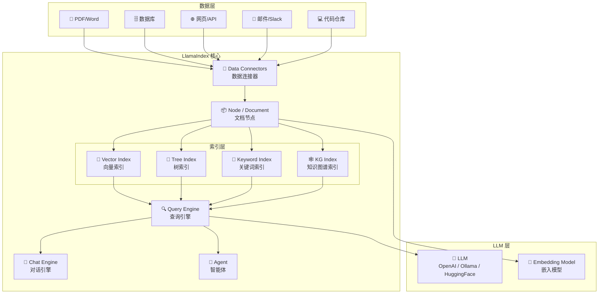
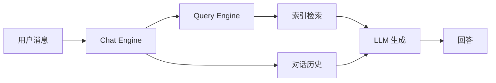

# LlamaIndex

## 概念说明

**LlamaIndex**（原名 GPT Index）是一个专注于**数据连接和索引**的 LLM 应用框架。如果说 LangChain 是"LLM 应用的瑞士军刀"，那 LlamaIndex 就是"数据到 LLM 的高速公路"——它的核心优势在于将各种数据源（PDF、数据库、API、网页）高效地连接到 LLM，并通过多种索引结构优化检索质量。

### LlamaIndex vs LangChain 定位差异

| 维度 | LlamaIndex | LangChain |
|------|-----------|-----------|
| 核心定位 | 数据索引与检索 | LLM 应用全栈框架 |
| 擅长场景 | RAG、知识库、文档问答 | Agent、Chain、多种 LLM 应用 |
| 数据连接 | 160+ 数据连接器（LlamaHub） | 文档加载器较少 |
| 索引能力 | 多种索引类型（向量/树/关键词/知识图谱） | 主要依赖向量索引 |
| 查询优化 | 内置查询改写、路由、子问题分解 | 需要手动实现 |
| Agent 能力 | 基础 Agent 支持 | 强大的 Agent 生态 |
| 学习曲线 | 较平缓，API 简洁 | 较陡峭，概念多 |

### LlamaIndex 架构概览



## 核心原理

### 1. Data Connectors — 数据连接器

LlamaIndex 通过 LlamaHub 提供 160+ 数据连接器：

| 数据源类型 | 连接器示例 | 说明 |
|-----------|-----------|------|
| 文件 | SimpleDirectoryReader | PDF、Markdown、TXT、DOCX |
| 数据库 | DatabaseReader | MySQL、PostgreSQL、SQLite |
| 网页 | BeautifulSoupWebReader | 网页抓取和解析 |
| API | NotionReader、SlackReader | SaaS 服务集成 |
| 代码 | GithubRepositoryReader | 代码仓库索引 |
| 知识库 | ConfluenceReader | 企业知识库 |

### 2. Node 与 Document

LlamaIndex 将数据抽象为两层：

- **Document**：原始文档，包含文本和元数据
- **Node**：Document 切分后的片段，是索引和检索的基本单位

```
Document (一篇 PDF)
├── Node 1 (第 1-2 段)
├── Node 2 (第 3-4 段)
├── Node 3 (第 5-6 段)
└── Node 4 (第 7-8 段)
```

Node 之间可以建立关系（前后关系、父子关系），支持上下文感知的检索。

### 3. Index Types — 索引类型

LlamaIndex 的核心优势是多种索引类型：

| 索引类型 | 原理 | 适用场景 | 查询方式 |
|---------|------|---------|---------|
| VectorStoreIndex | 向量相似度检索 | 通用语义搜索 | Top-K 相似度 |
| TreeIndex | 树状层级摘要 | 长文档摘要 | 自顶向下遍历 |
| KeywordTableIndex | 关键词倒排索引 | 精确关键词匹配 | 关键词提取 |
| KnowledgeGraphIndex | 知识图谱三元组 | 实体关系查询 | 图遍历 |
| SummaryIndex | 全文档摘要 | 文档级问答 | 顺序扫描 |

### 4. Query Engine — 查询引擎

查询引擎是 LlamaIndex 的核心接口，支持多种查询模式：

**基础查询：**
```python
query_engine = index.as_query_engine()
response = query_engine.query("什么是 RAG？")
```

**高级查询模式：**

| 查询模式 | 说明 | 适用场景 |
|---------|------|---------|
| 基础查询 | 直接检索 + 生成 | 简单问答 |
| 子问题分解 | 将复杂问题拆分为子问题 | 多文档对比 |
| 路由查询 | 根据问题类型选择索引 | 多索引混合 |
| 查询改写 | 优化查询表述 | 提升检索质量 |
| 引用查询 | 回答附带来源引用 | 需要溯源 |

### 5. Chat Engine — 对话引擎

Chat Engine 在 Query Engine 基础上增加了对话历史管理：



对话模式：`condense_question`（将多轮对话压缩为单个查询）、`context`（将检索上下文注入对话）、`react`（ReAct Agent 模式）。

### 6. 与 LangChain 集成

LlamaIndex 可以作为 LangChain 的 Retriever 使用：

```python
# LlamaIndex 索引作为 LangChain Retriever
from llama_index.core import VectorStoreIndex
index = VectorStoreIndex.from_documents(documents)
retriever = index.as_retriever()

# 在 LangChain 中使用
from langchain.chains import RetrievalQA
qa_chain = RetrievalQA.from_chain_type(llm=llm, retriever=retriever)
```

## 代码示例

> 💻 完整可运行代码：[code-examples/03-ai-apps/frameworks/03_llamaindex_basics.py](https://github.com/your-repo/tree/main/code-examples/03-ai-apps/frameworks/03_llamaindex_basics.py)
> 🐍 Python 版本：3.11+
> 📦 依赖：标准库（默认模式）

```python
# LlamaIndex 核心使用模式
from llama_index.core import VectorStoreIndex, SimpleDirectoryReader

documents = SimpleDirectoryReader("data/").load_data()
index = VectorStoreIndex.from_documents(documents)
query_engine = index.as_query_engine()
response = query_engine.query("什么是 RAG？")
```

## 实战要点

**索引选型：**
- 90% 的场景用 `VectorStoreIndex` 就够了
- 长文档摘要用 `TreeIndex`，精确匹配用 `KeywordTableIndex`
- 多索引可以用 `RouterQueryEngine` 自动路由

**性能优化：**
- 使用 `StorageContext` 持久化索引，避免每次重建
- 大规模数据用 `IngestionPipeline` 批量处理
- Embedding 缓存避免重复计算

**版本注意：**
- LlamaIndex v0.10+ 拆分为 `llama-index-core` + 集成包
- 旧版 `from llama_index import ...` 改为 `from llama_index.core import ...`
- LlamaHub 连接器需要单独安装

## 常见面试题

### Q1: LlamaIndex 有哪些索引类型？各自适用什么场景？

**难度**：⭐⭐⭐ | **频率**：🔥🔥

**答题思路**：列举索引类型 → 原理说明 → 场景匹配

**标准答案**：LlamaIndex 提供五种主要索引：(1) VectorStoreIndex——向量相似度检索，适合通用语义搜索，是最常用的索引类型；(2) TreeIndex——树状层级摘要，适合长文档摘要和层级问答；(3) KeywordTableIndex——关键词倒排索引，适合精确关键词匹配；(4) KnowledgeGraphIndex——知识图谱三元组，适合实体关系查询；(5) SummaryIndex——全文档顺序扫描，适合需要完整上下文的问答。实际项目中 90% 用 VectorStoreIndex，复杂场景用 RouterQueryEngine 组合多种索引。

**深入追问**：
- TreeIndex 的构建过程是怎样的？（自底向上，叶子节点是原始文本，父节点是 LLM 生成的摘要）
- 如何组合多种索引？（ComposableGraph 或 RouterQueryEngine）

### Q2: LlamaIndex 和 LangChain 在 RAG 场景下如何选择？

**难度**：⭐⭐⭐ | **频率**：🔥🔥🔥

**答题思路**：定位差异 → 各自优势 → 选型建议

**标准答案**：LlamaIndex 专注数据索引和检索，提供更丰富的索引类型和查询优化（子问题分解、路由查询、引用追踪），数据连接器生态更丰富（160+），API 更简洁。LangChain 是全栈框架，Agent 和 Chain 能力更强，生态更广。选型建议：纯 RAG 知识库用 LlamaIndex 更高效；需要 Agent + RAG + 工具调用的复杂应用用 LangChain/LangGraph；两者可以集成——LlamaIndex 做索引和检索，LangChain 做编排和 Agent。

**深入追问**：
- LlamaIndex 的 Query Engine 和 LangChain 的 Retriever 有什么区别？
- 如何将 LlamaIndex 索引集成到 LangChain Chain 中？

### Q3: LlamaIndex 的 Node 和 Document 有什么区别？

**难度**：⭐⭐ | **频率**：🔥🔥

**答题思路**：概念区分 → 关系说明 → 实际意义

**标准答案**：Document 是原始文档的抽象，包含完整文本和元数据（文件名、创建时间等）。Node 是 Document 切分后的片段，是索引和检索的基本单位。一个 Document 会被切分为多个 Node，Node 之间可以建立关系（前后关系、父子关系）。Node 的关系信息让检索更智能——检索到某个 Node 后，可以自动获取其前后文 Node 提供更完整的上下文。这是 LlamaIndex 相比简单向量检索的优势之一。

**深入追问**：
- Node 的关系信息如何影响检索质量？（上下文窗口扩展、父子节点回溯）
- 如何自定义 Node 的切分策略？（NodeParser、SentenceSplitter、SemanticSplitter）

## 推荐工具

> 📌 以下工具可帮助你更高效地学习和实践本知识点，详见 [模块 7：AI 使用与实践](/7-ai-tools/)

| 工具 | 用途 | 详情 |
|------|------|------|
| Cursor | 辅助编写 LlamaIndex 索引和查询代码 | [AI 编程辅助](/7-ai-tools/7.1-efficiency/ai-coding) |
| ChatGPT | 快速理解索引类型和查询模式 | [AI 对话助手](/7-ai-tools/7.1-efficiency/ai-chat) |
| Perplexity | 搜索 LlamaIndex 最新版本和集成 | [AI 搜索](/7-ai-tools/7.1-efficiency/ai-search) |

## 参考资料

- [LlamaIndex 官方文档](https://docs.llamaindex.ai/)
- [LlamaIndex GitHub](https://github.com/run-llama/llama_index)
- [LlamaHub — 数据连接器](https://llamahub.ai/)
- [LlamaIndex vs LangChain](https://docs.llamaindex.ai/en/stable/getting_started/concepts/)
- [Building RAG with LlamaIndex](https://docs.llamaindex.ai/en/stable/understanding/rag/)
