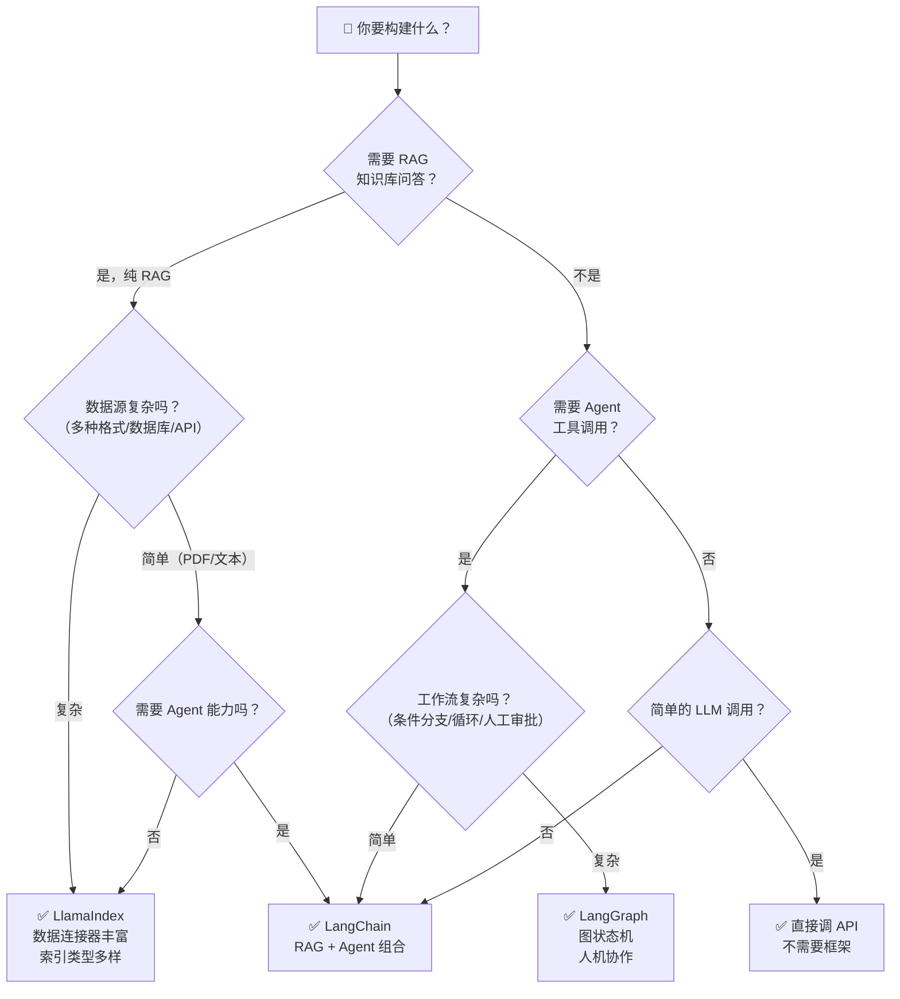

# 框架选型对比

## 概念说明

LLM 应用开发框架是 AI 工程师的核心工具。选错框架会导致开发效率低下、架构不合理、后期难以维护。本文从多个维度对比 LangChain、LangGraph 和 LlamaIndex 三大主流框架，帮助你在不同场景下做出正确选择。

### 三大框架定位

| 框架 | 一句话定位 | 核心优势 |
|------|-----------|---------|
| **LangChain** | LLM 应用全栈开发框架 | 生态最丰富，组件最多，社区最大 |
| **LangGraph** | 图状态机工作流框架 | 复杂流程编排，有状态，人机协作 |
| **LlamaIndex** | 数据索引与检索框架 | 数据连接最强，索引类型最多，RAG 最专业 |

## 核心原理

### 全维度对比表

| 维度 | LangChain | LangGraph | LlamaIndex |
|------|-----------|-----------|------------|
| **GitHub Star** | 90K+ | 8K+ | 35K+ |
| **核心理念** | 链式调用（LCEL） | 图状态机 | 数据索引 |
| **学习曲线** | 中等（概念多） | 较陡（图思维） | 较平缓（API 简洁） |
| **RAG 能力** | ⭐⭐⭐ | ⭐⭐ | ⭐⭐⭐⭐⭐ |
| **Agent 能力** | ⭐⭐⭐⭐ | ⭐⭐⭐⭐⭐ | ⭐⭐⭐ |
| **工作流编排** | ⭐⭐ | ⭐⭐⭐⭐⭐ | ⭐⭐ |
| **数据连接器** | 100+ | 依赖 LangChain | 160+（LlamaHub） |
| **索引类型** | 向量索引为主 | 无内置索引 | 向量/树/关键词/知识图谱 |
| **状态管理** | 无内置 | 原生支持 | 无内置 |
| **人机协作** | 需手动实现 | 原生 interrupt | 需手动实现 |
| **持久化** | 需手动实现 | 原生 Checkpointer | 内置 StorageContext |
| **流式输出** | LCEL 原生支持 | 原生支持 | 支持 |
| **异步支持** | LCEL 原生支持 | 原生支持 | 支持 |
| **部署方案** | LangServe | LangGraph Platform | LlamaCloud |
| **监控追踪** | LangSmith | LangSmith | LlamaTrace |
| **版本稳定性** | API 变更频繁 | 相对稳定 | API 变更频繁 |
| **商业支持** | LangChain Inc. | LangChain Inc. | LlamaIndex Inc. |

### 场景选型决策树



### 典型场景推荐

| 应用场景 | 推荐框架 | 理由 |
|---------|---------|------|
| 企业知识库问答 | LlamaIndex | 数据连接器丰富，索引优化强 |
| 简单 RAG 聊天机器人 | LangChain | 快速搭建，生态成熟 |
| 多步骤 Agent 工作流 | LangGraph | 条件路由、循环、状态管理 |
| Multi-Agent 协作 | LangGraph | 原生支持多 Agent 编排 |
| 文档摘要/分析 | LlamaIndex | TreeIndex 层级摘要 |
| 客服系统（RAG + Agent） | LangChain + LangGraph | RAG 检索 + 工具调用 + 状态管理 |
| 数据分析 Agent | LangGraph | 复杂推理 + 工具调用 + 人工审批 |
| 简单 LLM API 封装 | 不需要框架 | 直接用 OpenAI SDK |
| 代码生成助手 | LangChain | Prompt Template + Output Parser |
| 多数据源融合检索 | LlamaIndex | 多索引路由查询 |

### 组合使用方案

实际项目中，三个框架经常组合使用：

**方案 1：LlamaIndex + LangChain**
```
LlamaIndex（数据索引 + 检索） → LangChain（Agent + Chain 编排）
适用：需要强大检索 + Agent 能力的应用
```

**方案 2：LangChain + LangGraph**
```
LangChain（组件库：Prompt/LLM/Tools） → LangGraph（工作流编排）
适用：复杂的有状态 Agent 应用
```

**方案 3：三者组合**
```
LlamaIndex（数据层） → LangChain（组件层） → LangGraph（编排层）
适用：企业级复杂 AI 应用
```

### 性能与成本对比

| 维度 | LangChain | LangGraph | LlamaIndex |
|------|-----------|-----------|------------|
| 启动开销 | 中等 | 较低 | 中等 |
| 内存占用 | 中等 | 较低（按需加载） | 较高（索引缓存） |
| LLM 调用次数 | 取决于 Chain 长度 | 取决于图复杂度 | 索引构建时较多 |
| 适合数据规模 | 中小规模 | 不限 | 大规模 |
| 云服务成本 | LangSmith 付费 | LangGraph Platform 付费 | LlamaCloud 付费 |

## 代码示例

> 💻 完整可运行代码：[code-examples/03-ai-apps/frameworks/](https://github.com/skyhe58/guide-ai/tree/main/code-examples/03-ai-apps/frameworks/)
> 🐍 Python 版本：3.11+

```python
# 三种框架的核心使用模式对比

# LangChain LCEL
chain = prompt | llm | parser
result = chain.invoke({"question": "什么是 RAG？"})

# LangGraph
graph = StateGraph(State)
graph.add_node("retrieve", retrieve_fn)
app = graph.compile()
result = app.invoke({"messages": [("human", "什么是 RAG？")]})

# LlamaIndex
index = VectorStoreIndex.from_documents(docs)
engine = index.as_query_engine()
result = engine.query("什么是 RAG？")
```

## 实战要点

**选型原则：**
- **不要为了用框架而用框架**：简单场景直接调 API
- **从简单开始**：先用 LangChain 快速原型，复杂了再引入 LangGraph
- **数据驱动选型**：数据源复杂优先 LlamaIndex，流程复杂优先 LangGraph
- **考虑团队能力**：LangChain 社区资源最多，学习成本最低
- **锁定版本**：三个框架都在快速迭代，生产环境必须锁定版本

**迁移建议：**
- LangChain 旧版 Chain → LCEL：官方提供迁移指南
- LangChain Agent → LangGraph Agent：推荐迁移，LangGraph 更灵活
- 纯 LangChain RAG → LlamaIndex：如果检索质量不满意，考虑迁移

## 常见面试题

### Q1: LangChain、LangGraph、LlamaIndex 三者如何选型？

**难度**：⭐⭐⭐ | **频率**：🔥🔥🔥

**答题思路**：定位差异 → 场景匹配 → 组合方案

**标准答案**：三者定位不同：LangChain 是全栈框架，适合快速搭建各类 LLM 应用；LangGraph 是图状态机，适合复杂的有状态工作流和 Multi-Agent；LlamaIndex 专注数据索引和检索，RAG 场景最强。选型建议：纯 RAG 知识库用 LlamaIndex；简单 Agent 用 LangChain；复杂工作流（条件分支、循环、人工审批）用 LangGraph。实际项目中常组合使用：LlamaIndex 做数据层，LangChain 做组件层，LangGraph 做编排层。简单场景不需要框架，直接调 API 更清晰。

**深入追问**：
- 如果项目从 LangChain 迁移到 LangGraph，需要注意什么？
- 三个框架的商业模式分别是什么？对开源版本有什么影响？

### Q2: 什么场景下不需要使用 LLM 框架？

**难度**：⭐⭐ | **频率**：🔥🔥

**答题思路**：过度工程化的问题 → 适合直接调 API 的场景

**标准答案**：以下场景不需要框架：(1) 简单的 LLM API 调用（单轮问答、文本生成）；(2) 固定 Prompt 模板的批量处理；(3) 只需要一个 LLM 提供商的简单应用；(4) 对性能要求极高、需要精细控制的场景。框架的价值在于抽象和复用，但也带来额外的复杂度、依赖和性能开销。如果应用逻辑简单，直接用 OpenAI SDK 或 Ollama SDK 更清晰、更可控。

**深入追问**：
- 框架带来的额外开销有多大？（依赖体积、启动时间、调用延迟）
- 如何评估是否需要引入框架？（复杂度阈值、团队熟悉度、维护成本）

### Q3: 如何评估一个 LLM 框架是否适合生产环境？

**难度**：⭐⭐⭐⭐ | **频率**：🔥🔥

**答题思路**：评估维度 → 关键指标 → 风险点

**标准答案**：评估维度：(1) 稳定性——API 变更频率、版本兼容性、Bug 修复速度；(2) 性能——额外延迟、内存占用、并发能力；(3) 可观测性——日志、追踪、监控支持；(4) 社区——Star 数、Issue 响应速度、文档质量；(5) 商业支持——是否有企业版、SLA 保障；(6) 锁定风险——是否容易替换、核心逻辑是否过度依赖框架。LangChain 和 LlamaIndex 的 API 变更频繁是主要风险，生产环境必须锁定版本并做好回归测试。

**深入追问**：
- 如何降低框架锁定风险？（抽象层隔离、核心逻辑不依赖框架特定 API）
- 框架升级导致 Breaking Change 怎么办？（版本锁定、渐进式迁移、兼容层）

## 推荐工具

> 📌 以下工具可帮助你更高效地学习和实践本知识点，详见 [模块 7：AI 使用与实践](/7-ai-tools/)

| 工具 | 用途 | 详情 |
|------|------|------|
| Perplexity | 搜索框架最新版本和社区评价 | [AI 搜索](/7-ai-tools/7.1-efficiency/ai-search) |
| ChatGPT | 针对具体场景获取选型建议 | [AI 对话助手](/7-ai-tools/7.1-efficiency/ai-chat) |

## 参考资料

- [LangChain 官方文档](https://python.langchain.com/docs/)
- [LangGraph 官方文档](https://langchain-ai.github.io/langgraph/)
- [LlamaIndex 官方文档](https://docs.llamaindex.ai/)
- [LangChain vs LlamaIndex — 社区对比](https://www.reddit.com/r/LangChain/)
- [Choosing the Right LLM Framework](https://blog.langchain.dev/)
