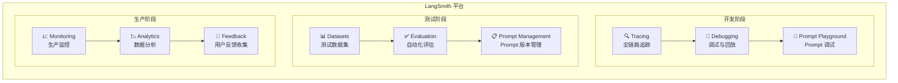

# LangSmith

## 概念说明

**LangSmith** 是 LangChain 团队推出的 LLM 应用可观测性平台，提供从开发到生产的全生命周期追踪、调试和评估能力。它解决了 LLM 应用开发中最痛苦的问题——"黑盒调试"：你不知道 Prompt 发了什么、LLM 返回了什么、中间步骤哪里出了问题。

### 为什么需要 LangSmith？

- **调试困难**：LLM 应用链路长（Prompt → LLM → Parser → Tool → LLM），出错难定位
- **质量不可控**：同样的 Prompt，不同时间可能返回不同质量的结果
- **成本不透明**：不知道每次调用消耗了多少 Token、花了多少钱
- **版本混乱**：Prompt 迭代频繁，不知道哪个版本效果最好
- **评估缺失**：没有系统化的方法评估 LLM 应用的质量

### LangSmith 核心功能



## 核心原理

### 1. Tracing — 全链路追踪

Trace 是 LangSmith 的核心功能，记录 LLM 应用每一步的输入、输出、耗时和 Token 消耗：

```
Trace: "用户问 RAG 是什么"
├── Run 1: ChatPromptTemplate (0.1ms)
│   ├── Input: {"question": "RAG 是什么"}
│   └── Output: [SystemMessage, HumanMessage]
├── Run 2: ChatOpenAI (1200ms, 150 tokens)
│   ├── Input: [SystemMessage, HumanMessage]
│   ├── Output: AIMessage("RAG 是检索增强生成...")
│   └── Token Usage: prompt=80, completion=70
└── Run 3: StrOutputParser (0.05ms)
    ├── Input: AIMessage
    └── Output: "RAG 是检索增强生成..."
```

**Trace 的关键信息：**

| 字段 | 说明 | 用途 |
|------|------|------|
| run_id | 唯一标识 | 定位具体调用 |
| parent_run_id | 父级 Run | 追踪调用链路 |
| run_type | 类型（llm/chain/tool） | 分类统计 |
| inputs | 输入数据 | 调试输入 |
| outputs | 输出数据 | 调试输出 |
| latency | 耗时（ms） | 性能分析 |
| token_usage | Token 消耗 | 成本统计 |
| error | 错误信息 | 异常排查 |
| feedback | 用户反馈 | 质量评估 |

### 2. Run 分析

Run 是 Trace 中的单个执行步骤，LangSmith 提供丰富的 Run 分析能力：

- **延迟分析**：P50/P95/P99 延迟分布，定位性能瓶颈
- **错误分析**：错误率趋势、错误类型分布、错误堆栈
- **Token 分析**：Token 消耗趋势、成本统计、模型对比
- **过滤与搜索**：按时间、状态、标签、元数据过滤 Run

### 3. Prompt 版本管理

LangSmith Hub 提供 Prompt 的版本管理和协作：

| 功能 | 说明 |
|------|------|
| 版本控制 | 每次修改自动创建新版本，支持回滚 |
| A/B 测试 | 不同版本 Prompt 对比效果 |
| 团队协作 | 多人编辑、评审、发布 |
| Playground | 在线调试 Prompt，实时查看效果 |
| 模板库 | 共享和复用 Prompt 模板 |

### 4. 在线评估

LangSmith 支持自动化评估 LLM 应用质量：

**评估流程：**
1. 创建评估数据集（输入 + 期望输出）
2. 定义评估器（Evaluator）
3. 运行评估，自动对比实际输出和期望输出
4. 查看评估报告（准确率、相关性、忠实度等）

**内置评估器：**

| 评估器 | 评估维度 | 适用场景 |
|--------|---------|---------|
| Correctness | 答案正确性 | 有标准答案的问答 |
| Helpfulness | 回答有用性 | 开放式问答 |
| Harmfulness | 有害内容检测 | 安全审查 |
| Custom | 自定义评估逻辑 | 业务特定指标 |

### 5. 集成方式

LangSmith 与 LangChain/LangGraph 无缝集成：

```python
# 方式 1：环境变量（推荐）
import os
os.environ["LANGCHAIN_TRACING_V2"] = "true"
os.environ["LANGCHAIN_API_KEY"] = "ls-..."
os.environ["LANGCHAIN_PROJECT"] = "my-project"
# LangChain 代码自动上报 Trace

# 方式 2：手动追踪（非 LangChain 代码）
from langsmith import traceable

@traceable(name="my_function")
def my_function(query: str) -> str:
    # 自动记录输入输出
    return call_llm(query)
```

## 代码示例

> 💻 完整可运行代码：[code-examples/03-ai-apps/evaluation/01_langsmith_trace.py](https://github.com/skyhe58/guide-ai/tree/main/code-examples/03-ai-apps/evaluation/01_langsmith_trace.py)
> 🐍 Python 版本：3.11+
> 📦 依赖：标准库（默认模式）

```python
# LangSmith 追踪核心模式
from langsmith import traceable

@traceable(name="rag_query", tags=["rag", "production"])
def rag_query(question: str) -> str:
    context = retrieve(question)
    answer = generate(question, context)
    return answer
```

## 实战要点

**开发阶段：**
- 开启 Tracing 后，所有 LangChain 调用自动上报，无需改代码
- 用 Playground 快速迭代 Prompt，找到最佳版本
- 用 Dataset 创建回归测试集，每次改动后自动评估

**生产阶段：**
- 设置采样率（sampling_rate），避免全量上报影响性能
- 监控 P95 延迟和错误率，设置告警阈值
- 收集用户反馈（👍👎），持续优化

**成本控制：**
- LangSmith 免费版每月 5K Traces，小项目够用
- 生产环境按需采样，不必全量追踪
- 敏感数据可配置脱敏规则

## 常见面试题

### Q1: LangSmith 的 Trace 和 Run 有什么区别？

**难度**：⭐⭐ | **频率**：🔥🔥

**答题思路**：概念区分 → 层级关系 → 实际用途

**标准答案**：Trace 是一次完整的用户请求链路，包含从输入到输出的所有步骤。Run 是 Trace 中的单个执行步骤（如一次 LLM 调用、一次工具调用）。一个 Trace 包含多个 Run，Run 之间通过 parent_run_id 形成树状结构。例如一次 RAG 查询的 Trace 包含：Prompt 构建 Run → 向量检索 Run → LLM 生成 Run → 输出解析 Run。通过 Trace 可以看到完整链路，通过 Run 可以定位具体步骤的问题。

**深入追问**：
- 如何在非 LangChain 代码中使用 LangSmith 追踪？（`@traceable` 装饰器）
- 生产环境如何控制 Trace 的采样率？（`LANGCHAIN_TRACING_SAMPLE_RATE` 环境变量）

### Q2: 如何用 LangSmith 做 Prompt 版本管理和 A/B 测试？

**难度**：⭐⭐⭐ | **频率**：🔥🔥

**答题思路**：版本管理流程 → A/B 测试方法 → 评估指标

**标准答案**：Prompt 版本管理：在 LangSmith Hub 创建 Prompt，每次修改自动生成新版本，支持标签（latest/production/staging）和回滚。A/B 测试：创建评估数据集，分别用不同版本 Prompt 运行评估，对比准确率、相关性、延迟和成本。流程：(1) 在 Playground 调试新 Prompt；(2) 创建评估数据集（50-100 条）；(3) 运行自动化评估对比新旧版本；(4) 确认效果后发布到 production 标签。

**深入追问**：
- 评估数据集如何构建？（人工标注 + LLM 生成 + 生产日志采样）
- 如何处理评估指标冲突？（准确率提升但延迟增加）

### Q3: LLM 应用的可观测性包括哪些维度？

**难度**：⭐⭐⭐⭐ | **频率**：🔥🔥🔥

**答题思路**：三大支柱 → LLM 特有维度 → 工具选型

**标准答案**：LLM 应用可观测性包括：(1) 追踪（Tracing）——全链路调用追踪，记录每步输入输出和耗时；(2) 指标（Metrics）——延迟（P50/P95/P99）、Token 消耗、错误率、QPS；(3) 日志（Logging）——结构化日志，记录请求/响应/异常；(4) LLM 特有维度——Prompt 版本、模型版本、输出质量评分、幻觉检测、用户反馈。工具选型：LangSmith（LangChain 生态）、LangFuse（开源替代）、Helicone（轻量级）、Prometheus+Grafana（基础指标）。

**深入追问**：
- 如何检测 LLM 的幻觉（Hallucination）？（事实核查、引用验证、一致性检查）
- 开源替代方案 LangFuse 和 LangSmith 有什么区别？

## 推荐工具

> 📌 以下工具可帮助你更高效地学习和实践本知识点，详见 [模块 7：AI 使用与实践](/7-ai-tools/)

| 工具 | 用途 | 详情 |
|------|------|------|
| Cursor | 辅助编写 LangSmith 集成代码 | [AI 编程辅助](/7-ai-tools/7.1-efficiency/ai-coding) |
| Perplexity | 搜索 LangSmith 最新功能和定价 | [AI 搜索](/7-ai-tools/7.1-efficiency/ai-search) |

## 参考资料

- [LangSmith 官方文档](https://docs.smith.langchain.com/)
- [LangSmith — Tracing](https://docs.smith.langchain.com/tracing)
- [LangSmith — Evaluation](https://docs.smith.langchain.com/evaluation)
- [LangSmith — Prompt Hub](https://smith.langchain.com/hub)
- [LangFuse — 开源替代](https://langfuse.com/)
