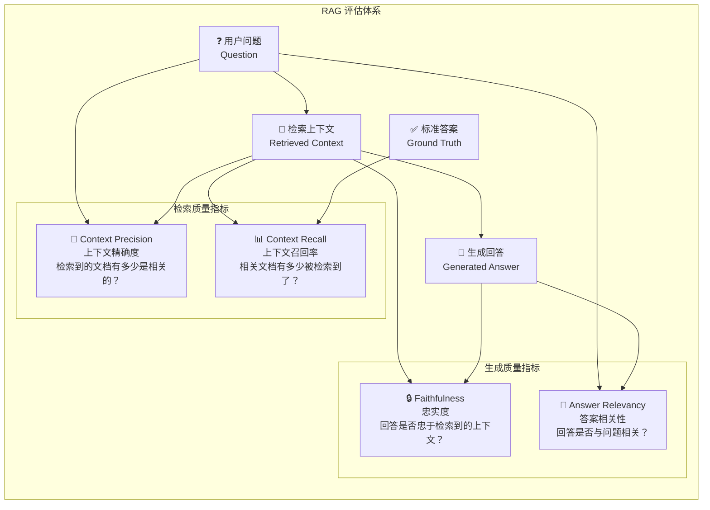
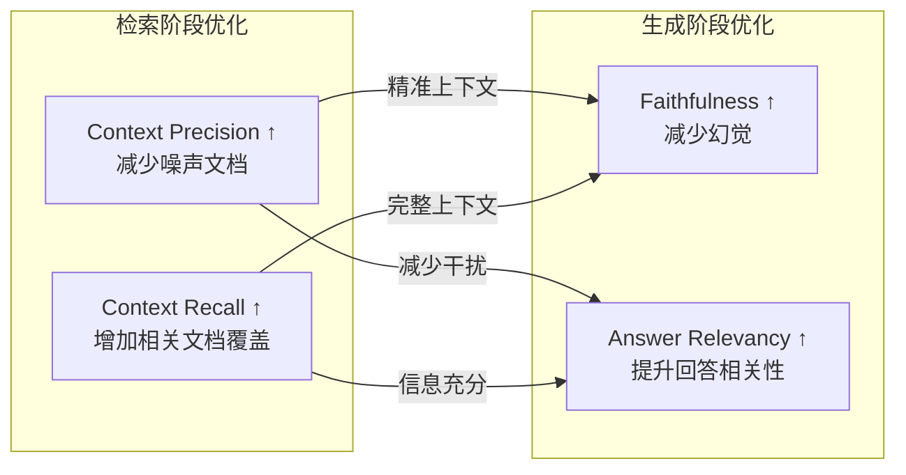

# RAG 评估指标

## 概念说明

RAG（检索增强生成）系统的质量评估是 AI 应用落地的关键环节。与传统 NLP 评估不同，RAG 评估需要同时考量**检索质量**和**生成质量**两个维度。一个好的 RAG 系统不仅要检索到正确的文档，还要基于这些文档生成准确、相关的回答。

### RAG 评估的四大核心指标



## 核心原理

### 1. Faithfulness — 忠实度

**定义**：生成的回答是否忠实于检索到的上下文，即回答中的每个声明（claim）是否都能在上下文中找到依据。

**计算方法**：
```
Faithfulness = 有上下文支持的声明数 / 回答中的总声明数
```

**评估流程：**
1. 将回答拆分为多个独立声明（claims）
2. 逐一检查每个声明是否能在检索上下文中找到支持
3. 计算有支持的声明占比

**示例：**
```
上下文: "Python 3.11 于 2022 年 10 月发布，性能提升 10-60%。"
回答: "Python 3.11 于 2022 年发布，性能提升了 50%，是最流行的语言。"

声明 1: "Python 3.11 于 2022 年发布" → ✅ 有支持
声明 2: "性能提升了 50%" → ❌ 上下文说 10-60%，不是确切的 50%
声明 3: "是最流行的语言" → ❌ 上下文未提及

Faithfulness = 1/3 = 0.33
```

**为什么重要**：低忠实度意味着 LLM 在"幻觉"——编造上下文中没有的信息。

### 2. Answer Relevancy — 答案相关性

**定义**：生成的回答与用户问题的相关程度。即使回答内容正确，如果答非所问也是低质量的。

**计算方法**：
```
Answer Relevancy = mean(cosine_similarity(question, generated_questions))
```

**评估流程：**
1. 根据回答反向生成 N 个问题
2. 计算这些生成问题与原始问题的余弦相似度
3. 取平均值作为相关性分数

**示例：**
```
问题: "Python 的 GIL 是什么？"
回答 A: "GIL 是全局解释器锁，限制同一时刻只有一个线程执行 Python 字节码。"
→ 高相关性 ✅

回答 B: "Python 是一种编程语言，支持多种编程范式。"
→ 低相关性 ❌（虽然正确但答非所问）
```

### 3. Context Precision — 上下文精确度

**定义**：检索到的上下文中，有多少是与回答问题真正相关的。衡量检索的"精准度"。

**计算方法**：
```
Context Precision = 相关上下文数 / 检索到的总上下文数
```

**评估流程：**
1. 对每个检索到的上下文片段，判断是否与问题相关
2. 计算相关片段的占比
3. 考虑排序位置（排名靠前的相关文档权重更高）

**示例：**
```
问题: "什么是 RAG？"
检索到 5 个文档:
  [1] RAG 架构介绍 → ✅ 相关
  [2] RAG 实现步骤 → ✅ 相关
  [3] Python 安装指南 → ❌ 不相关
  [4] RAG 优化技巧 → ✅ 相关
  [5] Java 基础教程 → ❌ 不相关

Context Precision = 3/5 = 0.6
```

### 4. Context Recall — 上下文召回率

**定义**：标准答案中的信息有多少被检索到的上下文覆盖。衡量检索的"完整度"。

**计算方法**：
```
Context Recall = 被上下文覆盖的标准答案声明数 / 标准答案总声明数
```

**评估流程：**
1. 将标准答案拆分为多个声明
2. 检查每个声明是否能在检索上下文中找到支持
3. 计算覆盖率

**示例：**
```
标准答案: "RAG 包含检索和生成两个阶段，检索阶段使用向量数据库，生成阶段使用 LLM。"

声明 1: "RAG 包含检索和生成两个阶段" → ✅ 上下文有
声明 2: "检索阶段使用向量数据库" → ✅ 上下文有
声明 3: "生成阶段使用 LLM" → ❌ 上下文未提及

Context Recall = 2/3 = 0.67
```

### 指标关系与优化方向



**优化策略对照：**

| 指标低 | 可能原因 | 优化方向 |
|--------|---------|---------|
| Faithfulness 低 | LLM 幻觉严重 | 优化 Prompt、降低 temperature、增加引用约束 |
| Answer Relevancy 低 | 答非所问 | 优化 Prompt 指令、改进查询理解 |
| Context Precision 低 | 检索噪声大 | 优化 Embedding、增加 Rerank、调整 Top-K |
| Context Recall 低 | 检索不完整 | 增大 Top-K、查询改写、混合检索 |

### 5. 其他补充指标

| 指标 | 说明 | 评估维度 |
|------|------|---------|
| Answer Correctness | 回答与标准答案的一致性 | 生成质量 |
| Answer Similarity | 回答与标准答案的语义相似度 | 生成质量 |
| Context Relevancy | 上下文与问题的相关度 | 检索质量 |
| Noise Sensitivity | 对噪声上下文的敏感度 | 鲁棒性 |
| Latency | 端到端延迟 | 性能 |

## 代码示例

> 💻 完整可运行代码：[code-examples/03-ai-apps/evaluation/02_ragas_eval.py](https://github.com/skyhe58/guide-ai/tree/main/code-examples/03-ai-apps/evaluation/02_ragas_eval.py)
> 🐍 Python 版本：3.11+
> 📦 依赖：标准库（默认模式）

```python
# RAG 评估核心计算
def faithfulness(answer_claims, context):
    supported = sum(1 for c in answer_claims if is_supported(c, context))
    return supported / len(answer_claims)
```

## 实战要点

**评估数据集构建：**
- 至少 50-100 条评估样本，覆盖不同问题类型
- 标准答案由领域专家标注，确保质量
- 包含简单问题、复杂问题、边界情况
- 定期更新评估数据集，反映知识库变化

**评估频率：**
- 开发阶段：每次 Prompt/检索策略变更后评估
- 上线前：完整评估 + 人工抽检
- 生产阶段：定期自动评估 + 用户反馈监控

**常见陷阱：**
- 只看单一指标（Faithfulness 高但 Relevancy 低也不行）
- 评估数据集太小，结果不稳定
- 用 LLM 评估 LLM，存在评估偏差（evaluator bias）
- 忽略延迟和成本指标

## 常见面试题

### Q1: RAG 系统的评估指标有哪些？如何选择？

**难度**：⭐⭐⭐ | **频率**：🔥🔥🔥

**答题思路**：四大核心指标 → 检索 vs 生成 → 选择策略

**标准答案**：RAG 评估分为检索质量和生成质量两个维度。检索质量：Context Precision（检索精确度，检索到的文档有多少相关）和 Context Recall（检索召回率，相关文档有多少被检索到）。生成质量：Faithfulness（忠实度，回答是否忠于上下文，不幻觉）和 Answer Relevancy（答案相关性，回答是否与问题相关）。选择策略：如果用户反馈"回答不准确"，优先看 Faithfulness；如果"答非所问"，看 Answer Relevancy；如果"信息不全"，看 Context Recall；如果"回答啰嗦"，看 Context Precision。

**深入追问**：
- Faithfulness 和 Answer Correctness 有什么区别？（忠于上下文 vs 忠于事实）
- 如何构建高质量的评估数据集？（专家标注 + LLM 辅助 + 生产日志采样）

### Q2: 如何提升 RAG 系统的 Faithfulness？

**难度**：⭐⭐⭐⭐ | **频率**：🔥🔥🔥

**答题思路**：原因分析 → 优化方案 → 效果验证

**标准答案**：Faithfulness 低的原因是 LLM 幻觉。优化方案：(1) Prompt 层面——明确指示"只基于提供的上下文回答，如果上下文不包含答案请说不知道"；(2) 降低 temperature 到 0-0.3，减少随机性；(3) 要求引用来源——"请在回答中标注信息来源的段落编号"；(4) 检索层面——提升 Context Precision，减少噪声文档干扰；(5) 后处理——用 NLI（自然语言推理）模型验证回答与上下文的一致性；(6) 使用 Chain-of-Thought 让 LLM 先推理再回答。

**深入追问**：
- 如何自动检测 LLM 的幻觉？（NLI 模型、事实核查、自我一致性检查）
- Faithfulness 和创造性之间如何平衡？（根据场景调整，知识问答要高忠实度，创意写作可以低一些）

### Q3: 用 LLM 评估 LLM 的结果可靠吗？有什么局限性？

**难度**：⭐⭐⭐⭐ | **频率**：🔥🔥

**答题思路**：可靠性分析 → 局限性 → 缓解方案

**标准答案**：LLM-as-Judge 是目前主流的自动化评估方法，在大多数场景下与人工评估有较高一致性（70-80%），但存在局限：(1) 评估偏差——LLM 倾向于给自己生成的内容更高分；(2) 位置偏差——对比评估时倾向于选择第一个选项；(3) 长度偏差——倾向于给更长的回答更高分；(4) 无法评估事实准确性——LLM 自己也可能幻觉。缓解方案：使用更强的模型做评估（GPT-4 评估 GPT-3.5）、多次评估取平均、人工抽检校准、结合规则评估（BLEU/ROUGE）。

**深入追问**：
- 如何校准 LLM 评估器的偏差？（人工标注对齐、多评估器投票）
- 除了 LLM-as-Judge，还有哪些评估方法？（人工评估、规则评估、嵌入相似度）

## 推荐工具

> 📌 以下工具可帮助你更高效地学习和实践本知识点，详见 [模块 7：AI 使用与实践](/7-ai-tools/)

| 工具 | 用途 | 详情 |
|------|------|------|
| Cursor | 辅助编写 RAG 评估代码 | [AI 编程辅助](/7-ai-tools/7.1-efficiency/ai-coding) |
| Perplexity | 搜索 RAG 评估最新研究 | [AI 搜索](/7-ai-tools/7.1-efficiency/ai-search) |

## 参考资料

- [RAGAS — RAG Assessment](https://docs.ragas.io/)
- [RAG Evaluation — LlamaIndex](https://docs.llamaindex.ai/en/stable/module_guides/evaluating/)
- [Evaluating RAG Applications — LangChain](https://blog.langchain.dev/evaluating-rag-pipelines-with-ragas-langsmith/)
- [Survey on RAG Evaluation](https://arxiv.org/abs/2404.01272)
