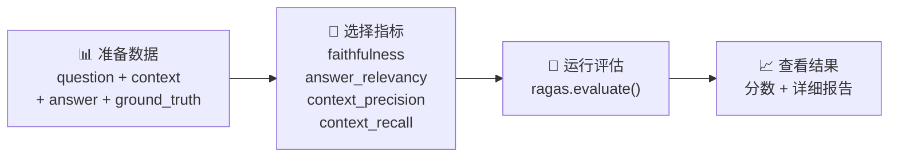
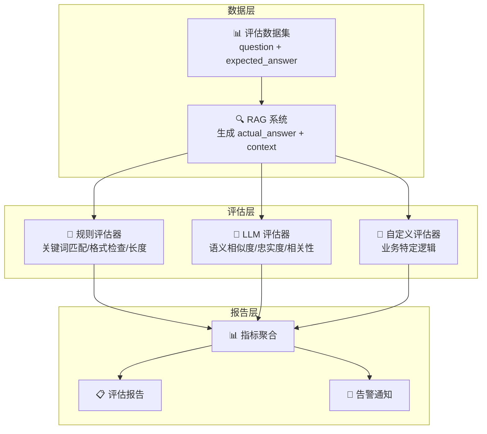

# 评估框架

## 概念说明

RAG 评估指标定义了"评什么"，评估框架解决"怎么评"。手动评估费时费力且不可重复，自动化评估框架让你能够快速、一致地评估 LLM 应用质量。本文介绍三种主流方案：RAGAS（RAG 专用）、DeepEval（通用 LLM 评估）和自定义评估流水线。

### 评估框架对比

| 维度 | RAGAS | DeepEval | 自定义评估 |
|------|-------|---------|-----------|
| 定位 | RAG 专用评估 | 通用 LLM 评估 | 业务定制 |
| 内置指标 | Faithfulness/Relevancy/Precision/Recall | 15+ 指标 | 自定义 |
| 评估方式 | LLM-as-Judge | LLM-as-Judge + 规则 | 灵活 |
| pytest 集成 | ❌ | ✅ 原生支持 | 自行实现 |
| CI/CD 集成 | 需手动 | 原生支持 | 自行实现 |
| 学习曲线 | 低 | 中 | 高 |
| 灵活性 | 中 | 高 | 最高 |
| 适用场景 | RAG 系统评估 | 各类 LLM 应用 | 特殊业务需求 |

## 核心原理

### 1. RAGAS — RAG 评估标准

RAGAS（RAG Assessment）是最流行的 RAG 评估框架，提供四大核心指标的自动化计算：

**核心特点：**
- 专注 RAG 场景，指标设计针对性强
- 支持无标准答案评估（reference-free）
- 基于 LLM-as-Judge，无需人工标注
- 与 LangChain、LlamaIndex 无缝集成

**使用流程：**



**RAGAS 指标计算原理：**

| 指标 | 输入 | 计算方式 | 是否需要标准答案 |
|------|------|---------|----------------|
| Faithfulness | answer + context | LLM 拆分声明 → 逐一验证 | ❌ |
| Answer Relevancy | question + answer | 反向生成问题 → 计算相似度 | ❌ |
| Context Precision | question + context + ground_truth | LLM 判断每个 context 是否相关 | ✅ |
| Context Recall | context + ground_truth | LLM 检查标准答案覆盖率 | ✅ |

### 2. DeepEval — 通用 LLM 评估

DeepEval 是一个更通用的 LLM 评估框架，不仅支持 RAG，还支持对话、摘要、翻译等多种场景：

**核心特点：**
- 15+ 内置评估指标
- 原生 pytest 集成，像写单元测试一样写评估
- 支持 CI/CD 自动化评估
- 提供 Confident AI 云平台（可选）

**DeepEval 指标体系：**

| 指标类别 | 指标名称 | 说明 |
|---------|---------|------|
| RAG 指标 | Faithfulness | 忠实度 |
| RAG 指标 | Answer Relevancy | 答案相关性 |
| RAG 指标 | Contextual Precision | 上下文精确度 |
| RAG 指标 | Contextual Recall | 上下文召回率 |
| 安全指标 | Toxicity | 有毒内容检测 |
| 安全指标 | Bias | 偏见检测 |
| 质量指标 | Hallucination | 幻觉检测 |
| 质量指标 | Summarization | 摘要质量 |
| 质量指标 | G-Eval | 通用质量评估 |
| 对话指标 | Conversation Relevancy | 对话相关性 |
| 对话指标 | Knowledge Retention | 知识保持 |

**pytest 集成示例：**
```python
# test_rag.py — 像写单元测试一样写评估
from deepeval import assert_test
from deepeval.test_case import LLMTestCase
from deepeval.metrics import FaithfulnessMetric

def test_faithfulness():
    test_case = LLMTestCase(
        input="什么是 RAG？",
        actual_output="RAG 是检索增强生成...",
        retrieval_context=["RAG 全称 Retrieval-Augmented Generation..."]
    )
    metric = FaithfulnessMetric(threshold=0.7)
    assert_test(test_case, [metric])
```

### 3. 自定义评估流水线

当内置框架无法满足业务需求时，需要构建自定义评估流水线：

**适用场景：**
- 业务特定的评估标准（如医疗准确性、法律合规性）
- 需要结合规则评估和 LLM 评估
- 需要与内部系统集成
- 对评估成本有严格控制

**自定义评估架构：**



**自定义评估器设计模式：**

```python
class BaseEvaluator:
    """评估器基类。"""
    def evaluate(self, question, answer, context, ground_truth) -> float:
        raise NotImplementedError

class KeywordEvaluator(BaseEvaluator):
    """关键词覆盖率评估。"""
    def evaluate(self, question, answer, context, ground_truth) -> float:
        keywords = extract_keywords(ground_truth)
        covered = sum(1 for k in keywords if k in answer)
        return covered / len(keywords)

class LLMEvaluator(BaseEvaluator):
    """LLM 评估器。"""
    def evaluate(self, question, answer, context, ground_truth) -> float:
        prompt = f"评估回答质量（0-1 分）：\n问题：{question}\n回答：{answer}"
        score = call_llm(prompt)
        return float(score)
```

### 评估流水线最佳实践

| 阶段 | 建议 | 说明 |
|------|------|------|
| 数据准备 | 50-200 条评估样本 | 覆盖常见问题和边界情况 |
| 指标选择 | 3-5 个核心指标 | 不要贪多，聚焦关键维度 |
| 评估频率 | 每次变更后 + 定期 | 开发阶段高频，生产阶段定期 |
| 结果分析 | 关注趋势而非绝对值 | 指标波动比绝对分数更重要 |
| 人工校准 | 定期人工抽检 | 校准自动评估的准确性 |

## 代码示例

> 💻 完整可运行代码：
> - [code-examples/03-ai-apps/evaluation/02_ragas_eval.py](https://github.com/skyhe58/guide-ai/tree/main/code-examples/03-ai-apps/evaluation/02_ragas_eval.py)
> - [code-examples/03-ai-apps/evaluation/03_deepeval.py](https://github.com/skyhe58/guide-ai/tree/main/code-examples/03-ai-apps/evaluation/03_deepeval.py)
> 🐍 Python 版本：3.11+
> 📦 依赖：标准库（默认模式）

```python
# RAGAS 评估核心模式
from ragas import evaluate
from ragas.metrics import faithfulness, answer_relevancy

result = evaluate(dataset, metrics=[faithfulness, answer_relevancy])
print(result)  # {'faithfulness': 0.85, 'answer_relevancy': 0.92}
```

## 实战要点

**RAGAS 使用建议：**
- 评估模型推荐用 GPT-4，评估质量更高
- 无标准答案时只能用 Faithfulness 和 Answer Relevancy
- 大规模评估注意 LLM API 成本（每条样本约 3-5 次 LLM 调用）

**DeepEval 使用建议：**
- 利用 pytest 集成，将评估纳入 CI/CD 流水线
- 设置合理的 threshold，避免过于严格导致频繁失败
- 使用 `deepeval test run` 命令批量运行评估

**自定义评估建议：**
- 先用 RAGAS/DeepEval 快速验证，不满足再自定义
- 规则评估 + LLM 评估组合，降低成本提升准确性
- 评估结果存入数据库，支持历史趋势分析

## 常见面试题

### Q1: RAGAS 和 DeepEval 有什么区别？如何选择？

**难度**：⭐⭐⭐ | **频率**：🔥🔥

**答题思路**：定位差异 → 功能对比 → 选型建议

**标准答案**：RAGAS 专注 RAG 评估，提供四大核心指标（Faithfulness/Answer Relevancy/Context Precision/Context Recall），API 简洁，学习成本低，适合快速评估 RAG 系统。DeepEval 是通用 LLM 评估框架，提供 15+ 指标（包括 RAG、安全、对话等），原生支持 pytest 和 CI/CD 集成，适合需要全面评估的项目。选型建议：纯 RAG 评估用 RAGAS；需要安全检测、对话评估或 CI/CD 集成用 DeepEval；两者可以同时使用，互补。

**深入追问**：
- RAGAS 的评估成本大概是多少？（每条样本 3-5 次 LLM 调用）
- 如何将评估集成到 CI/CD 流水线？（DeepEval pytest 插件 + GitHub Actions）

### Q2: 如何构建一个自定义的 RAG 评估流水线？

**难度**：⭐⭐⭐⭐ | **频率**：🔥🔥

**答题思路**：架构设计 → 评估器选择 → 报告生成

**标准答案**：自定义评估流水线包含三层：(1) 数据层——评估数据集管理（问题 + 标准答案 + 元数据），RAG 系统生成实际回答和检索上下文；(2) 评估层——组合多种评估器：规则评估器（关键词覆盖、格式检查、长度限制）+ LLM 评估器（语义相似度、忠实度）+ 业务评估器（领域准确性、合规性）；(3) 报告层——指标聚合、趋势分析、告警通知。关键设计：评估器接口统一（BaseEvaluator）、支持并行评估、结果持久化到数据库、定期人工校准。

**深入追问**：
- 如何降低 LLM 评估的成本？（缓存、采样、规则预过滤）
- 评估结果不稳定怎么办？（多次评估取平均、固定 seed、使用确定性评估器）

### Q3: LLM 应用的评估应该在什么阶段进行？

**难度**：⭐⭐⭐ | **频率**：🔥🔥

**答题思路**：开发阶段 → 测试阶段 → 生产阶段

**标准答案**：三个阶段都需要评估：(1) 开发阶段——每次 Prompt 或检索策略变更后运行评估，快速迭代，用小数据集（20-50 条）；(2) 测试阶段——上线前完整评估，用大数据集（100-200 条），设置质量门槛（如 Faithfulness > 0.8），不达标不上线；(3) 生产阶段——定期自动评估（每天/每周），监控指标趋势，收集用户反馈（👍👎），发现质量下降及时告警。评估是持续的过程，不是一次性的。

**深入追问**：
- 生产环境如何收集评估数据？（用户反馈、A/B 测试、日志采样）
- 评估指标下降了怎么排查？（对比历史数据、分析失败案例、检查数据源变化）

## 推荐工具

> 📌 以下工具可帮助你更高效地学习和实践本知识点，详见 [模块 7：AI 使用与实践](/7-ai-tools/)

| 工具 | 用途 | 详情 |
|------|------|------|
| Cursor | 辅助编写评估框架集成代码 | [AI 编程辅助](/7-ai-tools/7.1-efficiency/ai-coding) |
| Perplexity | 搜索评估框架最新版本和对比 | [AI 搜索](/7-ai-tools/7.1-efficiency/ai-search) |

## 参考资料

- [RAGAS 官方文档](https://docs.ragas.io/)
- [DeepEval 官方文档](https://docs.confident-ai.com/)
- [DeepEval GitHub](https://github.com/confident-ai/deepeval)
- [RAGAS GitHub](https://github.com/explodinggradients/ragas)
- [LLM Evaluation Best Practices](https://www.confident-ai.com/blog/llm-evaluation-metrics-everything-you-need-for-llm-evaluation)
