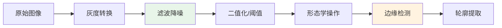
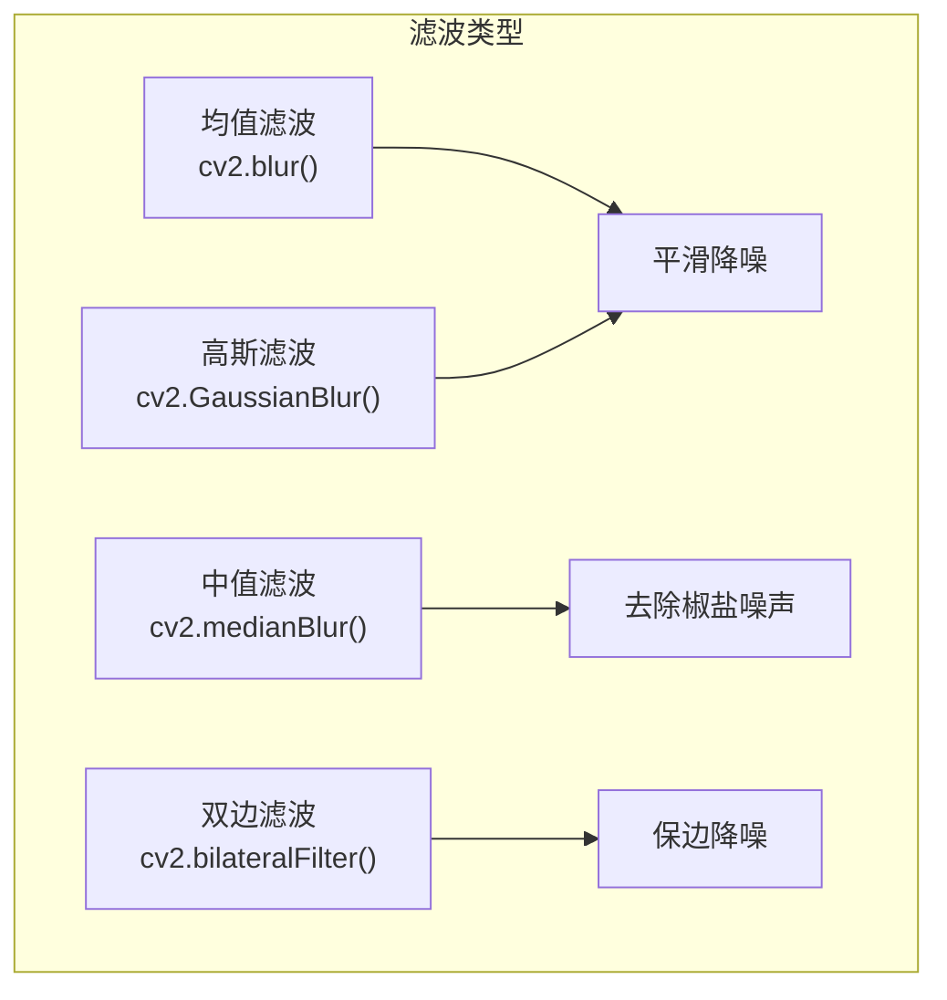
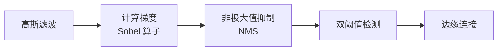

# 图像处理

## 概念说明

图像处理是计算机视觉的基础，涵盖灰度转换、二值化、滤波降噪、边缘检测和形态学操作等核心技术。这些操作是目标检测、语义分割等高级任务的预处理步骤。

### 图像处理流水线



## 核心原理

### 1. 灰度转换

将彩色图像转换为单通道灰度图，减少计算量：

```python
import cv2

gray = cv2.cvtColor(img, cv2.COLOR_BGR2GRAY)
# 灰度公式：Gray = 0.299*R + 0.587*G + 0.114*B
# 人眼对绿色最敏感，所以绿色权重最大
```

### 2. 图像二值化（阈值处理）

将灰度图转换为黑白二值图：

| 方法 | 函数 | 适用场景 |
|------|------|---------|
| 全局阈值 | `cv2.threshold()` | 光照均匀的图像 |
| 自适应阈值 | `cv2.adaptiveThreshold()` | 光照不均匀 |
| Otsu 自动阈值 | `cv2.threshold(..., cv2.THRESH_OTSU)` | 双峰直方图 |

```python
# 全局阈值
_, binary = cv2.threshold(gray, 127, 255, cv2.THRESH_BINARY)

# Otsu 自动阈值（自动计算最佳阈值）
_, otsu = cv2.threshold(gray, 0, 255, cv2.THRESH_BINARY + cv2.THRESH_OTSU)

# 自适应阈值（局部计算阈值，适合光照不均）
adaptive = cv2.adaptiveThreshold(
    gray, 255, cv2.ADAPTIVE_THRESH_GAUSSIAN_C, cv2.THRESH_BINARY, 11, 2
)
```

### 3. 图像滤波（降噪）

滤波是用卷积核在图像上滑动计算的过程：



```python
# 均值滤波 — 简单平均，会模糊边缘
blur = cv2.blur(img, (5, 5))

# 高斯滤波 — 加权平均，中心权重大（最常用）
gaussian = cv2.GaussianBlur(img, (5, 5), sigmaX=0)

# 中值滤波 — 取中值，对椒盐噪声效果最好
median = cv2.medianBlur(img, 5)

# 双边滤波 — 保留边缘的同时降噪（计算量大）
bilateral = cv2.bilateralFilter(img, 9, 75, 75)
```

### 4. 边缘检测

#### Canny 边缘检测（最常用）

Canny 是多阶段边缘检测算法：



```python
# Canny 边缘检测
edges = cv2.Canny(gray, threshold1=50, threshold2=150)
# threshold1: 低阈值（弱边缘）
# threshold2: 高阈值（强边缘）
# 推荐比例 1:2 或 1:3

# Sobel 算子（计算梯度）
sobel_x = cv2.Sobel(gray, cv2.CV_64F, 1, 0, ksize=3)  # 水平梯度
sobel_y = cv2.Sobel(gray, cv2.CV_64F, 0, 1, ksize=3)  # 垂直梯度

# Laplacian 算子（二阶导数）
laplacian = cv2.Laplacian(gray, cv2.CV_64F)
```

### 5. 形态学操作

形态学操作基于结构元素对二值图像进行处理：

| 操作 | 函数 | 效果 | 应用场景 |
|------|------|------|---------|
| 腐蚀 | `cv2.erode()` | 缩小白色区域 | 去除小噪点 |
| 膨胀 | `cv2.dilate()` | 扩大白色区域 | 填充小孔洞 |
| 开运算 | `cv2.morphologyEx(MORPH_OPEN)` | 先腐蚀后膨胀 | 去噪 |
| 闭运算 | `cv2.morphologyEx(MORPH_CLOSE)` | 先膨胀后腐蚀 | 填孔 |
| 梯度 | `cv2.morphologyEx(MORPH_GRADIENT)` | 膨胀 - 腐蚀 | 提取边缘 |

```python
# 创建结构元素
kernel = cv2.getStructuringElement(cv2.MORPH_RECT, (5, 5))

# 腐蚀与膨胀
eroded = cv2.erode(binary, kernel, iterations=1)
dilated = cv2.dilate(binary, kernel, iterations=1)

# 开运算（去噪）= 先腐蚀后膨胀
opened = cv2.morphologyEx(binary, cv2.MORPH_OPEN, kernel)

# 闭运算（填孔）= 先膨胀后腐蚀
closed = cv2.morphologyEx(binary, cv2.MORPH_CLOSE, kernel)
```

### 6. 轮廓检测

```python
# 查找轮廓
contours, hierarchy = cv2.findContours(
    binary, cv2.RETR_EXTERNAL, cv2.CHAIN_APPROX_SIMPLE
)

# 绘制轮廓
result = img.copy()
cv2.drawContours(result, contours, -1, (0, 255, 0), 2)

# 轮廓属性
for cnt in contours:
    area = cv2.contourArea(cnt)          # 面积
    perimeter = cv2.arcLength(cnt, True) # 周长
    x, y, w, h = cv2.boundingRect(cnt)   # 外接矩形
```

## 代码示例

> 💻 完整可运行代码：[code-examples/04-cv/opencv/02_image_processing.py](https://github.com/your-repo/tree/main/code-examples/04-cv/opencv/02_image_processing.py)
> 🐍 Python 版本：3.11+
> 📦 依赖：numpy（模拟模式）、opencv-python>=4.8（完整模式）

## 实战要点

**预处理管道设计原则：**
- **先降噪再检测**：噪声会导致边缘检测产生大量伪边缘
- **参数调优**：Canny 阈值、核大小需要根据具体图像调整
- **形态学组合**：开运算去噪 + 闭运算填孔是经典组合
- **性能考虑**：大图像先缩放再处理，最后映射回原图

**常见陷阱：**
- 二值化前忘记转灰度图
- 形态学操作的核大小选择不当（太大会丢失细节）
- Canny 阈值设置不合理（太低噪声多，太高边缘断裂）

## 常见面试题

### Q1: Canny 边缘检测的步骤是什么？

**难度**：⭐⭐ | **频率**：🔥🔥🔥

**答题思路**：五个步骤逐一说明 → 每步作用

**标准答案**：Canny 边缘检测包含五个步骤：(1) 高斯滤波平滑降噪；(2) 用 Sobel 算子计算水平和垂直方向梯度；(3) 非极大值抑制（NMS），沿梯度方向只保留局部最大值，使边缘变细；(4) 双阈值检测，将像素分为强边缘、弱边缘和非边缘；(5) 边缘连接，与强边缘相连的弱边缘保留，否则丢弃。

**深入追问**：
- 双阈值的比例如何选择？（通常 1:2 或 1:3）
- NMS 的具体实现原理？（沿梯度方向插值比较）

### Q2: 开运算和闭运算的区别和应用场景？

**难度**：⭐⭐ | **频率**：🔥🔥

**答题思路**：定义 → 效果 → 应用场景

**标准答案**：开运算 = 先腐蚀后膨胀，效果是去除小的白色噪点（前景噪声），适合去噪。闭运算 = 先膨胀后腐蚀，效果是填充小的黑色孔洞（前景空洞），适合填孔。实际应用中常组合使用：先开运算去噪，再闭运算填孔。

**深入追问**：
- 结构元素的形状（矩形/椭圆/十字）如何选择？
- 迭代次数对结果有什么影响？

## 推荐工具

> 📌 以下工具可帮助你更高效地学习和实践本知识点，详见 [模块 7：AI 使用与实践](/7-ai-tools/)

| 工具 | 用途 | 详情 |
|------|------|------|
| Cursor | 辅助编写图像处理管道 | [AI 编程辅助](/7-ai-tools/7.1-efficiency/ai-coding) |
| ChatGPT | 解释滤波器原理和参数 | [AI 对话助手](/7-ai-tools/7.1-efficiency/ai-chat) |
| Perplexity | 搜索图像处理算法 | [AI 搜索](/7-ai-tools/7.1-efficiency/ai-search) |

## 参考资料

- [OpenCV 图像处理教程](https://docs.opencv.org/4.x/d2/d96/tutorial_py_table_of_contents_imgproc.html)
- [Canny Edge Detection — OpenCV](https://docs.opencv.org/4.x/da/d22/tutorial_py_canny.html)
- [形态学变换 — OpenCV](https://docs.opencv.org/4.x/d9/d61/tutorial_py_morphological_ops.html)
- [Digital Image Processing — Gonzalez & Woods](https://www.imageprocessingplace.com/)
