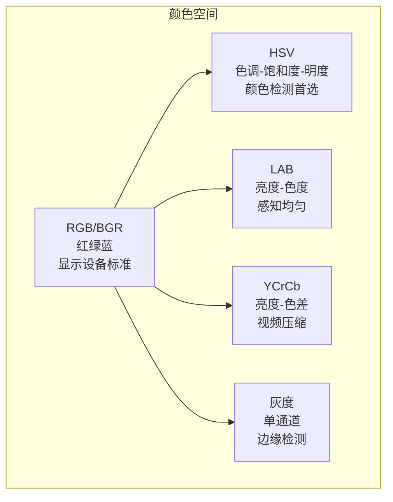

# 颜色空间

## 概念说明

**颜色空间**（Color Space）是描述颜色的数学模型。不同颜色空间适合不同任务：RGB 适合显示，HSV 适合颜色检测，LAB 适合颜色校正。理解颜色空间是图像处理和计算机视觉的基础。

### 主要颜色空间对比



## 核心原理

### 1. RGB / BGR 颜色空间

RGB 是最基础的颜色空间，通过红（R）、绿（G）、蓝（B）三个通道的组合表示颜色：

| 属性 | 说明 |
|------|------|
| 通道数 | 3（R, G, B） |
| 值范围 | 每通道 0-255 |
| 总颜色数 | 256³ = 16,777,216 |
| OpenCV 顺序 | BGR（非 RGB） |

```python
import cv2
import numpy as np

# BGR → RGB 转换
rgb = cv2.cvtColor(img, cv2.COLOR_BGR2RGB)

# 创建纯色图像
red_img = np.zeros((100, 100, 3), dtype=np.uint8)
red_img[:, :, 2] = 255  # BGR 中 R 在索引 2
```

### 2. HSV 颜色空间（颜色检测首选）

HSV 将颜色分解为色调（Hue）、饱和度（Saturation）、明度（Value），更符合人类对颜色的感知：

| 通道 | 含义 | OpenCV 范围 | 说明 |
|------|------|------------|------|
| H（Hue） | 色调 | 0-179 | 颜色种类（红/绿/蓝...） |
| S（Saturation） | 饱和度 | 0-255 | 颜色纯度（0=灰色） |
| V（Value） | 明度 | 0-255 | 亮度（0=黑色） |

> ⚠️ OpenCV 中 H 范围是 0-179（非 0-360），因为 uint8 最大 255，OpenCV 将 360° 映射到 0-179。

**常用颜色的 HSV 范围：**

| 颜色 | H 范围 | S 范围 | V 范围 |
|------|--------|--------|--------|
| 红色 | 0-10, 170-179 | 100-255 | 100-255 |
| 橙色 | 11-25 | 100-255 | 100-255 |
| 黄色 | 26-34 | 100-255 | 100-255 |
| 绿色 | 35-85 | 100-255 | 100-255 |
| 蓝色 | 100-130 | 100-255 | 100-255 |
| 紫色 | 131-160 | 100-255 | 100-255 |

```python
# BGR → HSV
hsv = cv2.cvtColor(img, cv2.COLOR_BGR2HSV)

# 颜色检测：提取蓝色区域
lower_blue = np.array([100, 100, 100])
upper_blue = np.array([130, 255, 255])
mask = cv2.inRange(hsv, lower_blue, upper_blue)

# 应用掩码
result = cv2.bitwise_and(img, img, mask=mask)
```

### 3. LAB 颜色空间（感知均匀）

LAB 颜色空间设计为感知均匀——数值差异与人眼感知的颜色差异成正比：

| 通道 | 含义 | 范围 | 说明 |
|------|------|------|------|
| L | 亮度 | 0-255 | 从黑到白 |
| A | 绿-红色度 | 0-255 | 128 为中性 |
| B | 蓝-黄色度 | 0-255 | 128 为中性 |

```python
# BGR → LAB
lab = cv2.cvtColor(img, cv2.COLOR_BGR2LAB)

# LAB 的优势：颜色校正和白平衡
l, a, b = cv2.split(lab)
# CLAHE 自适应直方图均衡化（只对 L 通道）
clahe = cv2.createCLAHE(clipLimit=2.0, tileGridSize=(8, 8))
l_enhanced = clahe.apply(l)
enhanced = cv2.merge([l_enhanced, a, b])
result = cv2.cvtColor(enhanced, cv2.COLOR_LAB2BGR)
```

### 4. 颜色空间转换总结

```python
# 常用转换
bgr2gray = cv2.cvtColor(img, cv2.COLOR_BGR2GRAY)
bgr2hsv  = cv2.cvtColor(img, cv2.COLOR_BGR2HSV)
bgr2lab  = cv2.cvtColor(img, cv2.COLOR_BGR2LAB)
bgr2rgb  = cv2.cvtColor(img, cv2.COLOR_BGR2RGB)
bgr2ycrcb = cv2.cvtColor(img, cv2.COLOR_BGR2YCrCb)

# 反向转换
hsv2bgr  = cv2.cvtColor(hsv, cv2.COLOR_HSV2BGR)
lab2bgr  = cv2.cvtColor(lab, cv2.COLOR_LAB2BGR)
```

### 5. 直方图与颜色分析

```python
# 计算直方图
hist = cv2.calcHist([img], [0], None, [256], [0, 256])  # B 通道

# 直方图均衡化（增强对比度）
gray = cv2.cvtColor(img, cv2.COLOR_BGR2GRAY)
equalized = cv2.equalizeHist(gray)

# CLAHE 自适应均衡化（避免过度增强）
clahe = cv2.createCLAHE(clipLimit=2.0, tileGridSize=(8, 8))
enhanced = clahe.apply(gray)
```

## 代码示例

> 💻 完整可运行代码：[code-examples/04-cv/opencv/01_image_basics.py](https://github.com/your-repo/tree/main/code-examples/04-cv/opencv/01_image_basics.py)
> 🐍 Python 版本：3.11+

## 实战要点

**颜色空间选择指南：**
- **颜色检测/追踪** → HSV（色调独立于亮度）
- **颜色校正/白平衡** → LAB（感知均匀）
- **深度学习输入** → RGB 归一化到 [0, 1]
- **视频压缩** → YCrCb
- **边缘检测/特征提取** → 灰度

**常见陷阱：**
- HSV 中红色跨越 0°，需要两个范围合并
- OpenCV 的 H 范围是 0-179，不是 0-360
- LAB 中 A、B 通道的中性值是 128，不是 0

## 常见面试题

### Q1: HSV 和 RGB 颜色空间的区别？为什么颜色检测用 HSV？

**难度**：⭐⭐ | **频率**：🔥🔥🔥

**答题思路**：两者定义 → HSV 优势 → 实际应用

**标准答案**：RGB 用红绿蓝三原色混合表示颜色，三个通道耦合——同一颜色在不同光照下 RGB 值变化很大。HSV 将颜色分解为色调（H）、饱和度（S）、明度（V），色调独立于亮度变化。颜色检测用 HSV 是因为只需要设定 H 通道范围就能锁定颜色，对光照变化鲁棒。例如检测红色物体，在 RGB 中需要复杂条件，在 HSV 中只需 H∈[0,10]∪[170,179]。

**深入追问**：
- LAB 颜色空间有什么优势？（感知均匀，适合颜色差异计算）
- 如何处理 HSV 中红色跨越 0° 的问题？（两个范围取并集）

## 推荐工具

> 📌 以下工具可帮助你更高效地学习和实践本知识点，详见 [模块 7：AI 使用与实践](/7-ai-tools/)

| 工具 | 用途 | 详情 |
|------|------|------|
| Cursor | 辅助编写颜色处理代码 | [AI 编程辅助](/7-ai-tools/7.1-efficiency/ai-coding) |
| ChatGPT | 解释颜色空间数学原理 | [AI 对话助手](/7-ai-tools/7.1-efficiency/ai-chat) |
| Perplexity | 搜索颜色空间应用案例 | [AI 搜索](/7-ai-tools/7.1-efficiency/ai-search) |

## 参考资料

- [OpenCV 颜色空间转换](https://docs.opencv.org/4.x/df/d9d/tutorial_py_colorspaces.html)
- [HSV 颜色模型 — Wikipedia](https://en.wikipedia.org/wiki/HSL_and_HSV)
- [CIELAB 颜色空间 — Wikipedia](https://en.wikipedia.org/wiki/CIELAB_color_space)
- [OpenCV 直方图](https://docs.opencv.org/4.x/d1/db7/tutorial_py_histogram_begins.html)
