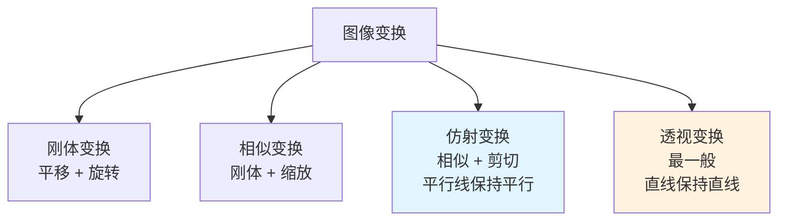

# 图像变换

## 概念说明

**图像变换**（Image Transformation）是对图像进行几何操作的技术，包括缩放、旋转、平移、仿射变换和透视变换。这些操作在数据增强、图像校正、文档扫描等场景中广泛使用。

### 变换类型层级



## 核心原理

### 1. 图像缩放 — `cv2.resize()`

```python
import cv2
import numpy as np

# 按比例缩放
resized = cv2.resize(img, None, fx=0.5, fy=0.5)  # 缩小一半

# 指定目标尺寸
resized = cv2.resize(img, (640, 480))  # (宽, 高)

# 插值方法
resized = cv2.resize(img, (640, 480), interpolation=cv2.INTER_LINEAR)
```

**插值方法对比：**

| 方法 | 速度 | 质量 | 适用场景 |
|------|------|------|---------|
| `INTER_NEAREST` | 最快 | 最低 | 掩码/标签图缩放 |
| `INTER_LINEAR` | 快 | 中等 | 默认，通用缩放 |
| `INTER_CUBIC` | 中等 | 较高 | 放大图像 |
| `INTER_AREA` | 中等 | 高 | 缩小图像（推荐） |
| `INTER_LANCZOS4` | 慢 | 最高 | 高质量放大 |

### 2. 图像旋转

```python
# 获取旋转矩阵
h, w = img.shape[:2]
center = (w // 2, h // 2)
M = cv2.getRotationMatrix2D(center, angle=45, scale=1.0)
# center: 旋转中心
# angle: 逆时针旋转角度
# scale: 缩放因子

# 应用旋转
rotated = cv2.warpAffine(img, M, (w, h))

# 旋转后保留完整图像（计算新尺寸）
cos = abs(M[0, 0])
sin = abs(M[0, 1])
new_w = int(h * sin + w * cos)
new_h = int(h * cos + w * sin)
M[0, 2] += (new_w - w) / 2
M[1, 2] += (new_h - h) / 2
rotated_full = cv2.warpAffine(img, M, (new_w, new_h))
```

### 3. 仿射变换

仿射变换保持平行线的平行性，由 2×3 矩阵定义。需要 3 对对应点：

```python
# 定义 3 对对应点
pts_src = np.float32([[50, 50], [200, 50], [50, 200]])
pts_dst = np.float32([[10, 100], [200, 50], [100, 250]])

# 计算仿射变换矩阵
M = cv2.getAffineTransform(pts_src, pts_dst)

# 应用仿射变换
affine = cv2.warpAffine(img, M, (w, h))
```

**仿射变换矩阵的含义：**

```
| a  b  tx |     a, b: 旋转 + 缩放 + 剪切
| c  d  ty |     tx, ty: 平移
```

### 4. 透视变换（最常用于文档扫描）

透视变换可以将任意四边形映射为矩形，需要 4 对对应点：

```python
# 定义 4 对对应点（源图像中的四边形 → 目标矩形）
pts_src = np.float32([[56, 65], [368, 52], [28, 387], [389, 390]])
pts_dst = np.float32([[0, 0], [300, 0], [0, 400], [300, 400]])

# 计算透视变换矩阵（3×3）
M = cv2.getPerspectiveTransform(pts_src, pts_dst)

# 应用透视变换
perspective = cv2.warpPerspective(img, M, (300, 400))
```

**透视变换的典型应用：**


### 5. 翻转操作

```python
# 水平翻转（左右镜像）
flipped_h = cv2.flip(img, 1)

# 垂直翻转（上下镜像）
flipped_v = cv2.flip(img, 0)

# 同时翻转（180° 旋转）
flipped_both = cv2.flip(img, -1)
```

### 6. 图像平移

```python
# 平移矩阵
tx, ty = 100, 50  # 向右 100，向下 50
M = np.float32([[1, 0, tx], [0, 1, ty]])
translated = cv2.warpAffine(img, M, (w, h))
```

## 代码示例

> 💻 完整可运行代码：[code-examples/04-cv/opencv/01_image_basics.py](https://github.com/your-repo/tree/main/code-examples/04-cv/opencv/01_image_basics.py)
> 🐍 Python 版本：3.11+

## 实战要点

**数据增强中的图像变换：**
- 随机缩放（0.8-1.2 倍）+ 随机旋转（±15°）是常用增强策略
- 透视变换可模拟不同拍摄角度
- 翻转是最简单有效的增强方式（水平翻转几乎不影响语义）

**性能优化：**
- 多次变换合并为一个矩阵运算（矩阵乘法）
- 大批量图像变换用 GPU 加速（cv2.cuda）
- 缩小图像时用 `INTER_AREA`，放大时用 `INTER_LINEAR`

## 常见面试题

### Q1: 仿射变换和透视变换的区别？

**难度**：⭐⭐ | **频率**：🔥🔥

**答题思路**：数学定义 → 几何性质 → 应用场景

**标准答案**：仿射变换由 2×3 矩阵定义，保持平行线的平行性，需要 3 对对应点，包含平移、旋转、缩放和剪切。透视变换由 3×3 矩阵定义，只保持直线的直线性（平行线可能不再平行），需要 4 对对应点，可以模拟相机视角变化。仿射变换是透视变换的特例。典型应用：仿射用于图像校正，透视用于文档扫描矫正。

**深入追问**：
- 如何自动检测文档的四个角点？（轮廓检测 + 多边形近似）
- 变换矩阵如何组合？（矩阵乘法，注意顺序）

## 推荐工具

> 📌 以下工具可帮助你更高效地学习和实践本知识点，详见 [模块 7：AI 使用与实践](/7-ai-tools/)

| 工具 | 用途 | 详情 |
|------|------|------|
| Cursor | 辅助编写变换代码 | [AI 编程辅助](/7-ai-tools/7.1-efficiency/ai-coding) |
| ChatGPT | 解释变换矩阵原理 | [AI 对话助手](/7-ai-tools/7.1-efficiency/ai-chat) |
| Perplexity | 搜索变换应用案例 | [AI 搜索](/7-ai-tools/7.1-efficiency/ai-search) |

## 参考资料

- [OpenCV 几何变换](https://docs.opencv.org/4.x/da/d6e/tutorial_py_geometric_transformations.html)
- [仿射变换 — Wikipedia](https://en.wikipedia.org/wiki/Affine_transformation)
- [透视变换 — Wikipedia](https://en.wikipedia.org/wiki/Perspective_transform)
- [图像插值方法对比](https://docs.opencv.org/4.x/da/d54/group__imgproc__transform.html)
