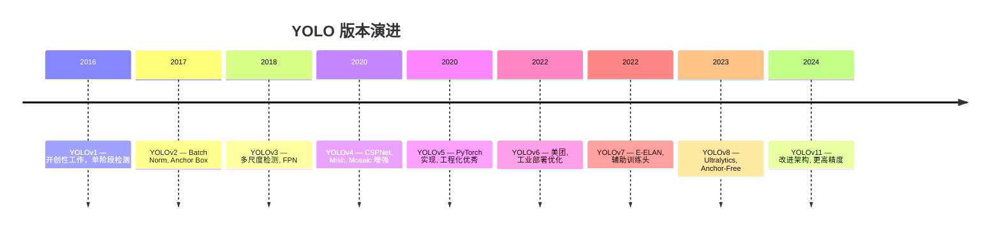
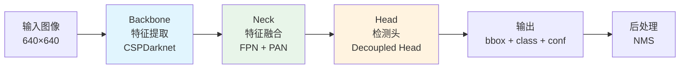

# YOLO 目标检测

## 概念说明

**YOLO**（You Only Look Once）是最流行的实时目标检测算法系列。与两阶段检测器（如 Faster R-CNN）不同，YOLO 将检测问题转化为回归问题，一次前向传播同时预测所有目标的位置和类别，实现了速度与精度的平衡。

### 为什么 YOLO 如此重要？

- **实时性**：YOLOv8n 在 GPU 上可达 600+ FPS
- **易用性**：Ultralytics 框架 3 行代码完成检测
- **生态完善**：支持检测、分割、姿态估计、跟踪等多任务
- **面试必考**：CV 岗位几乎必问 YOLO 架构演进

### YOLO 架构演进



## 核心原理

### 1. YOLO 检测原理



**三大组件：**

| 组件 | 作用 | YOLOv8 实现 |
|------|------|------------|
| Backbone | 提取图像特征 | CSPDarknet（C2f 模块） |
| Neck | 多尺度特征融合 | FPN（自顶向下）+ PAN（自底向上） |
| Head | 预测 bbox/class | Decoupled Head（分类和回归解耦） |

### 2. YOLOv8 关键改进

相比 YOLOv5，YOLOv8 的主要改进：

- **Anchor-Free**：不再使用预定义 Anchor Box，直接预测中心点偏移
- **C2f 模块**：替代 C3 模块，更多梯度流分支
- **Decoupled Head**：分类和回归使用独立分支
- **Distribution Focal Loss**：回归损失使用 DFL
- **Task-Aligned Assigner**：动态标签分配策略

### 3. Ultralytics 框架使用

```python
from ultralytics import YOLO

# 加载预训练模型
model = YOLO("yolov8n.pt")  # nano 版本，最快
# 可选：yolov8s.pt, yolov8m.pt, yolov8l.pt, yolov8x.pt

# 图像检测
results = model("image.jpg")

# 解析结果
for result in results:
    boxes = result.boxes          # 检测框
    for box in boxes:
        xyxy = box.xyxy[0]        # [x1, y1, x2, y2]
        conf = box.conf[0]        # 置信度
        cls = int(box.cls[0])     # 类别 ID
        name = result.names[cls]  # 类别名称
        print(f"{name}: {conf:.2f} at {xyxy}")

# 视频检测
results = model("video.mp4", stream=True)
for result in results:
    annotated = result.plot()  # 绘制检测结果
```

### 4. 模型规格对比

| 模型 | 参数量 | mAP50-95 | 速度(T4 GPU) | 适用场景 |
|------|--------|----------|-------------|---------|
| YOLOv8n | 3.2M | 37.3 | 1.2ms | 边缘设备/实时 |
| YOLOv8s | 11.2M | 44.9 | 1.9ms | 平衡选择 |
| YOLOv8m | 25.9M | 50.2 | 4.3ms | 通用场景 |
| YOLOv8l | 43.7M | 52.9 | 6.2ms | 高精度 |
| YOLOv8x | 68.2M | 53.9 | 9.8ms | 最高精度 |

### 5. NMS（非极大值抑制）

```python
# NMS 流程
# 1. 按置信度排序所有检测框
# 2. 选择置信度最高的框
# 3. 计算其与其他框的 IoU
# 4. 删除 IoU > 阈值的框（重叠框）
# 5. 重复 2-4 直到处理完所有框

# Ultralytics 中的 NMS 参数
results = model.predict(
    source="image.jpg",
    conf=0.25,    # 置信度阈值
    iou=0.7,      # NMS IoU 阈值
    max_det=300,  # 最大检测数
)
```

## 代码示例

> 💻 完整可运行代码：[code-examples/04-cv/yolo/01_detection.py](https://github.com/skyhe58/guide-ai/tree/main/code-examples/04-cv/yolo/01_detection.py)
> 🐍 Python 版本：3.11+
> 📦 依赖：ultralytics>=8.0（完整模式）

## 实战要点

**生产环境部署：**
- **模型选择**：边缘设备用 nano/small，服务器用 medium/large
- **输入尺寸**：640×640 是默认值，可根据目标大小调整（小目标用 1280）
- **批处理**：服务端推理用 batch 提升吞吐量
- **模型导出**：生产环境导出为 ONNX/TensorRT 加速

**常见陷阱：**
- 训练数据标注质量直接决定模型效果
- 小目标检测需要更大输入尺寸或特殊策略
- NMS 阈值设置不当会导致漏检或重复检测

## 常见面试题

### Q1: YOLO 的核心思想是什么？与两阶段检测器有什么区别？

**难度**：⭐⭐ | **频率**：🔥🔥🔥

**答题思路**：YOLO 核心思想 → 与 Faster R-CNN 对比 → 优劣势

**标准答案**：YOLO 将目标检测转化为回归问题，一次前向传播同时预测所有目标的位置和类别（"You Only Look Once"）。两阶段检测器（如 Faster R-CNN）先用 RPN 生成候选区域，再对每个区域分类和回归。YOLO 优势：速度快（实时），端到端训练。劣势：早期版本小目标检测较弱。现代 YOLO（v8+）通过多尺度检测、FPN 等技术已大幅改善。

**深入追问**：
- Anchor-Based 和 Anchor-Free 的区别？（预定义框 vs 直接预测中心点）
- NMS 的替代方案有哪些？（Soft-NMS、DIoU-NMS、端到端检测器 DETR）

### Q2: YOLOv8 相比 YOLOv5 有哪些改进？

**难度**：⭐⭐⭐ | **频率**：🔥🔥🔥

**答题思路**：架构改进 → 训练策略 → 性能提升

**标准答案**：(1) Anchor-Free 设计，不再需要预定义 Anchor；(2) C2f 模块替代 C3，更多梯度流分支；(3) Decoupled Head，分类和回归解耦；(4) Task-Aligned Assigner 动态标签分配；(5) Distribution Focal Loss 改进回归损失；(6) 统一框架支持检测/分割/姿态估计/分类多任务。

**深入追问**：
- Anchor-Free 为什么比 Anchor-Based 好？（无需手动设计 Anchor，泛化性更强）
- Decoupled Head 的优势？（分类和回归任务特征需求不同，解耦后各自优化）

## 推荐工具

> 📌 以下工具可帮助你更高效地学习和实践本知识点，详见 [模块 7：AI 使用与实践](/7-ai-tools/)

| 工具 | 用途 | 详情 |
|------|------|------|
| Cursor | 辅助编写 YOLO 代码 | [AI 编程辅助](/7-ai-tools/7.1-efficiency/ai-coding) |
| ChatGPT | 解释 YOLO 架构原理 | [AI 对话助手](/7-ai-tools/7.1-efficiency/ai-chat) |
| Perplexity | 搜索 YOLO 最新版本 | [AI 搜索](/7-ai-tools/7.1-efficiency/ai-search) |

## 参考资料

- [Ultralytics YOLOv8 文档](https://docs.ultralytics.com/)
- [YOLOv8 论文](https://docs.ultralytics.com/models/yolov8/)
- [YOLO 系列论文汇总](https://github.com/ultralytics/ultralytics)
- [COCO 数据集](https://cocodataset.org/)
- [Papers With Code — Object Detection](https://paperswithcode.com/task/object-detection)
