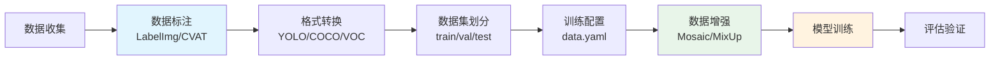
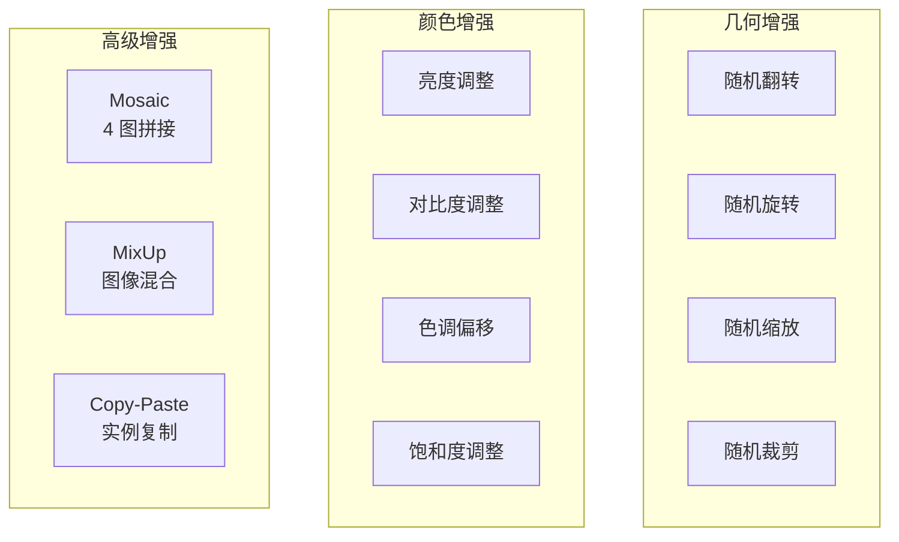

# 模型训练

## 概念说明

目标检测模型训练是将标注好的数据集用于训练 YOLO 等模型的过程。完整流程包括数据收集、标注、格式转换、训练配置、数据增强和训练执行。数据质量直接决定模型效果——"Garbage In, Garbage Out"。

### 训练完整流程



## 核心原理

### 1. 数据标注工具

| 工具 | 类型 | 特点 | 适用场景 |
|------|------|------|---------|
| LabelImg | 桌面端 | 简单易用，支持 YOLO/VOC 格式 | 小规模标注 |
| CVAT | Web 端 | 功能强大，支持团队协作 | 中大规模标注 |
| Label Studio | Web 端 | 支持多种任务类型 | 多模态标注 |
| Roboflow | 云平台 | 标注+增强+导出一站式 | 快速原型 |
| SAM 辅助标注 | AI 辅助 | 自动分割辅助标注 | 加速标注 |

### 2. YOLO 数据格式

**YOLO 格式（TXT）：**

```
# 每行一个目标：class_id center_x center_y width height
# 所有值归一化到 [0, 1]
0 0.5 0.5 0.3 0.4
1 0.2 0.8 0.1 0.15
```

**目录结构：**

```
dataset/
├── images/
│   ├── train/
│   │   ├── img001.jpg
│   │   └── img002.jpg
│   └── val/
│       ├── img003.jpg
│       └── img004.jpg
├── labels/
│   ├── train/
│   │   ├── img001.txt
│   │   └── img002.txt
│   └── val/
│       ├── img003.txt
│       └── img004.txt
└── data.yaml
```

### 3. 数据集配置文件 — `data.yaml`

```yaml
# data.yaml
path: /path/to/dataset    # 数据集根目录
train: images/train       # 训练集路径（相对于 path）
val: images/val           # 验证集路径
test: images/test         # 测试集路径（可选）

# 类别定义
names:
  0: person
  1: car
  2: bicycle
  3: dog

nc: 4  # 类别数量
```

### 4. 训练配置与执行

```python
from ultralytics import YOLO

# 加载预训练模型
model = YOLO("yolov8n.pt")

# 开始训练
results = model.train(
    data="data.yaml",       # 数据集配置
    epochs=100,             # 训练轮数
    imgsz=640,              # 输入图像尺寸
    batch=16,               # 批大小
    lr0=0.01,               # 初始学习率
    lrf=0.01,               # 最终学习率（lr0 * lrf）
    optimizer="SGD",        # 优化器
    patience=50,            # 早停耐心值
    device="0",             # GPU 设备
    workers=8,              # 数据加载线程数
    project="runs/detect",  # 输出目录
    name="exp1",            # 实验名称
)
```

**关键超参数：**

| 参数 | 默认值 | 说明 | 调优建议 |
|------|--------|------|---------|
| `epochs` | 100 | 训练轮数 | 小数据集 200+，大数据集 50-100 |
| `imgsz` | 640 | 输入尺寸 | 小目标用 1280 |
| `batch` | 16 | 批大小 | 显存允许尽量大 |
| `lr0` | 0.01 | 初始学习率 | 微调时降低 10 倍 |
| `patience` | 50 | 早停 | 防止过拟合 |
| `mosaic` | 1.0 | Mosaic 增强 | 最后 10 epoch 关闭 |

### 5. 数据增强策略



**Ultralytics 内置增强参数：**

```python
# 训练时的增强配置
model.train(
    data="data.yaml",
    # 几何增强
    hsv_h=0.015,      # 色调偏移
    hsv_s=0.7,        # 饱和度偏移
    hsv_v=0.4,        # 明度偏移
    degrees=0.0,      # 旋转角度
    translate=0.1,    # 平移比例
    scale=0.5,        # 缩放比例
    shear=0.0,        # 剪切角度
    flipud=0.0,       # 上下翻转概率
    fliplr=0.5,       # 左右翻转概率
    # 高级增强
    mosaic=1.0,       # Mosaic 概率
    mixup=0.0,        # MixUp 概率
    copy_paste=0.0,   # Copy-Paste 概率
)
```

### 6. 格式转换

```python
# COCO JSON → YOLO TXT
def coco_to_yolo(coco_json_path, output_dir):
    """将 COCO 格式标注转换为 YOLO 格式。"""
    import json
    with open(coco_json_path) as f:
        coco = json.load(f)
    
    for ann in coco["annotations"]:
        img_id = ann["image_id"]
        img_info = next(i for i in coco["images"] if i["id"] == img_id)
        w, h = img_info["width"], img_info["height"]
        
        # COCO bbox: [x, y, width, height] (左上角)
        bx, by, bw, bh = ann["bbox"]
        
        # 转换为 YOLO 格式: center_x, center_y, width, height (归一化)
        cx = (bx + bw / 2) / w
        cy = (by + bh / 2) / h
        nw = bw / w
        nh = bh / h
        
        cat_id = ann["category_id"]
        # 写入 TXT 文件...
```

## 代码示例

> 💻 完整可运行代码：[code-examples/04-cv/yolo/02_custom_training.py](https://github.com/skyhe58/guide-ai/tree/main/code-examples/04-cv/yolo/02_custom_training.py)
> 🐍 Python 版本：3.11+
> 📦 依赖：ultralytics>=8.0（完整模式）

## 实战要点

**数据标注最佳实践：**
- **标注一致性**：制定标注规范，多人标注时定期校准
- **数据量**：每个类别至少 500-1000 张图像
- **数据平衡**：各类别数量尽量均衡，否则用过采样/欠采样
- **负样本**：包含不含目标的背景图（10-20%）

**训练技巧：**
- 先用小数据集跑通流程，再扩大数据量
- 使用预训练权重（迁移学习）大幅减少训练时间
- 监控 loss 曲线，train loss 下降但 val loss 上升说明过拟合
- Mosaic 增强在最后 10 个 epoch 关闭效果更好

## 常见面试题

### Q1: 目标检测数据集标注有哪些注意事项？

**难度**：⭐⭐ | **频率**：🔥🔥

**答题思路**：标注规范 → 数据质量 → 常见问题

**标准答案**：(1) 标注框要紧贴目标边缘，不要留太多空白；(2) 遮挡目标也要标注（标注可见部分）；(3) 制定统一的标注规范（什么算目标、遮挡比例阈值）；(4) 多人标注时定期交叉验证；(5) 包含足够的负样本（背景图）；(6) 数据集划分要随机且保持类别分布一致。

**深入追问**：
- 如何处理类别不平衡？（过采样、欠采样、Focal Loss）
- 小数据集如何提升效果？（数据增强、迁移学习、半监督学习）

## 推荐工具

> 📌 以下工具可帮助你更高效地学习和实践本知识点，详见 [模块 7：AI 使用与实践](/7-ai-tools/)

| 工具 | 用途 | 详情 |
|------|------|------|
| Cursor | 辅助编写训练脚本 | [AI 编程辅助](/7-ai-tools/7.1-efficiency/ai-coding) |
| ChatGPT | 解释训练超参数 | [AI 对话助手](/7-ai-tools/7.1-efficiency/ai-chat) |
| Perplexity | 搜索标注工具和实践 | [AI 搜索](/7-ai-tools/7.1-efficiency/ai-search) |

## 参考资料

- [Ultralytics 训练文档](https://docs.ultralytics.com/modes/train/)
- [CVAT 标注工具](https://www.cvat.ai/)
- [Roboflow 数据集平台](https://roboflow.com/)
- [COCO 数据格式](https://cocodataset.org/#format-data)
