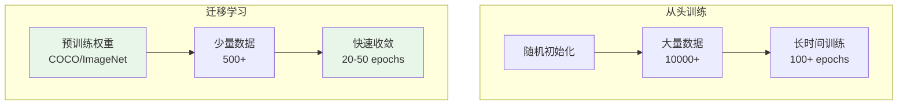
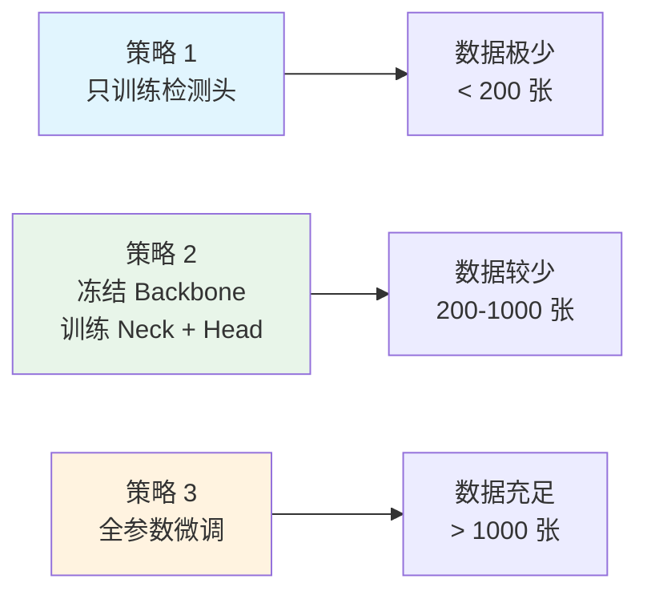
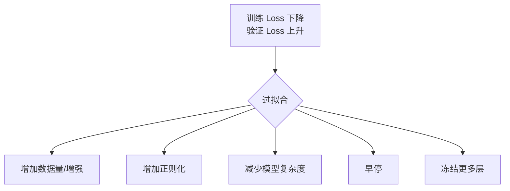

# 模型微调

## 概念说明

**模型微调**（Fine-tuning）是在预训练模型基础上，用特定领域数据继续训练的技术。相比从头训练，微调可以用更少的数据和计算资源达到更好的效果。这是 CV 工程中最常用的模型开发方式。

### 迁移学习 vs 从头训练



## 核心原理

### 1. 迁移学习的层级理解

CNN 的不同层学习不同级别的特征：

| 层级 | 学习内容 | 迁移性 | 微调策略 |
|------|---------|--------|---------|
| 浅层（前几层） | 边缘、纹理、颜色 | 高（通用特征） | 通常冻结 |
| 中间层 | 形状、部件 | 中等 | 可选冻结 |
| 深层（后几层） | 高级语义特征 | 低（任务相关） | 必须训练 |
| 检测头 | 类别和位置 | 无（任务特定） | 必须训练 |

### 2. 微调策略



### 3. YOLO 微调实践

```python
from ultralytics import YOLO

# 策略 1：只训练检测头（冻结 Backbone）
model = YOLO("yolov8n.pt")
model.train(
    data="custom_data.yaml",
    epochs=50,
    freeze=10,          # 冻结前 10 层（Backbone）
    lr0=0.001,          # 较低学习率
    batch=16,
)

# 策略 2：全参数微调（较低学习率）
model = YOLO("yolov8n.pt")
model.train(
    data="custom_data.yaml",
    epochs=100,
    freeze=0,           # 不冻结任何层
    lr0=0.001,          # 比从头训练低 10 倍
    warmup_epochs=5,    # 预热阶段
    batch=16,
)

# 策略 3：从已有自定义模型继续训练
model = YOLO("runs/detect/exp1/weights/best.pt")
model.train(
    data="custom_data.yaml",
    epochs=50,
    lr0=0.0001,         # 更低学习率
    resume=True,        # 从上次中断处继续
)
```

### 4. 小样本训练策略

当数据量极少（< 500 张）时的应对策略：

| 策略 | 方法 | 效果 |
|------|------|------|
| 强数据增强 | Mosaic + MixUp + Copy-Paste | 等效扩充数据 3-5 倍 |
| 冻结更多层 | freeze=15（只训练最后几层） | 防止过拟合 |
| 降低学习率 | lr0=0.0001 | 避免破坏预训练特征 |
| 早停 | patience=20 | 及时停止防止过拟合 |
| 正则化 | weight_decay=0.001 | 限制参数更新幅度 |
| 预训练数据 | 先在相似大数据集上训练 | 两阶段迁移 |

### 5. 学习率调度

```python
# Ultralytics 默认使用余弦退火
model.train(
    lr0=0.01,           # 初始学习率
    lrf=0.01,           # 最终学习率 = lr0 * lrf
    warmup_epochs=3,    # 预热轮数
    warmup_momentum=0.8,# 预热动量
    warmup_bias_lr=0.1, # 预热偏置学习率
    cos_lr=True,        # 余弦退火（默认）
)
```

### 6. 过拟合诊断与处理



**过拟合信号：**
- train/box_loss 持续下降，val/box_loss 开始上升
- mAP 在验证集上不再提升
- 训练集精度远高于验证集

## 代码示例

> 💻 完整可运行代码：[code-examples/04-cv/yolo/02_custom_training.py](https://github.com/skyhe58/guide-ai/tree/main/code-examples/04-cv/yolo/02_custom_training.py)
> 🐍 Python 版本：3.11+

## 实战要点

**微调最佳实践：**
- **先跑 baseline**：用预训练模型直接推理，评估零样本效果
- **渐进式解冻**：先冻结 Backbone 训练几轮，再解冻全部层
- **学习率差异化**：Backbone 用更低学习率，Head 用更高学习率
- **监控指标**：关注 mAP 而非 loss，loss 低不代表 mAP 高

**常见陷阱：**
- 微调学习率太高，破坏预训练特征（"灾难性遗忘"）
- 数据太少时不做增强，导致严重过拟合
- 忘记调整类别数（nc），导致检测头维度不匹配

## 常见面试题

### Q1: 迁移学习的原理是什么？为什么有效？

**难度**：⭐⭐ | **频率**：🔥🔥🔥

**答题思路**：原理 → 为什么有效 → 实践策略

**标准答案**：迁移学习利用在大规模数据集（如 ImageNet/COCO）上预训练的模型权重作为初始化，再在目标数据集上微调。有效原因：(1) CNN 浅层学习的边缘、纹理等低级特征具有通用性；(2) 预训练提供了好的参数初始化，加速收敛；(3) 相当于隐式的正则化，减少过拟合风险。实践策略：数据少时冻结更多层，数据多时全参数微调。

**深入追问**：
- 源域和目标域差异很大时怎么办？（两阶段迁移，先在相似中间域训练）
- 灾难性遗忘如何避免？（低学习率、冻结层、EWC 正则化）

## 推荐工具

> 📌 以下工具可帮助你更高效地学习和实践本知识点，详见 [模块 7：AI 使用与实践](/7-ai-tools/)

| 工具 | 用途 | 详情 |
|------|------|------|
| Cursor | 辅助编写微调脚本 | [AI 编程辅助](/7-ai-tools/7.1-efficiency/ai-coding) |
| ChatGPT | 解释迁移学习策略 | [AI 对话助手](/7-ai-tools/7.1-efficiency/ai-chat) |
| Perplexity | 搜索微调最新技巧 | [AI 搜索](/7-ai-tools/7.1-efficiency/ai-search) |

## 参考资料

- [Ultralytics Fine-tuning Guide](https://docs.ultralytics.com/guides/fine-tuning/)
- [Transfer Learning — CS231n](https://cs231n.github.io/transfer-learning/)
- [A Survey on Transfer Learning](https://arxiv.org/abs/1808.01974)
- [How transferable are features in deep neural networks?](https://arxiv.org/abs/1411.1792)
