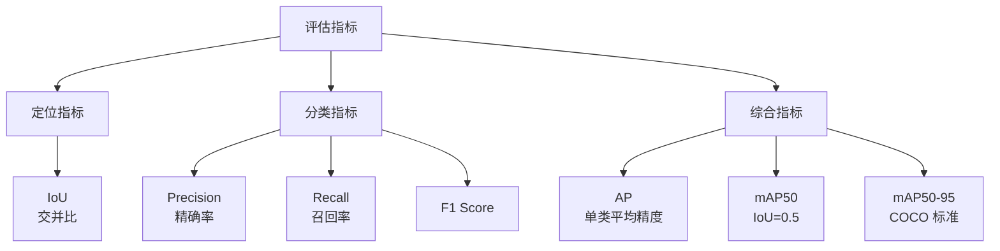
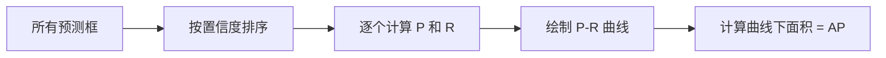

# 模型评估

## 概念说明

目标检测模型评估是衡量模型性能的关键步骤。核心指标包括 Precision（精确率）、Recall（召回率）、mAP（平均精度均值）和 IoU（交并比）。理解这些指标对于模型选型、调优和面试都至关重要。

### 评估指标体系



## 核心原理

### 1. IoU（Intersection over Union）

IoU 衡量预测框与真实框的重叠程度：

```
IoU = 交集面积 / 并集面积

IoU = Area(Pred ∩ GT) / Area(Pred ∪ GT)
```

| IoU 值 | 含义 | 判定 |
|--------|------|------|
| 0.0 | 完全不重叠 | 错误检测 |
| 0.5 | 一般重叠 | PASCAL VOC 标准 |
| 0.75 | 较好重叠 | 严格标准 |
| 1.0 | 完全重叠 | 完美检测 |

```python
def calculate_iou(box1, box2):
    """计算两个框的 IoU。
    box 格式: [x1, y1, x2, y2]
    """
    x1 = max(box1[0], box2[0])
    y1 = max(box1[1], box2[1])
    x2 = min(box1[2], box2[2])
    y2 = min(box1[3], box2[3])
    
    intersection = max(0, x2 - x1) * max(0, y2 - y1)
    area1 = (box1[2] - box1[0]) * (box1[3] - box1[1])
    area2 = (box2[2] - box2[0]) * (box2[3] - box2[1])
    union = area1 + area2 - intersection
    
    return intersection / union if union > 0 else 0
```

### 2. Precision 和 Recall

在给定 IoU 阈值下：

| 指标 | 公式 | 含义 |
|------|------|------|
| Precision | TP / (TP + FP) | 检测到的目标中，正确的比例 |
| Recall | TP / (TP + FN) | 所有真实目标中，被检测到的比例 |
| F1 Score | 2 × P × R / (P + R) | Precision 和 Recall 的调和平均 |

**TP/FP/FN 定义（IoU 阈值 = 0.5）：**

| 类型 | 定义 |
|------|------|
| TP（True Positive） | 预测框与真实框 IoU ≥ 0.5 |
| FP（False Positive） | 预测框与所有真实框 IoU < 0.5（误检） |
| FN（False Negative） | 没有被任何预测框匹配的真实框（漏检） |

### 3. AP（Average Precision）

AP 是 Precision-Recall 曲线下的面积，衡量单个类别的检测性能：



**计算步骤：**
1. 将所有预测框按置信度从高到低排序
2. 逐个加入预测框，计算当前的 Precision 和 Recall
3. 绘制 P-R 曲线
4. 计算曲线下面积（使用 11 点插值或全点插值）

### 4. mAP（mean Average Precision）

mAP 是所有类别 AP 的平均值：

| 指标 | IoU 阈值 | 说明 | 使用场景 |
|------|---------|------|---------|
| mAP50 | 0.5 | PASCAL VOC 标准 | 宽松评估 |
| mAP75 | 0.75 | 严格标准 | 高精度要求 |
| mAP50-95 | 0.5:0.05:0.95 | COCO 标准（10 个阈值平均） | 最全面 |

```python
# mAP50-95 计算
# 在 IoU = 0.5, 0.55, 0.60, ..., 0.95 共 10 个阈值下
# 分别计算 mAP，然后取平均
mAP_50_95 = mean([mAP_at_iou(t) for t in [0.5, 0.55, ..., 0.95]])
```

### 5. 混淆矩阵

```python
# Ultralytics 自动生成混淆矩阵
from ultralytics import YOLO

model = YOLO("best.pt")
metrics = model.val(data="data.yaml")

# 查看指标
print(f"mAP50: {metrics.box.map50:.4f}")
print(f"mAP50-95: {metrics.box.map:.4f}")
print(f"Precision: {metrics.box.mp:.4f}")
print(f"Recall: {metrics.box.mr:.4f}")

# 每个类别的 AP
for i, name in enumerate(metrics.names.values()):
    print(f"  {name}: AP50={metrics.box.ap50[i]:.4f}")
```

### 6. IoU 变体

| 变体 | 改进 | 优势 |
|------|------|------|
| GIoU | 考虑最小外接框 | 解决不重叠时梯度为 0 的问题 |
| DIoU | 考虑中心点距离 | 收敛更快 |
| CIoU | 考虑宽高比 | 最全面的 IoU 损失 |

## 代码示例

> 💻 完整可运行代码：[code-examples/04-cv/yolo/01_detection.py](https://github.com/skyhe58/guide-ai/tree/main/code-examples/04-cv/yolo/01_detection.py)
> 🐍 Python 版本：3.11+

## 实战要点

**评估最佳实践：**
- **使用 mAP50-95**：COCO 标准最全面，不要只看 mAP50
- **关注每类 AP**：整体 mAP 高不代表每个类别都好
- **测试集独立**：测试集不能参与训练和验证
- **可视化分析**：看混淆矩阵找出容易混淆的类别

**指标选择指南：**
- 安全场景（自动驾驶）→ 高 Recall（不能漏检）
- 精确场景（质检）→ 高 Precision（不能误检）
- 通用场景 → 平衡 F1 Score

## 常见面试题

### Q1: mAP 是如何计算的？mAP50 和 mAP50-95 有什么区别？

**难度**：⭐⭐⭐ | **频率**：🔥🔥🔥

**答题思路**：AP 定义 → mAP 计算 → 两种标准对比

**标准答案**：AP 是单个类别的 Precision-Recall 曲线下面积。mAP 是所有类别 AP 的平均值。mAP50 在 IoU=0.5 阈值下计算，是 PASCAL VOC 标准，评估较宽松。mAP50-95 在 IoU=0.5 到 0.95（步长 0.05）共 10 个阈值下分别计算 mAP 再取平均，是 COCO 标准，评估更全面严格。mAP50-95 更能反映模型的定位精度。

**深入追问**：
- 为什么 mAP50-95 比 mAP50 更有意义？（区分定位精度差异）
- AP 的 11 点插值和全点插值有什么区别？

### Q2: Precision 和 Recall 的权衡？什么场景侧重哪个？

**难度**：⭐⭐ | **频率**：🔥🔥🔥

**答题思路**：定义 → 权衡关系 → 场景选择

**标准答案**：Precision 和 Recall 通常是此消彼长的关系——提高置信度阈值，Precision 上升但 Recall 下降。安全关键场景（自动驾驶行人检测）侧重 Recall，宁可误检不能漏检。精确场景（工业质检）侧重 Precision，减少误报。通用场景用 F1 Score 平衡两者。可以通过调整置信度阈值来控制 P-R 权衡。

**深入追问**：
- 如何通过调整 NMS 阈值影响 P-R？（IoU 阈值低→更多框被抑制→Precision 高 Recall 低）
- F1 Score 的局限性？（不考虑 TN，不适合类别极不平衡场景）

## 推荐工具

> 📌 以下工具可帮助你更高效地学习和实践本知识点，详见 [模块 7：AI 使用与实践](/7-ai-tools/)

| 工具 | 用途 | 详情 |
|------|------|------|
| Cursor | 辅助编写评估脚本 | [AI 编程辅助](/7-ai-tools/7.1-efficiency/ai-coding) |
| ChatGPT | 解释评估指标原理 | [AI 对话助手](/7-ai-tools/7.1-efficiency/ai-chat) |
| Perplexity | 搜索评估标准 | [AI 搜索](/7-ai-tools/7.1-efficiency/ai-search) |

## 参考资料

- [COCO 评估指标](https://cocodataset.org/#detection-eval)
- [PASCAL VOC 评估](http://host.robots.ox.ac.uk/pascal/VOC/)
- [mAP 详解 — Jonathan Hui](https://jonathan-hui.medium.com/map-mean-average-precision-for-object-detection-45c121a31173)
- [Ultralytics 验证文档](https://docs.ultralytics.com/modes/val/)
