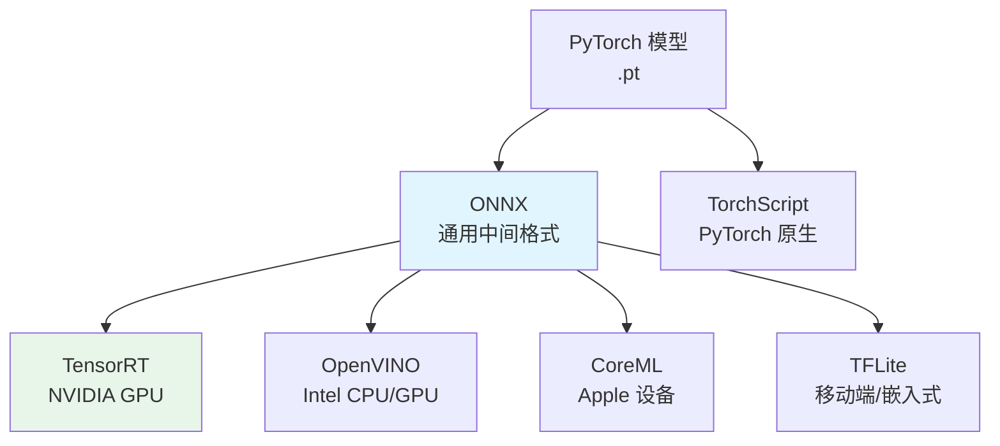
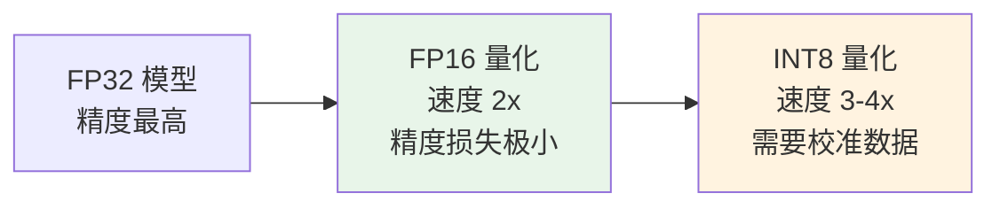

# 模型导出

## 概念说明

模型导出是将训练好的 PyTorch 模型转换为其他推理框架支持的格式，以实现更快的推理速度和更广泛的部署平台支持。ONNX 是通用中间格式，TensorRT 针对 NVIDIA GPU 优化，CoreML 针对 Apple 设备优化。

### 导出格式生态



## 核心原理

### 1. 导出格式对比

| 格式 | 目标平台 | 加速比 | 精度损失 | 易用性 |
|------|---------|--------|---------|--------|
| ONNX | 通用 | 1.5-2x | 无 | ⭐⭐⭐⭐⭐ |
| TensorRT | NVIDIA GPU | 2-5x | 极小（FP16） | ⭐⭐⭐ |
| OpenVINO | Intel CPU | 2-3x | 极小 | ⭐⭐⭐⭐ |
| CoreML | Apple M1/M2 | 2-3x | 极小 | ⭐⭐⭐⭐ |
| TFLite | 移动端 | 1.5-3x | 小（INT8） | ⭐⭐⭐ |
| TorchScript | PyTorch | 1.2x | 无 | ⭐⭐⭐⭐⭐ |

### 2. ONNX 导出（最通用）

```python
from ultralytics import YOLO

model = YOLO("best.pt")

# 导出为 ONNX
model.export(
    format="onnx",
    imgsz=640,
    half=False,       # FP16（需要 GPU）
    simplify=True,    # 简化 ONNX 图
    opset=12,         # ONNX opset 版本
    dynamic=False,    # 动态输入尺寸
)
# 输出: best.onnx
```

**ONNX Runtime 推理：**

```python
import onnxruntime as ort
import numpy as np

# 创建推理会话
session = ort.InferenceSession("best.onnx", providers=["CUDAExecutionProvider"])

# 准备输入
input_name = session.get_inputs()[0].name
input_data = np.random.randn(1, 3, 640, 640).astype(np.float32)

# 推理
outputs = session.run(None, {input_name: input_data})
```

### 3. TensorRT 导出（NVIDIA GPU 最快）

```python
# 导出为 TensorRT（需要 NVIDIA GPU + TensorRT 安装）
model.export(
    format="engine",
    imgsz=640,
    half=True,        # FP16 加速（推荐）
    device=0,         # GPU 设备
    workspace=4,      # 工作空间大小（GB）
)
# 输出: best.engine
```

**TensorRT 精度模式：**

| 精度 | 速度 | 精度损失 | 显存 | 适用场景 |
|------|------|---------|------|---------|
| FP32 | 基准 | 无 | 大 | 精度优先 |
| FP16 | 2x | 极小 | 减半 | 推荐默认 |
| INT8 | 3-4x | 小 | 1/4 | 边缘设备 |

### 4. CoreML 导出（Apple 设备）

```python
# 导出为 CoreML
model.export(
    format="coreml",
    imgsz=640,
    half=False,
    nms=True,         # 包含 NMS 后处理
)
# 输出: best.mlpackage
```

### 5. 模型量化

量化是将模型权重从 FP32 转换为更低精度（FP16/INT8）的技术：



```python
# INT8 量化（需要校准数据集）
model.export(
    format="engine",
    imgsz=640,
    int8=True,
    data="data.yaml",  # 校准数据集
)
```

### 6. 导出后验证

```python
# 验证导出模型的精度
onnx_model = YOLO("best.onnx")
metrics = onnx_model.val(data="data.yaml")
print(f"ONNX mAP50-95: {metrics.box.map:.4f}")

# 对比原始模型
pt_model = YOLO("best.pt")
pt_metrics = pt_model.val(data="data.yaml")
print(f"PyTorch mAP50-95: {pt_metrics.box.map:.4f}")

# 精度差异应 < 0.5%
```

### 7. 推理性能基准测试

```python
# Ultralytics 内置 benchmark
from ultralytics.utils.benchmarks import benchmark

results = benchmark(
    model="best.pt",
    data="data.yaml",
    imgsz=640,
    half=True,
    device=0,
)
```

## 代码示例

> 💻 完整可运行代码：[code-examples/04-cv/yolo/03_model_export.py](https://github.com/your-repo/tree/main/code-examples/04-cv/yolo/03_model_export.py)
> 🐍 Python 版本：3.11+
> 📦 依赖：ultralytics>=8.0, onnxruntime>=1.16（完整模式）

## 实战要点

**导出策略选择：**
- **通用部署** → ONNX（兼容性最好）
- **NVIDIA GPU 生产** → TensorRT FP16（速度最快）
- **Apple 设备** → CoreML
- **移动端** → TFLite INT8
- **Intel CPU** → OpenVINO

**常见陷阱：**
- TensorRT 版本与 CUDA 版本必须匹配
- 动态输入尺寸会降低 TensorRT 性能
- INT8 量化需要有代表性的校准数据集
- 导出后必须验证精度，确保无显著下降

## 常见面试题

### Q1: ONNX 是什么？为什么需要它？

**难度**：⭐⭐ | **频率**：🔥🔥🔥

**答题思路**：定义 → 作用 → 优势

**标准答案**：ONNX（Open Neural Network Exchange）是微软和 Facebook 推出的开放神经网络交换格式，定义了通用的算子集和模型格式。作用是作为不同深度学习框架之间的桥梁——PyTorch 训练的模型可以导出为 ONNX，再转换为 TensorRT/OpenVINO/CoreML 等推理框架格式。优势：(1) 框架无关，一次导出多处部署；(2) ONNX Runtime 本身就是高性能推理引擎；(3) 支持图优化和量化。

**深入追问**：
- ONNX 导出时 opset 版本如何选择？（越新支持的算子越多，但兼容性可能降低）
- 动态 shape 和静态 shape 的区别？（动态灵活但性能低，静态性能高但不灵活）

## 推荐工具

> 📌 以下工具可帮助你更高效地学习和实践本知识点，详见 [模块 7：AI 使用与实践](/7-ai-tools/)

| 工具 | 用途 | 详情 |
|------|------|------|
| Cursor | 辅助编写导出代码 | [AI 编程辅助](/7-ai-tools/7.1-efficiency/ai-coding) |
| ChatGPT | 解释导出格式差异 | [AI 对话助手](/7-ai-tools/7.1-efficiency/ai-chat) |
| Perplexity | 搜索部署方案 | [AI 搜索](/7-ai-tools/7.1-efficiency/ai-search) |

## 参考资料

- [Ultralytics 导出文档](https://docs.ultralytics.com/modes/export/)
- [ONNX 官方文档](https://onnx.ai/)
- [ONNX Runtime](https://onnxruntime.ai/)
- [TensorRT 文档](https://developer.nvidia.com/tensorrt)
- [CoreML 文档](https://developer.apple.com/documentation/coreml)
